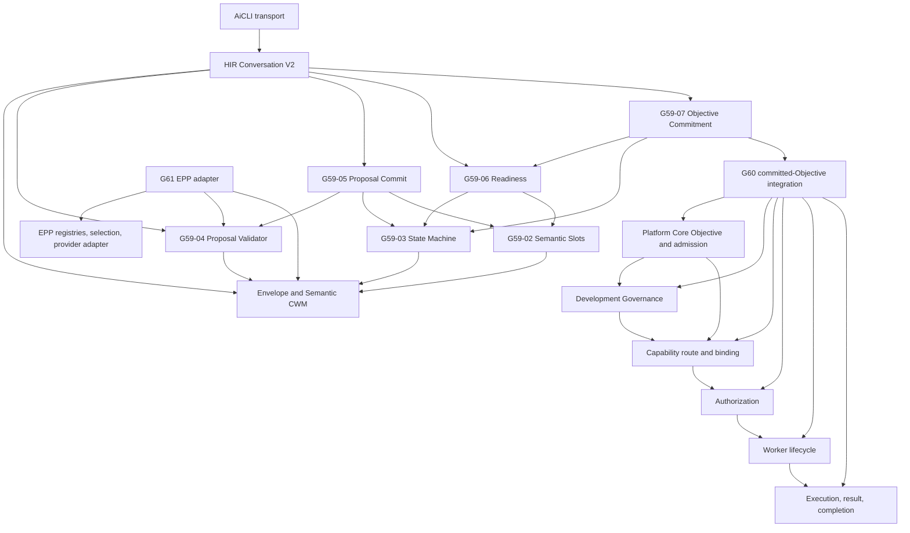
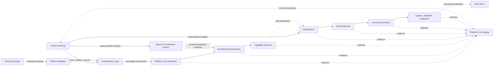
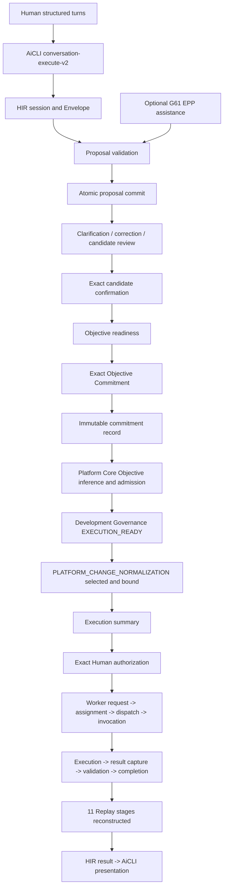

# 1. Implementation Summary

Generation: G62-01

Report identity:
G62_01_COMPLETE_CONSTITUTIONAL_ARCHITECTURE_RECONSTRUCTION_AND_READINESS_AUDIT_REPORT_V1

Reporting date: 2026-08-01

Constitutional baseline:
CONVERSATION_INTERPRETER_CENTRAL_LLM_ADAPTER_ESTABLISHED

Authenticated repository anchor:

- Commit: `c1033e668e4ef42617970d348504b87e0b41d2fd`
- Direct parent: `822d8feaeb858ee9b003729eff50046b2f5b3693`
- Tree: `0eec5a2be0bd59daf22ef80eee9056c88e180427`
- Subject: `G61-03: establish Conversation Interpreter EPP assistance runtime`

Implementation contracts:

- G48 Constitutional Evidence Reporting Standard V1
- Constitutional Architecture Specification V1
- Canonical Layer Model
- Constitutional Invariants
- Governance Enforcement Hierarchy
- Governance Lineage Model
- Stable Substrate Declaration V1
- Governance Conformance System V1
- PCBV31 Baseline Identity Record V1
- G53-01 Platform Core Constitutional Consistency Audit Report V1
- G53-02 Platform Core Constitutional Evidence Consolidation Record V1
- G54 Platform Core capability, admission, execution-binding, completion, and
  end-to-end certification records
- G57 Conversation Working Memory, semantic slot, Conversation Envelope, and
  Conversation State Machine architecture records
- G58 Conversation Interpreter architecture and AiGOL architecture readiness
  records
- G59-01 through G59-07 Conversation Layer V2 implementation records
- G60-01 through G60-03 Human Interface and complete conversation-execution
  integration records
- G61-01 through G61-03 Central LLM Services discovery, reuse, and adapter
  records

Objective:

Perform a complete read-only reconstruction of the authenticated AiGOL
constitutional architecture as it exists after G61. Determine the actual
owners, dependencies, authority boundaries, registries, runtime integrations,
evidence paths, duplication status, bounded implementation readiness, and
remaining risks without changing or designing runtime architecture.

Implementation scope:

- Authenticated the direct G61-03 repository anchor and its constitutional
  evidence baseline.
- Reconstructed Human Interface, Conversation Layer V2, EPP Central LLM
  Services, Platform Core, Development Governance, capability, Authorization,
  Worker, Completion, Replay, evidence, provider, and registry surfaces.
- Traced actual imports and public orchestration calls from AiCLI through the
  bounded completed execution path and the separate EPP proposal-assistance
  path.
- Distinguished constitutional ownership from stage-local implementation
  custody, registry metadata, historical compatibility code, and presentation.
- Audited responsibility uniqueness, dependency direction, authority
  separation, certified-infrastructure reuse, and provider-surface overlap.
- Exercised 396 focused and adjacent regression cases, Python compilation, and
  the read-only governance conformance engine.
- Produced readiness classifications and a roadmap that sequences already
  identified integration and consolidation work without authorizing it.

Modified modules:

- `docs/governance/G62_01_COMPLETE_CONSTITUTIONAL_ARCHITECTURE_RECONSTRUCTION_AND_READINESS_AUDIT_REPORT_V1.md`:
  this G48 read-only architecture reconstruction and readiness audit.

Intentionally unchanged modules:

- All AiGOL runtime, AiCLI, Human Interface, Conversation Layer, Platform Core,
  Development Governance, capability, Authorization, Worker, Completion,
  Replay, provider, credential, and registry source.
- PCBV31 and every pre-existing constitutional, governance, evidence,
  certification, manifest, and finalize artifact.
- All tests, runtime state, provider/network state, and Git history.

Architectural boundaries preserved:

- This report records the architecture found at the authenticated anchor; it
  creates no new runtime owner, contract, registry, route, or authority.
- Read-only inspection and tests did not call a live external provider or
  authorize an external execution.
- Conversation interpretation remains proposal-only; Semantic CWM mutation,
  Objective Commitment, Platform Core admission, Authorization, Worker
  execution, and Replay validation retain separate owners.
- PCBV31 identity, execution-spine membership, sockets, and independent-owner
  exclusions are not reinterpreted or extended.
- Known partial conformance, limited capability coverage, asserted human
  identity, direct-provider compatibility paths, and absent default EPP/HIR
  integration remain visible.

## Executive Readiness Determination

The authenticated architecture is reconstructable as one coherent
constitutional system. The certified reference path has a single owner for
each authority-bearing responsibility and a downstream-only dependency
direction. G59-G61 additions reuse existing Platform Core, EPP, Authorization,
Worker, Completion, and Replay owners rather than replacing them.

The architecture is ready only within its demonstrated bounds:

- **Certified foundation ready:** structured Human-to-Conversation interaction,
  deterministic Semantic CWM, Objective Commitment, bounded Platform Core
  admission, `PLATFORM_CHANGE_NORMALIZATION`, explicit Authorization, Worker
  lifecycle, Completion, Replay reconstruction, and Human/AiCLI return.
- **Interpreter adapter ready but not default-integrated:** the G61-03 EPP
  adapter can obtain and normalize an external proposal and submit it to the
  G59-04 validator. It is not wired into the default HIR/AiCLI conversation
  route and cannot commit proposals.
- **Not universal runtime readiness:** the completed execution proof covers one
  certified capability, not every G51 capability profile or arbitrary Worker
  task. Human participant identity remains asserted, live provider operation
  was not exercised, and repository governance conformance remains partial
  because of known hook drift.

These are declared coverage and operational gaps. They do not establish a
second constitutional owner or invalidate the certified reference chain.

# 2. Code Evidence

## Authenticated Evidence Basis

| Evidence | Repository identity | Architectural use |
|---|---|---|
| G61-03 anchor | Commit `c1033e668e4ef42617970d348504b87e0b41d2fd`; tree `0eec5a2be0bd59daf22ef80eee9056c88e180427` | Exact post-G61 source boundary for this reconstruction. |
| Constitutional Architecture Specification V1 | SHA-256 `e32f5772b3650befb5be4cd0201735aeddeebb47838684751c25939d27955650` | Distributed constitutional topology, precedence, invariants, enforcement, and limitations. |
| Canonical Layer Model | SHA-256 `05b9a9ff6028301b60d978270050cda49e80b0befa534c160356c4a03486a78c` | L0-L4 mutation classification. |
| Constitutional Invariants | SHA-256 `9483798a6b06ab57dfdfe4273aceebfba49fa3df29607bedf0b578d8e4efa6e4` | Replay, fail-closed, immutability, evidence, and no-live-execution boundaries. |
| Governance Enforcement Hierarchy | SHA-256 `1996e4f307421fde2057c044f263703a8780f37828643ff6ea3eb964bcfe2b72` | Distributed enforcement ownership and known hook limitations. |
| Governance Lineage Model | SHA-256 `9bc5f4b4e557cc0cf76f90526714a9715205f64ee7b1c7245a6c19e15688003d` | Evidence lineage, certification inheritance, replay, and rollback boundaries. |
| PCBV31 identity record | SHA-256 `27891d71227a0870c41f091c7fc32fc79b179dc1357015f39574d4b117f96d72` | Execution-spine identity, sockets, exclusions, and independent authority owners. |
| HIR Conversation V2 | SHA-256 `c5b462e377b078dba9388d524c232ad63eb8eccd5e6253a504acda129f9d3c51` | Isolated Human-to-Objective-Commitment route. |
| G61 EPP interpreter assistance | SHA-256 `22730a2e8f3bfbfcd4989abec0cdff630f6489da10b44c58eb5ad7c89d8cf430` | Existing-provider reuse and proposal-only boundary. |
| Complete execution integration | SHA-256 `a5e698fd3554c153e7671d997cf1c0f0d9a671c9327331d224c3426387d8edc2` | Committed-Objective handoff through existing execution owners. |

The PCBV31 record identifies a seven-stage execution spine and separately
retains `HUMAN_AUTHORITY`, `APPROVAL`, `AUTHORIZATION`,
`PLATFORM_CORE_REPLAY`, `GOVERNANCE`, and `CERTIFICATION` as independent
owners. Providers, Workers, AiCLI, presentation, post-V31 capabilities, and
post-V31 protocol semantics are explicit exclusions rather than silently
absorbed PCBV31 members.

## Complete Constitutional Architecture Reconstruction

The system is a governed composition, not a monolithic runtime:

| Plane | Subsystem | Canonical responsibility | Primary implementation/evidence surface | Current disposition |
|---|---|---|---|---|
| Human | Human Authority | Supplies intent, semantic assertions, confirmation, commitment, and separate execution authorization | HIR inputs; digest-bound `/confirm`, `/commit`, and `/authorize` evidence | Independent authority; identity locally asserted, not authenticated |
| Interface | AiCLI | Terminal transport, mode selection, prompts, and presentation | `aigol/cli/aicli.py` | Non-authorizing and non-executing |
| Interface | Human Interface Runtime | Session transport and return boundary | `human_interface_conversation_runtime_v2.py`; `human_interface_runtime_entry_service.py` | Orchestrates owner APIs; does not inherit their authority |
| Conversation | Conversation Envelope and Semantic CWM | Conversation identity, participants, locality, phase, semantic slots, revision, integrity, and atomic persistence | `platform_core_conversation_working_memory_runtime_v2.py` | Mutable only through certified Conversation owners before commitment |
| Conversation | Semantic Slot Runtime | Six slot classes, identity, revision, replacement, merge, conflict, completeness, and dependency semantics | `platform_core_semantic_slot_runtime_v2.py` | Slot lifecycle owner |
| Conversation | Conversation State Machine | Clarification, candidate review, correction, suspend/resume, abandonment, recovery, and readiness-state derivation | `platform_core_conversation_state_machine_runtime_v2.py` | Conversation progression owner; no Objective creation |
| Conversation | Interpreter Proposal Validator | Non-authoritative proposal schema, identity, source binding, comparison, conflict/ambiguity declarations, and admissibility | `platform_core_conversation_interpreter_proposal_runtime_v2.py` | Sole semantic proposal acceptance owner |
| Conversation | Proposal Commit Runtime | Deterministic ordering and one atomic mutation of already validated candidates | `platform_core_conversation_proposal_commit_runtime_v2.py` | Sole validated-candidate application owner |
| Conversation | Objective Readiness | Required-slot, dependency, clarification, conflict, revision, and state readiness report | `platform_core_conversation_objective_readiness_runtime_v2.py` | Eligibility only; no commitment or execution |
| Conversation | Objective Commitment | Immutable candidate projection, exact human commitment, idempotent record, and mutable-CWM cleanup | `platform_core_objective_commitment_runtime_v2.py` | Commitment owner; does not admit or execute Objective |
| Provider | EPP Central LLM Services | Provider/resource identity, selection policy, provider proposal invocation, credentials, lifecycle, and evidence | `aigol/provider/`; resource selection and provider governance runtimes; G6/G61 records | Distributed canonical provider platform, not one facade |
| Provider/Conversation edge | G61-03 Interpreter/EPP Adapter | Translate one bound turn to existing EPP, normalize returned proposal, and call G59-04 validation | `conversation_interpreter_epp_assistance_runtime_v1.py` | Proposal-only, opt-in, injected; no CWM commit or execution |
| Platform | Platform Core entry and project services | Infer sufficient Objective, enforce admission precedence, assemble project context, and enter governed service routing | `human_interface_runtime_entry_service.py`; project services and admission runtimes | First execution-pipeline admission authority after commitment |
| Governance | Development Governance | Need/evidence/policy/planning eligibility and execution-ready preparation | `constitutional_development_governance_operational_integration.py`; Conversation-to-PPP and dry-run owners | Planning/governance owner; cannot authorize or dispatch |
| Governance decision | Approval and acceptance | Record scope-specific Human approval, rejection, acceptance, or resume decisions | `aigol/runtime/approval/`; proposal, implementation, domain, and generated-content approval/acceptance owners | Independent from Objective Commitment and execution Authorization |
| Capability | Capability declaration and certification | Declare profiles and index certification/implementation evidence | G51 manifest; `platform_capability_certification_registry.py` | Metadata and evidence index only; no execution authority |
| Capability | Semantic capability selection and binding | Select a certified semantic capability and bind its inputs to execution-ready evidence | `project_context_semantic_capability_route.py`; normalization binding runtime | Selection is not Authorization or invocation |
| Authorization | Execution Authorization | Bind explicit Human approval to one exact execution-summary and execution-ready lineage | `execution_authorization_runtime.py` | Sole execution-authorization owner in reference path |
| Worker | Request and assignment | Create authorized invocation request and select an eligible Worker identity | `worker_invocation_request_runtime.py`; `worker_assignment_runtime.py` | No execution before authorization and assignment |
| Worker | Dispatch and invocation | Bind assignment to dispatch and create one Worker invocation | `worker_dispatch_runtime.py`; `worker_invocation_runtime.py` | Distinct from Authorization and execution |
| Execution | Governed execution | Start exactly the authenticated Worker invocation | `execution_runtime.py` | Execution owner; cannot self-authorize |
| Result | Capture and validation | Capture returned evidence and validate policy/lineage result | `worker_result_capture_runtime.py`; `worker_result_validation_runtime.py` | Does not certify broader capability semantics |
| Completion | Capability completion and HIR return | Bind validated result to selected capability completion and present bounded human result | `platform_change_normalization_worker_completion_adapter.py`; HIR return owner | Current complete proof is normalization-specific |
| Replay/evidence | Stage-local append-only evidence and deterministic reconstruction | Preserve immutable wrappers, hashes, ordering, references, and reconstructors | Owner-local `REPLAY_STEPS`, `write_json_immutable`, and `reconstruct_*` APIs | Logical authority is Platform Core Replay; producer custody stays with each stage owner |
| Governance evidence | Constitutional reports, manifests, evidence, and finalize records | Preserve certification, lineage, baselines, and declared limitations | `docs/governance/`; `.github/governance/{evidence,finalize,manifests,specs}` | Constitutional evidence, not runtime execution authority |

## Canonical Conversation Data and State

Repository reference:
`aigol/runtime/platform_core_conversation_working_memory_runtime_v2.py`.
The exact six-class vocabulary is:

```python
OPERATIVE_ACTION = "OPERATIVE_ACTION"
OPERATIVE_SUBJECT = "OPERATIVE_SUBJECT"
DESIRED_OUTCOME = "DESIRED_OUTCOME"
WORK_TYPE = "WORK_TYPE"
GOVERNING_QUALIFIER = "GOVERNING_QUALIFIER"
SEMANTIC_REFERENCE = "SEMANTIC_REFERENCE"

SEMANTIC_SLOT_CLASSES = (
    OPERATIVE_ACTION,
    OPERATIVE_SUBJECT,
    DESIRED_OUTCOME,
    WORK_TYPE,
    GOVERNING_QUALIFIER,
    SEMANTIC_REFERENCE,
)
```

The HIR reference grammar currently requires one primary action, subject,
outcome, and governed work type in deterministic order. Governing qualifiers
and semantic references remain supported by the underlying slot model but are
not required by the G60 terminal happy path.

The state machine derives `COLLECTING`, `CLARIFYING`, `CANDIDATE_REVIEW`,
`OBJECTIVE_READY`, `SUSPENDED`, `ABANDONED`, and `EXPIRED` from validated
atomic state. Objective Commitment remains a separate owner: the state machine
does not implement commitment or execution, and G59-07 validates readiness,
creates the immutable record, and removes mutable state.

## Ownership Matrix

| Responsibility | One constitutional owner | Delegated/consuming surfaces | Explicit non-owner |
|---|---|---|---|
| Human semantic assertion | Human Authority through HIR evidence | AiCLI transports; State Machine records | Parser, EPP, Platform Core |
| Conversation state persistence | Semantic CWM owner | Slot, State Machine, Proposal Commit owners use its atomic APIs | HIR, provider, Objective, Worker |
| Slot lifecycle | Semantic Slot Runtime | State Machine and Proposal Commit call it | Interpreter and EPP adapter |
| Proposal admissibility | G59-04 Interpreter Proposal Validator | Deterministic parser and EPP adapter submit proposals | Provider, HIR, Proposal Commit |
| Candidate mutation | G59-05 Proposal Commit Runtime | HIR may call after `ADMISSIBLE` | Interpreter, provider, readiness |
| Conversation progression | G59-03 State Machine | HIR supplies exact human acts | AiCLI, EPP, Platform Core |
| Objective eligibility | G59-06 Objective Readiness | HIR and Commitment owner consume report | Interpreter, provider, Platform Core |
| Objective Commitment | G59-07 Commitment Runtime plus exact Human act | HIR prepares transport action | State Machine, Platform Core, EPP |
| Provider metadata | `ProviderRegistry` | G61 adapter read-only lookup | Conversation Layer, model config |
| Resource selection | Unified Resource Selection | G61 adapter and existing EPP consumers | Provider adapter, Authorization |
| Provider invocation contract | Existing `ProviderAdapter` implementation | G61 edge invokes one bound proposal call | Conversation validator, Worker |
| Platform Objective/admission | Existing Platform Core project services | G60 handoff supplies committed source | Conversation Layer, AiCLI |
| Development readiness | Existing Development Governance owners | Platform Core and G60 orchestrator consume evidence | Capability selection, Authorization |
| Approval/acceptance | Scope-specific Approval owner plus explicit Human decision | Governance, proposal, implementation, domain, or content flow consumes its own artifact | Approval cannot substitute for execution Authorization |
| Capability certification metadata | Platform capability certification registry | Route validates identity/evidence | Registry cannot select, authorize, or execute |
| Capability selection/binding | Existing semantic route and capability binding | Platform Core/G60 consume | Authorization, Worker |
| Execution authorization | `execution_authorization_runtime.py` plus explicit Human confirmation | Worker request authenticates its replay | AiCLI, selection, Worker |
| Worker request/assignment/dispatch/invocation | Corresponding existing Worker stage owner | G60 orchestration sequences them | Platform Core and Authorization do not execute Worker code |
| Execution | `execution_runtime.py` | Result capture consumes evidence | Worker assignment and HIR |
| Result capture/validation | Corresponding result owner | Capability completion consumes both | Worker cannot self-accept |
| Capability completion | Normalization completion adapter for certified reference capability | HIR returns bounded result | AiCLI and Replay |
| Replay semantics | Platform Core Replay constitutional owner; stage runtime owns its schema/reconstructor | G60 composes 11 reconstructions | AiCLI and orchestration do not rewrite replay |
| Certification | Governance/Certification evidence owners | Registry indexes reports | Runtime success does not self-certify |

No authority-bearing row has two owners on the certified reference path.
Multiple stage modules under Worker and Replay are deliberate lifecycle
decomposition, not competing owners of the same transition. Approval is also
scope-partitioned: proposal approval, implementation approval, domain approval,
content acceptance, Objective Commitment, and execution Authorization are
different decisions and are not interchangeable aliases.

## Registry Inventory and Scope Separation

| Registry/index | Content and scale | Authority | Why it is not a duplicate owner |
|---|---|---|---|
| G51 Platform Core capability manifest | 47 profiles; category counts total 47; declared acyclic dependency graph | Constitutional capability declaration metadata | Declares profiles and dependencies; it neither loads nor invokes runtime code |
| G15 platform capability certification registry | 45 immutable certification records | Indexes owner, scope, milestone, implementation, and evidence | Explicitly `governance_metadata_only`; reports remain evidence authority |
| Generic capability allowlist | Four bounded names in `aigol/runtime/capabilities/capability_registry.py` | Validates a separate generic read-only/mock capability surface | Different namespace, consumers, and safety role from G51 profiles |
| Semantic capability route allowlist | Five explicitly adapter-invocable Platform Core capabilities | Selects a certified semantic route from admitted context | Does not claim platform-wide dynamic loading or Authorization |
| Provider metadata registry | Provider identity, version, status, domain, capability, resource type | Exact metadata lookup | Cannot dispatch, execute, or carry authority |
| External Resource Registry | Passive resource type/capability descriptions | Resource discovery metadata | No selection ranking, invocation, credentials, or Authorization |
| Unified Resource Selection registry | Resource/role/capability/domain/trust/lifecycle/priority and authority profile | Deterministic non-authorizing resource selection | Does not own provider lifecycle, semantic meaning, credentials, or dispatch |
| Provider Governance registry | Provider alias, lifecycle, credential reference, participation, and metrics | Provider governance/lifecycle evidence | Does not own model selection or Conversation semantics |
| Caller-supplied G59 interpreter registry | Enabled interpreter identity/class/version | Proposal-validator trust input | Does not identify provider/model or mutate Semantic CWM |
| G61 selection/binding profile | Immutable cross-reference among interpreter, EPP resource/provider, and model configuration | Request-local binding only | Explicitly not a provider or model registry |
| Worker registry | Worker identity/capability/status used by assignment | Bounded Worker selection after authorized request | Cannot authorize or execute by itself |

The absence of one general model registry is deliberate at G61. Model identity
and configuration version are immutable fields of the role-specific G61
binding. This avoids creating a second routing system before multiple governed
consumers establish a shared lifecycle requirement.

## Dependency Graph

Arrows mean "imports or consumes the authenticated output of". They do not
transfer authority to the caller.



The actual G61 adapter imports provider-neutral EPP contracts and G59-04/CWM
validation surfaces. It imports neither Proposal Commit nor any downstream
execution owner. The actual G60 integration imports the existing downstream
owners; those owners do not import the G60 integration or the Conversation
Interpreter adapter. No reverse dependency from Authorization, Worker,
Replay, or provider infrastructure into Semantic CWM was located.

## Authority Graph

Solid arrows represent an authority-gated transition. Dashed arrows are
proposal, transport, evidence, or observation only.



AiCLI, HIR, providers, resource selection, registries, Replay, and report
generation never become execution authorizers. Objective Commitment and
execution Authorization are separate Human acts bound to different immutable
digests. Approval and acceptance artifacts retain their declared scope and do
not implicitly grant execution Authorization.

## End-to-End Integration Graph



The optional G61 edge ends at G59-04 validation. It is not currently selected
by the default HIR/AiCLI path. The completed G60 route continues to use the
closed deterministic HIR parser unless a future governed integration
generation explicitly composes the existing adapter.

## Public APIs and Orchestration Entry Points

| Boundary | Existing public API | Reconstructed role |
|---|---|---|
| AiCLI | `main`, `build_parser` | Select default, `submit`, `conversation-v2`, or `conversation-execute-v2` transport mode |
| HIR Conversation | `create_hir_conversation_session_v2`, `admit_hir_semantic_turn_v2`, `confirm_hir_candidate_v2`, `create_hir_objective_commitment_v2`, `run_hir_conversation_terminal_v2` | Compose Human transport through existing Conversation owners and stop at commitment |
| Interpreter/EPP | `create_conversation_interpreter_epp_selection_and_binding_profile_v1`, `create_conversation_interpreter_epp_request_v1`, `adapt_epp_response_to_interpreter_proposal_v1`, `run_conversation_interpreter_epp_assistance_v1` | Reuse EPP and return G59-04 validation/candidate data only |
| Full integration | `prepare_committed_objective_execution_v2`, `authorize_and_execute_prepared_objective_v2`, `run_complete_conversation_execution_terminal_v2` | Sequence existing committed-Objective-to-completion owners |
| Platform entry | `run_human_interface_runtime_entry` | Enter existing project services and admission precedence |
| Development Governance | `integrate_constitutional_development_governance` and existing routing/handoff/dry-run APIs | Produce governed planning/execution-ready evidence |
| Capability route | `run_project_context_semantic_capability_route` | Select one certified semantic capability without authorizing execution |
| Authorization | `authorize_execution_ready` | Create one exact execution authorization without invoking a Worker |
| Worker lifecycle | `create_worker_invocation_request`, `assign_worker_from_invocation_request`, `dispatch_assigned_worker`, `invoke_dispatched_worker` | Preserve request, assignment, dispatch, and invocation stage ownership |
| Execution/result | `start_execution`, `capture_worker_result`, `validate_worker_result`, `complete_platform_change_normalization_worker_capability` | Execute, capture, validate, and complete the bounded capability |
| Replay | Corresponding `reconstruct_*_replay` functions | Validate immutable owner-local evidence and lineage |

The public terminal entry is `aigol.cli.aicli:main`. The isolated
`conversation-v2` branch calls HIR and stops at Objective Commitment. The
explicit `conversation-execute-v2` branch calls the G60 integration, which
first obtains the same immutable commitment and then crosses the Platform Core
boundary.

## Public Validators and Deterministic Algorithms

| Validation/reduction owner | Deterministic operation |
|---|---|
| Semantic CWM | Validate closed V2 schema, envelope, slot collection, revision, and integrity; serialize canonically |
| Semantic Slot Runtime | Derive content-bound slot identity and revisions; validate lifecycle, equivalence, cardinality, dependencies, completeness, and conflicts |
| State Machine | Derive protocol state from validated atomic data; compute clarification and correction transitions without hidden state |
| Proposal Validator | Bind exact source turn and expected revisions; reject unknown interpreter, stale input, malformed spans, ambiguity, conflict, or authority-bearing output |
| Proposal Commit | Sort validated operations canonically, apply one atomic update, advance revisions/integrity, enforce idempotency, and roll back on any failure |
| Objective Readiness | Produce a canonical report over required slots, dependencies, clarification/conflict state, state-machine eligibility, and current revisions |
| Objective Commitment | Recompute candidate digest, require exact Human command, create/verify immutable record, and prevent duplicate divergence |
| EPP selection/adapter | Rank only eligible resources deterministically; bind provider/model/request integrity; validate envelope and closed response vocabulary |
| Platform admission/capability | Apply admission precedence, certification lookup, semantic selection, lifecycle binding, and exact input compatibility |
| Authorization/Worker | Validate execution-ready lineage and Human summary confirmation before request; authenticate each downstream predecessor |
| Replay | Recompute artifact/wrapper hashes, exact step indexes, ordering, identity, and upstream references; reject tamper or missing evidence |

## Representative Responsibility Boundaries

Repository reference: `aigol/provider/provider_registry.py`.

```python
class ProviderRegistry:
    """Deterministic metadata registry. It does not dispatch or execute providers."""
```

Repository reference: `aigol/runtime/unified_resource_selection_runtime.py`.

```python
def select_unified_resource(
    *,
    selection_id: str,
    workflow_type: str,
    required_capability: str,
    requested_role_type: str,
    domain_id: str,
    created_at: str,
    replay_dir: str | Path,
    provider_necessity_classification: str | None = None,
    worker_authorization_required: bool = False,
    min_trust_level: str = "STANDARD",
    preferred_resource_id: str | None = None,
    context_assembly_output: dict[str, Any] | None = None,
    registry: dict[str, Any] | None = None,
) -> dict[str, Any]:
    """Select an eligible resource and active role without invoking it."""
```

Repository reference: `aigol/runtime/execution_authorization_runtime.py`.

```python
def authorize_execution_ready(
    *,
    authorization_id: str,
    execution_ready_replay_reference: str,
    authorizing_actor: str,
    authorized_at: str,
    replay_dir: str | Path,
    authorization_expires_at: str = "NEVER",
    execution_summary_artifact: dict[str, Any] | None = None,
    human_confirmation_artifact: dict[str, Any] | None = None,
) -> dict[str, Any]:
    """Authorize one bounded execution-ready packet without invoking a Worker."""
```

These exact contracts show that registry lookup, resource selection,
authorization, and Worker invocation are separate operations. The G60
orchestrator sequences them but does not reimplement them.

## Replay and Evidence Reconstruction

Replay is constitutionally singular in meaning but distributed in production:

1. Each stage owner defines its own closed artifact schema and ordered
   `REPLAY_STEPS`.
2. Each stage writes immutable, canonically serialized wrappers with artifact
   and wrapper hashes.
3. Each stage exposes a `reconstruct_*_replay` validator that checks identity,
   order, hashes, and upstream lineage.
4. The G60 integration calls eleven existing reconstructors and aggregates
   their returned evidence; it does not edit or reinterpret the source logs.
5. Governance reports and registries point to evidence but do not replace the
   underlying authenticated artifacts.

The complete certified path reconstructs capability routing, execution
binding, Authorization, Worker request, assignment, dispatch, invocation,
execution, result capture, result validation, and completion. G60-03 tamper
tests demonstrate fail-closed reconstruction.

## Reuse and Duplication Audit

| Finding | Determination | Constitutional consequence |
|---|---|---|
| G60 execution orchestration imports existing admission, governance, selection, Authorization, Worker, execution, result, completion, and Replay APIs | Reuse confirmed | No duplicate certified execution logic |
| G61 adapter imports existing Provider Registry, Provider Adapter, Provider Proposal Envelope, necessity policy, resource selection, serialization, CWM validation, and G59-04 proposal validation | Reuse confirmed | No new provider infrastructure or semantic authority |
| G51 declaration, G15 certification, generic capability allowlist, semantic route, and Worker registry coexist | Scope-separated registries | Names overlap at the word "capability" but authority and consumers differ |
| EPP includes Provider Registry, ERR, unified selection, Provider Governance, provider adapters, and transports | Distributed canonical platform | Multiple modules are expected facets, not multiple provider authorities |
| `llm_cognition_provider_runtime.py` and `native_provider_execution_runtime.py` remain CLI-reachable direct-provider paths | Active compatibility/specialized bypass surfaces | They are outside the G61 Conversation path; no new Conversation consumer may use them |
| Older OpenAI/provider modules and experimental invocation families remain in the tree | Historical/legacy overlap | Retention and reachability should remain explicit; they are not suitable reuse targets |
| Stage-local Replay writers and reconstructors exist in many owner modules | Distributed evidence custody | Not duplicate control authority; common invariants and immutable lineage govern them |
| G60 orchestrator is normalization-specific | Bounded integration, not a general duplicate Platform Core | Generalization must use existing owners and be capability-evidence driven |

No unintended duplicate constitutional authority was found on the certified
reference route. Physical provider overlap is real and remains an architectural
risk because some direct paths are still reachable. G61 correctly prevents the
new Conversation adapter from importing those paths.

## Readiness Assessment

| Readiness area | Status | Evidence-based conclusion |
|---|---|---|
| Constitutional ownership | READY_WITHIN_CERTIFIED_SCOPE | Every authority-bearing reference-path transition has one owner and explicit non-authority flags at adjacent stages. |
| Conversation Layer V2 foundation | READY | G59 schema, slots, state machine, proposal validation/commit, readiness, and commitment tests pass together. |
| Human Interface integration | READY_WITH_LIMITATION | Structured multi-turn, correction, conflict, suspend/resume, commitment, and execution are certified; participant identity remains asserted. |
| Central LLM reuse | ADAPTER_READY_NOT_DEFAULT_INTEGRATED | Existing EPP services are reused; no HIR/AiCLI default route or live-provider proof exists. |
| Platform Core admission | READY_FOR_CERTIFIED_NORMALIZATION_PATH | Committed Objective is revalidated and admitted through existing owners. |
| Development Governance | READY_WITH_REPOSITORY_CONFORMANCE_LIMITATION | Execution-ready evidence is exercised; hook enforcement remains partially conformant. |
| Capability registry/selection | READY_FOR_EXPLICIT_BOUND_CAPABILITIES | Declaration/certification metadata are complete as indexes; only selected capabilities have runtime adapters. |
| Authorization | READY | Exact summary-bound Human authorization is separate and fail-closed. |
| Worker lifecycle | READY_FOR_CERTIFIED_WORKER_PATH | Request, assignment, dispatch, invocation, execution, capture, and validation regressions pass. |
| Replay/evidence | READY_FOR_EXERCISED_PATHS | Eleven-stage reconstruction and tamper rejection are exercised; rollback remains distributed/partial repository-wide. |
| Platform-wide arbitrary capability execution | NOT_ESTABLISHED | G60 demonstrates only `PLATFORM_CHANGE_NORMALIZATION`; 42 of 47 G51 profiles are not claimed as dynamically invocable. |
| Live external-provider conversation | NOT_ESTABLISHED | G61 used an injected deterministic client and performed no network or credential-vault composition. |
| Production enforcement completeness | NOT_ESTABLISHED | Conformance engine reports `PARTIALLY_CONFORMANT` due two known hook mismatches. |

## Remaining Architectural Risks

| Priority | Risk | Evidence | Required disposition before broader claim |
|---|---|---|---|
| R1 | Direct-provider bypass and historical provider dialects remain reachable | G61-01 classifies two active direct paths and multiple legacy families | Preserve current consumers, prohibit new dependencies, and govern retirement/version-gating with authenticated reachability evidence |
| R2 | G61 EPP assistance is not composed into default HIR/AiCLI | G61-03 `Not Verified`; no HIR import or call to the adapter | Certify an explicit opt-in HIR proposal-assistance edge before claiming natural-language EPP conversation |
| R3 | Only one complete conversation-to-execution capability is demonstrated | G60 route requires `PLATFORM_CHANGE_NORMALIZATION` | Add capability-specific bindings only for justified Product 1 use cases; do not create a universal dynamic loader by assumption |
| R4 | Human identity lacks authentication | Conversation participant binding is `ASSERTED_NOT_AUTHENTICATED` | Define and certify identity/custody binding before production attribution claims |
| R5 | Governance hook enforcement remains partial | Conformance engine: 18 passed, 2 failed, 0 critical violations | Repair root and system pre-commit hook drift under existing governance ownership |
| R6 | Replay and rollback are distributed across many stage owners | Governance Lineage Model and current per-stage reconstructors | Preserve stage ownership; add cross-stage rollback/continuity certification only where an operational recovery case requires it |
| R7 | Capability registry coverage can be mistaken for runtime invocability | 47 G51 profiles, 45 certification records, five explicit semantic adapters | Keep declaration, certification, selection, and invocation claims separately labeled |
| R8 | G61 binding uses existing generic `PROPOSAL_GENERATION` and `GOVERNANCE` vocabulary | G61-03 immutable binding profile | Add a versioned conversation-specific capability/domain only through a future authorized registry generation, not locally in the adapter |
| R9 | General model lifecycle authority is intentionally absent | G61 binding owns immutable model configuration; no general model registry | Re-audit before creating one; require multiple independent governed consumers |
| R10 | The complete orchestrator is concrete and large | G60 imports many existing stage owners | Keep it orchestration-only; prefer smaller capability bindings and generated dependency evidence before adding routes |

## Recommended Roadmap Beyond Foundational Architecture

This sequence recommends verification and bounded reuse; it does not authorize
implementation.

1. **Restore enforcement continuity.** Repair the two existing hook mismatches
   and re-run the read-only conformance engine until full conformance is
   demonstrated or the expected hook contract is constitutionally revised.
2. **Make provider reachability explicit.** Produce an authenticated active,
   specialized, legacy, and retired provider-surface inventory. Freeze new
   consumers of direct concrete-provider paths and retain compatibility only
   where an owner and certification record exist.
3. **Certify opt-in EPP interpretation at HIR.** Compose the existing G61
   adapter with HIR strictly as a proposal source, preserve G59-04 validation
   and G59-05 commit ownership, require external-data disclosure, and stop
   before execution in the first integration checkpoint.
4. **Certify the assisted full path separately.** After step 3, prove one
   external proposal through Human correction/confirmation, Objective
   Commitment, existing Platform Core owners, separate Authorization, Worker,
   Completion, and Replay without enabling a default provider route.
5. **Expand capability coverage by use case.** Add only Product 1 capability
   bindings that have exact certification, input schemas, Worker ownership,
   result validation, completion, and Replay. Preserve a visible distinction
   between a registry profile and an executable binding.
6. **Strengthen attribution and recovery.** Certify authenticated Human
   participant binding and cross-stage recovery/rollback evidence before
   production attribution or generalized recovery claims.
7. **Consider shared model lifecycle only when justified.** If at least three
   independently governed consumers require it, perform a reuse audit and then
   decide whether a versioned model registry is warranted.

## Certification Checkpoints

| Checkpoint | Required evidence | Fail-closed condition |
|---|---|---|
| CP-1 Baseline continuity | Direct Git anchor, tree, constitutional hashes, PCBV31 identity | Missing or conflicting authenticated source |
| CP-2 Ownership uniqueness | Owner matrix and import/call graph | Two authorities can perform the same gated transition |
| CP-3 Dependency direction | No downstream owner imports Conversation/EPP orchestration for authority | Reverse authority dependency or hidden callback |
| CP-4 Reuse-before-create | G60/G61 imports resolve to existing registry, selection, Authorization, Worker, Replay, and provider contracts | Duplicate registry, adapter family, selection, or execution owner |
| CP-5 Proposal isolation | EPP output passes G59-04 and adapter cannot call G59-05 or execution | Provider can mutate CWM, commit, authorize, or execute |
| CP-6 Commitment separation | Exact Human commitment precedes Platform Core admission | Objective admitted from mutable/unconfirmed CWM |
| CP-7 Authorization separation | Exact execution-summary authorization precedes Worker request | Selection, HIR, or Worker can self-authorize |
| CP-8 Replay integrity | Owner reconstructors verify all exercised stages and reject tamper | Mutable, unordered, unverified, or rewritten evidence |
| CP-9 Coverage honesty | Capability, provider, identity, and conformance limits remain explicit | Bounded proof reported as platform-wide or production-complete |

# 3. Constitutional Self-Assessment

## Verified

- The exact G61-03 commit, direct parent, tree, subject, and constitutional
  source hashes were authenticated before reconstruction.
- Human Interface, Conversation Layer, Central LLM Services, Platform Core,
  Development Governance, capability, Authorization, Worker, Completion,
  Replay, evidence, provider, and registry surfaces have explicit inventory
  and ownership dispositions.
- Actual imports and orchestration calls preserve the downstream direction from
  Conversation state to commitment, Platform Core admission, governance,
  capability binding, Authorization, Worker, execution, result, Completion,
  Replay, and HIR return.
- The G61 EPP adapter reuses existing provider registry, selection, adapter,
  envelope, and serialization contracts and ends at G59-04 deterministic
  validation.
- Interpreters and providers cannot mutate Semantic CWM, commit a candidate,
  create an Objective, authorize execution, dispatch a Worker, or alter
  Development Governance through the certified adapter.
- G60 reuses existing downstream owner APIs and contains no local
  Authorization, Worker, execution, result-validation, completion, or Replay
  algorithm.
- Declaration, certification, generic capability, semantic route, provider,
  resource, interpreter, and Worker registries have separate scopes and do not
  duplicate execution authority.
- No duplicate constitutional authority exists on the certified reference
  path. Provider dialect overlap and direct-provider bypass surfaces are
  identified and excluded from new Conversation reuse.
- Proposal validation, atomic candidate commit, Objective readiness, Objective
  Commitment, Platform Core admission, capability selection, Authorization,
  Worker lifecycle, and Replay tamper detection were exercised together.
- 225 G54/G59/G60/G61/governance cases and 171 adjacent registry,
  Development Governance, Authorization, Worker, Replay, and provider cases
  passed.
- The selected architecture sources compiled successfully and the complete
  untracked report passed no-index Git diff whitespace validation.
- The conformance engine completed read-only and deterministically with zero
  critical violations while preserving its `PARTIALLY_CONFORMANT` status and
  two hook findings.
- No runtime, registry, provider, test, PCBV31, evidence source, or Git-history
  mutation was introduced.

## Not Verified

- No live external provider, network, credential-vault composition, timeout at
  a real endpoint, or non-OpenAI provider family was invoked in this read-only
  generation or in G61-03 certification.
- No default HIR/AiCLI integration of G61 assistance exists; current G60
  terminal interpretation remains the closed deterministic command parser.
- Platform-wide runtime invocability is not established by the G51 manifest or
  G15 certification registry. The complete conversation-execution proof is
  limited to `PLATFORM_CHANGE_NORMALIZATION`.
- Human participant identity remains `ASSERTED_NOT_AUTHENTICATED`; no
  cryptographic or external identity provider binding is claimed.
- Full repository governance conformance is not established. The read-only
  engine reports 18 passed checks, two known hook mismatches, zero critical
  violations, and `PARTIALLY_CONFORMANT`.
- Repository-wide provider consolidation is not complete. Specialized direct
  provider and historical compatibility surfaces remain present, although the
  G61 Conversation adapter does not use them.
- A general model registry, generalized committed-Objective-to-capability
  adapter, and universal cross-stage rollback owner do not exist and are not
  inferred as required without a governed use case.

# 4. Validation Matrix

| Requirement | Evidence | Validation | Result |
|---|---|---|---|
| Authenticate post-G61 baseline | Git commit, parent, tree, subject; constitutional SHA-256 inventory | `git log -1`; `sha256sum` | PASS |
| Reconstruct all requested subsystems | Complete subsystem inventory in Code Evidence | Governance-record review, source inventory, public API and import tracing | PASS |
| Establish single responsibility ownership | Ownership matrix and PCBV31 independent owners | Compared contracts, owners, authority flags, callers, and non-authorities | PASS |
| Detect unintended duplication | Reuse and Duplication Audit; G61-01 classifications | Classified certified, distributed, specialized, direct-bypass, and historical surfaces | PASS |
| Verify dependency direction | Dependency graph and actual import inventory | Traced G59/G60/G61 and downstream owner imports; no reverse authority edge located | PASS |
| Verify authority separation | Authority graph; exact provider, selection, Authorization, and Worker contracts | Source review plus fail-closed integration tests | PASS |
| Verify Conversation Layer semantics | G59-01 through G59-07 runtimes | Included in 225-case focused lineage suite | PASS |
| Verify HIR integration and Human controls | G60-01/G60-03 runtimes and tests | Structured multi-turn, correction, conflict, suspension/resume, exact confirmation/commitment | PASS |
| Verify Central LLM reuse-before-create | G61 adapter imports and tests | Existing provider registry/adapter/envelope/selection reused; no duplicate provider infrastructure | PASS |
| Verify Platform Core and Development Governance reuse | G60 integration; project services; G47 owner | Admission, routing, execution-ready, and evidence checks exercised | PASS |
| Verify capability registry and selection separation | G51 47-profile manifest; G15 45-record registry; route and generic registries | Counts, metadata flags, callers, and selection non-authority reviewed | PASS |
| Verify Authorization and Worker separation | Authorization, request, assignment, dispatch, invocation, and execution runtimes | Included in 171-case adjacent owner suite and G60 end-to-end suite | PASS |
| Verify Replay and evidence integrity | Eleven reconstructors and G60-03 tamper scenario | Reconstruction, ordering, lineage, and tamper rejection tests | PASS |
| Verify deterministic repeated execution | G60-03 repeated-session scenarios | Equal isolated inputs reproduced commitment, Objective, and completion semantics | PASS |
| Python source integrity | Selected architecture owner source set | `PYTHONPYCACHEPREFIX=/tmp/sapianta-g62-pycache python -m py_compile ...` | PASS |
| Governance conformance visibility | Governance conformance engine | 18 passed, 2 known hook mismatches, 0 critical violations, deterministic/read-only/fail-closed; status preserved as `PARTIALLY_CONFORMANT` | PASS |
| Live external provider behavior | Explicitly outside read-only audit and prior G61-03 scope | No network/provider call performed | NOT_APPLICABLE |
| Runtime mutation | Restrictions prohibit implementation | No source change except this report | NOT_APPLICABLE |
| Diff hygiene | Complete G62-01 change set | `git diff --no-index --check /dev/null docs/governance/G62_01_COMPLETE_CONSTITUTIONAL_ARCHITECTURE_RECONSTRUCTION_AND_READINESS_AUDIT_REPORT_V1.md` (exit 1 for an added file; no whitespace diagnostics) | PASS |

# 5. Repository Mutation Summary

Modified files:

- `docs/governance/G62_01_COMPLETE_CONSTITUTIONAL_ARCHITECTURE_RECONSTRUCTION_AND_READINESS_AUDIT_REPORT_V1.md`:
  added this read-only reconstruction, ownership audit, readiness assessment,
  risk inventory, and roadmap.

Unchanged subsystems:

- Human Interface and AiCLI runtime.
- Conversation Working Memory V1/V2, Conversation Envelope, Semantic Slot,
  State Machine, Interpreter Proposal, Proposal Commit, Objective Readiness,
  and Objective Commitment runtimes.
- EPP provider registries, resource selection, provider governance,
  credentials, adapters, connectors, transports, and model configuration.
- Platform Core, Development Governance, capability declaration,
  certification, routing, and binding.
- Authorization, Worker, execution, result, Completion, Replay, evidence,
  PCBV31, tests, and Git history.

API compatibility:

- No public function, schema, registry entry, capability identifier, status
  vocabulary, serialization rule, replay artifact, CLI mode, provider
  contract, or execution behavior changed.
- The report adds no importable runtime surface.

Boundary preservation:

- The audit did not invoke a provider or network, mutate runtime state, create
  an Objective, authorize execution, dispatch a Worker, rewrite Replay, or
  change governance.
- The reconstructed maps describe existing relationships and do not authorize
  roadmap implementation.
- Bounded certification is not restated as platform-wide, production-complete,
  or fully conformant readiness.

Unrelated pre-existing changes:

- None observed at audit start. The authenticated G61-03 baseline was clean.
- The two governance hook mismatches and provider compatibility/direct-call
  surfaces are pre-existing findings and were not modified.

# 6. Certification Verdict

COMPLETE_CONSTITUTIONAL_ARCHITECTURE_RECONSTRUCTED
