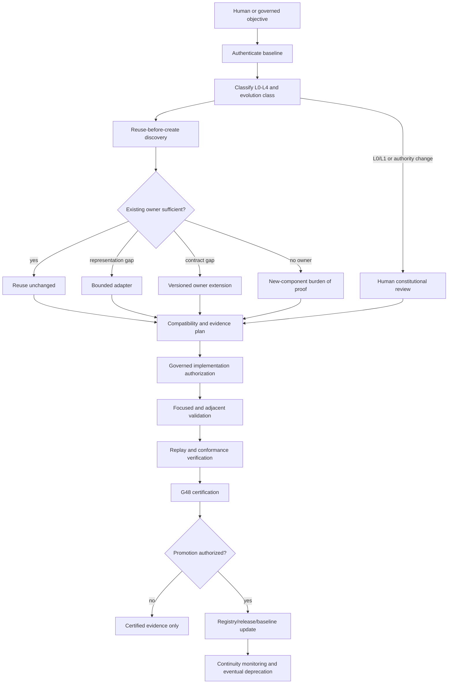

# 1. Implementation Summary

Generation: G63-01

Report identity:
G63_01_CONSTITUTIONAL_EVOLUTION_GOVERNANCE_FRAMEWORK_REPORT_V1

Reporting date: 2026-08-01

Constitutional baseline:
COMPLETE_CONSTITUTIONAL_ARCHITECTURE_RECONSTRUCTED

Authenticated repository anchor:

- Commit: `7b4e77a94a2323500edf3720bc7e74427633eac5`
- Direct parent: `c1033e668e4ef42617970d348504b87e0b41d2fd`
- Tree: `96bbd048857ecd26dd0dbe84583e3e74d87f73ec`
- Subject: `G62-01: reconstruct complete constitutional architecture`

Implementation contracts:

- G48 Constitutional Evidence Reporting Standard V1
- G62-01 Complete Constitutional Architecture Reconstruction and Readiness
  Audit Report V1
- Constitutional Architecture Specification V1
- Canonical Layer Model
- Constitutional Invariants
- Governance Enforcement Hierarchy
- Governance Lineage Model
- Stable Substrate Declaration V1
- Governance Conformance System V1
- Governance Conformance Engine and current conformance evidence
- PCBV31 Baseline Identity Record V1
- AGENTS.md SAPIANTA Codex Orchestration Guide

Objective:

Characterize a permanent Constitutional Evolution Governance Framework for
future AiGOL generations. The framework determines how extensions,
modifications, repairs, replacements, deprecations, and experiments are
classified, reviewed, versioned, certified, promoted, and retired while
preserving the completed foundational architecture.

Implementation scope:

- Established constitutional evolution principles subordinate to the existing
  enforcement hierarchy and Human Authority.
- Defined deterministic extension-versus-modification and layer-admissibility
  rules.
- Defined a mandatory reuse-before-create discovery and decision procedure.
- Defined ownership, authority, dependency, compatibility, versioning,
  migration, deprecation, certification, and evidence requirements.
- Defined architectural review checkpoints and fail-closed outcomes for future
  generations.
- Defined a long-term governance lifecycle that uses existing Development
  Governance, subsystem owners, Certification, Replay, conformance, and release
  discipline rather than creating a new governance authority.
- Applied the framework to the remaining G62 architectural risks to demonstrate
  how future work is classified without authorizing that work.

Modified modules:

- `docs/governance/G63_01_CONSTITUTIONAL_EVOLUTION_GOVERNANCE_FRAMEWORK_REPORT_V1.md`:
  this G48 architecture-only evolution framework.

Intentionally unchanged modules:

- All runtime and tests.
- Platform Core, Conversation Layer, Human Interface, AiCLI, Central LLM
  Services/EPP, provider infrastructure, Development Governance, capability
  registries and selection, Authorization, Worker, Completion, Replay, and
  Evidence runtime.
- PCBV31 and all existing governance, constitutional, certification, evidence,
  finalize, manifest, registry, and baseline artifacts.
- Git history, installed hooks, runtime state, external providers, and network
  state.

Architectural boundaries preserved:

- This framework is an L3 governed review and evidence contract. It does not
  amend L0 or L1, activate dormant governance memory, or create a universal
  enforcement kernel.
- Human Authority retains final authority over constitutional change, system
  direction, high-risk approval, and stop decisions.
- Existing subsystem owners retain their certified responsibilities; an
  integration or orchestration generation cannot inherit their authority.
- Replay remains read-only and certification remains evidence-dependent.
- Documentation of an extension does not authorize implementation, promotion,
  activation, migration, deprecation, or execution.
- The current `PARTIALLY_CONFORMANT` hook reality and all G62 limitations
  remain visible.

## Framework Status and Scope

This report defines the review contract for generations after G63-01. It is
permanent in application, not immutable in constitutional rank. A future
change to this framework must create a new versioned governance artifact,
preserve this record and its lineage, and pass the same higher-authority rules
that it defines. It must never be edited or interpreted to outrank replay
safety, L0/L1 stability, the canonical invariants, PCBV31 independent owners,
or Human Authority.

The framework governs architectural evolution. It does not pre-authorize any
item in a roadmap, convert a proposed module into a certified component, or
declare every registered capability executable.

# 2. Code Evidence

No runtime code was added or changed. The evidence for this architecture study
is the authenticated G62 reconstruction and the canonical governance sources
that already constrain evolution.

## Authenticated Evidence Basis

| Evidence | Immutable identity | Use in this framework |
|---|---|---|
| G62-01 architecture reconstruction | Commit `7b4e77a94a2323500edf3720bc7e74427633eac5`; report SHA-256 `b8743d7575ff3db4d60798e19bb21d59498e1eab723e34e88561b2a0e029752c` | Complete post-G61 owner, dependency, authority, registry, integration, risk, and readiness baseline |
| Constitutional Architecture Specification V1 | SHA-256 `e32f5772b3650befb5be4cd0201735aeddeebb47838684751c25939d27955650` | Constitutional precedence, mutation classes, distributed enforcement, authority limits |
| Canonical Layer Model | SHA-256 `05b9a9ff6028301b60d978270050cda49e80b0befa534c160356c4a03486a78c` | L0-L4 layer classification and separate safety-authority model |
| Constitutional Invariants | SHA-256 `9483798a6b06ab57dfdfe4273aceebfba49fa3df29607bedf0b578d8e4efa6e4` | Replay, layer, mutation, fail-closed, deterministic, certification, execution, and governance-memory invariants |
| Governance Enforcement Hierarchy | SHA-256 `1996e4f307421fde2057c044f263703a8780f37828643ff6ea3eb964bcfe2b72` | Existing guard, promotion, development review, certification, and replay ordering |
| Governance Lineage Model | SHA-256 `9bc5f4b4e557cc0cf76f90526714a9715205f64ee7b1c7245a6c19e15688003d` | Mutation provenance, certification inheritance, rollback, and evidence classes |
| Stable Substrate Declaration V1 | SHA-256 `79d3b4707293eaf4b23dbd5d26e3cdc038da223698ed126ff518e380adffe2bb` | Stable foundation and permitted controlled expansion |
| Governance Conformance System V1 | SHA-256 `0d68ef5411580977fed8d27cac219f5bbfdfe3fea738419c730804a64b0ff54a` | Deterministic read-only drift detection and conservative status semantics |
| G48 reporting standard | SHA-256 `16508d1a77c4b3f07d37861e74d85f77896be16da01ca26cbc07a658ddf2c0eb` | Evidence, validation, mutation, limitation, and single-verdict discipline |

## Constitutional Position

The canonical source states that future evolution must build on top of the
stable substrate, preserve replay guarantees, constitutional invariants, and
governance lineage, and must not silently redefine semantics or bypass
mutation, conformance, or evidence boundaries.

The framework therefore occupies this position:

```text
Replay safety and immutable constitutional sources
  -> L0/L1 invariants and freeze evidence
    -> L2 restricted decision contracts
      -> L3 governed evolution review and certification
        -> L4 bounded research and implementation proposals
          -> product and presentation evolution
```

G63-01 is the L3 characterization shown above. It is not a new runtime service.
Where this report conflicts with a higher row, the higher row prevails and the
proposed evolution fails closed.

## Normative Evolution Principles

Future generations SHALL apply all of these principles:

| ID | Principle | Mandatory consequence |
|---|---|---|
| EP-01 | Constitution before convenience | Replay safety, L0/L1, invariants, protected domains, and Human Authority prevail over delivery speed or product demand |
| EP-02 | Evidence before authority | A claim, roadmap, filename, registry entry, or passing command cannot grant runtime or constitutional authority without authenticated evidence |
| EP-03 | Reuse before create | Existing owners, APIs, registries, adapters, schemas, and evidence paths must be discovered and evaluated before any new component is proposed |
| EP-04 | One responsibility, one constitutional owner | New orchestration may sequence existing owners but must not copy or absorb their decisions |
| EP-05 | Additive by default | New behavior should be opt-in, bounded, versioned where needed, and leave existing routes unchanged |
| EP-06 | No silent semantic change | Changed meaning, authority, default behavior, accepted evidence, or replay identity is a modification even if the function name or schema is unchanged |
| EP-07 | Dependency direction is constitutional | Higher-authority or downstream owners must not depend on a new convenience orchestrator for their authority or validation semantics |
| EP-08 | Proposal is not execution | Research, interpreters, providers, plans, selections, reviews, and readiness evidence remain non-authorizing until their existing owner performs the gated transition |
| EP-09 | Compatibility is multidimensional | API compatibility alone is insufficient; schema, behavior, persistence, replay, evidence, authority, ownership, and migration must also be assessed |
| EP-10 | Certification does not silently inherit | A later generation may reference stable earlier evidence but may not broaden its scope or upgrade its result without new proof |
| EP-11 | Deprecation preserves history | Runtime reachability may end, but certification, replay, lineage, supersession, and prior-decision evidence must remain readable |
| EP-12 | Fail closed on ambiguity | Unknown layer, owner, scope, authority delta, consumer, migration, or evidence sufficiency blocks implementation or escalates to Human review |
| EP-13 | Limitations remain first-class | Partial conformance, bounded capability coverage, unverified provider behavior, identity limits, and historical overlap must not be hidden by later reports |
| EP-14 | Product evolution stays governance-first | Product 1 remains the AI Decision Validator; extensions must preserve bounded execution, auditability, and enterprise trust positioning |

## Canonical Evolution Classes

Every future generation MUST select exactly one primary evolution class before
implementation. Secondary impacts may be recorded, but they cannot replace the
primary classification.

| Class | Meaning | Minimum governance disposition |
|---|---|---|
| `OBSERVATION_ONLY` | Read-only discovery, reconstruction, audit, validation, or plan | Authenticated sources, G48 report, declared limitations, no runtime mutation |
| `BOUNDED_REPAIR` | Restores already-certified semantics without broadening inputs, authority, outputs, ownership, or default routes | Exact defect evidence, smallest patch, focused and adjacent regressions, certification continuity review |
| `ADDITIVE_EXTENSION` | Adds an opt-in surface under an existing owner and contract without changing any current consumer | Reuse proof, owner approval, dependency/authority review, compatibility proof, focused certification |
| `VERSIONED_EXTENSION` | Adds new schema, protocol, role, capability binding, or integration behavior while preserving old versions | New immutable identity/version, compatibility and migration plan, dual-path evidence, targeted end-to-end certification |
| `CONSTITUTIONAL_MODIFICATION` | Changes an existing invariant, authority, owner, layer meaning, default path, canonical contract, replay identity, or protected boundary | Human constitutional review, new version/baseline, complete impact audit, migration/rollback evidence, no in-place rewrite |
| `SUBSYSTEM_REPLACEMENT` | Introduces a successor intended to supersede an existing owner or implementation family | Proof reuse/adapter is insufficient, parity and authority analysis, staged migration, deprecation record, Human approval where structural |
| `DEPRECATION_OR_RETIREMENT` | Stops new use or runtime reachability of an existing surface while preserving history | Consumer inventory, successor or no-use proof, replay compatibility, rollback window, supersession evidence |
| `L4_EXPERIMENT` | Isolated research with no canonical, runtime, governance, or execution authority | Allowed roots, explicit non-authority, no production route, disposal or promotion plan |

Renaming, relocating, wrapping, or splitting code does not determine its class.
The semantic and authority delta determines the class.

## Extension Versus Modification Rules

A change is an `ADDITIVE_EXTENSION` only when every extension condition is
true. If any modification trigger is true, the change is not additive.

| Dimension | Extension condition | Modification trigger |
|---|---|---|
| Existing behavior | All current inputs and routes produce equivalent owner results | Any current input, status, side effect, error, ordering, or default route changes |
| Authority | New surface has no additional authority and delegates to the same owner | Authority is created, broadened, transferred, merged, bypassed, or made implicit |
| Ownership | Existing certified owner retains the responsibility | A new owner duplicates, replaces, or arbitrates an existing owner |
| Contract/schema | Existing contract remains byte/meaning compatible; new interface is separate and opt-in | Existing schema meaning, required fields, validation, identifier, or canonical serialization changes |
| Replay/evidence | Existing evidence and reconstructors remain valid and read-only | Replay identity, ordering, hash input, lineage, retention, or evidence meaning changes |
| Dependencies | New adapter depends on existing owners in the established direction | Existing owner must import/call the new orchestrator, or a reverse/cyclic authority edge appears |
| Registry | New metadata cannot alter current selection or authority | Entry changes ranking, default selection, authority profile, lifecycle meaning, or certification claim |
| Persistence | No migration of existing state is required | Existing state must be rewritten, reinterpreted, or migrated |
| Activation | Explicit opt-in; current consumers remain unchanged | Default-on activation or automatic migration occurs |
| Removal | Disabling the extension restores the prior route without evidence loss | Rollback requires rewriting history or cannot restore prior operation |

Specific reductions:

- Adding a new optional runtime mode is an extension only if the prior modes and
  defaults remain unchanged.
- Adding a field to a closed canonical schema is a versioned extension, not an
  in-place additive change.
- Adding a registry entry is a modification when it changes deterministic
  selection for an existing request.
- Refactoring is a repair only when behavior, ownership, evidence, hashes,
  public contracts, and dependency direction remain equivalent.
- Broadening a certification statement is a modification even when no code
  changes.
- Changing Human confirmation, Objective Commitment, Authorization, Worker,
  or Replay authority is always structural and cannot be treated as a local
  adapter change.

## Deterministic Evolution Classification Procedure

```text
1. Authenticate the current baseline and every governing source.
2. Classify every target path and contract as L0, L1, L2, L3, L4, or external.
3. Inventory the current owner, consumers, imports, registries, adapters,
   schemas, persistence, replay, tests, certification, and historical paths.
4. Execute reuse-before-create discovery.
5. Calculate semantic, authority, ownership, dependency, compatibility,
   persistence, replay, and activation deltas.
6. Select exactly one evolution class.
7. Apply the highest applicable layer and authority gate.
8. Define validation, migration, rollback, deprecation, and certification
   evidence before implementation.
9. Return one disposition:
   EVOLUTION_ADMISSIBLE_FOR_GOVERNED_PLANNING,
   EVOLUTION_REQUIRES_HUMAN_CONSTITUTIONAL_REVIEW,
   NO_CHANGE_REQUIRED, or EVOLUTION_BLOCKED.
```

Missing evidence at any step produces `EVOLUTION_BLOCKED`; an unresolved
high-authority question produces
`EVOLUTION_REQUIRES_HUMAN_CONSTITUTIONAL_REVIEW`. Neither outcome authorizes
implementation.

## Layer Admissibility Matrix

| Target | Ordinary generation | Required authority and evidence |
|---|---|---|
| L0 System Constitution | Prohibited | Only an explicit Human-authorized constitutional amendment may create a new versioned baseline; never an in-place silent edit |
| L1 Canonical Artifact Definitions | Prohibited | Explicit Human/governance authorization, new immutable contract version, full consumer/replay migration, baseline impact review |
| L2 Decision Spine | Restricted | Development Governance, promotion classification, subsystem-owner review, strict deterministic/replay evidence, certification |
| L3 Governance System | Governed | Existing governance owner, promotion and certification gates, lineage, conformance impact, Human approval where structural |
| L4 Research System | Bounded and evolvable | Allowed roots, MutationGuard/Guardian, Development Governance, non-authority, disposal/promotion evidence |
| Product/presentation | Evolvable within boundaries | Existing owner, API/behavior compatibility, no authority or governance-semantic change |
| Replay-critical or finalized evidence | Immutable regardless of path | New append-only correction/supersession evidence; never rewrite history |
| PCBV31 identity/spine/socket/independent-owner boundary | Baseline-sensitive | Apply PCBV31 trigger analysis and create a new authenticated baseline only when explicitly authorized |

## Reuse-Before-Create Governance

### Mandatory discovery inventory

Before proposing a new module, registry, provider path, adapter, schema,
validator, orchestrator, or evidence format, the generation MUST search:

1. authenticated governance and certification reports;
2. PCBV31 membership, sockets, independent owners, and exclusions;
3. runtime modules and public APIs;
4. manifests, registries, resource catalogs, and authority profiles;
5. importers, callers, CLI modes, and default routes;
6. provider, Worker, capability, Replay, and evidence families;
7. tests and end-to-end transcripts;
8. historical, deprecated, direct-bypass, experimental, and alternate paths;
9. Git history and supersession records where current identity is ambiguous;
10. migration, persistence, credential, network, privacy, and release surfaces.

### Reuse decision matrix

| Disposition | Required finding | Permitted next step |
|---|---|---|
| `REUSE_UNCHANGED` | Existing owner/API satisfies the need | Integrate through existing public contract; no copied logic |
| `REUSE_WITH_BOUNDED_ADAPTER` | Contract is sufficient but representations differ | Add the smallest provider-neutral or owner-neutral adapter; no authority |
| `REUSE_WITH_VERSIONED_EXTENSION` | Existing owner is correct but contract cannot express the bounded need | Plan a new version under the same owner with compatibility/migration evidence |
| `NEW_COMPONENT_JUSTIFIED` | No owner exists and reuse/adapter/versioning are demonstrably insufficient | Propose a bounded owner, non-overlap proof, contract, lifecycle, and certification plan |
| `NO_CHANGE_REQUIRED` | Existing behavior already satisfies the use case | Stop; document located evidence |
| `REPLACEMENT_REQUIRES_REVIEW` | Existing owner is unsuitable and successor is proposed | Human/structural review, parity, migration, deprecation, rollback, and baseline assessment |
| `BLOCKED_DUPLICATE_AUTHORITY` | Proposed component overlaps an existing authority or registry meaning | Reject the proposal |

### New-component burden of proof

A new component is inadmissible unless all are demonstrated:

- no authenticated existing owner already holds the responsibility;
- an adapter or versioned extension cannot safely meet the need;
- its owner and non-authorities are explicit;
- its dependencies follow the canonical direction and remain acyclic;
- its schema, identity, persistence, evidence, and failure semantics are closed;
- it cannot bypass Human Authority, governance, Authorization, Worker, Replay,
  provider governance, or certification;
- compatibility, migration, rollback, deprecation, tests, and release ownership
  are defined before implementation.

## Constitutional Ownership Preservation

| Rule | Required evidence | Rejection condition |
|---|---|---|
| Owner identity | Exact current architectural and implementation owner | Owner absent, inferred from filename, or contradicted by certification |
| Authority delta | Before/after authority matrix | Any implicit or unreviewed authority gain |
| Non-authority | Explicit false flags or contract statements for adjacent layers | Adapter can validate, commit, authorize, dispatch, execute, or certify outside its role |
| Delegation | Caller invokes the certified owner and validates its output | Caller reimplements owner algorithm or treats presentation as authority |
| Dependency direction | Import/call graph before and after | Reverse edge, hidden callback, cycle, or downstream owner dependency on convenience layer |
| Human boundary | Exact Human acts remain distinct where required | Confirmation, commitment, approval, and Authorization are conflated |
| Evidence custody | Stage owner writes and reconstructs its own evidence | Orchestrator rewrites, fabricates, or broadens stage evidence |
| Registry scope | Registry metadata and non-authority are explicit | Registry presence is interpreted as runtime invocability or certification |

Integration code may coordinate transactions, verify cross-owner identities,
and present results. It may not become the constitutional owner of the
coordinated decisions merely because it imports their APIs.

## Compatibility Requirements

Every planned runtime generation MUST publish a compatibility matrix covering
all applicable dimensions:

| Dimension | Compatibility requirement | Mandatory validation |
|---|---|---|
| Public API | Existing calls remain valid or are explicitly versioned | Signature and consumer tests |
| Data/schema | Closed schemas, enums, required fields, canonical ordering, and identities remain valid | Old/new fixtures and validator tests |
| Behavior | Existing inputs preserve status, failure, side-effect, ordering, and owner semantics | Golden and adjacent regression tests |
| Persistence | Existing state loads without reinterpretation or has an authenticated migration | Migration, interruption, recovery, and stale-version tests |
| Replay | Historical evidence reconstructs unchanged; new evidence has a distinct version where required | Old/new reconstruction and tamper tests |
| Certification | Prior scope is preserved but not broadened | Evidence-hash and scope comparison |
| Authority | No role gains authority through compatibility shims | Before/after authority graph and forbidden-import checks |
| Registry/selection | Existing identities and deterministic selections remain stable unless modification is authorized | Registry snapshot and selection tests |
| Provider/network | Provider-specific logic stays behind existing EPP contracts; data processing is declared | Injected adapter tests; live calls only when separately authorized |
| Worker/execution | Existing Authorization and Worker lineage remains mandatory | Negative bypass and end-to-end tests |
| Human interface | Existing commands/defaults remain stable; new routes disclose consequences | CLI parser, transcript, and exact-action tests |
| Governance/release | Conformance, mutation boundaries, evidence, and release topology remain connected | Conformance engine, diff hygiene, release evidence |

Unknown compatibility is incompatible until proven. Authority, replay, and
constitutional invariants have no backward-compatibility waiver.

## Versioning and Migration Strategy

### Version rules

- Immutable canonical artifacts and certified reports are never edited in
  place to change meaning. A changed contract receives a new `Vn` identity.
- A new independent surface begins at `V1` and references its exact baseline.
- A backward-incompatible or semantically changed existing contract receives a
  new major artifact/schema/runtime version and coexistence plan.
- A bounded repair that restores the existing contract retains that contract's
  identity but receives explicit generation/repair lineage and new hashes.
- Registry record additions may remain within a registry version only when the
  schema, authority, and selection of existing requests remain unchanged.
  Otherwise the registry or selection contract is versioned.
- Generation identifiers record governance sequence; they do not substitute
  for API/schema/artifact versions.
- Content hashes bind exact evidence. Any changed bytes invalidate the old hash
  and require new evidence rather than reinterpretation.
- Certification identifiers state only the exercised scope. `CHARACTERIZED`,
  `ESTABLISHED`, `INTEGRATED`, `CERTIFIED_END_TO_END`, and
  `BASELINE_CONSOLIDATED` are distinct maturity claims and must not be treated
  as synonyms.

### Migration rules

A versioned migration MUST define:

- source and target identity/version;
- authorized owner and migration trigger;
- deterministic transformation and canonical serialization;
- preservation of original state and evidence;
- idempotency and repeated-run behavior;
- partial-failure rollback or fail-closed recovery;
- consumer cutover and coexistence rules;
- replay compatibility and audit links;
- deprecation/retirement entry criteria;
- proof that no default route changes before its certification checkpoint.

Migration must append lineage. It must not rewrite historical replay or make an
old certification appear to cover the new version.

## Subsystem Deprecation and Retirement Policy

### Lifecycle

```text
ACTIVE
  -> DEPRECATED_NO_NEW_CONSUMERS
    -> MIGRATION_ONLY
      -> RETIRED_NOT_RUNTIME_REACHABLE
        -> SOURCE_REMOVAL_ELIGIBLE
```

The final state applies only to executable/source retention. Governance,
certification, replay, migration, supersession, and historical decision
evidence remain permanently addressable.

### Entry and exit criteria

| State | Entry criteria | Exit criteria |
|---|---|---|
| `ACTIVE` | Current owner, contract, consumers, tests, and certification known | Successor/no-use decision authenticated |
| `DEPRECATED_NO_NEW_CONSUMERS` | Deprecation owner, reason, replacement or no-use policy, consumer inventory, and warning evidence exist | Every active consumer has an approved migration or retirement plan |
| `MIGRATION_ONLY` | New selection/attachment is blocked; migration tooling and compatibility evidence certified | Zero active runtime consumers and replay reconstruction remains valid |
| `RETIRED_NOT_RUNTIME_REACHABLE` | Imports, CLI routes, registries, defaults, and dispatch paths cannot select the surface | Retention/legal/replay review permits source removal |
| `SOURCE_REMOVAL_ELIGIBLE` | No runtime consumer, dynamic lookup, migration dependency, or forensic requirement remains | Governed removal generation preserves tombstone, hashes, lineage, and prior evidence |

### Mandatory deprecation evidence

- owner-approved deprecation record and classification;
- complete static and dynamic consumer inventory;
- registry, CLI, default-route, provider, Worker, and reflection lookup audit;
- successor mapping or authenticated no-replacement rationale;
- old/new compatibility and replay reconstruction;
- rollback/cutback procedure before retirement;
- explicit `superseded_by` or terminal disposition;
- proof that removal does not erase historical certification or evidence.

Time alone cannot retire a subsystem. Zero known consumers without a complete
reachability audit is insufficient.

## Certification Strategy for Future Generations

| Evolution class | Required certification evidence |
|---|---|
| Observation-only | Authenticated sources, deterministic inventory/review, G48 report, diff hygiene, limitation visibility |
| Bounded repair | Defect reproduction, smallest diff, focused tests, adjacent owner regressions, conformance, compatibility proof |
| Additive extension | Reuse audit, owner/non-authority matrix, import boundary, focused tests, unchanged-route regressions, failure and idempotency tests |
| Versioned extension | Old/new schema and fixtures, migration/coexistence, replay compatibility, default-route isolation, end-to-end proof for the new route |
| Constitutional modification | Human authorization, layer/baseline impact, complete architecture reconstruction, migration/rollback, adversarial review, new immutable baseline |
| Subsystem replacement | Insufficiency proof, behavior/authority parity, staged migration, deprecation gates, cutback, replay and consumer evidence |
| Deprecation/retirement | Reachability proof, zero active consumers, successor/no-use verification, historical replay, tombstone and supersession evidence |
| L4 experiment | Isolation, allowed-root evidence, no-authority assertions, disposal test, promotion prohibition until separately certified |

Every major implementation report follows G48's six-section structure and one
authorized verdict. Tests prove only their exercised scope. A certifying
verdict is prohibited when a mandatory criterion fails, is not run, or is
blocked. Inherited evidence remains valid only while its source hash, scope,
consumer assumptions, and replay remain stable.

## Architectural Review Checkpoints

| Gate | Timing | Required output | Fail-closed condition |
|---|---|---|---|
| EG-00 Objective | Before design | One bounded objective, non-goals, prohibited surfaces | Scope or authority objective ambiguous |
| EG-01 Baseline authentication | Before architecture | Commit/tree, governing artifact hashes, current limitations | Baseline missing, dirty, conflicting, or unauthenticated |
| EG-02 Layer and mutation classification | Before design | Path/contract L0-L4 matrix | Any target unclassified or immutable target treated as ordinary work |
| EG-03 Reuse discovery | Before proposing modules | Module/registry/API/consumer/history inventory and reuse disposition | Search incomplete or duplicate owner found |
| EG-04 Ownership and authority | Before interface design | Before/after owner, non-authority, dependency, and authority graphs | Overlap, transfer, reverse edge, or hidden authority |
| EG-05 Contract and compatibility | Before plan certification | API/schema/behavior/persistence/replay/registry compatibility matrix | Unknown or unversioned incompatibility |
| EG-06 Migration, rollback, deprecation | Before implementation authorization | Coexistence, cutover, recovery, supersession, and history-preservation plan | Existing consumer/evidence can be stranded or rewritten |
| EG-07 Implementation plan | Before mutation | Exact files, owner APIs, tests, sequence, exclusions, certification checkpoints | Plan broadens architecture beyond characterized need |
| EG-08 Mutation enforcement | During implementation | Guard, allowed-root, promotion, Development Governance, and diff evidence | Protected layer or unauthorized path targeted |
| EG-09 Focused validation | Before integration claim | Positive, negative, stale, conflict, idempotency, rollback, determinism tests | Mandatory behavior not exercised |
| EG-10 Adjacent and end-to-end validation | Before certification | Owner regressions, authority-isolation, replay, migration, terminal/e2e proof as applicable | Existing route regresses or claimed integration is simulated |
| EG-11 Governance conformance | Before verdict | Read-only conformance result and all known limitations | Critical violation or hidden partial result |
| EG-12 G48 certification | Before promotion | Exact code/evidence/validation/mutation report and one verdict | Evidence/claim mismatch or prohibited verdict |
| EG-13 Promotion and baseline | After certification | Registry/manifest/finalize/baseline update only when authorized | Certification is assumed to imply promotion or baseline change |
| EG-14 Post-certification continuity | After release | Replay verification, consumer monitoring, deprecation/rollback readiness | Drift, unowned consumer, evidence break, or scope expansion |

An earlier gate may be repeated when later evidence changes the classification.
Passing a gate does not waive later gates.

## Evolution Governance Flow



## Long-Term Governance Model

The long-term model is federated ownership under a stable constitution:

| Role | Permanent responsibility | Must not become |
|---|---|---|
| Human Authority | Final constitutional direction, structural approval, high-risk stop and exception decisions | Automated approval inference |
| Stable constitutional substrate | Replay safety, canonical layers, invariants, mutation and lineage constraints | Product feature backlog or self-modifying policy |
| Development Governance and promotion/certification gates | Classify, review, block, route, validate, and certify bounded evolution | Runtime owner of every subsystem |
| Subsystem owner | Own one contract, state transition, validation, or lifecycle responsibility | Cross-system constitutional authority by integration convenience |
| Integration owner | Bind authenticated outputs and preserve transaction ordering across owners | Duplicate Authorization, Worker, Replay, provider, or semantic logic |
| Replay and Evidence owners | Preserve immutable, deterministic, stage-local evidence and reconstruction | Source of new authoritative history |
| Governance conformance | Detect drift in evidence and enforcement surfaces | Autonomous repair or proof of every semantic runtime path |
| L4 research/CAL | Explore and propose inside bounded roots | Promotion, activation, governance mutation, or production execution authority |
| GitHub governed release registry | Preserve reviewed lineage and release evidence | Uncontrolled deployment automation |
| Stable server/runtime | Run promoted, governed artifacts | Direct innovation or constitutional mutation surface |

"Evolution Review" in this framework is the coordinated activity of these
existing roles. It is not a new committee encoded in runtime, a centralized
validator, or a new authority owner.

The recurring lifecycle is:

```text
observe -> authenticate -> discover -> characterize -> classify -> plan
  -> authorize mutation -> implement -> validate -> certify -> promote
  -> monitor -> repair/version/deprecate -> preserve lineage
```

## Application to G62 Remaining Risks

| G62 risk | Framework classification | Required next checkpoint; not authorization |
|---|---|---|
| Hook drift | `BOUNDED_REPAIR` if expected hook contract remains authoritative | EG-01, EG-02, defect evidence, smallest hook repair, conformance rerun |
| Direct-provider and legacy provider reachability | `DEPRECATION_OR_RETIREMENT` per surface | EG-03 consumer/reachability inventory before blocking or removing anything |
| G61 adapter absent from default HIR | `ADDITIVE_EXTENSION` only as explicit opt-in; `CONSTITUTIONAL_MODIFICATION` if default-on | EG-04 through EG-10 with proposal-only and data-processing boundaries |
| One complete capability path | `VERSIONED_EXTENSION` per justified capability binding | Reuse existing selection/Authorization/Worker owners; capability-specific e2e evidence |
| Asserted Human identity | `VERSIONED_EXTENSION` with structural authority/custody review | Human review, privacy/trust model, migration, exact attribution tests |
| Distributed rollback evidence | `VERSIONED_EXTENSION` under existing evidence owners | Cross-stage recovery contract without replay rewrite or new central Replay owner |
| Registry coverage confused with invocability | `OBSERVATION_ONLY` evidence/claim repair first | Keep declaration, certification, selection, binding, and execution claims separate |
| Generic G61 provider vocabulary | `VERSIONED_EXTENSION` only if current registries cannot express the role | Reuse audit and registry-owner plan; no local adapter constants as authority |
| No general model registry | `NO_CHANGE_REQUIRED` until multiple governed consumers prove a shared lifecycle | Repeat EG-03 before any registry proposal |
| Large concrete G60 orchestrator | `BOUNDED_REPAIR` only for behavior-preserving decomposition; otherwise versioned | Owner/import graph, replay equivalence, complete adjacent/e2e regressions |

## Framework Decision Record Schema

Every future architectural plan SHOULD record these fields inside its G48
report or governed planning artifact:

| Field | Required value |
|---|---|
| `generation` | Exact generation identifier |
| `authenticated_baseline` | Commit/tree and governing evidence hashes |
| `primary_evolution_class` | Exactly one canonical class from this report |
| `target_layers` | L0-L4/path/contract classification |
| `current_owner` | Exact authenticated owner or `NONE_LOCATED` with search evidence |
| `proposed_owner` | Existing owner, bounded new owner, or `NOT_APPLICABLE` |
| `reuse_disposition` | One reuse decision token |
| `authority_delta` | Before/after matrix; must be explicit even when none |
| `dependency_delta` | Before/after import/call graph |
| `compatibility_disposition` | Per-dimension result and unresolved items |
| `migration_disposition` | Not required, planned, tested, or blocked |
| `rollback_disposition` | Exact recovery/cutback and evidence preservation |
| `deprecation_impact` | Consumers, successor, reachability, retention |
| `validation_plan` | Focused, adjacent, e2e, replay, conformance, compilation, diff checks |
| `known_limitations` | Every partial, unverified, unsupported, or historical condition |
| `review_disposition` | One of the four evolution classification outcomes |
| `certification_verdict` | One authorized G48 verdict consistent with validation |

This schema is documentation guidance in G63-01; no runtime schema or registry
was created.

# 3. Constitutional Self-Assessment

## Verified

- The framework is anchored to the committed G62-01 reconstruction and exact
  canonical governance hashes.
- The L0-L4 mutation taxonomy remains separate from the Human/Governance/
  Research/Execution authority model.
- Replay safety, L0/L1 stability, invariants, protected paths, Human Authority,
  and existing independent owners remain higher than this L3 framework.
- Extension and modification are distinguished by semantic, authority,
  ownership, dependency, schema, replay, persistence, activation, and rollback
  effects rather than filenames or implementation size.
- Reuse-before-create includes current, historical, deprecated, direct-bypass,
  provider, registry, consumer, test, history, migration, and release evidence.
- New-component creation carries an explicit non-duplication and non-authority
  burden of proof.
- Compatibility requirements cover API, schema, behavior, persistence, replay,
  certification, authority, registry, provider, Worker, HIR, governance, and
  release surfaces.
- Versioning preserves immutable artifacts, exact hashes, old versions,
  certification scope, migration lineage, and PCBV31 baseline triggers.
- Deprecation separates new-consumer prohibition, migration, runtime
  retirement, and possible source removal while retaining historical evidence.
- Certification requirements scale with the change class and prohibit silent
  inheritance or promotion.
- Fourteen review gates define entry evidence, exit output, and fail-closed
  conditions from objective through post-certification continuity.
- The long-term model reuses existing Human, governance, subsystem, integration,
  Replay, conformance, research, and release roles; no central evolution
  runtime or duplicate authority is introduced.
- The G62 remaining risks were classified without authorizing implementation.
- No runtime, test, registry, provider, replay, PCBV31, existing governance, or
  Git-history change was made.

## Not Verified

- The framework is documentation-only in G63-01. No runtime engine, automated
  classifier, review gate, deprecation scanner, migration tool, or registry was
  implemented or activated.
- Full repository conformance remains unverified. The current read-only engine
  continues to expose the known root and system pre-commit hook mismatch.
- MutationValidator physical path coverage, distributed approval evidence,
  cross-stage rollback uniformity, and dormant governance memory remain the
  canonical limitations stated by existing sources.
- No future extension, modification, replacement, migration, deprecation, or
  baseline transition has been executed under this framework yet.
- No live provider, network, credential, external identity, Worker execution,
  or production deployment was required or performed.
- The framework does not prove formal semantic equivalence for every repository
  path; future generations must validate their actual affected surface.

# 4. Validation Matrix

| Requirement | Evidence | Validation | Result |
|---|---|---|---|
| Authenticate certified G62 baseline | Git commit/parent/tree/subject and G62 report SHA-256 | `git log -1`; `sha256sum` | PASS |
| Preserve constitutional precedence | Constitutional Position, Layer Admissibility Matrix | Compared G63 rules to canonical architecture, layer, invariant, and enforcement sources | PASS |
| Characterize evolution principles | EP-01 through EP-14 | Reviewed each principle against authenticated source constraints and G62 risks | PASS |
| Define extension versus modification | Evolution classes, dimension matrix, specific reductions | Deterministic classification review | PASS |
| Define reuse-before-create | Discovery inventory, disposition matrix, burden of proof | Cross-checked against G62 provider, registry, owner, and duplication findings | PASS |
| Preserve ownership and authority | Ownership Preservation matrix and governance roles | Compared against G62 owner/authority/dependency graphs | PASS |
| Define future compatibility | Twelve-dimension compatibility matrix | Verified API-only compatibility cannot mask replay, authority, persistence, or behavior change | PASS |
| Define versioning and migration | Version and migration rules | Reviewed immutable identity, hashes, coexistence, certification inheritance, and PCBV31 triggers | PASS |
| Define subsystem deprecation | Lifecycle, entry/exit criteria, mandatory evidence | Verified history and replay remain addressable through retirement/removal | PASS |
| Define future certification strategy | Change-class certification matrix and G48 discipline | Reviewed evidence proportionality and fail-closed verdict rules | PASS |
| Define architectural review checkpoints | EG-00 through EG-14 | Verified each gate has timing, output, and failure condition | PASS |
| Define long-term governance model | Role matrix and recurring lifecycle | Confirmed existing roles are reused and no new runtime authority is created | PASS |
| Apply framework to current risks | G62 risk classification matrix | Each risk assigned a class and next review checkpoint without implementation authority | PASS |
| Preserve limitation visibility | Self-Assessment Not Verified; G62 limitations | Hook drift, rollback, approval, path coverage, provider, identity, and bounded-capability limits retained | PASS |
| Governance conformance visibility | `python -m runtime.governance.governance_conformance_engine` | Read-only result recorded after report creation | PASS |
| G48 top-level conformance | This report | Confirm exactly six required top-level sections and one final authorized verdict | PASS |
| Runtime/test mutation | Repository status and scope review | Requested report is the only new file | NOT_APPLICABLE |
| Diff hygiene | Complete G63-01 change set | `git diff --no-index --check /dev/null docs/governance/G63_01_CONSTITUTIONAL_EVOLUTION_GOVERNANCE_FRAMEWORK_REPORT_V1.md` (exit 1 for an added file; no whitespace diagnostics) | PASS |

# 5. Repository Mutation Summary

Modified files:

- `docs/governance/G63_01_CONSTITUTIONAL_EVOLUTION_GOVERNANCE_FRAMEWORK_REPORT_V1.md`:
  added this read-only constitutional evolution framework.

Unchanged subsystems:

- Runtime and tests.
- Platform Core, Conversation Layer, Human Interface, AiCLI, Central LLM
  Services/EPP, provider infrastructure, Development Governance, capability
  registries and selection, Authorization, Worker, Completion, Replay, and
  Evidence.
- PCBV31 and all existing governance, constitutional, certification, evidence,
  finalize, manifest, registry, and baseline artifacts.
- Git history, hooks, runtime state, external services, and network state.

API compatibility:

- No API, schema, protocol, state, registry entry, capability, CLI mode,
  provider contract, replay artifact, serialization rule, or runtime behavior
  changed.
- The framework introduces governance vocabulary only inside this report; it
  creates no importable schema or executable API.

Boundary preservation:

- The report creates no autonomous constitutional mutation path, central
  governance authority, hidden activation, execution bypass, provider route,
  or deployment mechanism.
- Roadmap classification is not implementation or promotion authorization.
- Existing owners, certification scopes, replay lineage, partial conformance,
  and historical evidence remain intact.

Unrelated pre-existing changes:

- None observed at audit start. The authenticated G62-01 baseline was clean.
- Known hook drift, incomplete path coverage, distributed approval/rollback,
  direct-provider compatibility surfaces, asserted Human identity, and bounded
  capability coverage pre-exist G63-01 and were not modified.

# 6. Certification Verdict

CONSTITUTIONAL_EVOLUTION_FRAMEWORK_CHARACTERIZED
