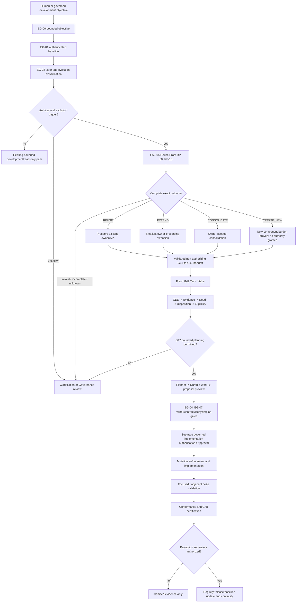

# 1. Implementation Summary

Generation: G63-06

Report identity:
G63_06_CONSTITUTIONAL_REUSE_PROOF_PIPELINE_INTEGRATION_AUDIT_REPORT_V1

Reporting date: 2026-08-01

Certified development baseline:
CONSTITUTIONAL_REUSE_PROOF_RUNTIME_ESTABLISHED

Authenticated repository anchor:

- Commit: `b26a0d5e16e8cb3c7cdf715e02378f26abef4a62`
- Direct parent: `61fdd92849f7878b2fde1744c7459c2e0d009461`
- Tree: `bca3fd26236a9bd794e31aa911329773a29bf073`
- Subject: `G63-05: establish constitutional reuse proof runtime`
- G63-05 runtime SHA-256:
  `220ade9ef6c59270cac8bc323de87f7ea8695e5ab7bf8b7256244dce08810242`
- G63-05 report SHA-256:
  `7a9cb9ccc6e3afe3f56d69322ad185aa95d94d3ddd668ee9a4309ba1904dac51`
- Audit-start worktree state: clean

Implementation contracts:

- G48 Constitutional Evidence Reporting Standard V1
- G63-05 Constitutional Reuse Proof Runtime Implementation Report V1
- G63-04 Constitutional Reuse Proof Runtime Composition Audit Report V1
- G63-02 Constitutional Reuse Proof Framework Report V1
- G63-01 Constitutional Evolution Governance Framework Report V1
- G62-01 Complete Constitutional Architecture Reconstruction and Readiness
  Audit Report V1
- G60-02 First Complete Conversation-to-Platform Core Execution Integration
- G47 Final Constitutional Closure Report V1
- G32-10E Constitutional Governance-to-Certification Integration
- Governed Repository Mutation Workflow V1
- Constitutional Architecture Specification V1
- Canonical Layer Model
- Constitutional Invariants
- Governance Enforcement Hierarchy
- Governance Lineage Model
- Governance Conformance System V1
- AGENTS.md SAPIANTA Codex Orchestration Guide

Objective:

Perform a read-only audit determining the exact constitutional insertion
points at which the G63-05 Constitutional Reuse Proof Runtime shall become a
mandatory stage in authenticated development and repository-evolution flows.
This report distinguishes the current unwired runtime from the target
constitutional requirement and makes no pipeline change.

Audit scope:

- Reconstructed current development lifecycle entry points.
- Reconstructed architecture proposal, Development Governance, planning,
  Approval, implementation authorization, mutation, validation,
  certification, promotion, and continuity flows.
- Located the single primary Reuse Proof execution point and the later
  material-drift re-execution points.
- Classified invocation as conditional at the global lifecycle entry but
  mandatory and non-advisory for every in-scope architectural evolution.
- Defined exact owner, dependency, evidence, handoff, failure, and freshness
  boundaries.
- Distinguished development governance from the certified operational
  Conversation-to-Platform Core execution pipeline.

Modified modules:

- `docs/governance/G63_06_CONSTITUTIONAL_REUSE_PROOF_PIPELINE_INTEGRATION_AUDIT_REPORT_V1.md`:
  this governance-only G48 audit.

Intentionally unchanged modules:

- All runtime source and tests.
- Constitutional Reuse Proof Runtime and its G47 handoff contract.
- Platform Core, Project Services, Conversation Layer, Human Interface,
  AiCLI, Central LLM Services, provider infrastructure, Development
  Governance, Planner, Durable Work, Approval, Authorization, Worker,
  Completion, Replay, and Certification runtimes.
- All registries, manifests, route descriptors, policies, hooks, prior
  governance artifacts, PCBV31 artifacts, Git refs, and Git history.
- The separately versioned and outer-ignored `sapianta_system/` repository.

Architectural determination:

- Reuse Proof is a Development Governance pre-proposal evidence gate.
- Its primary insertion point is G63-01 `EG-03`, after bounded objective,
  authenticated baseline, and L0-L4/evolution classification, but before
  interface design, a fresh G47 assessment, planning, Approval, mutation, or
  implementation.
- In the current Project Services runtime path, that point is immediately
  after `project_objective_ready_for_governance` becomes true and immediately
  before `integrate_constitutional_development_governance(...)` is called.
- Material changes after the initial proof invalidate the affected proof
  phases and require re-execution before implementation authorization,
  mutation, or certification may continue.
- Reuse Proof is not inserted into ordinary certified capability execution,
  Objective Commitment, Platform Core admission, execution Authorization,
  Worker dispatch, Replay reconstruction, or result return.

# 2. Code Evidence

## Authenticated evidence basis

| Evidence | SHA-256 | Audit use |
|---|---|---|
| G48 reporting standard | `16508d1a77c4b3f07d37861e74d85f77896be16da01ca26cbc07a658ddf2c0eb` | Six-section evidence and verdict discipline |
| G63-01 evolution framework | `c449abb036763c87335518bec81eff114aba5f20a384a3526c3d327e3772afa3` | EG-00 through EG-14 and lifecycle ordering |
| G63-02 reuse framework | `55cfc7547990bcc3440a720fdb209d2d4dba1f66bd58db61b1d00c7c500dfb07` | Mandatory EG-03/RP-00 through RP-13 gate |
| G63-04 composition audit | `36391ade93412bdd48ed9e139285b5bec815d2afdf930ed01ecedbd2c185d9bb` | Development Governance ownership and downstream G47 boundary |
| G63-05 implementation report | `7a9cb9ccc6e3afe3f56d69322ad185aa95d94d3ddd668ee9a4309ba1904dac51` | Implemented proof and non-authorizing handoff behavior |
| G47 closure report | `f5aaa04309ee26043417304faaa7b68da6544fc256ebf58b902f957a32922977` | Existing Project Services-to-pre-planning barrier |
| G60-02 execution integration | `9ad9f73493c2524f1259d7058067f8d8d5287123ad7162a43a68f934f0013dae` | Operational Conversation-to-execution route separation |
| G62-01 architecture reconstruction | `b8743d7575ff3db4d60798e19bb21d59498e1eab723e34e88561b2a0e029752c` | End-to-end ownership, dependency, and authority graphs |
| Governed mutation workflow | `22cf9b2df9dcc1d36a268b5e3e2669a88ca9b971534db5498bbb0cfb6dc34e48` | Approval-to-mutation and validation boundary |
| G32-10E certification integration | `93bb14c5f0d46d96c85731bc0bb926893ca7b53fe96e8f6456f9b07f3a13a2f1` | Certification consumes Governance conclusions without authorization |

## Current runtime evidence

| Runtime | SHA-256 | Reconstructed responsibility |
|---|---|---|
| `constitutional_reuse_proof_runtime.py` | `220ade9ef6c59270cac8bc323de87f7ea8695e5ab7bf8b7256244dce08810242` | Complete proof, exact four outcomes, and non-authorizing G47 handoff |
| `platform_core_project_services.py` | `aa84372da05b210f1570ce6f76c927a6ec29a126e6a39cae9e68ddc89182237a` | Development objective readiness, clarification, and current G47 call site |
| `constitutional_development_governance_operational_integration.py` | `3e414949519630009f3987ba176be2b30cf4a8e1e57ab4e4a1cf2e0e66cb3139` | G47 Task Intake through Planning Eligibility and Planner/Durable Work binding |
| `platform_implementation_turn_durable_work_binding.py` | `fdf82b128b5c407a54d58e4fcaf1dca142ec2d502ff49e86ea40b28a3a13fed2` | Proposal preview, approval request, exact bounded plan, and no-execution flags |
| `human_interface_conversation_execution_integration_v2.py` | `a5e698fd3554c153e7671d997cf1c0f0d9a671c9327331d224c3426387d8edc2` | Separate committed-Objective operational execution path |
| `governed_repository_mutation_runtime.py` | `dc09c79ee55c09d267982ee6bbd95b7d3c0381a11292681ab9b54009c15ec5e0` | Exact proposal Approval, existing mutation Worker, validation, and Replay |

Repository-wide search found no import or call of
`constitutional_reuse_proof_runtime`,
`evaluate_constitutional_reuse_proof`, or
`project_reuse_proof_to_development_governance` outside the G63-05 module,
its focused tests, and its implementation report. Therefore the current
runtime status is `EXTERNALLY_INVOKED`, not pipeline-mandatory.

## Current development lifecycle entry points

| Entry point | Current trigger and owner | Current next stage | Reuse Proof applicability |
|---|---|---|---|
| Project Services conversational development | Admissible `IMPLEMENTATION` intent plus sufficient canonical Project Objective | Direct call to G47 operational integration | Primary runtime insertion point for architecture-affecting development |
| Direct G47 public API | Governed caller invokes `integrate_constitutional_development_governance` | G47 internally constructs all six stages and may bind Planner/Durable Work | Precondition at every direct caller when scope is architecture-affecting |
| Human/Codex governance generation | Governed objective expressed outside the live Project Services route | Architecture report, plan, or implementation work | External mandatory proof before proposing the component or authorizing implementation |
| G43/G44 repair and resume | Supervisor/Continuity evidence resumes an existing bounded workflow | Exact diagnosed repair/revalidation scope | Validate existing proof; rerun only when repair changes responsibility, owner, contract, registry, default, or scope |
| Governed repository mutation | Resolved intent produces a proposal, exact Human approval, mutation Worker, and validation | Repository mutation and Replay | Proof must already cover architecture-affecting mutation scope before proposal Approval; ordinary content mutation is out of scope |
| Capability/registry/provider onboarding | Governed proposal changes an implementation, adapter, registry record, provider path, capability, or subsystem | Owner review, implementation, validation, and certification | Mandatory before the first architecture proposal or registry/API design |
| Ordinary certified capability execution | Objective Commitment enters Platform Core admission, selection, Authorization, Worker, Completion, and Replay | Operational result | Not applicable; this is execution of existing architecture, not architecture evolution |
| Read-only informational or audit work | Project Services binds read-only work or a Human commissions a governance audit | Read-only result/report | Not required unless the output itself proposes an architectural component or material contract change |

## Current G47 call boundary

Project Services first establishes:

```text
summary_admissible == true
work_type == IMPLEMENTATION
project_objective_ready_for_governance == true
```

It then immediately calls:

```python
integrate_constitutional_development_governance(...)
```

The G47 API internally performs, without an external stage between them:

```text
Task Intake
-> CDD Classification
-> Authoritative Evidence Snapshot
-> Need Assessment
-> Governance Disposition
-> Planning Eligibility
-> existing Planner / Durable Work when eligible
```

Because G63-05 requires a complete proof and then emits
`RUN_FRESH_DEVELOPMENT_GOVERNANCE_ASSESSMENT`, inserting it inside that
six-stage G47 bundle would alter the G47 contract and would contradict the
G63-04 composition boundary. The exact primary runtime seam is therefore:

```text
Project Objective ready for governance
-> G63 applicability classification
-> complete Reuse Proof when applicable
-> validated G63-to-G47 handoff
-> existing G47 API starts fresh at Task Intake
```

No G47 outcome is precomputed or translated by G63.

## Invocation disposition

| Classification | Determination | Meaning |
|---|---|---|
| `MANDATORY` | Yes, for every in-scope architectural evolution | No architecture proposal, interface design, implementation plan certification, Approval, or mutation may proceed without a complete current proof |
| `CONDITIONAL` | Yes, at global lifecycle entry | The trigger is whether the work can create, extend, consolidate, replace, register, deprecate, or materially rebind a component, runtime, adapter, registry, provider, capability, subsystem, owner, authority, default, state, Replay meaning, or public contract |
| `ADVISORY` | No for in-scope work | The exact four-outcome result constrains later planning; a caller cannot ignore it and choose a higher-impact architecture |
| `EXTERNALLY_INVOKED` | Yes in the current repository only | G63-05 has no production caller. This is current implementation status, not the final constitutional disposition |

The complete characterization is therefore:

```text
CONDITIONAL_APPLICABILITY
-> MANDATORY_NON_ADVISORY_EXECUTION_WHEN_TRIGGERED
-> EXTERNALLY_INVOKED_UNTIL_A_LATER_AUTHORIZED_INTEGRATION
```

## Mandatory trigger model

Reuse Proof is mandatory when any proposed work may do one or more of the
following:

- create a runtime, adapter, registry, provider surface, capability, service,
  subsystem, protocol, state model, or architectural orchestration;
- add or change a public API, schema, identity, state, persistence, evidence,
  Replay, lifecycle, selection, routing, activation, fallback, or default;
- extend, consolidate, replace, deprecate, relocate, split, or merge an
  existing owner or implementation family;
- change a capability declaration, certification binding, runtime binding,
  provider integration, Worker contract, Authorization boundary, or Human
  interface route; or
- claim that no reusable owner exists.

It is not triggered solely by:

- executing an existing certified capability with an unchanged contract;
- a read-only inventory, explanation, or evidence audit that proposes no
  architecture;
- a byte/content-only documentation correction with no semantic, owner,
  baseline, registry, route, or authority effect; or
- a proven bounded repair that restores exact certified behavior and creates
  no new responsibility, interface, owner, or route.

If applicability is ambiguous, the result is not “advisory.” The work stops
for clarification or Governance review before design.

## Lifecycle insertion diagram



The `F` branch may still enter G47 where the existing lifecycle requires it.
It does not acquire a proof exemption for work whose scope later changes.

## Mandatory invocation sequence

1. Establish one bounded objective and explicit non-goals.
2. Authenticate commit, tree, governing artifacts, worktree state, and known
   limitations.
3. Classify affected layers and the proposed evolution type without treating a
   filename or component name as the responsibility.
4. Apply the trigger model. Unknown applicability fails closed.
5. Normalize the G63 responsibility signature.
6. Assemble authenticated source-owner evidence for RP-01 through RP-10.
7. Call `evaluate_constitutional_reuse_proof(...)`.
8. Require `PROOF_COMPLETE_FOR_EVOLUTION_PLANNING` and exactly one of
   `REUSE`, `EXTEND`, `CONSOLIDATE`, or `CREATE_NEW`.
9. Call `project_reuse_proof_to_development_governance(...)` and validate the
   hash-bound non-authorizing handoff.
10. Start the existing G47 lifecycle fresh at Task Intake. G47 independently
    evaluates evidence, Need, disposition, and Planning Eligibility.
11. Bind the proof ID, evidence identity, baseline, decision, selected target,
    evolution class, and limitations into later planning and review evidence.
12. Before Approval or mutation, validate that the proposal remains within the
    proof signature and selected target. Material drift returns to step 1 or
    the earliest affected RP phase.
13. Before certification, verify proof lineage and scope parity. Rerun the
    affected proof phases if implementation evidence changed a candidate,
    owner, registry, consumer, default, compatibility result, or architectural
    responsibility.

## Material-drift re-execution points

| Checkpoint | Default action | Re-execution trigger | Failure consequence |
|---|---|---|---|
| Before interface design / G47 | Execute complete proof | Always for in-scope work | No G47 handoff or design |
| Before implementation plan certification | Validate proof identity and scope | Plan changes owner, API/schema, dependency, state, registry, route, default, migration, or certification scope | Return to affected RP phase |
| Before Human Approval / implementation authorization | Validate exact plan-to-proof binding | Approved proposal differs from proof-selected target or smallest justified change | Approval request is inadmissible |
| Before repository mutation | Validate proof/plan/approval lineage | Target paths or semantic mutation exceed the characterized responsibility | No mutation authorization; Worker not invoked |
| After correction, interruption, or resume | Validate baseline and source identities | Baseline, objective, responsibility signature, candidate set, or evidence changed | Existing proof is stale and cannot resume |
| Before G48 certification | Validate implementation-to-proof parity | Implemented behavior reveals new responsibility, owner, consumer, route, default, or compatibility effect | Certification cannot claim completion; rerun proof |
| Before promotion/baseline update | Validate certified proof lineage | Promotion scope exceeds certified implementation or changes registry/baseline meaning | No promotion or baseline mutation |

Validation without material drift does not rerun the whole proof. This keeps
the stage deterministic and avoids manufacturing new evidence while still
preventing stale proof reuse.

## Outcome interaction with Development Governance

| G63 result | Permitted G47 interpretation | Prohibited shortcut |
|---|---|---|
| `REUSE` | Fresh G47 may determine no implementation is required or may bound direct integration through the existing owner | Copying the owner, creating an adapter without a representation gap, or skipping G47 |
| `EXTEND` | Fresh G47 may assess only the first feasible owner-preserving rung and residual gap | Choosing a higher rung, new owner, or broader scope |
| `CONSOLIDATE` | Fresh G47 may assess owner-scoped composition/migration/retirement with compatibility and lineage evidence | Treating consolidation as a new independent authority or mapping it mechanically to G47 `COMPOSE` |
| `CREATE_NEW` | Fresh G47 and G63-01 gates may review a bounded proposed owner and complete new-component burden | Treating the token as planning, implementation, mutation, registry, or execution authorization |

G47 remains decisive. A complete G63 proof does not force G47 to permit
planning, and G47 cannot silently replace the exact G63 result with a more
expansive choice.

## Ownership boundaries

| Responsibility | Constitutional owner | Reuse Proof relationship | Explicit non-owner |
|---|---|---|---|
| Human objective and structural direction | Human Authority | Supplies/clarifies objective and later separate decisions | Reuse Proof cannot infer Human approval |
| Conversation semantics and commitment | Conversation Layer owners | May supply an immutable development objective to Platform Core | Reuse Proof does not read/write Semantic CWM or create Objective Commitment |
| Objective inference, project knowledge, and development routing | Platform Core Project Services | Supplies bounded objective/context and hosts the future pre-G47 call seam | Reuse Proof does not acquire Platform Core admission or execution authority |
| Reuse proof semantics | Development Governance under G63 | Validates evidence and returns one exact reuse outcome | Platform Core, Conversation, providers, registries, and AiCLI do not decide reuse |
| Planning eligibility | Existing G47 Development Governance | Consumes a validated handoff and runs every G47 stage fresh | G63 cannot precompute Need or eligibility |
| Plan and Durable Work | Existing Planner/Durable Work owners | Must remain within proof-selected target and G47 residual gap | G63 does not plan or create work |
| Approval / implementation authorization | Scope-specific Human/Approval owner | Requires current proof lineage for in-scope proposals | Proof result is not Approval |
| Mutation | Existing mutation authorization and Worker owners | Reject scope beyond proof/plan/approval | Proof runtime never mutates |
| Execution Authorization and Worker | Existing Authorization/Worker owners | Not part of architecture proof; unchanged operational route | G63 cannot authorize or dispatch |
| Certification | Existing Governance/Certification evidence owners | Verify proof lineage and claimed scope | Certification does not reinterpret G63 or authorize promotion |
| Replay/evidence | Existing stage-local evidence owners under Platform Core Replay meaning | Future integration may persist references through an authorized owner | G63-05 currently writes no Replay |

## Interaction with Platform Core

Platform Core interaction is evidence-producing and routing-only:

- Objective Inference and Project Services must establish a sufficient
  development objective before the applicability check.
- Existing Project Services, Platform Knowledge, capability discovery, and G15
  registry APIs remain source owners used by G63-05.
- The future call seam may be hosted by Project Services immediately before
  G47, but the proof decision remains Development Governance authority.
- Platform Core admission, capability selection, execution binding,
  Authorization, Worker, and Completion must not depend on G63 for ordinary
  operational execution.
- If an operational conversation requests architecture evolution, it must
  enter the development lifecycle; it cannot use execution admission as a
  substitute for Reuse Proof.

## Interaction with Conversation Layer

Conversation Layer interaction ends at an immutable development objective:

- Human turns, semantic proposals, CWM updates, clarification, correction,
  readiness, and Objective Commitment remain Conversation-owned.
- Reuse Proof does not execute during ordinary clarification or candidate
  proposal validation.
- The proof begins only after a committed or otherwise governed development
  objective reaches Project Services and the evolution trigger is established.
- A Human correction before commitment changes Conversation state and no proof
  is yet required.
- A correction after proof that changes the responsibility signature, target,
  authority, owner, route, or contract invalidates the proof and requires
  re-execution before G47 or implementation can continue.
- Interpreter and external LLM outputs remain non-authoritative proposals and
  cannot supply a reuse result or waive the proof.

## Failure semantics

| Failure | Required disposition | Downstream effects prohibited |
|---|---|---|
| Objective, non-goals, layer, or applicability ambiguous | Clarification or Governance review | No proof, design, G47, plan, or mutation |
| Baseline dirty/unauthenticated or governing source conflict | `PROOF_INCOMPLETE` / fail closed | No G47 handoff |
| Material repository/dynamic/history scope unknown | Fail closed until evidence or declared blocker is resolved | No negative absence claim or `CREATE_NEW` |
| Missing/contradictory owner, registry, usage, equivalence, compatibility, or duplicate evidence | Fail closed | No outcome token |
| Critical conformance violation | G63-05 blocks evaluation | No handoff or planning |
| Existing partial conformance without a critical violation | Preserve as a visible limitation; later gates decide scope-specific admissibility | No claim of full conformance |
| Invalid or tampered result/handoff hash | Reject artifact | No G47 entry |
| G47 terminates or denies planning | Stop at G47 | No Planner, Durable Work, Approval, or mutation |
| Plan/Approval/mutation scope exceeds proof | Invalidate lineage and rerun affected gates | No Approval consumption or Worker invocation |
| Certification finds architectural drift | Withhold certifying verdict and rerun affected proof phases | No promotion or baseline update |

## Certification and repository-evolution flow

Reuse Proof is upstream evidence, not the certification owner:

```text
G63 proof
-> fresh G47 assessment
-> bounded plan and Durable Work
-> owner/contract/migration review
-> separate implementation authorization or exact Approval
-> guarded mutation
-> focused/adjacent/e2e validation
-> Replay and conformance verification
-> G48 certification
-> separate promotion decision
-> registry/release/baseline update when authorized
-> continuity, rollback, repair, versioning, or deprecation
```

Certification must record the proof identity and confirm that the implemented
scope matches it. Certification cannot turn `CREATE_NEW` into authorization,
and promotion cannot infer permission from certification alone.

# 3. Constitutional Self-Assessment

## Verified

- The committed G63-05 baseline and exact runtime/report identities were
  authenticated from a clean worktree.
- G63-01 and G63-02 place Reuse Proof at EG-03, after objective/baseline/layer
  classification and before ownership/interface/plan/authorization gates.
- The exact current Project Services seam is immediately before the G47
  operational integration call.
- G63-05 explicitly requires a fresh G47 Task Intake, CDD, Evidence Snapshot,
  Need Assessment, Governance Disposition, and Planning Eligibility.
- No current production runtime imports or invokes G63-05; current status is
  external invocation only.
- Conditional applicability and mandatory execution are distinguished: the
  proof is not required for ordinary existing-capability execution, but is
  mandatory and non-advisory for in-scope architecture evolution.
- Later plan, Approval, mutation, certification, promotion, correction, and
  resume checkpoints validate proof freshness and rerun it on material drift.
- Platform Core, Conversation Layer, G47, Planner, Durable Work, Approval,
  Authorization, Worker, Replay, Certification, and Human ownership remain
  separate.
- No runtime, test, pipeline, registry, hook, Git history, or constitutional
  artifact was modified by this audit.

## Not verified and intentionally deferred

- No mandatory runtime integration exists yet. Enforcing the characterized
  Project Services/direct-G47 precondition requires a later authorized
  implementation generation.
- No persistence owner or Replay schema for G63 proof references is selected
  by G63-05 or this audit. A later integration must reuse an authenticated
  evidence owner and may not create an implicit central Replay owner.
- No automatic applicability classifier is implemented. A later design must
  fail closed on ambiguous architecture impact and must not rely only on
  filenames, generation labels, or requested component names.
- No G47 schema or stage accepts a G63 proof field today. Integration must
  preserve the frozen G47 bundle and use the existing non-authorizing handoff
  semantics rather than silently widening G47.
- Repository-wide conformance remains partial because of the known root and
  nested pre-commit hook drift. This audit does not repair or hide it.

# 4. Validation Matrix

| Requirement | Evidence | Validation | Result |
|---|---|---|---|
| Authenticate G63-05 baseline | Git commit/parent/tree/subject; runtime and report SHA-256 | Compared committed anchor and clean audit-start status | PASS |
| Identify lifecycle entry points | Project Services, direct G47, external governance, repair/resume, mutation, onboarding, operational execution, read-only work | Reconstructed current callers and owner contracts | PASS |
| Identify architecture proposal flow | G63-01 EG-00 through EG-07 and G63-02 RP-00 through RP-13 | Matched proof to EG-03 before component/interface proposal | PASS |
| Identify Governance checkpoints | G63-01 EG-00 through EG-14; G47 six-stage bundle | Reconstructed pre-design through continuity gates | PASS |
| Identify implementation authorization flow | G47 planning eligibility, Planner/Durable Work, proposal preview, scope-specific Approval | Confirmed proof cannot substitute for eligibility or Approval | PASS |
| Identify mutation authorization flow | Governed mutation proposal, exact Human approval, mutation Worker, validation, Replay | Placed proof-lineage validation before Approval and mutation | PASS |
| Identify certification flow | Validation, conformance, G48, certification, separate promotion | Confirmed proof is lineage evidence and drift trigger, not certification authority | PASS |
| Determine exact primary insertion point | Project Services readiness predicate and immediate G47 call | Located seam after objective readiness and before fresh G47 Task Intake | PASS |
| Classify invocation | Mandatory, conditional, advisory, externally invoked | Determined conditional applicability, mandatory non-advisory execution, current external invocation | PASS |
| Define lifecycle diagram and sequence | Code Evidence diagrams and 13-step sequence | Cross-checked against G63-01/G63-02/G47/G60/G62 | PASS |
| Define owner boundaries | Ownership matrix | Confirmed no authority transfer to G63 | PASS |
| Define failure semantics | Fail-closed matrix | Confirmed no fallback outcome, G47 bypass, mutation, or promotion | PASS |
| Platform Core interaction | Project Services call site and operational route | Confirmed evidence/routing relationship and no execution insertion | PASS |
| Conversation interaction | G59/G60/G62 commitment and execution boundaries | Confirmed proof starts after governed development objective, not in CWM | PASS |
| Governance conformance tests | `python -m pytest tests/test_governance_conformance.py -q` | `5 passed in 0.03s` | PASS |
| Governance conformance engine | Read-only engine result | `18` passed, `2` failed, `0` critical; deterministic, fail-closed, read-only; `PARTIALLY_CONFORMANT`; report hash `0790499ee53f9a82e15225e15eff1c2637b7e60523fa38be0c921281abe4cbea` | PASS_WITH_KNOWN_LIMITATION |
| Runtime/test mutation | Git status and scope review | Report is the only new file | NOT_APPLICABLE |
| Documentation whitespace | `git diff --check` and no-index check for the new report | No whitespace errors | PASS |

# 5. Repository Mutation Summary

Added files:

- `docs/governance/G63_06_CONSTITUTIONAL_REUSE_PROOF_PIPELINE_INTEGRATION_AUDIT_REPORT_V1.md`

Unchanged subsystems:

- Constitutional Reuse Proof Runtime and tests.
- Platform Core, Project Services, Conversation Layer, HIR, AiCLI, and Central
  LLM Services.
- Development Governance, Planner, Durable Work, Approval, Authorization,
  Worker, Completion, Replay, Certification, and provider infrastructure.
- All registries, manifests, route tables, policies, hooks, tests, PCBV31
  artifacts, Git history, and refs.

API compatibility:

- No runtime API, schema, registry, route, lifecycle, default, persistence,
  Replay identity, selection rule, authorization, mutation, certification, or
  execution behavior changed.
- The insertion points are architectural findings only.

Boundary preservation:

- This audit does not wire G63-05 into Project Services or G47.
- It does not create an applicability classifier, evidence persistence owner,
  new G47 field, new approval rule, mutation guard, registry, or Replay stage.
- It authorizes no proposal, plan, implementation, mutation, execution,
  certification, promotion, release, or baseline change.

Unrelated pre-existing changes:

- None observed at audit start.

# 6. Certification Verdict

CONSTITUTIONAL_REUSE_PROOF_PIPELINE_CHARACTERIZED
