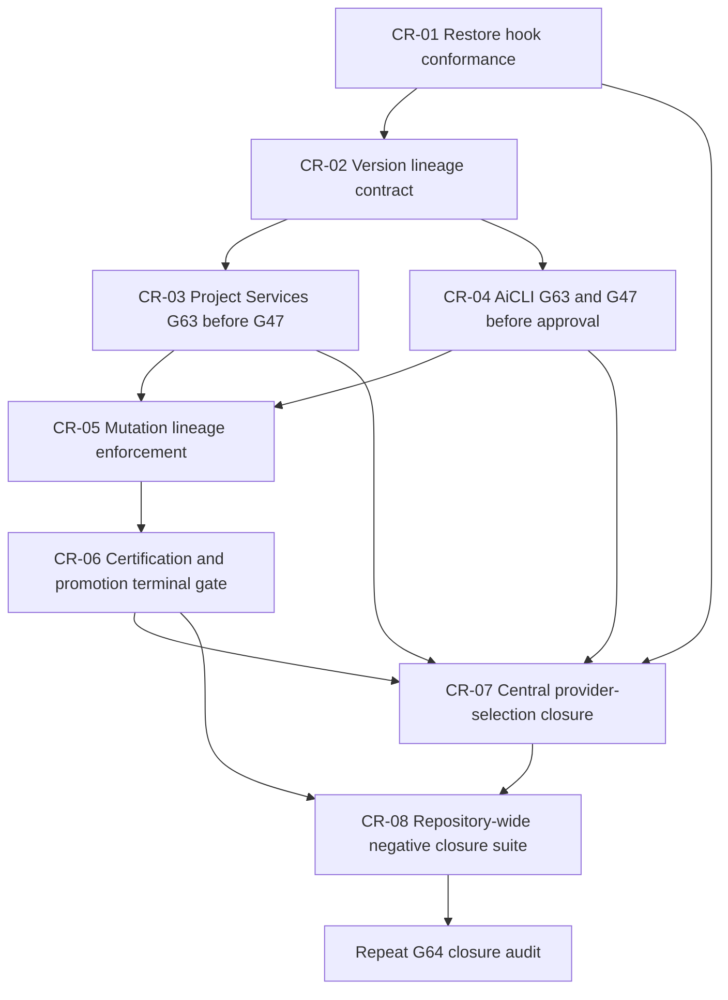

# 1. Implementation Summary

Generation: G64-02

Report identity:
G64_02_CONSTITUTIONAL_GOVERNANCE_CLOSURE_REPAIR_SEQUENCING_REPORT_V1

Reporting date: 2026-08-02

Constitutional baseline:
CONSTITUTIONAL_GOVERNANCE_REQUIRES_REPAIR

Authenticated repository anchor:

- Commit: `0a47998cd3c4a3b536aeec86235b91940c469aa7`
- Direct parent: `2e4a7ae4bde2a1b7a8b5fa1fda202dded38b119a`
- Tree: `a04380eac923f23d7b9e37e96e14861f3b8d2479`
- Subject: `G64-01: audit constitutional governance closure`
- G64-01 report SHA-256:
  `f24cc3bf5bd88357789d1471be6facee39ce8029cf33f76f216873dccd85ea68`
- Audit-start worktree state: clean

Implementation contracts:

- G48 Constitutional Evidence Reporting Standard V1
- G64-01 Constitutional Governance Closure Audit Report V1
- G63-06 Constitutional Reuse Proof Pipeline Integration Audit Report V1
- G63-05 Constitutional Reuse Proof Runtime Implementation Report V1
- G63-02 Constitutional Reuse Proof Framework V1
- G63-01 Constitutional Evolution Governance Framework V1
- G47 Final Constitutional Closure Report V1
- G32-10E Constitutional Governance-to-Certification Integration
- Governance Conformance System V1
- Governance Promotion Discipline
- G61-01 Central LLM Services Discovery and Constitutional Integration Audit
- G62-01 Complete Constitutional Architecture Reconstruction and Readiness
  Audit Report V1
- AGENTS.md SAPIANTA Codex Orchestration Guide

Objective:

Derive the minimum deterministic implementation and certification order needed
to close every authenticated G64-01 repository-wide governance blocker,
without implementing a repair, redesigning an owner, or repeating the
repository discovery completed by G64-01.

Sequencing scope:

- Treated the seven enforcement gaps named by the governing request and
  authenticated by G64-01 as normative inputs.
- Bound each gap to its implementation owner, runtime owner, Governance owner,
  invariant, exact insertion point, change class, dependencies, regression
  surface, certification checkpoint, and fail-safe rollback.
- Reused the existing G63 proof and handoff, G47 integration, mutation Worker,
  Validation, Replay, Certification, promotion, provider registry, and unified
  selection owners.
- Defined one critical path and explicit parallelism only where it cannot
  weaken ordering or authority.
- Kept the G64-01 medium risks of asserted Human identity and distributed
  rollback visible as residual risks, but did not promote them into new
  closure blockers beyond the authenticated scope.

Modified modules:

- `docs/governance/G64_02_CONSTITUTIONAL_GOVERNANCE_CLOSURE_REPAIR_SEQUENCING_REPORT_V1.md`:
  this governance-only G48 sequencing audit.

Intentionally unchanged modules:

- All runtime source and tests.
- Human Interface, AiCLI, Conversation Layer, Objective Commitment, Platform
  Core, Project Services, Development Governance, Reuse Proof, mutation,
  Certification, promotion, provider, Authorization, Worker, and Replay
  owners.
- Hooks, registries, manifests, policies, prior governance reports, PCBV31,
  Git refs, and Git history.
- The separately versioned and outer-ignored `sapianta_system/` repository.

Architectural boundaries preserved:

- The sequence introduces no new constitutional owner.
- Reuse Proof remains non-authorizing and precedes a fresh G47 assessment.
- G47 remains the Development Governance owner and is not folded into AiCLI,
  Platform Core, mutation, Certification, or Replay.
- Mutation approval remains separate from execution Authorization.
- Certification consumes Governance conclusions and cannot self-authorize or
  retrospectively validate an ungoverned mutation.
- Provider-specific logic remains outside Conversation Layer and central
  provider registries remain authoritative.
- A rollback may disable an entry point, but may never restore a known bypass.

Sequencing determination:

Eight bounded repair stages are required. Hook enforcement must be restored
before repository-mutating repair work. A versioned constitutional-lineage
contract must exist before either development entry point is wired. Project
Services and AiCLI must then invoke G63 and fresh G47 before the mutation owner
can enforce their lineage. Certification/promotion becomes a terminal gate
only after mutation lineage is authoritative. Provider-selection exceptions
must be closed under the newly enforced development path. Repository-wide
negative tests and a new closure audit are last and cannot be parallelized
with unfinished repairs.

# 2. Code Evidence

## Normative G64-01 input set

This generation does not rediscover the findings. It sequences these exact
authenticated inputs:

| G64-01 input | Normative finding | Required repair result |
|---|---|---|
| B1 / Blocker 1 | G63 Reuse Proof has no production caller | Every architecture-development entry point performs fail-closed applicability and consumes a current proof before G47 |
| B3 / Blocker 2 | AiCLI governed development and mutation do not require G47 | No architecture-affecting proposal reaches approval or mutation without fresh G47 Planning Eligibility |
| B4 / Blocker 3 | Approval and mutation artifacts lack G63/G47 lineage | Exact proof, baseline, handoff, G47, eligibility, and mutation-scope identities are hash-bound and validated |
| Blocker 4 | AiCLI mutation can complete before mandatory G48 certification/promotion | Mutation result remains pending until external certification and promotion evidence close the lifecycle |
| B7 / High 1 | Root and nested hook surfaces are partially conformant | Expected and installed hooks pass all conformance rules |
| B6 / High 2 | Two direct-provider selection paths remain CLI-reachable | Every new provider invocation carries authoritative central selection evidence; legacy exceptions are version-gated |
| Recommendation 7 | No repository-wide negative closure suite exists | Every known entry point is exercised with missing, stale, mismatched, and tampered control evidence and fails closed |

## Existing owner APIs to reuse

| Existing owner | Existing API or artifact | Sequencing use |
|---|---|---|
| Constitutional Reuse Proof | `validate_constitutional_reuse_proof_result(...)` | Validate complete proof without reimplementing proof semantics |
| Constitutional Reuse Proof | `project_reuse_proof_to_development_governance(...)` and `validate_reuse_proof_g47_handoff(...)` | Produce and validate the non-authorizing G63-to-G47 boundary |
| G47 Development Governance | `integrate_constitutional_development_governance(...)` and `validate_constitutional_development_governance_operational_record(...)` | Run fresh Task Intake through Planning Eligibility and validate the result |
| Project Services | `project_objective_ready_for_governance` branch | Primary pre-G47 insertion seam characterized by G63-06 |
| AiCLI bridge | `propose_acli_governed_development_execution(...)` and `approve_and_execute_acli_governed_development(...)` | Prevent proposal approval/execution before G63/G47 lineage exists |
| Governed development | `create_governed_development_proposal(...)`, `_validate_proposal(...)`, and `_validate_approval(...)` | Bind the top-level development proposal and Human approval to exact constitutional lineage |
| Governed mutation | `create_governed_repository_mutation_proposal(...)`, `_validate_proposal(...)`, `_validate_approval(...)`, and `execute_governed_repository_mutation(...)` | Enforce lineage immediately before mutation Worker proposal creation |
| Repository mutation Worker | `create_patch_proposal_artifact(...)` and `apply_repository_mutation(...)` | Reuse unchanged after upstream lineage validation succeeds |
| Constitutional Certification | `certify_constitutional_governance(...)` | Reuse the non-authorizing Certification owner for an immutable Governance assessment |
| Promotion discipline | `evaluate_governance_promotion(...)` | Reuse fail-closed promotion eligibility; missing or mismatched certification is blocked |
| Unified resource selection | `select_unified_resource(...)` | Produce authoritative, non-dispatching provider-selection evidence |
| Existing provider runtimes | `run_llm_cognition_provider_runtime(...)` and `run_native_provider_execution(...)` | Remain provider execution owners but consume central selection evidence at their CLI boundary |
| Governance conformance | `python -m runtime.governance.governance_conformance_engine` | Verify expected and installed hook surfaces without changing conformance semantics |

## Exact current insertion seams

### Project Services seam

The exact G63-06 insertion seam is between the existing readiness predicate and
the G47 import/call in `aigol/runtime/platform_core_project_services.py`:

```python
    if (
        development_intent.get("summary_admissible") is True
        and development_intent.get("work_type") == "IMPLEMENTATION"
        and project_objective_ready_for_governance
    ):
        from aigol.runtime.constitutional_development_governance_operational_integration import (
            G47_OPERATIONAL_INTEGRATION_READY,
            integrate_constitutional_development_governance,
        )
```

The repair inserts applicability, proof validation, and handoff validation
before the existing G47 call. It does not insert G63 inside G47.

### AiCLI governed-development seam

The exact pre-execution seam is inside
`approve_and_execute_acli_governed_development(...)`, before:

```python
        workflow_capture = execute_governed_development_workflow(
```

The earlier and lower-risk seam is proposal construction in
`propose_acli_governed_development_execution(...)`: an architecture-affecting
proposal must not become approval-ready until G63 and fresh G47 evidence are
present and scope-bound.

### Mutation enforcement seam

The final mandatory enforcement point is inside
`execute_governed_repository_mutation(...)`, before this existing code:

```python
        worker_proposal = create_patch_proposal_artifact(
```

This is the last point at which missing or stale lineage can be rejected
without invoking the mutation Worker. The Worker remains unchanged.

### Certification completion seam

`execute_governed_development_workflow(...)` currently emits
`GOVERNED_DEVELOPMENT_WORKFLOW_COMPLETED` immediately after governance-artifact
creation, repository mutation, validation, and Replay assembly. The versioned
repair changes this post-validation outcome to
`AWAITING_CONSTITUTIONAL_CERTIFICATION_AND_PROMOTION`. A separate finalization
entry consumes external G48-conformant report identity, immutable Governance
assessment/Certification evidence, and promotion eligibility before it can
emit a terminal completed status.

The workflow must not create its own G48 report or certify itself.

### Provider-selection seam

`aigol/cli/aigol_cli.py` currently imports both direct provider runtimes and
calls `run_native_provider_execution(...)` for the native command. The repair
inserts `select_unified_resource(...)` at the CLI orchestration boundary and
binds the selected resource identity/hash to the existing provider request.
Provider runtimes, adapters, credentials, and registries remain unchanged.

## Constitutional blocker matrix

| Repair | Authenticated blocker | Implementation owner | Runtime owner | Governance owner | Invariant | Exact insertion point | Change class | Complexity | Regression impact | Certification dependency |
|---|---|---|---|---|---|---|---|---|---|---|
| CR-01 | Hook drift | Repository Governance maintainer | Version-controlled hook scripts and installed hook surfaces; conformance engine remains validator | Governance Conformance | L0/L1 freeze and promotion enforcement must be present | Root `scripts/hooks/pre-commit` and `.git/hooks/pre-commit`; nested `sapianta_system/.git/hooks/pre-commit` from its tracked canonical hook | Additive/configuration; no conformance-rule semantic change | Medium because two repository identities and installed state are involved | Hook tests, layer-freeze tests, promotion-gate tests, conformance engine | Must certify before any later mutation-bearing repair |
| CR-02 | Missing G63/G47 lineage contract | Development Governance implementation owner | Governed-development and governed-mutation proposal/validator owners | Development Governance | Evidence lineage, freshness, exact scope, and no authority by implication | Proposal creation/validation and approval validation, before any proposal becomes approval-ready | Versioned V2 artifacts; V1 remains replay-readable only | High | Proposal hashing, replay reconstruction, approval binding, stale/mismatch failures | Requires CR-01; certifies the contract before wiring callers |
| CR-03 | No production G63 invocation in Project Services | Platform Core Project Services maintainer | `platform_core_project_services.py` orchestration | Development Governance owns applicability disposition and G63 evidence meaning | Reuse before create; G63 precedes fresh G47 | Immediately after `project_objective_ready_for_governance` and before `integrate_constitutional_development_governance(...)` | Versioned Project Services output/capture; additive reuse of G63/G47 APIs | High because complete proof evidence may require a pause/clarification state | Project Services sessions, implementation intent, read-only exclusions, proof freshness, G47 compatibility | Requires CR-02; independent certification before AiCLI integration |
| CR-04 | AiCLI governed development bypasses G47/G63 | AiCLI/HIR orchestration maintainer | `acli_governed_development_execution_bridge.py` and governed-development workflow | Development Governance; Human Authority retains approval | No planning or implementation without G63 and fresh G47 | Proposal phase before `APPROVAL_REQUIRED`, and execution phase before `execute_governed_development_workflow(...)` | Versioned bridge/proposal/capture contract | High | Interactive approval/resume, restored proposals, G47 termination, proof mismatch, old V1 replay | Requires CR-02 and certified CR-03 semantics; does not depend on Project Services implementation code if it calls the same owners directly |
| CR-05 | Mutation authorization accepts local approval only | Governed mutation maintainer | `governed_repository_mutation_runtime.py` validators and execution entry | Development Governance defines lineage; Human Authority approves exact scope | Mutation requires applicable governance, current proof, exact approval, and fail-closed scope | `_validate_proposal`, `_validate_approval`, then final check immediately before `create_patch_proposal_artifact(...)` | Versioned mutation proposal/approval/outcome V2; V1 historical replay only | High | All mutation consumers, patch hashes, validation commands, replay, non-architectural exemption | Requires CR-02, CR-03, and CR-04; must certify before completion-gate work |
| CR-06 | Mutation reports complete before G48 certification/promotion | Governance/Certification integration maintainer | Governed-development outcome/finalization adapter; existing Certification and promotion runtimes unchanged | Certification and Promotion owners | Implementation cannot certify itself; promotion requires current compliant evidence | After successful validation/Replay and before current `GOVERNED_DEVELOPMENT_WORKFLOW_COMPLETED` outcome | Versioned lifecycle/status and additive finalization API | High | Outcome/status consumers, safe resume, Replay ordering, certification mismatch, promotion refusal | Requires CR-05; G48 report conformance plus independent Certification and promotion evidence |
| CR-07 | Direct-provider selection owner exceptions | Provider Platform and CLI orchestration maintainers | AiCLI command handlers plus unified selection; provider runtimes unchanged | Provider Governance | Registry/selection ownership is singular; selection does not authorize or dispatch | Before calls to `run_llm_cognition_provider_runtime(...)` and `run_native_provider_execution(...)` | Versioned CLI routing/selection binding; legacy use explicit and time-bounded | Medium | Provider CLI, credentials, timeout/failure propagation, Replay, Conversation adapter non-regression | Requires CR-03 through CR-06 so this architectural repair itself uses the closed path |
| CR-08 | Missing repository-wide negative fail-closed validation | Governance Conformance and test maintainers | Test/evidence layer only; no production owner change | Development Governance and Certification | Every mandatory control is unavoidable across every authenticated entry point | Cross-entry test suite after CR-01 through CR-07 | Additive tests and evidence only | High breadth, low runtime mutation risk | All Project Services, AiCLI, mutation, provider, certification, hook, Replay, and operational reference paths | Requires every prior repair certificate; gates the repeat closure audit |

## Versioned constitutional lineage contract

CR-02 is the shared dependency that prevents later orchestration from passing
unstructured references. Its V2 proposal evidence must contain and validate:

| Required field | Source owner | Validation rule |
|---|---|---|
| Applicability disposition and evidence hash | Development Governance applicability step | Exact `APPLICABLE` or `NOT_APPLICABLE`; ambiguity fails closed |
| Authenticated baseline commit, parent, tree, and clean-state claim | G63 proof input/result | Must match the proof and precede mutation |
| Reuse Proof ID, evidence identity, decision, selected target, and evolution class | G63 result | Revalidate with `validate_constitutional_reuse_proof_result(...)` |
| G63-to-G47 handoff and hash | G63 handoff owner | Revalidate; must require all fresh G47 stages and grant no authority |
| G47 operational record and hash | G47 owner | Revalidate; must be ready and contain bounded Planning Eligibility |
| Planning Eligibility ID and eligible state | G47 stage output | Must match the G47 record and be eligible for the exact proposed work |
| Target-path and content-hash scope digest | Governed mutation proposal | Must match proposal, approval, Worker proposal, and certification scope |
| Material-drift/freshness marker | Development Governance orchestration | Baseline, responsibility, owner, API, registry, default, or scope drift invalidates the proof |
| Explicit non-applicability evidence | Development Governance applicability step | Allowed only for deterministically bounded non-architectural work; never inferred from missing evidence |

V1 proposal and replay artifacts remain reconstructable. They must not be
accepted for new architecture-affecting execution after the V2 gate is
certified. This preserves historical Replay without grandfathering the bypass.

## Repair dependency graph



CR-03 and CR-04 may be implemented in separate branches after CR-02, but CR-05
cannot certify until both are certified. No later parallel work may bypass the
newly completed gates.

## Critical path

The deterministic critical path is:

```text
CR-01
-> CR-02
-> CR-03 and CR-04, both required
-> CR-05
-> CR-06
-> CR-07
-> CR-08
-> repeat G64 closure audit
```

CR-07 is logically independent of mutation lineage at runtime, but it is
sequenced after CR-06 because changing an architectural provider route before
the repaired development pipeline is mandatory would reproduce the governance
problem being repaired.

## Deterministic implementation and certification order

### CR-01 — Restore governance-hook conformance

Prerequisites:

- Authenticate the G64-01 baseline and exact current hook hashes.
- Preserve the tracked nested canonical hook as source evidence.
- Record installed-hook custody separately from repository content.

Implementation:

- Add or restore the version-controlled root pre-commit hook expected by the
  conformance rules with `promotion_gate_v02` and `check_layer_freeze`.
- Install the authenticated root hook into `.git/hooks/pre-commit`.
- Reinstall the nested tracked canonical hook into
  `sapianta_system/.git/hooks/pre-commit` without modifying freeze or promotion
  semantics.

Validation:

- Run root and nested hook tests, promotion-gate tests, layer-freeze tests, and
  the governance conformance engine.
- Require 20/20 conformance checks, zero failures, and zero critical
  violations; token presence alone is insufficient without executable tests.

Certification:

- Produce a G48 hook-restoration report with tracked and installed hashes and
  installation provenance.
- Do not begin mutation-bearing CR-02 work until this checkpoint certifies.

Rollback strategy:

- Preserve prior installed hooks as authenticated backups.
- If the repaired hook fails, disable governed promotion and restore the last
  functional hook only as a temporary fail-closed state. Do not resume
  architecture mutation until conformance is restored.

### CR-02 — Establish the versioned constitutional-lineage contract

Prerequisites:

- CR-01 certification.
- Existing G63 result/handoff and G47 operational validators remain unchanged
  and passing.
- Freeze the V1 artifact/replay fixtures as historical compatibility evidence.

Implementation:

- Add V2 governed-development and governed-mutation proposal, approval, and
  outcome schemas carrying the required lineage table above.
- Reuse G63 and G47 public validators; add only owner-local composition
  validation.
- Keep V1 reconstructors read-only. New architecture-affecting proposal
  creation emits V2 and refuses absent or ambiguous applicability evidence.

Validation:

- Cover canonical serialization, deterministic hashes, exact scope binding,
  missing proof, incomplete proof, stale baseline, tampered handoff, G47
  termination, ineligible planning, changed target paths/content, and valid
  non-applicability evidence.
- Reconstruct all preserved V1 fixtures without permitting them as new
  architecture-mutation authority.

Certification:

- Certify the schema, validator, Replay compatibility, and non-authority
  boundary before any production caller supplies V2 evidence.

Rollback strategy:

- Disable V2 proposal creation if the contract fails certification.
- Preserve V1 Replay readers, but block new architecture mutation rather than
  falling back to V1 execution.

### CR-03 — Invoke G63 before G47 in Project Services

Prerequisites:

- CR-02 certification.
- A complete owner-supplied proof input or a deterministic pause state when
  proof evidence is incomplete.
- Existing Project Objective sufficiency and G47 tests remain green.

Implementation:

- At the exact Project Services seam, classify G63 applicability.
- For applicable work, validate/evaluate the proof, create and validate the
  G47 handoff, then call the existing G47 integration fresh.
- For non-applicable work, persist exact evidence. For unknown or incomplete
  work, stop before G47 and return clarification/governance-review state.
- Version the affected Project Services capture because its persisted content
  and hash gain mandatory constitutional lineage.

Validation:

- Demonstrate applicable implementation, `REUSE`, `EXTEND`, `CONSOLIDATE`, and
  `CREATE_NEW`; incomplete proof; dirty/stale baseline; material drift; exact
  non-applicability; read-only work; and unchanged certified capability
  execution.
- Prove G63 never precomputes G47 and never grants planning authority.

Certification:

- Certify Project Services as a mandatory production caller and prove no
  direct G47 call in that module can bypass the precondition.

Rollback strategy:

- On repair failure, disable the Project Services implementation branch and
  return a fail-closed unavailable/clarification state. Do not restore direct
  G47 invocation for architecture-affecting work.

### CR-04 — Bind AiCLI governed development to G63 and fresh G47

Prerequisites:

- CR-02 certification and the certified semantic behavior of CR-03.
- Existing Human approval/resume and replay fixtures preserved.

Implementation:

- Before `APPROVAL_REQUIRED`, require applicable G63 proof and a fresh G47
  ready record bound to the exact generated proposal scope.
- Put the V2 lineage into the proposal preview and Human approval digest.
- Revalidate all lineage and freshness immediately before
  `execute_governed_development_workflow(...)`.
- A restored proposal must re-present any new lineage and must rerun proof/G47
  after material drift.

Validation:

- Cover missing/stale proof, G47 termination, scope drift after approval,
  altered replay reference, restored-session approval, non-applicable bounded
  work, and a valid end-to-end pre-mutation path.
- Prove AiCLI transports evidence but does not become Governance or
  Certification owner.

Certification:

- Certify both proposal-time and execution-time barriers. A check at only one
  point is insufficient because state may drift between them.

Rollback strategy:

- Disable approval/execution of governed-development proposals and preserve
  read-only proposal visibility. Never fall back to the V1 execution route.

### CR-05 — Enforce constitutional lineage at mutation authorization

Prerequisites:

- CR-03 and CR-04 certifications.
- CR-02 V2 lineage fixtures available from both entry paths.

Implementation:

- Require V2 lineage in mutation proposal and approval validation.
- Revalidate proof, handoff, G47 result, Planning Eligibility, baseline, and
  exact target/content scope before creating the Worker patch proposal.
- Bind those hashes into Worker replay references and authorization references
  without transferring Governance semantics to the Worker.
- Permit only evidence-bound non-architectural exemptions.

Validation:

- Exercise every public mutation caller with missing, stale, mismatched, and
  tampered lineage; changed file ordering; changed content; and a valid V2
  route.
- Prove the Worker is never invoked on rejection and V1 historical Replay
  still reconstructs.

Certification:

- Certify that the mutation owner is the final unavoidable lineage barrier and
  that lower Worker APIs remain unchanged.

Rollback strategy:

- Disable governed repository mutation if V2 validation cannot be trusted.
  Preserve proposal/replay inspection and do not permit V1 execution.

### CR-06 — Add the external certification and promotion terminal gate

Prerequisites:

- CR-05 certification.
- Existing G32 Certification and promotion-discipline owners authenticated.
- Define the exact G48 report identity/hash and change-scope binding consumed
  by finalization; the workflow must not author it.

Implementation:

- Replace immediate post-validation completion with a versioned
  `AWAITING_CONSTITUTIONAL_CERTIFICATION_AND_PROMOTION` outcome.
- Add a bounded finalization entry that validates the G48 report structure and
  scope identity, consumes immutable Governance/Certification evidence, and
  requires `ELIGIBLE` promotion evidence for the same change ID.
- Emit terminal completion only after all identities match. Persist the pending
  and terminal transitions in Replay.

Validation:

- Cover missing report, malformed G48 sections, requires-repair verdict,
  mismatched change ID/scope, non-compliant certification, blocked promotion,
  duplicate finalization, tampering, and valid deterministic finalization.
- Prove Certification and promotion remain non-authorizing and external to the
  implementation workflow.

Certification:

- Independently certify pending-state semantics, finalization, Replay, and the
  absence of self-certification.

Rollback strategy:

- Leave completed mutations in the pending state and block promotion. Do not
  relabel them completed and do not manufacture certification evidence.

### CR-07 — Close direct provider-selection ownership exceptions

Prerequisites:

- CR-03 through CR-06 certified so this architectural route change itself is
  governed by the repaired lifecycle.
- Authenticate existing provider consumers and compatibility requirements.

Implementation:

- Make AiCLI obtain and hash-bind central unified-selection evidence before
  invoking either specialized provider runtime.
- Reject provider/request mismatch and selection ambiguity before credentials
  or transport are reached.
- Preserve direct runtimes for authenticated compatibility only behind an
  explicit versioned profile; prohibit new direct callers and define its
  retirement checkpoint.
- Do not add a provider registry, model registry, adapter, or provider-specific
  Conversation logic.

Validation:

- Cover deterministic selection, ambiguity, unknown provider, selected versus
  requested mismatch, credential/timeout propagation, provider failure,
  compatibility profile, Replay, and G61 Conversation-adapter regression.

Certification:

- Certify one authoritative selection path for all new calls and separately
  inventory any time-bounded compatibility exception.

Rollback strategy:

- Disable affected direct CLI commands if the selection binding fails. Do not
  re-enable unrestricted direct selection.

### CR-08 — Establish repository-wide negative closure validation

Prerequisites:

- CR-01 through CR-07 independently certified.
- Freeze a complete entry-point manifest and expected control matrix.

Implementation:

- Add tests and evidence only. Do not add production fallback behavior.
- Exercise Project Services, direct G47 callers, AiCLI proposal/approval,
  governed development, standalone mutation, provider CLI, certification,
  promotion, hooks, Worker handoff, Replay reconstruction, and the certified
  operational reference path.

Validation:

- For every in-scope entry point, remove or corrupt each required control in
  turn: applicability, proof, handoff, G47, eligibility, approval,
  Authorization where applicable, Worker evidence, Replay, G48 report,
  Certification, promotion, and provider selection.
- Require deterministic fail-closed results, zero mutation/dispatch on
  precondition failure, and stable repeated evaluation.
- Re-run governance conformance, Python compilation, focused and adjacent
  regressions, full available tests in proportion to scope, and
  `git diff --check`.

Certification:

- Produce a G48 negative-closure certification report with the complete
  manifest and immutable results.
- Only after it certifies may a new G64 closure audit run.

Rollback strategy:

- Tests and evidence may be corrected if their contract is wrong, but no
  production repair is rolled back. A failed test blocks closure and the
  affected entry point remains disabled or pending.

## Certification order

| Order | Required checkpoint | May next stage begin when |
|---|---|---|
| 1 | Hook Conformance Restoration certification | All required hook checks pass and installation provenance is recorded |
| 2 | Constitutional Lineage Contract V2 certification | V2 tamper/freshness/scope rules pass and V1 Replay remains readable |
| 3 | Project Services Reuse Proof Gate certification | Every Project Services G47 call is preconditioned by applicability/proof |
| 4 | AiCLI Development Governance Gate certification | Proposal and execution barriers both reject absent/stale G63/G47 evidence |
| 5 | Mutation Lineage Enforcement certification | No public mutation path can invoke the Worker without valid lineage or exact exemption |
| 6 | Certification/Promotion Terminal Gate certification | Successful mutation remains pending until external evidence closes it |
| 7 | Central Provider Selection Closure certification | All new provider calls use central selection; exceptions are explicit and bounded |
| 8 | Repository-wide Negative Closure certification | Every omission/tamper case fails closed across the frozen entry manifest |
| 9 | Repeated G64 closure audit | All prior certificates are current against the same authenticated baseline or have validated successor lineage |

No checkpoint may be self-certified by the runtime it changes. A later repair
that materially changes an earlier certified scope invalidates and reruns the
affected checkpoint before proceeding.

## Expected closure criteria

The repeated closure audit may return a closed verdict only when all of the
following are demonstrated:

1. Every production architecture-development entry point has deterministic
   G63 applicability handling.
2. Every applicable path consumes a current complete Reuse Proof and validated
   non-authorizing G47 handoff.
3. Fresh G47 Planning Eligibility is mandatory before proposal approval,
   planning, or implementation.
4. Proposal, Human approval, mutation, Worker Replay, G48 report,
   Certification, and promotion evidence share exact baseline and scope
   lineage.
5. No architecture mutation invokes a Worker with V1 or missing lineage.
6. No development workflow reports terminal completion before external
   certification and eligible promotion evidence.
7. Root and nested hook enforcement pass all conformance checks.
8. Every new provider invocation uses the authoritative central selection
   owner; any surviving compatibility exception is authenticated, bounded,
   non-default, and prohibited for new callers.
9. Repository-wide negative tests cover every authenticated entry point and
   prove fail-closed behavior without mutation or dispatch.
10. The certified operational Conversation-to-execution reference path remains
    unchanged and passing, with Reuse Proof still not applied to execution of
    an unchanged certified capability.

## Constitutional risk assessment

| Risk during repair | Likelihood | Impact | Sequencing control |
|---|---|---|---|
| Schema changes invalidate historical Replay | Medium | High | Version V2, retain V1 read-only reconstructors, prohibit V1 new authority |
| G63 is incorrectly inserted inside or substituted for G47 | Low | Critical | Use the G63-06 seam and public handoff validator; run G47 fresh |
| AiCLI acquires Governance authority | Medium | Critical | AiCLI only transports validated owner artifacts and cannot classify/override outcomes |
| Applicability exemption becomes a new bypass | Medium | Critical | Require explicit hashed non-applicability evidence; ambiguity stops |
| Mutation Worker starts interpreting Governance | Low | High | Validate upstream; Worker receives references only and remains unchanged |
| Workflow self-certifies after mutation | Medium | Critical | Pending state consumes external report/Certification/promotion evidence only |
| Hook repair locks out valid recovery | Medium | Medium | Authenticate backups and retain Human-governed recovery while promotion stays blocked |
| Provider compatibility becomes indefinite default | Medium | High | Versioned non-default profile, caller inventory, no new callers, retirement checkpoint |
| Later repair invalidates earlier evidence | Medium | High | Material-drift rule and ordered recertification before proceeding |
| Broad rollback reopens a known bypass | Low | Critical | Roll back by disabling entry point, never by restoring permissive V1 execution |

Residual G64-01 medium risks remain visible:

- Human identity is still locally asserted unless a separately authorized
  identity-binding generation is undertaken.
- Replay and rollback remain distributed; this sequence requires bounded
  stage rollback evidence but does not create a universal rollback owner.

Neither limitation permits omitting the seven authenticated closure repairs.

## Sequencing-audit validation evidence

The documentation-only validation completed with:

```text
python -m pytest tests/test_governance_conformance.py -q
5 passed in 0.03s

python -m runtime.governance.governance_conformance_engine
18 passed, 2 failed, 0 critical violations, PARTIALLY_CONFORMANT

git diff --check
PASS
```

The two conformance findings are the unchanged G64-01 hook-drift inputs that
CR-01 is sequenced to repair. Their continued visibility is expected in this
read-only generation and is not evidence that the repair sequence itself is
incomplete.

# 3. Constitutional Self-Assessment

## Verified

- The normative input is the committed G64-01 report identified by exact
  commit, parent, tree, subject, and SHA-256.
- Every blocker named by the governing request maps to at least one bounded
  repair, existing runtime owner, Governance owner, exact insertion point,
  validation set, rollback rule, and certification checkpoint.
- The sequence reuses existing G63, G47, mutation Worker, Validation, Replay,
  Certification, promotion, registry, and selection owners.
- The critical path prevents mutation-lineage enforcement from certifying
  before both Project Services and AiCLI produce the required evidence.
- Governance conformance tests pass, and the read-only conformance engine
  deterministically reproduces the 18-pass/2-failure hook state used by CR-01.
- V1 artifacts are retained for historical Replay but are not grandfathered as
  authority for new architectural mutations.
- Rollback semantics consistently fail closed by disabling or pending the
  affected route rather than restoring a known bypass.
- Ordinary execution of an unchanged certified capability remains outside
  Reuse Proof applicability.
- No runtime, test, hook, registry, policy, prior report, or Git history was
  modified by this sequencing audit.

## Not Verified

- None of CR-01 through CR-08 is implemented or certified in this generation.
- Production G63 invocation, mandatory G47 coverage, V2 lineage enforcement,
  certification/promotion completion gating, hook conformance, provider-route
  closure, and repository-wide negative tests remain absent exactly as G64-01
  reports.
- The exact future generation identifiers and authorized verdict tokens for
  each implementation checkpoint are not assigned by this planning artifact.
- Installed-hook repair cannot be demonstrated by a read-only sequencing
  report.
- The sequence does not close separately declared Human identity or universal
  rollback limitations.

# 4. Validation Matrix

| Requirement | Evidence | Validation | Result |
|---|---|---|---|
| Authenticate G64-01 baseline | Commit `0a47998c...`, tree `a04380ea...`, report SHA-256 `f24cc3bf...` | Git and hash inspection | `PASS` |
| Treat findings as normative without rediscovery | Normative G64-01 input set | One-to-one comparison with governing request | `PASS` |
| Map every blocker to owners and invariant | Constitutional blocker matrix | Deterministic matrix review | `PASS` |
| Identify exact insertion points | Project Services, AiCLI bridge, mutation, completion, and provider seams | Existing public API and call-site review | `PASS` |
| Classify additive versus versioned changes | Constitutional blocker matrix and CR-01 through CR-08 | Compatibility and Replay-impact review | `PASS` |
| Establish deterministic dependency order | Dependency graph and critical path | Topological review | `PASS` |
| State prerequisites, implementation, validation, certification, and rollback for every repair | CR-01 through CR-08 subsections | Completeness review | `PASS` |
| Minimize architecture risk and maximize reuse | Existing owner API inventory | Owner/dependency review | `PASS` |
| Preserve historical Replay without preserving bypass authority | CR-02 and CR-05 contracts | Version-bound compatibility review | `PASS` |
| Preserve separate Governance, Certification, Authorization, Worker, and Replay ownership | Boundary rules and repair stages | Authority review | `PASS` |
| Define certification order | Certification-order matrix | Dependency comparison | `PASS` |
| Define expected closure criteria | Ten closure criteria | G64-01 blocker coverage review | `PASS` |
| Preserve authenticated hook-drift input | Governance conformance engine | 18 passed, 2 failed, 0 critical, deterministic `PARTIALLY_CONFORMANT` | `PASS` |
| Governance conformance regression | `tests/test_governance_conformance.py` | 5 passed | `PASS` |
| Implement CR-01 through CR-08 | Explicitly forbidden in G64-02 | No implementation performed | `NOT_APPLICABLE` |
| Validate repaired runtime behavior | Repairs do not yet exist | Explicitly outside this read-only sequencing generation; required by each ordered implementation checkpoint | `NOT_APPLICABLE` |
| No runtime mutation | Git status and mutation inventory | Documentation-only review | `PASS` |
| Documentation diff integrity | New G64-02 report | `git diff --check` | `PASS` |

# 5. Repository Mutation Summary

Modified files:

- `docs/governance/G64_02_CONSTITUTIONAL_GOVERNANCE_CLOSURE_REPAIR_SEQUENCING_REPORT_V1.md`:
  added this documentation-only repair sequencing audit.

Unchanged subsystems:

- All runtime source and tests.
- Human Interface, AiCLI, Conversation Layer, Objective Commitment, Platform
  Core, Project Services, Development Governance, Reuse Proof, mutation,
  Certification, promotion, provider, Authorization, Worker, and Replay
  owners.
- Hooks, registries, manifests, policies, PCBV31, prior governance artifacts,
  Git refs, and Git history.

API compatibility:

- No API, schema, state, route, registry, hook, provider, approval,
  Authorization, Worker, Replay, Certification, promotion, or persistence
  behavior changed.
- Future V2 changes are sequenced and bounded here but are not created.

Boundary preservation:

- This report does not authorize CR-01 through CR-08.
- It does not certify any missing enforcement control as repaired.
- It does not reinterpret G64-01 risk severity or erase residual limitations.

Unrelated pre-existing changes:

- None observed at audit start.

# 6. Certification Verdict

CONSTITUTIONAL_GOVERNANCE_REPAIR_SEQUENCE_CERTIFIED
