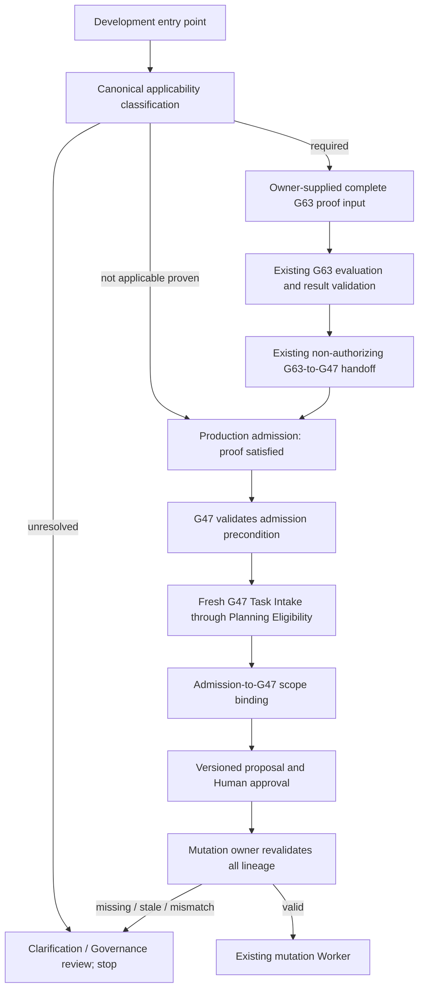

# 1. Implementation Summary

Generation: G64-03

Report identity:
G64_03_CONSTITUTIONAL_REUSE_PROOF_PRODUCTION_INTEGRATION_DESIGN_REPORT_V1

Reporting date: 2026-08-02

Constitutional baseline:
CONSTITUTIONAL_GOVERNANCE_REPAIR_SEQUENCE_CERTIFIED

Authenticated repository anchor:

- Commit: `2f1be169ae88edaaa6b1552f56baa793ed3e66a2`
- Direct parent: `0a47998cd3c4a3b536aeec86235b91940c469aa7`
- Tree: `f3fdb01bdd896de3951b52dee86e7e49c151a639`
- Subject: `G64-02: certify constitutional governance repair sequence`
- G64-01 report SHA-256:
  `f24cc3bf5bd88357789d1471be6facee39ce8029cf33f76f216873dccd85ea68`
- G64-02 report SHA-256:
  `5fdd00d56651defd1389ee3aa4ac3d4316df118063c74b0fcc1329cedc31e46d`
- Design-start worktree state: clean

Implementation contracts:

- G48 Constitutional Evidence Reporting Standard V1
- G64-01 Constitutional Governance Closure Audit Report V1
- G64-02 Constitutional Governance Closure Repair Sequencing Report V1
- G63-06 Constitutional Reuse Proof Pipeline Integration Audit Report V1
- G63-05 Constitutional Reuse Proof Runtime Implementation Report V1
- G63-02 Constitutional Reuse Proof Framework V1
- G63-01 Constitutional Evolution Governance Framework V1
- G47 Final Constitutional Closure Report V1
- G62-01 Complete Constitutional Architecture Reconstruction and Readiness
  Audit Report V1
- G61-01 Central LLM Services Discovery and Constitutional Integration Audit
- Governance Conformance System V1
- AGENTS.md SAPIANTA Codex Orchestration Guide

Objective:

Design the minimum production integration that makes the existing G63
Constitutional Reuse Proof Runtime a mandatory, fail-closed pre-G47 stage for
every architecture-affecting development workflow, without implementing the
integration or changing any existing constitutional owner.

Design scope:

- Treated the G64-01 bypass findings and the G64-02 repair order as normative;
  no repository discovery was repeated.
- Defined one thin Development-Governance-owned production gate that composes
  existing G63 evaluation, result validation, and G47 handoff APIs.
- Defined mandatory caller-side invocation plus independent enforcement at
  G47 and governed-mutation boundaries.
- Covered Platform Core Project Services, direct G47 callers, AiCLI governed
  development, direct governed-development APIs, direct governed-mutation
  APIs, resume/repair, onboarding, and external/manual development handoff.
- Defined fail-closed applicability, exemptions, evidence acquisition,
  freshness, migration, version compatibility, validation, risk, and exact
  implementation order.
- Preserved ordinary execution of unchanged certified capabilities outside
  Reuse Proof applicability.

Modified modules:

- `docs/governance/G64_03_CONSTITUTIONAL_REUSE_PROOF_PRODUCTION_INTEGRATION_DESIGN_REPORT_V1.md`:
  this governance-only G48 design report.

Intentionally unchanged modules:

- All runtime source and tests.
- Platform Core, Project Services, Conversation Layer, Development Governance,
  Reuse Proof, AiCLI, governed development, governed mutation, Replay,
  Authorization, Worker, provider infrastructure, and registries.
- Hooks, policies, manifests, PCBV31, prior governance artifacts, Git refs,
  and Git history.
- The separately versioned and outer-ignored `sapianta_system/` repository.

Architectural boundaries preserved:

- Development Governance owns applicability and production admission meaning.
- G63 remains the sole Reuse Proof evaluation owner and grants no authority.
- G47 remains the sole Development Governance assessment and Planning
  Eligibility owner; G63 never precomputes or overrides G47.
- Platform Core and AiCLI invoke and transport evidence but do not interpret
  Reuse Proof decisions or acquire Governance authority.
- Governed mutation enforces lineage but does not evaluate proof meaning.
- Replay records owner artifacts but does not admit, authorize, or repair.
- Authorization and Worker are neither invoked nor modified by the gate.
- Missing evidence never defaults to an exemption.

Design determination:

The minimum safe integration is a shared production-gate adapter, owned by
Development Governance, plus versioned consumer preconditions. The adapter
produces one applicability artifact and one admission artifact. Every
architecture-development entry point must obtain the admission before G47.
G47 must independently reject calls without a current admission, and mutation
must independently reject proposals without admission-to-G47-to-scope
lineage. Caller checks alone are insufficient because direct public API calls
would remain a bypass.

# 2. Code Evidence

## Normative findings

This design begins from, and does not rediscover, these authenticated facts:

1. `constitutional_reuse_proof_runtime.py` exists and is certified as a
   deterministic standalone runtime.
2. It exposes proof input/result validators, evaluation, a non-authorizing
   projection toward G47, and a handoff validator.
3. G64-01 found no mandatory production caller.
4. Project Services currently calls G47 directly after Project Objective
   sufficiency.
5. AiCLI governed development and governed repository mutation can proceed
   without G63 or G47 lineage.
6. G64-02 requires a versioned lineage contract before production integration
   and requires caller checks plus mutation enforcement.

## Existing APIs reused unchanged

| Existing API | Owner | Integration use |
|---|---|---|
| `create_constitutional_reuse_proof_input(...)` | G63 Reuse Proof | Canonicalize owner-supplied evidence; the production gate does not fabricate repository evidence |
| `validate_constitutional_reuse_proof_input(...)` | G63 Reuse Proof | Reject malformed, dirty-baseline, non-canonical, or tampered proof input |
| `evaluate_constitutional_reuse_proof(...)` | G63 Reuse Proof | Return exactly `REUSE`, `EXTEND`, `CONSOLIDATE`, or `CREATE_NEW` |
| `validate_constitutional_reuse_proof_result(...)` | G63 Reuse Proof | Revalidate proof identity, baseline, decision, evidence, and boundary flags |
| `project_reuse_proof_to_development_governance(...)` | G63 Reuse Proof | Produce a non-authorizing instruction to run every G47 stage fresh |
| `validate_reuse_proof_g47_handoff(...)` | G63 Reuse Proof | Reject incomplete handoff or any authority-bearing substitution |
| `integrate_constitutional_development_governance(...)` | G47 Development Governance | Run fresh Task Intake through Planning Eligibility after gate admission |
| `validate_constitutional_development_governance_operational_record(...)` | G47 Development Governance | Validate G47 outcome independently of G63 |
| `create_governed_development_proposal(...)` | Governed-development owner | Consume admission and G47 lineage in a versioned proposal |
| `create_governed_repository_mutation_proposal(...)` | Governed-mutation owner | Bind admission/G47 evidence to exact target and content hashes |
| `create_patch_proposal_artifact(...)` and `apply_repository_mutation(...)` | Mutation Worker owner | Remain unchanged and unreachable until upstream checks pass |

No existing G63 validator is copied into Platform Core, AiCLI, G47, or
mutation code.

## Production integration architecture

### New integration surface

The only new production surface is a thin adapter/orchestrator provisionally
identified as:

```text
aigol/runtime/constitutional_reuse_proof_production_gate.py
```

This identifier is an implementation target, not a file created by this
generation. The surface has no independent constitutional authority. Its
owner is Development Governance and its responsibility is limited to:

1. canonical applicability classification;
2. calling existing G63 APIs when proof is required;
3. validating the G63 result and handoff;
4. binding request, Project Objective, proposed scope, authenticated baseline,
   proof, and handoff into one production admission;
5. validating admission freshness for consumers; and
6. returning fail-closed status without planning, approval, mutation,
   Authorization, Worker, provider, or execution action.

It must not perform repository reconstruction. Complete proof input remains
owner-supplied evidence as required by G63-05.

### Required public integration APIs

The future adapter requires only these bounded APIs:

```text
classify_reuse_proof_applicability(...)
prepare_reuse_proof_production_admission(...)
validate_reuse_proof_production_admission(...)
bind_reuse_proof_admission_to_g47(...)
validate_reuse_proof_g47_scope_binding(...)
```

Their behavior is specified below. Names are stable design identifiers, not
implemented interfaces.

### Defense-in-depth topology



The three enforcement layers are mandatory:

- entry-point invocation prevents invalid work from becoming proposal-ready;
- the G47 precondition prevents direct G47 callers from bypassing the gate;
- mutation revalidation prevents direct governed-development or mutation
  callers from bypassing both orchestration layers.

## Canonical integration artifacts

### Applicability artifact

`REUSE_PROOF_APPLICABILITY_ARTIFACT_V1` is owned by Development Governance and
contains:

| Field | Requirement |
|---|---|
| `applicability_id` | Deterministic identity from request, objective, baseline, scope, and classifier version |
| `request_reference` / `request_hash` | Exact development request identity |
| `project_objective_reference` / `project_objective_hash` | Exact bounded objective, when the entry point has one |
| `authenticated_baseline` | Commit, parent, tree, clean-state claim, governing sources, and known limitations |
| `proposed_scope` / `scope_digest` | Canonical responsibilities, target layers, owners, APIs, registries, routes, defaults, paths, and content hashes known before mutation |
| `change_characteristics` | Canonical booleans for create, extend, consolidate, replace, register, deprecate, rebind, route/default change, authority change, and exact repair |
| `applicability_disposition` | Exactly `REQUIRED`, `NOT_APPLICABLE`, or `UNRESOLVED` |
| `exemption_code` | Required only for `NOT_APPLICABLE`; one canonical exemption listed below |
| `classification_reason` | Deterministic reason; prose alone cannot establish exemption |
| boundary flags | No planning, implementation, mutation, authorization, Worker, provider, execution, or certification authority |
| `artifact_hash` | Canonical digest of all preceding fields |

`UNRESOLVED` is a stop state. There is no default disposition and no caller
may rewrite it as `NOT_APPLICABLE`.

### Production admission artifact

`REUSE_PROOF_PRODUCTION_ADMISSION_V1` contains:

| Field | Proof-required work | Proven exemption |
|---|---|---|
| Applicability ID/hash | Required | Required |
| Request/objective/scope/baseline identity | Required | Required |
| `proof_requirement` | `REQUIRED_SATISFIED` | `NOT_APPLICABLE_PROVEN` |
| G63 proof ID/evidence identity/decision | Required | Explicitly absent |
| Selected target and evolution class | Required | Explicitly absent |
| G63-to-G47 handoff and hash | Required | Explicitly absent |
| Exemption code/evidence hash | Explicitly absent | Required |
| `admission_status` | `READY_FOR_FRESH_G47` | `READY_FOR_FRESH_G47` when G47 otherwise applies |
| Freshness | Baseline and scope current | Baseline and scope current |
| Authority flags | All false | All false |
| Admission hash | Required | Required |

An exemption from Reuse Proof is not an exemption from G47. G47 applicability
and disposition remain owned by Development Governance.

### Admission-to-G47 scope binding

After G47 completes, `REUSE_PROOF_G47_SCOPE_BINDING_V1` binds:

- admission ID/hash;
- request, objective, baseline, and scope digest;
- G47 operational record hash and governance-bundle hash;
- Planning Eligibility ID and eligible state;
- G47 canonical owners, prohibitions, and residual gaps;
- whether the G63 outcome constrains the plan to `REUSE`, `EXTEND`,
  `CONSOLIDATE`, or justified `CREATE_NEW`;
- material-drift status; and
- all authority flags false.

This artifact does not merge G63 and G47 conclusions. It proves that both
owners evaluated the same request, baseline, and scope in the required order.

## Public development entry-point coverage

The entry-point set is inherited from G63-06 and G64-01/G64-02; it is not a
new discovery inventory.

| Entry ID | Public development entry point | Architecture-affecting condition | Mandatory invocation point | Independent enforcement |
|---|---|---|---|---|
| PDE-01 | Platform Core Project Services implementation branch | Project Objective proposes any architectural evolution trigger | After `project_objective_ready_for_governance`, before the existing G47 call | Versioned G47 API validates admission |
| PDE-02 | Direct callers of `integrate_constitutional_development_governance(...)` | Any architecture-affecting request, including callers outside Project Services | Mandatory versioned `reuse_proof_admission` parameter at API entry | G47 rejects missing, unresolved, stale, or scope-mismatched admission |
| PDE-03 | AiCLI `propose_acli_governed_development_execution(...)` | Generated governance artifact or repository mutation changes architecture | Before proposal preview can report `APPROVAL_REQUIRED` | Execution bridge and mutation owner revalidate |
| PDE-04 | AiCLI `approve_and_execute_acli_governed_development(...)` | Pending architecture-affecting proposal | Immediately before Human approval is converted into workflow execution | Governed-development and mutation validators revalidate |
| PDE-05 | Direct `create/execute_governed_development_*` APIs | Any architectural governance artifact or source mutation | Proposal creation requires admission and G47 binding; execution revalidates | Mutation owner remains final barrier |
| PDE-06 | Direct `create/execute_governed_repository_mutation_*` APIs | Target/content can change a runtime, API, registry, route, owner, default, schema, lifecycle, or authority | Before proposal becomes approval-ready and immediately before Worker proposal creation | Missing V2 lineage blocks Worker invocation |
| PDE-07 | G43/G44 repair, retry, resume, or restored pending workflow | Repair changes responsibility, contract, owner, route, default, scope, or baseline; or prior proof is stale | On resume before reuse of prior Planning Eligibility or approval | Mutation owner rejects stale prior lineage |
| PDE-08 | Capability, provider, registry, adapter, and subsystem onboarding | Registration or attachment changes architecture by definition | Before first interface/registry proposal and before G47 | Proposal/mutation binding |
| PDE-09 | Human/Codex externally initiated governance or implementation | Work ultimately proposes or mutates architecture outside a live Project Services session | Gate invoked externally before proposal certification; its admission accompanies later runtime entry | Mutation, certification, and later hook repairs reject absent evidence |

PDE-09 cannot make raw filesystem or Git commands disappear. G64-02 CR-01
hook restoration and later certification/promotion enforcement close those
non-runtime surfaces. Within production runtimes, no architecture mutation may
proceed without the same admission.

## Invocation sequence

### Proof-required development

```text
1. Entry owner submits exact request, Project Objective if present,
   authenticated clean baseline, and proposed scope.
2. Production gate emits applicability = REQUIRED.
3. If complete owner-supplied proof input is absent:
   return WAITING_FOR_REUSE_PROOF_EVIDENCE; stop.
4. Gate calls existing validate/evaluate G63 APIs.
5. G63 returns exactly one decision and complete evidence identity.
6. Gate calls existing G63-to-G47 projection and handoff validator.
7. Gate emits READY_FOR_FRESH_G47 admission with all authority flags false.
8. Entry owner calls versioned G47 with the admission.
9. G47 revalidates admission, then runs all G47 stages fresh.
10. Gate binds G47 record and Planning Eligibility back to the admission and
    exact scope.
11. Proposal creation and Human approval hash-bind that scope binding.
12. Immediately before mutation, mutation owner revalidates admission,
    proof, handoff, G47, eligibility, approval, baseline, and scope.
13. Only then may the existing mutation Worker be invoked.
```

### Proven non-applicability

```text
1. Entry owner supplies request, baseline, scope, and change characteristics.
2. Production gate proves one canonical exemption and emits NOT_APPLICABLE.
3. Gate emits an admission with NOT_APPLICABLE_PROVEN and no fake G63 fields.
4. G47 still runs when the work is implementation subject to G47.
5. Proposal/mutation validators bind and revalidate the exemption evidence.
6. Any change to scope or characteristics invalidates the exemption.
```

### Resume and material drift

```text
resume request
-> validate prior admission and G47 scope binding
-> compare baseline, responsibility, owner, API, registry, route, default,
   target paths, content hashes, and proposed scope
-> exact match: continue from the next uncompleted governed stage
-> material change: PROOF_STALE_REEVALUATION_REQUIRED; stop and rerun G63/G47
-> ambiguous change: APPLICABILITY_UNRESOLVED; stop for Governance review
```

The existing governed-development component order may create its governance
artifact before repository mutation. That expected intermediate delta must be
included in the approved scope binding. Mutation freshness accepts only that
exact in-workflow artifact/hash; any other worktree drift invalidates the
admission.

## Runtime ownership

| Responsibility | Constitutional owner | Runtime implementer | Explicit non-owner |
|---|---|---|---|
| Applicability classification | Development Governance | New thin production-gate adapter | Platform Core, AiCLI, provider, Worker |
| Proof input evidence | Existing evidence/registry/repository owners coordinated by the governed development process | Supplied to G63; not reconstructed by gate | Gate, AiCLI |
| Proof evaluation and four-way decision | G63 Reuse Proof Runtime | Existing G63 module unchanged | Production gate, G47 |
| Non-authorizing G47 handoff | G63 Reuse Proof Runtime | Existing G63 module unchanged | Project Services, AiCLI |
| Fresh Development Governance assessment | G47 | Existing G47 integration, versioned only to require admission | G63, gate, mutation owner |
| Entry invocation | Entry orchestration owner | Project Services, AiCLI bridge, onboarding/resume orchestrator | G63 itself |
| Proposal and Human approval binding | Governed-development owner and Human Authority | Versioned proposal/approval contract | G63, Worker |
| Final pre-mutation enforcement | Governed-mutation owner | Versioned mutation validator | Worker, Replay |
| Mutation | Existing mutation Worker | Existing Worker unchanged | Gate, G47, AiCLI |
| Evidence recording/reconstruction | Existing Replay owners | Versioned records/reconstructors | Replay does not decide applicability or eligibility |

## Interaction boundaries

### G47 Development Governance

- G63 runs before G47 and emits only a non-authorizing handoff.
- The G47 public integration becomes versioned and requires one validated
  production admission.
- G47 runs every canonical stage fresh and may still terminate the work.
- A G63 `CREATE_NEW` decision proves only that reuse alternatives were
  rejected; it does not make G47 Planning Eligibility true.
- A G63 `REUSE` decision constrains later planning to the selected owner/API;
  G47 cannot silently plan a new duplicate component.

### Platform Core Project Services

- Project Services gathers the already available request, Project Objective,
  knowledge-reuse context, workspace state, and repository context.
- It invokes the shared gate after objective sufficiency and before G47.
- It surfaces missing evidence or clarification but does not synthesize proof.
- It stores admission and G47 binding identities in its versioned development
  intent/capture.
- Read-only services and ordinary certified capability execution remain
  unchanged.

### AiCLI

- AiCLI renders proof requirements, selected G63 outcome, G47 status, and
  scope-bound approval evidence.
- It cannot override `UNRESOLVED`, `WAITING`, `STALE`, or `FAILED_CLOSED`.
- Human approval covers the exact admission-to-G47 scope binding.
- Restored pending proposals are re-presented and revalidated before approval.
- AiCLI neither evaluates proof meaning nor owns Governance evidence.

### Governed repository mutation

- The mutation proposal carries the versioned scope binding.
- Proposal, approval, and Worker patch proposal hashes cover the same paths
  and content.
- Immediately before Worker creation, the mutation runtime revalidates every
  upstream artifact and current baseline/allowed intermediate delta.
- A direct mutation caller must supply the same evidence or a proven bounded
  non-applicability artifact.
- The Worker sees immutable references only; it does not interpret G63/G47.

## Failure semantics

| Condition | Canonical result | Required behavior |
|---|---|---|
| Applicability data missing or contradictory | `APPLICABILITY_UNRESOLVED` | Stop before proof, G47, proposal, approval, mutation, or Worker; request Governance clarification |
| Required proof input absent | `WAITING_FOR_REUSE_PROOF_EVIDENCE` | Return exact missing evidence classes; do not fabricate or downgrade |
| Proof input/result/hash invalid | `FAILED_CLOSED_INVALID_REUSE_PROOF` | Stop and record failure evidence |
| G63 critical conformance violation | Existing G63 failure | Propagate unchanged; no admission |
| Authenticated baseline dirty or mismatched | `FAILED_CLOSED_BASELINE_MISMATCH` | Stop; require clean authenticated baseline and new proof |
| Proof result stale after material drift | `PROOF_STALE_REEVALUATION_REQUIRED` | Invalidate handoff, G47 binding, proposal eligibility, and approval |
| Plan contradicts G63 decision/selected target | `FAILED_CLOSED_REUSE_DECISION_SCOPE_CONFLICT` | Stop before approval or mutation |
| G47 admission missing or invalid | `FAILED_CLOSED_REUSE_ADMISSION_REQUIRED` | G47 performs no Task Intake or downstream stage |
| G47 terminates or Planning Eligibility is false | Existing G47 terminated result | No proposal approval or mutation; G63 cannot override |
| Approval does not bind admission/G47/scope hashes | `FAIL_CLOSED_APPROVAL_SCOPE_MISMATCH` | No Worker proposal |
| Unexpected worktree drift | `FAILED_CLOSED_UNAUTHENTICATED_DRIFT` | Stop and rerun proof/G47 as applicable |
| Exemption absent, unknown, or stale | `APPLICABILITY_UNRESOLVED` | Never infer `NOT_APPLICABLE` |

All failure and waiting artifacts state:

```text
planning_authorized = false
implementation_authorized = false
mutation_performed = false
authorization_created = false
worker_invoked = false
provider_invoked = false
execution_started = false
```

## Exemption model

Exactly four Reuse Proof exemptions are permitted:

| Code | Permitted work | Required evidence | Invalidating condition |
|---|---|---|---|
| `UNCHANGED_CERTIFIED_CAPABILITY_EXECUTION` | Execute an existing certified capability without contract, owner, registry, route, or default change | Exact capability certification and unchanged invocation contract | Any implementation, registration, route, default, or authority change |
| `READ_ONLY_NON_PROPOSING_WORK` | Inventory, explain, validate, or audit without proposing a component or material contract change | Read-only scope and no mutation/design output | Output proposes architecture, owner, API, registry, route, or implementation |
| `NON_SEMANTIC_CONTENT_CORRECTION` | Byte/content-only correction with no constitutional or architectural meaning change | Before/after semantic-equivalence evidence and bounded paths | Governance meaning, owner, baseline, registry, route, authority, or default changes |
| `EXACT_CERTIFIED_BEHAVIOR_REPAIR` | Restore exact previously certified behavior with no new responsibility, interface, owner, or route | Prior certificate, diagnosed divergence, exact repair scope, and no delta evidence | Repair changes contract, implementation family, owner, route, default, scope, or authority |

Rules:

1. Exemption is determined from evidence, not caller name or filename.
2. Architecture governance reports that design new components are not exempt
   merely because they are Markdown; read-only audits that propose no new
   architecture may be exempt.
3. Registration, onboarding, deprecation, consolidation, provider attachment,
   and default changes always require proof.
4. An exact repair may reuse a current prior proof; material drift requires a
   new proof.
5. Unknown classification is never an exemption.
6. Exemption removes only G63 evaluation. It grants no G47, approval,
   certification, promotion, Authorization, or mutation exemption.

## Migration strategy

### Artifact and API versioning

- Add the applicability, production admission, and G47 scope-binding artifacts
  as new V1 integration artifacts.
- Version G47 operational integration to require an admission parameter. Do
  not add an optional `None` default.
- Version Project Services development captures, AiCLI governed-development
  proposal/execution captures, governed-development proposal/approval/outcome,
  and governed-mutation proposal/approval/outcome.
- Retain existing G63 artifact versions and evaluation semantics unchanged.
- Retain V1 historical Replay readers for pre-integration artifacts.

### Pending work migration

| Existing state | Migration disposition |
|---|---|
| Historical completed V1 Replay | Read-only reconstructable; never rewritten |
| Unexecuted architecture-affecting V1 proposal | Cannot be approved/executed; recreate under new gate and obtain new Human approval |
| Previously approved but unexecuted V1 proposal | Approval is insufficient; mark migration-required, rerun G63/G47, and reapprove exact V2 scope |
| Suspended/resumable workflow with current proof | Validate baseline and scope; migrate only if exact, otherwise stale and rerun |
| Non-architectural pending work | Obtain explicit exemption admission; no silent grandfathering |
| Ordinary certified operational execution | No migration; route remains unchanged |

### Rollout rule

The integration is activated entry point by entry point only while the final
mutation barrier already rejects unintegrated architecture changes. If that
barrier is not yet available, the affected entry point remains disabled for
architecture mutation during migration.

## Backward compatibility assessment

| Surface | Compatibility | Assessment |
|---|---|---|
| G63 proof input/result/handoff | Unchanged | Full compatibility; existing validators and tests remain authoritative |
| G47 public Python API | Intentionally versioned | Mandatory admission is source-incompatible for direct callers; this is required to eliminate bypass |
| Project Services output artifacts | Versioned | New admission and binding hashes alter deterministic output; old Replay remains readable |
| AiCLI pending proposal format | Versioned | Old architecture proposals cannot execute; Human reapproval is required |
| Governed-development and mutation artifacts | Versioned | V1 reconstructs historically but cannot authorize new architecture mutation |
| Mutation Worker API | Unchanged | Upstream owner validates lineage; Worker behavior and authority remain stable |
| Replay ownership | Unchanged | New artifacts are recorded by existing stage owners; Replay does not decide |
| Conversation-to-execution operational route | Unchanged | Reuse Proof is not inserted into unchanged certified capability execution |
| Registries and providers | Unchanged | Production gate reads existing evidence only; no registry or provider modification |

An optional compatibility parameter is forbidden because omission would
recreate the direct G47 bypass. Compatibility is provided by versioned readers
and explicit migration, not permissive execution.

## Validation strategy

### Unit validation

- Exhaustive applicability table for every required trigger and four
  exemptions.
- Deterministic repeated classification and canonical serialization.
- Missing/unknown fields, conflicting characteristics, and caller-supplied
  exemption claims fail closed.
- Admission creation for all four G63 decisions and proven exemptions.
- Tampered proof, handoff, baseline, scope, and authority flags are rejected.

### Owner integration validation

- Project Services proof-required, exemption, unresolved, waiting, stale, and
  G47-terminated paths.
- Direct G47 invocation without admission, with invalid admission, and with a
  valid admission.
- AiCLI proposal cannot become approval-ready before valid admission and G47
  binding.
- AiCLI execution revalidates restored and current proposals.
- Direct governed-development and mutation APIs reject V1/missing lineage.
- Resume, repair, onboarding, provider, registry, and capability paths obey
  the same gate.

### Negative closure validation

For every public entry point, remove or alter each of:

- applicability artifact;
- proof result when required;
- authenticated baseline;
- scope digest;
- G63-to-G47 handoff;
- G47 record;
- Planning Eligibility;
- Human approval binding; and
- current repository state.

Each case must prove no proposal eligibility, mutation, Worker invocation,
Authorization, provider invocation, or execution.

### Compatibility and non-regression validation

- Reconstruct historical G63, G47, Project Services, AiCLI, governed
  development, and mutation Replay fixtures.
- Demonstrate V1 architecture proposals cannot execute after activation.
- Re-run G63, G47, Project Services, AiCLI bridge, governed mutation,
  Conversation Layer, G60 operational execution, governance conformance,
  Python compilation, and `git diff --check`.
- Verify no new dependency from G63/G47 into Authorization, Worker, provider,
  or Conversation runtime.

### Acceptance conditions

The implementation may certify only if:

1. a repository-wide production call search finds the shared gate at every
   listed entry point;
2. direct G47 and mutation calls without admission fail closed;
3. all architecture-affecting paths produce identical owner-order lineage;
4. every exemption is explicit and tamper-resistant;
5. no failure path mutates or invokes a Worker;
6. historical Replay remains readable; and
7. ordinary certified operational execution remains unchanged and passing.

## Constitutional risk assessment

| Risk | Impact | Mitigation | Residual disposition |
|---|---|---|---|
| False non-applicability permits bypass | Critical | Exhaustive trigger flags, only four exemptions, unknown stops, mutation revalidation | Must be zero in negative suite |
| Gate duplicates G63 decision logic | High | Gate calls public G63 APIs and stores outputs; no local four-way reduction | Acceptable only with static dependency proof |
| Gate becomes a new Governance owner | Critical | Development Governance owns semantics; adapter only composes/validates | Authority flags and dependency tests required |
| G63 precomputes or overrides G47 | Critical | Existing handoff explicitly requires all G47 stages fresh and grants no eligibility | G47 termination tests required |
| Direct G47 caller bypasses entry check | Critical | Mandatory versioned admission parameter with no default | Must fail in public API test |
| Direct mutation caller bypasses both gates | Critical | Final mutation lineage validation before Worker proposal creation | Must prove Worker not called |
| Evidence acquisition deadlocks development | Medium | Return exact missing evidence list and wait; never fabricate proof | Safe fail-closed limitation |
| Proof becomes stale during proposal/approval | High | Bind baseline/scope; revalidate at approval and mutation; material drift reruns | Expected intermediate artifact must be pre-bound |
| Exemption is confused with G47 exemption | Critical | Admission always routes implementation to fresh G47; explicit separate semantics | Static and dynamic tests |
| Version migration silently executes V1 | Critical | V1 read-only; pending architecture work recreated and reapproved | No permissive compatibility default |
| Reuse Proof incorrectly gates ordinary execution | High | Applicability restricted to architecture evolution; G60 route non-regression | Required acceptance condition |
| External/manual Git path remains | High | Mutation barrier covers runtime; CR-01 hooks and later certification/promotion close external path | Not resolved by G64-03 design alone |

## Exact implementation sequence

This sequence is subordinate to G64-02: hook conformance restoration and the
versioned lineage contract must certify before production activation.

| Step | Implementation action | Dependency | Exit evidence |
|---|---|---|---|
| 1 | Freeze existing G63/G47 APIs and V1 Replay fixtures as compatibility evidence | G64-02 CR-01 and CR-02 prerequisites | Exact hashes and passing focused tests |
| 2 | Implement applicability and admission artifacts plus the thin production-gate adapter | Step 1 | Unit tests for triggers, exemptions, four G63 outcomes, tampering, and no-authority flags |
| 3 | Version G47 public integration to require and validate production admission with no optional default | Step 2 | Direct missing/invalid admission tests fail before Task Intake |
| 4 | Integrate Project Services at the post-objective/pre-G47 seam and version its capture | Step 3 | Required/exempt/unresolved/waiting/stale integration tests |
| 5 | Integrate AiCLI proposal and execution bridges; bind Human approval to admission/G47/scope | Steps 3 and 4 semantics | Proposal never becomes approval-ready early; resume/reapproval tests pass |
| 6 | Version direct governed-development proposal/execution APIs to require scope binding | Step 5 | Direct API bypass tests fail closed |
| 7 | Version governed-mutation proposal/approval/execution as the final mandatory barrier before Worker creation | Steps 3 through 6 | Every missing/stale/mismatched lineage case proves zero Worker calls |
| 8 | Integrate resume/repair and onboarding entry points; migrate or invalidate pending V1 work | Step 7 | Entry manifest has no unintegrated architecture path |
| 9 | Activate V2-only authority for new architecture work while retaining V1 read-only Replay | Step 8 | Historical reconstruction and V1 execution-refusal tests |
| 10 | Run repository-wide negative closure, adjacent regressions, conformance, compilation, and diff validation | Steps 1 through 9 | G48 implementation report with immutable test evidence |
| 11 | Re-run the applicable G64 closure checkpoint | Step 10 certification | Mandatory production caller and no-bypass finding independently closed |

Rollback during implementation always disables the affected architecture
entry point or leaves work waiting. It must never restore direct G47, V1
proposal execution, or mutation without current admission.

## Design validation evidence

The documentation-only validation completed with:

```text
python -m pytest tests/test_governance_conformance.py -q
5 passed in 0.03s

python -m runtime.governance.governance_conformance_engine
18 passed, 2 failed, 0 critical violations, PARTIALLY_CONFORMANT

git diff --check
PASS
```

The two unchanged hook findings are normative G64-01 inputs sequenced for
separate repair by G64-02 CR-01. This design neither hides nor repairs them.

# 3. Constitutional Self-Assessment

## Verified

- G64-01 and G64-02 are authenticated by exact committed identities and report
  hashes and are treated as normative rather than rediscovered.
- The design assigns one shared production adapter to Development Governance
  and introduces no new constitutional owner.
- Every public development entry point inherited from G63-06/G64 is mapped to
  a mandatory invocation and an independent enforcement boundary.
- The integration reuses all existing G63 evaluation and handoff APIs and runs
  G47 fresh afterward.
- The applicability model has exactly three dispositions and four explicit
  exemptions; unknown or missing evidence fails closed.
- Proof-required and exempt admissions both preserve G47 ownership and grant
  no planning, implementation, mutation, Authorization, Worker, provider, or
  execution authority.
- Migration preserves historical V1 Replay while refusing V1 authority for new
  architecture-affecting work.
- Validation includes caller, direct API, mutation, resume, onboarding,
  compatibility, operational non-regression, and negative bypass coverage.
- Governance conformance tests pass, and the read-only engine reproduces the
  known 18-pass/2-failure hook state without a critical violation.
- No runtime, test, registry, hook, policy, prior report, or Git history was
  modified by this design generation.

## Not Verified

- The production gate, applicability artifacts, admission artifacts, G47 scope
  binding, and versioned consumer contracts are not implemented.
- No production caller is mandatory yet; the G64-01 bypass remains until the
  ordered implementation certifies.
- G47 and mutation do not yet enforce admission.
- Pending V1 proposal migration and V2 Replay compatibility are design claims
  awaiting implementation validation.
- External/manual Git enforcement remains dependent on G64-02 hook and later
  certification/promotion repairs.
- Human identity authentication and universal rollback remain separately
  declared residual limitations and are not changed by this design.

# 4. Validation Matrix

| Requirement | Evidence | Validation | Result |
|---|---|---|---|
| Authenticate G64-01/G64-02 inputs | Commit `2f1be169...`; report hashes `f24cc3bf...` and `5fdd00d5...` | Git and SHA-256 inspection | `PASS` |
| Avoid rediscovery of authenticated finding | Normative-findings subsection | Compared directly to G64-01/G64-02 contracts | `PASS` |
| Define production integration architecture | Shared gate and defense-in-depth topology | Ownership and dependency review | `PASS` |
| Define every public entry point | PDE-01 through PDE-09 matrix | Coverage comparison with normative G63-06/G64 inventories | `PASS` |
| Define exact insertion points | Entry matrix and interaction boundaries | Current API seam review from normative evidence | `PASS` |
| Preserve G63 and G47 ownership | Existing API reuse and runtime-ownership matrices | Authority review | `PASS` |
| Define fail-closed behavior | Failure-semantics matrix | State and side-effect review | `PASS` |
| Define exemptions | Four-code exemption model | Trigger/exemption completeness review | `PASS` |
| Define Platform Core, AiCLI, G47, and mutation interactions | Interaction-boundary subsections | Dependency-direction review | `PASS` |
| Define migration and backward compatibility | Migration and compatibility matrices | V1/V2 Replay and API review | `PASS` |
| Define validation strategy | Unit, integration, negative, compatibility, and acceptance plans | G64-01 bypass coverage review | `PASS` |
| Define constitutional risks | Risk matrix | Severity and mitigation review | `PASS` |
| Define exact implementation sequence | Eleven ordered steps | Topological dependency review | `PASS` |
| Preserve known conformance input | Governance conformance engine | 18 passed, 2 failed, 0 critical, deterministic `PARTIALLY_CONFORMANT` | `PASS` |
| Governance conformance regression | `tests/test_governance_conformance.py` | 5 passed | `PASS` |
| Implement or exercise production integration | Explicitly forbidden in G64-03 | Design-only generation | `NOT_APPLICABLE` |
| No runtime mutation | Git status and mutation inventory | Documentation-only review | `PASS` |
| Documentation diff integrity | New G64-03 report | `git diff --check` | `PASS` |

# 5. Repository Mutation Summary

Modified files:

- `docs/governance/G64_03_CONSTITUTIONAL_REUSE_PROOF_PRODUCTION_INTEGRATION_DESIGN_REPORT_V1.md`:
  added this documentation-only production integration design.

Unchanged subsystems:

- All runtime source and tests.
- Platform Core, Project Services, Conversation Layer, Development Governance,
  Reuse Proof, AiCLI, governed development, governed mutation, Replay,
  Authorization, Worker, providers, and registries.
- Hooks, policies, manifests, PCBV31, prior governance artifacts, Git refs, and
  Git history.

API compatibility:

- No API, schema, state, route, registry, approval, Authorization, Worker,
  Replay, provider, or persistence behavior changed.
- Required future version changes and explicit incompatibilities are designed
  but not introduced.

Boundary preservation:

- This report does not authorize or implement the gate.
- It does not report the G64-01 bypass as repaired.
- It does not permit optional admission, silent exemption, V1 execution
  grandfathering, or rollback to a known bypass.

Unrelated pre-existing changes:

- None observed at design start.

# 6. Certification Verdict

CONSTITUTIONAL_REUSE_PROOF_PRODUCTION_INTEGRATION_DESIGN_CERTIFIED
