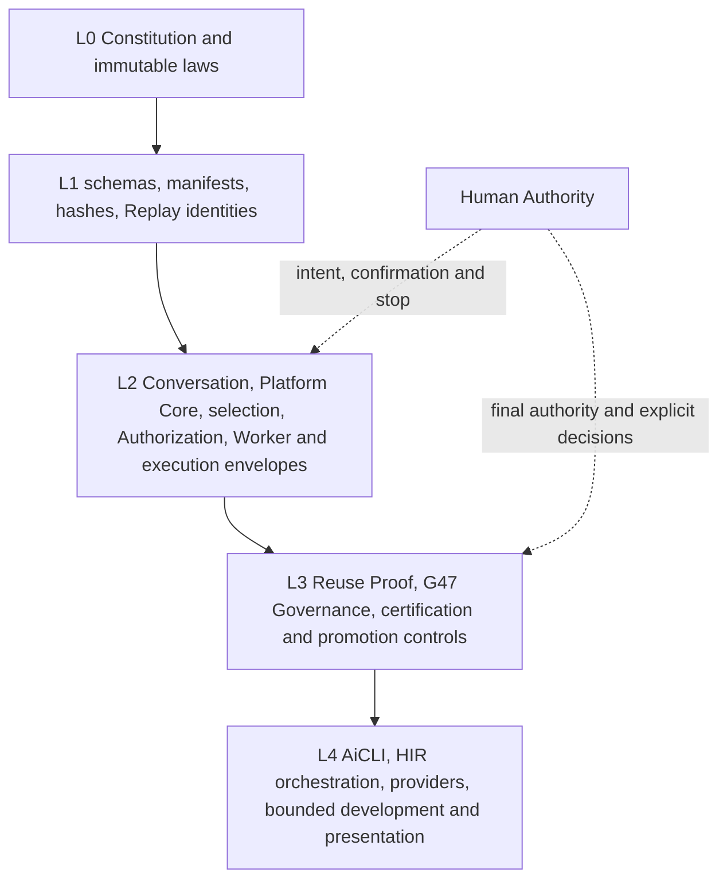
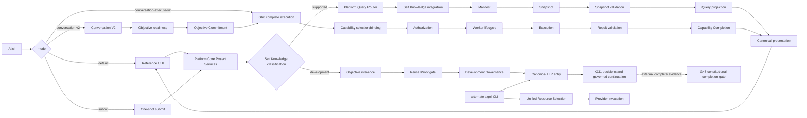
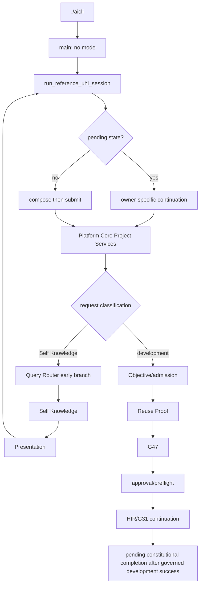
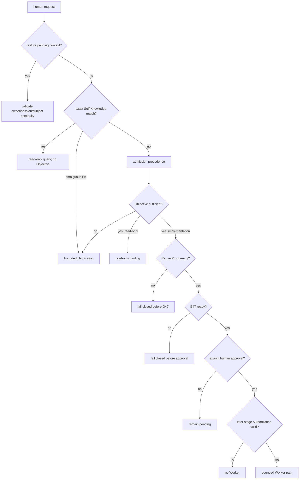
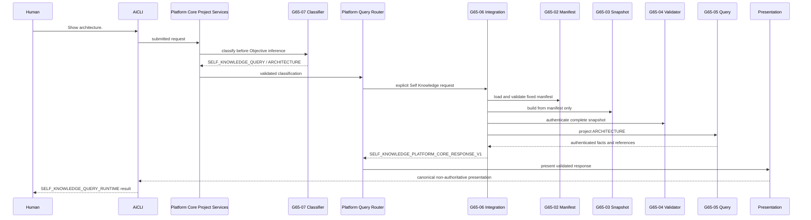
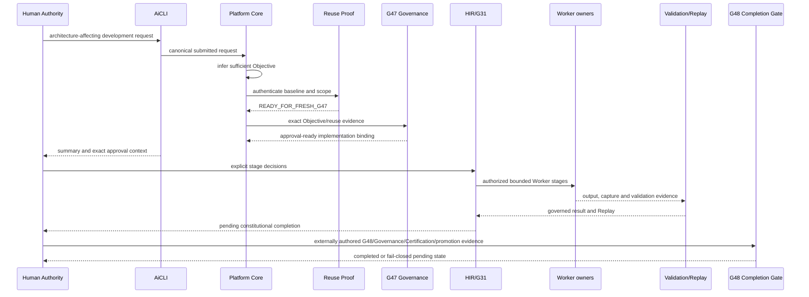
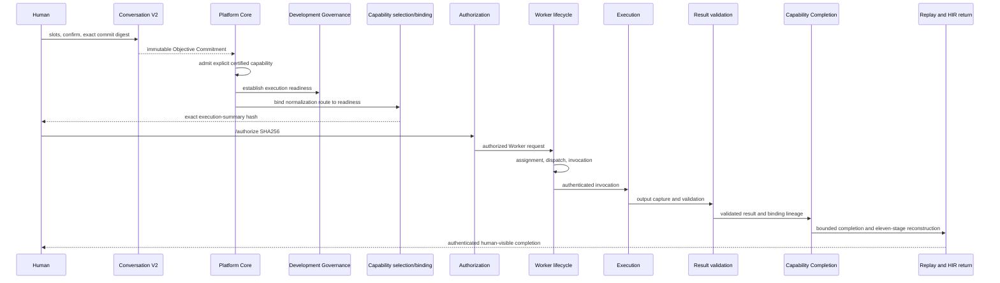
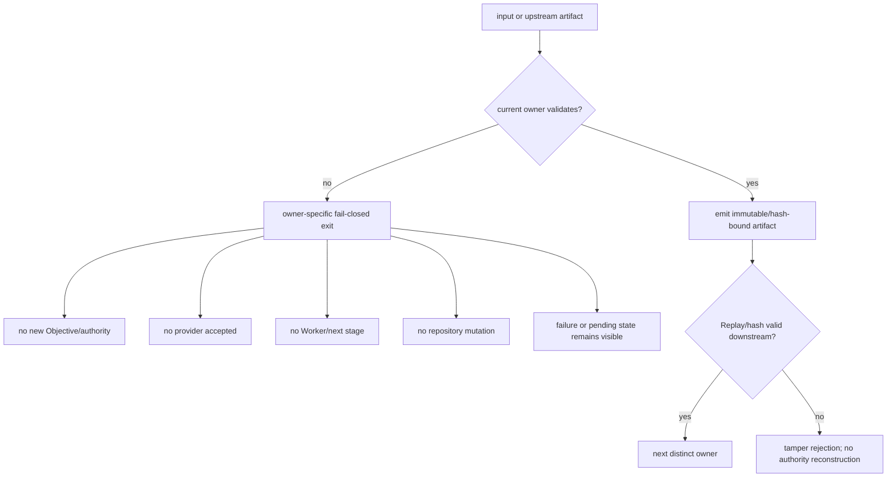
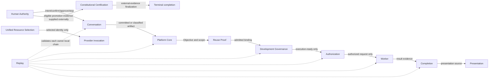

# 1. Implementation Summary

Generation: G65-10

Report identity:
G65_10_CONSTITUTIONAL_NERVOUS_SYSTEM_STATIC_RECONSTRUCTION_REPORT_V1

Constitutional baseline: `CONSTITUTIONAL_GOVERNANCE_CLOSED` and
`SELF_KNOWLEDGE_PRODUCTION_ROUTING_CHARACTERIZED`.

Authenticated repository identity:

- Commit: `1724a792cc77a26e89f4dc1e8ff0e54f9f44cb75`
- Tree: `4e6ccd313f7bccd616da1c5c823cbf6b0f30e045`
- Subject: `G65-09: characterize Self Knowledge production routing`

Implementation contracts: G48 Constitutional Evidence Reporting Standard V1;
the G0 through G65-09 certified lineage; Constitutional Architecture
Specification V1; Canonical Layer Model; Constitutional Invariants;
Governance Enforcement Hierarchy; Governance Lineage Model; G60-02/G60-03
complete Conversation execution evidence; G64-04 Reuse Proof production
admission; G64-07 Certification Completion Gate; G64-09 provider ownership;
and G65-01 through G65-09 Self Knowledge evidence.

Reporting date: 2026-08-02.

Objective:

Reconstruct the repository's constitutional nervous system as a static,
owner-level call and decision map beginning at `./aicli`, while preserving
the distinction between declared architecture, statically implemented calls,
default and alternate production routes, direct public APIs, test-only and
historical compatibility surfaces, unreachable branches, and externally
unresolved execution identities.

Implementation scope:

- Traced all four repository AiCLI modes and the alternate AiGOL CLI command
  families that can reach Conversation, Platform Core, Development
  Governance, providers, Authorization, Worker, Replay, presentation, or
  completion owners.
- Reconstructed the exact current `Show architecture.` Self Knowledge route,
  the default governed-development admission route, and the certified G60
  committed-Objective capability route through Authorization, Worker,
  Completion, and Replay.
- Recorded 45 owner-level nodes, 40 implemented transitions, 19 decision
  points, 17 entry surfaces, 84 artifact records, 22 owner records, 21
  authority classes, 17 fail-closed exits, all eight required reachability
  classes, and 57 source-line records in one closed JSON artifact.
- Defined a future dynamic trace event and comparison plan without adding
  runtime instrumentation or treating the static map as dynamic proof.

Modified modules:

- `docs/governance/G65_10_CONSTITUTIONAL_NERVOUS_SYSTEM_STATIC_RECONSTRUCTION_REPORT_V1.md`
  — this G48 static reconstruction report.
- `docs/governance/maps/AIGOL_CONSTITUTIONAL_NERVOUS_SYSTEM_MAP_V1.json`
  — descriptive, closed-record, machine-readable static map.

Intentionally unchanged modules:

- All AiCLI, AiGOL CLI, Conversation, Human Interface, Platform Core,
  Development Governance, Reuse Proof, capability, provider, Authorization,
  Worker, execution, result, Completion, Replay, presentation, Self Knowledge,
  constitutional completion, test, hook, and policy source.
- All runtime state, manifests, certification evidence, provider credentials,
  deployments, server processes, Git history, and external systems.

Architectural boundaries preserved:

- The map describes source wiring; it is not a runtime registry, authority
  source, admission record, execution plan, Authorization, Replay record,
  certification, or mutation instruction.
- Static reachability means a source-level call chain exists under the stated
  predicate. It does not prove that a production process exercised that path.
- Orchestration never inherits the authority of the owners it sequences.
  Human Authority, Conversation, Platform Core, Development Governance,
  provider selection, Authorization, Worker, Replay, Completion, and
  Certification remain separate.
- The G60 capability Completion and the G64 constitutional G48 Completion are
  separate owners and are not collapsed into one terminal state.

## Audit Method

The audit used five bounded methods:

1. Parsed the repository launchers and CLI argument grammar.
2. Followed imports and direct call sites from every relevant entry surface.
3. Compared public validators, status predicates, artifact names, Replay
   reconstructors, and fail-closed exits at each owner boundary.
4. Reused certified G60, G62, G64, and G65 reports only to identify the
   normative generation meaning, then verified current source wiring.
5. Exercised focused current regressions and governance conformance without
   invoking a live provider or authorizing an external Worker.

The reconstruction intentionally stops at owner-level public operations and
constitutionally significant private orchestration helpers. It does not list
every local formatting helper, field validator, or storage utility as a
separate nervous-system node.

## Authenticated Baseline

The audited tree contains the certified G65-07 intent classifier and the
G65-09 routing characterization. It also contains the complete G60-02/G60-03
reference execution pipeline, the G64-04 production Reuse Proof gate, the
G64-07 terminal constitutional completion owner, and the G64-09 unified
provider-selection binding.

The current governance engine reports `CONFORMANT`: 20 checks passed, 0
failed, 0 warnings, and 0 critical violations. This does not convert static
call evidence into a claim of deployment reachability.

## Entry-Point Inventory

| Entry surface | Syntax | Static disposition | Principal reachable owners |
|---|---|---|---|
| Default repository AiCLI | `./aicli` | `DEFAULT_PRODUCTION_PATH` | UHI, Platform Core, Self/Platform Knowledge, G47, G31 continuation |
| One-shot AiCLI | `./aicli submit` | `ALTERNATE_PRODUCTION_PATH` | UHI and Platform Core submission |
| Conversation V2 | `./aicli conversation-v2` | `ALTERNATE_PRODUCTION_PATH` | Semantic CWM, readiness, confirmation, Objective Commitment |
| Complete Conversation execution | `./aicli conversation-execute-v2` | `ALTERNATE_PRODUCTION_PATH` | G60 orchestration, Platform Core, G47, capability, Authorization, Worker, Completion, Replay |
| Alternate interactive CLI | `python -m aigol.cli.aigol_cli conversation` | `ALTERNATE_PRODUCTION_PATH` | legacy/alternate interactive lifecycle, provider and Worker continuations |
| Persistent alternate CLI | `... next [session|interactive|readonly-worker|execution-plan|dashboard]` | `ALTERNATE_PRODUCTION_PATH` | session, read-only Worker, planning, dashboard |
| Governed implementation families | `... run-governed` and `... implementation ...` | `ALTERNATE_PRODUCTION_PATH` | Development Governance and governed execution |
| Provider families | `... provider {invoke|governance|credential ...}` | `ALTERNATE_PRODUCTION_PATH` | Unified Resource Selection and invocation/credential owners |
| MOC family | `... moc ...` | `ALTERNATE_PRODUCTION_PATH` | approval, Authorization, Worker, provider gate, return, lineage |
| Inspection families | status, governance, approval, bridge, plan, dashboard, Replay, diagnostics, show and cognition commands | `ALTERNATE_PRODUCTION_PATH` | read-only inspection and presentation owners |
| Platform Core APIs | project services, router, governed read-only binding | `DIRECT_PUBLIC_API_PATH` | same validators without terminal transport |
| Self Knowledge APIs | integration and query APIs | `DIRECT_PUBLIC_API_PATH` | manifest, snapshot, validation, query |
| Conversation APIs | Conversation boundary and HIR terminal | `DIRECT_PUBLIC_API_PATH` | Conversation and Platform Core boundaries |
| G60 APIs | preparation and authorize/execute operations | `DIRECT_PUBLIC_API_PATH` | complete certified capability chain |
| G64 completion API | finalizer and reconstruction | `DIRECT_PUBLIC_API_PATH` | external constitutional completion owner |
| G60 robustness suite | focused pytest module | `TEST_ONLY_PATH` | fixed pipeline scenarios only |
| External installed/deployed AiCLI | not supplied | `UNRESOLVED_PATH` | no owner inferred |

The machine artifact records these as closed `entry_points` objects and keeps
the entire AiGOL CLI parser source as a line-bound reference instead of
promoting every diagnostic subcommand to a separate constitutional owner.

## Constitutional Layer Model

The map uses the canonical mutation layers, not the separate safety-authority
model:

- L0 constrains mutation and activation; it is not ordinary feature logic.
- L1 provides stable schemas, manifests, hashes, evidence and Replay identity.
- L2 contains deterministic classification, admission, selection,
  Authorization, Worker/execution envelopes, result and Completion flow.
- L3 contains governed Reuse Proof, G47 planning, approval/certification and
  constitutional completion controls.
- L4 contains interfaces, presentation, bounded orchestration, providers and
  research/development execution surfaces.

Diagram 1 — constitutional layer map:



# 2. Code Evidence

## Production Call Graph

### Public API

The complete repository AiCLI mode boundary is explicit and closed:

```python
def main(argv: list[str] | None = None) -> int:
    args = build_parser().parse_args(argv)
    if args.mode == "conversation-execute-v2":
        run_complete_conversation_execution_terminal_v2(
            session_id=args.session_id,
            created_at=args.created_at,
            runtime_root=args.runtime_root,
            workspace=args.workspace,
            human_identity=args.human_identity,
            ttl_seconds=args.ttl_seconds,
            explicit_canonical_artifacts=_conversation_execution_artifacts(args),
        )
        return 0
    if args.mode == "conversation-v2":
        run_hir_conversation_terminal_v2(
            session_identity=args.session_id,
            created_at=args.created_at,
            runtime_root=args.runtime_root,
            workspace_identity=args.workspace,
            human_identity=args.human_identity,
            ttl_seconds=args.ttl_seconds,
        )
        return 0
    if args.mode == "submit":
        run_reference_uhi_submit_session(
            session_id=args.session_id,
            created_at=args.created_at,
            runtime_root=args.runtime_root,
            workspace=args.workspace,
            input_reader=input,
            artifact_references=args.artifact_reference,
        )
        return 0
    run_reference_uhi_session(
        session_id=args.session_id,
        created_at=args.created_at,
        runtime_root=args.runtime_root,
        workspace=args.workspace,
        artifact_references=args.artifact_reference,
    )
    return 0
```

Source: `aigol/cli/aicli.py`, lines 1918-1958.

### Orchestration Entry Point

The current Platform Query Router performs G65-07 classification before the
generic Platform Knowledge probe:

```python
    if classification["request_classification"] != DEVELOPMENT_OBJECTIVE:
        return _route_preclassified_self_knowledge_request(
            query=raw_query,
            request_classification=classification,
            repository_root=repository_root,
            created_at=created_at,
        )
    descriptors = _descriptors(route_descriptors)
    knowledge_probe = query_platform_knowledge(
        query=raw_query,
        capability_identifier=capability_identifier,
        goal_target=goal_target,
        workspace_state=workspace_state,
    )
```

Source: `aigol/runtime/platform_query_router.py`, lines 494-511.

Diagram 2 — complete owner-level static graph:



### Semantic Reductions

The machine map applies one conservative rule:

```text
static node = one constitutional owner or constitutionally significant
orchestration boundary

static transition = an observed current source call plus its predicate,
input/output artifact class, fail-closed condition, side-effect flags,
authority prerequisites, generation, reachability and source reference
```

It does not infer a transition from similarly named artifacts or from a report
claim without a current call site. A public callable with no default caller is
`DIRECT_PUBLIC_API_PATH`, not default production.

### Public Validators

The Self Knowledge Platform integration demonstrates the owner sequence
without repository discovery or semantic synthesis:

```python
    manifest = _load_authenticated_manifest(root)
    snapshot = build_self_knowledge_snapshot(
        manifest=manifest,
        repository_root=root,
    )
    snapshot_validation = validate_authenticated_self_knowledge_snapshot(
        snapshot=snapshot,
        manifest=manifest,
        repository_root=root,
    )
    query_request = create_self_knowledge_query_request(
        query_subject=conversation_request["query_subject"],
        snapshot=snapshot,
        snapshot_validation=snapshot_validation,
    )
    query_response = execute_self_knowledge_query(
        request=query_request,
        snapshot=snapshot,
        snapshot_validation=snapshot_validation,
    )
```

Source:
`aigol/runtime/self_knowledge_platform_conversation_integration.py`, lines
157-177.

### Canonical Data Models

The JSON top-level record is closed by declared field contracts and contains:

```text
artifact_type, map_version, generation, repository_commit, repository_tree,
constitutional_baseline, map_semantics, record_field_contracts, nodes,
transitions, decisions, entry_points, artifact_types, owners,
authority_classes, fail_closed_exits, reachability, source_references
```

Every node and transition carries the requested module/function, caller or
callee, owner, artifact, predicate, failure, mutation, provider, Worker,
Replay, Authorization, Development Governance, Reuse Proof, G48 completion,
generation, reachability, and source-reference dimensions. The exact
reachability vocabulary is:

```text
DEFAULT_PRODUCTION_PATH
ALTERNATE_PRODUCTION_PATH
DIRECT_PUBLIC_API_PATH
TEST_ONLY_PATH
HISTORICAL_PATH
DEPRECATED_PATH
UNREACHABLE_PATH
UNRESOLVED_PATH
```

### Deterministic Algorithms

Machine validation checks JSON syntax, exact vocabulary, unique identities,
all node references in transitions, all source-reference identities, source
existence, and line bounds. Static AST validation confirms the four AiCLI
mode calls, the six Platform Core owner calls, the four Self Knowledge owner
calls, and the nine G60 execution-owner calls.

### Responsibility Boundaries

The G60 orchestrator's source makes the Authorization-to-Worker separation
explicit:

```python
    authorization = authorize_execution_ready(
        authorization_id=f"{chain}:AUTHORIZATION",
        execution_ready_replay_reference=ready_reference,
        authorizing_actor=actor,
        authorized_at=timestamp,
        replay_dir=root / "authorization",
        execution_summary_artifact=summary,
        human_confirmation_artifact=confirmation,
    )
    if authorization.get("authorization_status") != EXECUTION_AUTHORIZED:
        _fail("existing Authorization owner refused execution")
    request = create_worker_invocation_request(
        invocation_request_id=f"{chain}:WORKER-REQUEST",
        execution_authorization_replay_reference=authorization[
            "execution_authorization_replay_reference"
        ],
        requested_by=actor,
        requested_at=timestamp,
        replay_dir=root / "worker_request",
    )
```

Source:
`aigol/runtime/human_interface_conversation_execution_integration_v2.py`,
lines 379-399.

## Decision-Point Inventory

The machine map records 19 decisions. Their constitutional sequence is:

| Decision | Owner | Positive outcome | Fail-closed/non-positive outcome |
|---|---|---|---|
| mode selection | Interface | one of four AiCLI modes | argparse rejection |
| restore/new | Platform Core | owner-bound continuation or new classification | continuity mismatch |
| composition | Interface | one exact submitted request | remain composing/reject command |
| Self Knowledge/development | Conversation classifier | fixed read-only route or Objective path | bounded clarification for ambiguous Self Knowledge |
| Platform Knowledge/Project Services | Platform Core | informational service or governed work | owner mismatch rejection |
| read-only/development | Platform Core | read-only binding or implementation gate | clarification |
| Objective readiness | Platform Core or Conversation, depending entry | sufficient Objective/candidate | no commitment/governance |
| Objective Commitment | Conversation plus Human act | immutable commitment | no Platform execution |
| capability selection | Capability owner | eligible certified capability | clarification/not eligible |
| Reuse Proof | Reuse Proof owner | ready for fresh G47 | no G47 |
| G47 | Development Governance | approval-ready binding | no bounded planning |
| approval | Human Authority plus subject-specific owner | next stage | pending/rejected |
| Authorization | Authorization owner | Worker request allowed | no Worker |
| provider selection/invocation | separate selection and invocation owners | bound external response | no accepted provider response |
| Worker | Worker and execution owners | bounded execution | stop at failed stage |
| result Completion | Result and Completion owners | capability completion | no success return |
| G48 Completion | Certification owner over external evidence | constitutional terminal state | remains pending |
| Replay | Replay logical authority/owner-local reconstructors | validated projection | tamper failure |
| presentation | Presentation then Interface | human-readable response | no authoritative-looking rendering |

Diagram 3 — default AiCLI flow:



Diagram 4 — pre-execution decision tree:



## Artifact and State Flow

The central artifact chain is intentionally non-substitutable:

```text
Human request
-> request classification
-> Project Context / Self Knowledge request
-> Project Objective (development only)
-> Reuse Proof admission
-> G47 operational record and implementation-turn binding
-> stage-specific Human approval
-> execution-ready evidence and summary
-> Execution Authorization
-> Worker request -> assignment -> dispatch -> invocation
-> execution -> result capture -> result validation
-> bounded capability Completion
-> human presentation

governed-development success
-> pending constitutional completion
-> external G48 + Governance + Certification + promotion evidence
-> terminal constitutional completion
```

Replay is logically singular but physically owner-local. Each stage writes and
reconstructs its own immutable wrappers; later owners consume exact references
and hashes. A later artifact does not retroactively make an invalid earlier
stage authoritative.

## Authority Ownership Matrix

| Responsibility | Constitutional owner | Explicit non-owner |
|---|---|---|
| human intent/confirmation/approval/stop | Human Authority | AiCLI, model, Worker |
| terminal transport and mode selection | AiCLI/AiGOL CLI | Platform decision owners |
| semantic state/readiness/commitment | Conversation Layer | provider, Platform Core, Worker |
| Objective/admission/query routing | Platform Core | Conversation, provider, AiCLI |
| authenticated self-description | Self Knowledge family | Platform Knowledge, Conversation prose |
| generic platform metadata composition | Platform Knowledge | Self Knowledge manifest/query owner |
| Reuse Proof | Constitutional Reuse Proof owner | G47, Worker |
| governed planning | G47 Development Governance | Authorization, Worker |
| capability selection/binding | capability owners | Authorization, Worker |
| provider identity selection | Unified Resource Selection | provider adapter/invoker |
| provider transport | provider invocation owner | selection, Governance, Worker |
| execution permission | Authorization owner plus exact Human act | capability selection, AiCLI, Worker |
| request/assignment/dispatch/invocation | corresponding Worker owner | Authorization, Platform Core |
| execution | Execution Runtime | Worker selector, Authorization |
| result capture/validation | Result owners | provider, Completion |
| bounded capability completion | capability Completion owner | G48 constitutional finalizer |
| constitutional completion | G64 Certification Completion Gate over external evidence | workflow, Worker, report author |
| Replay meaning and integrity | Platform Core Replay logical authority; owner-local custody | presentation, provider response |
| final structured rendering | Canonical Presentation | fact and authority owners |

Diagram 9 below overlays these authorities on the flow.

## Default AiCLI Flow

For an exact supported Self Knowledge request, the default path never creates
a Project Objective. For a development request, classification returns
`DEVELOPMENT_OBJECTIVE`, Platform Core determines admission precedence,
infers and validates the Objective, and admits implementation only after
Reuse Proof and G47 readiness. AiCLI then presents explicit approval/preflight
and later G31 decision contexts; it does not itself authorize or execute.

The default G31 continuation can reach provider and Worker surfaces under
later predicates, disposable validation, content acceptance, and explicit
mutation decisions. Its successful governed-development lifecycle remains
`AWAITING_CONSTITUTIONAL_CERTIFICATION_AND_PROMOTION`; the G48 finalizer is a
separate direct API requiring external evidence.

## Alternate and Direct Paths

The three non-default AiCLI modes are current alternate production paths:

- `submit` transports one request but does not complete an interactive
  approval lifecycle.
- `conversation-v2` ends at Conversation Objective Commitment and neither
  admits nor executes it.
- `conversation-execute-v2` composes the committed Objective with the
  certified `PLATFORM_CHANGE_NORMALIZATION` capability and the complete G60
  execution chain.

The alternate `aigol_cli.py` exposes a larger, older operational surface.
Its `conversation`, `next`, implementation, provider, MOC, Replay, diagnostics,
and inspection command families remain statically reachable. They are not
aliases of the default repository `./aicli` path and are classified separately.

Direct public APIs bypass only terminal transport. They do not bypass their
own validators. Direct calls to project services, the Query Router,
Conversation boundary, Self Knowledge integration, G60 preparation/execution,
provider runtimes, or the G48 finalizer remain bound by the same artifact and
Replay contracts.

## Self Knowledge Flow

For exact input `Show architecture.` the current deterministic sequence is:

```text
Show architecture.
-> SELF_KNOWLEDGE_QUERY / ARCHITECTURE
-> Platform Query Router early return
-> G65-06 Platform Core Self Knowledge integration
-> G65-02 manifest validation
-> G65-03 snapshot construction
-> G65-04 snapshot validation
-> G65-05 query projection
-> canonical Self Knowledge presentation
-> AiCLI read-only renderer
```

Platform Knowledge is not called on this branch and does not wrap the Self
Knowledge response.

Diagram 5 — exact Self Knowledge sequence:



## Governed Development Flow

The minimal architecture-affecting default flow is deliberately longer than
a read-only query:

```text
development request
-> Objective inference and sufficiency
-> Reuse Proof applicability/current-baseline/scope authentication
-> READY_FOR_FRESH_G47
-> G47 integration and Reuse-Proof-to-G47 binding
-> implementation turn ready for approval
-> exact Human approval and G31 synthesis preflight
-> distinct execution and Worker activation decisions
-> Worker output and Human task-outcome decision
-> disposable patch validation decision and execution
-> generated-content acceptance
-> exact existing-file mutation decision
-> mutation authorization, Worker lineage and governed filesystem execution
-> validation and Final Execution certification
-> pending constitutional completion
-> separate external G48/Governance/Certification/promotion finalization
```

Diagram 6 — governed development sequence:



## Certified Capability Execution Flow

The certified complete execution path is specifically the G60
`conversation-execute-v2` composition for
`PLATFORM_CHANGE_NORMALIZATION`. It is not proof that every registered
capability has an identical implementation route.

Diagram 7 — certified capability sequence:



## Fail-Closed Flow

Fail-closed is distributed: every owner rejects its own invalid precondition,
and no downstream owner may repair or infer missing evidence.

Diagram 8 — fail-closed flow:



## Historical and Deprecated Paths

The map classifies `openai_provider_adapter.py` and
`provider_attachment.py` as historical Replay compatibility surfaces because
their module contracts explicitly say they do not perform current production
provider invocation. The `worker_invocation_runtime.invoke_worker` wrapper
retains a legacy branch for current-chain and older callers; the certified G60
route uses `invoke_dispatched_worker` directly.

Legacy Conversation imports remain review-required. Current V2 proposal,
slot, readiness and state-machine owners explicitly refuse unsupported legacy
semantic review rather than silently making it native. That completing branch
is `UNREACHABLE_PATH` in this map.

No separately authoritative current terminal route was proven to have the
exact `DEPRECATED_PATH` disposition. The required reachability class is
therefore present with an empty node list instead of inventing a deprecated
production path.

## Ambiguous or Unresolved Paths

- A separately installed package, container, server, long-running process, or
  alternate `PYTHONPATH` was not supplied. It remains `UNRESOLVED_PATH`.
- Static inspection cannot prove which environment executes in production or
  which conditional branches have been exercised.
- The default G31 path contains injected process-runner/provider boundaries;
  their actual adapter and external side effects depend on runtime inputs and
  approvals.
- Many alternate AiGOL CLI commands are statically callable, but this audit
  did not dynamically exercise every argument combination.
- The G64 G48 finalizer is public and production-capable, but current source
  search found no automatic call from a default AiCLI request. It is therefore
  `DIRECT_PUBLIC_API_PATH`, not an implied automatic terminal transition.

## Dynamic Trace Readiness

A future trace must be observational and must not alter decisions. The
minimum closed event is:

```text
trace_version
event_id
correlation_id
request_id
session_id
node_id
transition_id
event_kind (ENTER | DECISION | EXIT | FAIL_CLOSED)
decision_id and decision_outcome
input_artifact_type_ids and input_hashes
output_artifact_type_ids and output_hashes
source_module and source_function
monotonic_sequence
observed_at (optional wall-clock metadata, never ordering authority)
reachability_expectation
```

Requirements for a future trace owner:

- Correlation, request and session identities are caller-supplied or
  deterministically derived and validated at every event.
- `monotonic_sequence` is the deterministic ordering authority. Timestamps
  cannot repair missing or reordered events.
- Only artifact types and hashes are recorded; prompt text, credentials,
  provider payloads, Worker output bodies, secrets and arbitrary environment
  values are forbidden.
- Events are appended to a separate read-only trace store with no ability to
  approve, route, authorize, invoke, retry, mutate, certify, or promote.
- A comparison engine loads this static map by declared version, compares
  observed `(node_id, transition_id, decision_id)` identities, and emits
  `MATCHED`, `UNEXPECTED_TRANSITION`, `MISSING_EXPECTED_TRANSITION`, or
  `UNMAPPED_EVENT`. It cannot update the map.

No instrumentation was added by G65-10.

## Recommended Trace Scenarios

1. Default `Show architecture.` with expected nodes N001-N003, N007-N016 and
   N018; assert N017, Objective, provider and Worker nodes are absent.
2. Default ambiguous Self Knowledge wording; assert clarification and no
   Objective or Worker.
3. Default minimally sufficient implementation request with missing Reuse
   Proof; assert stop before G47.
4. Default implementation with valid Reuse Proof and G47 but rejected human
   approval; assert no Worker.
5. Default fully approved G31 disposable-validation and mutation sequence;
   assert every Human decision, Worker, validation and Replay identity.
6. `conversation-v2` through Objective Commitment; assert Platform Core
   execution is absent.
7. `conversation-execute-v2` happy path; assert the complete eleven-stage
   G60 Replay and exact Authorization identity.
8. G60 invalid `/authorize` followed by correction; assert no Worker before
   exact digest.
9. Alternate native provider path; assert Unified Resource Selection precedes
   transport and secrets/payloads are absent from trace.
10. G48 finalizer success, incomplete evidence, blocked promotion and duplicate
    Replay; assert success only for the exact external evidence set.
11. Replay tamper at each owner class; assert no downstream authority is
    reconstructed.
12. External deployed AiCLI identity comparison; resolve N045 only after
    executable, import, commit/tree and configuration evidence is supplied.

Diagram 9 — authority overlay:



Diagram 10 — generation lineage overlay:

```mermaid
flowchart LR
  G0["G0-G47 constitutional and governance substrate"] --> G48["G48 evidence reporting"]
  G48 --> G53["G53 Platform Core ownership"]
  G53 --> G54["G54 certified capability execution"]
  G54 --> G59["G59 Conversation V2 and Objective Commitment"]
  G59 --> G60["G60 HIR and complete conversation execution"]
  G60 --> G62["G62 architecture reconstruction"]
  G62 --> G63["G63 Constitutional Reuse Proof"]
  G63 --> G64["G64 governance closure, provider owner and completion gate"]
  G64 --> G6501["G65-01 architecture"]
  G6501 --> G6502["G65-02 manifest"] --> G6503["G65-03 snapshot"] --> G6504["G65-04 validation"] --> G6505["G65-05 query"] --> G6506["G65-06 integration"] --> G6507["G65-07 routing"] --> G6509["G65-09 production characterization"] --> G6510["G65-10 static nervous-system map"]
```



# 3. Constitutional Self-Assessment

## Constitutional Self-Assessment

The static map is sufficient as an authenticated descriptive baseline for a
future dynamic trace generation. It is not sufficient to certify exhaustive
runtime reachability, deployment identity, or observed external effects.

## Verified

- All four AiCLI modes are closed in `argparse` and statically bound to their
  current terminal functions.
- The default `./aicli` path reaches G65-07 classification before Objective
  inference; exact `Show architecture.` reaches Self Knowledge and bypasses
  Platform Knowledge, Development Governance, providers and Workers.
- The default development path requires sufficient Objective evidence,
  Reuse Proof production admission and G47 readiness before implementation
  approval can become admissible.
- The default G31 continuation preserves distinct execution, Worker
  activation, task-outcome, disposable validation, content acceptance and
  mutation decisions.
- The G60 alternate path statically sequences Objective Commitment, Platform
  Core, Development Governance, capability selection/binding, execution
  summary, Authorization, Worker request/assignment/dispatch/invocation,
  execution, result capture/validation, bounded capability Completion, Replay
  reconstruction and HIR return.
- Unified Resource Selection remains the provider-selection owner before the
  two G64-09 repaired provider invocation surfaces.
- The G64 constitutional completion gate is separate from bounded capability
  Completion, requires external G48/Governance/Certification/promotion
  evidence, and performs no provider, Worker or repository mutation.
- JSON syntax, closed record contracts, identity references, source paths,
  source-line bounds and the exact eight-value reachability vocabulary are
  valid.
- Static AST checks found every asserted critical owner call, 83 focused
  regressions passed, and governance conformance is `CONFORMANT`.
- Exactly ten Mermaid diagram blocks are included and structurally bounded in
  the report.

## Not Verified

- Exhaustive dynamic reachability is not claimed. No tracked runtime
  instrumentation was authorized or added.
- No live provider, external Worker, deployed server, container, installed
  package, or external process was invoked or inspected.
- No dynamic run covered every alternate AiGOL CLI command or conditional
  combination; their classifications are static.
- Mermaid CLI rendering was unavailable in the audited environment. Diagram
  count and fenced structure are validated, but graphical parser/rendering is
  not independently demonstrated.
- The external process that previously produced a pre-G65-07-like Platform
  Knowledge selection remains unresolved without executable/import/deployment
  evidence.
- The map intentionally aggregates non-authoritative local helpers under
  their owning node; it is complete at the constitutional owner/decision
  level, not a line-by-line control-flow graph.

# 4. Validation Matrix

| Requirement | Evidence | Validation | Result |
|---|---|---|---|
| Authenticated G65-09 baseline | commit/tree/subject and clean start | Git identity inspection | `PASS` |
| All AiCLI modes | parser and `main` lines 1883-1958 | static parser/call review and AST call check | `PASS` |
| Alternate/direct entry inventory | `aigol_cli` parser/main and public APIs | repository-wide parser and function search | `PASS` |
| Default production graph | launcher, UHI, Project Services, router, presentation | import and call-site trace | `PASS` |
| Self Knowledge precedence | G65-07 classifier and router early return | focused G65-06/G65-07 regressions | `PASS` |
| Governed development gates | Project Services, G64-04 Reuse Proof, G47 integration, G31 transition | static predicate/call trace and focused regressions | `PASS` |
| Certified capability execution | G60-02 orchestration and all owner APIs | AST call validation and G60 focused regressions | `PASS` |
| Provider ownership | G64-09 binding and Unified Resource Selection | source trace and G64-09 focused regressions | `PASS` |
| G48 constitutional completion | G64-07 finalizer and Replay reconstruction | source trace and focused completion tests | `PASS` |
| Historical/deprecated/unreachable distinction | provider replay-only modules and V2 legacy-review refusal | source contract search and classification review | `PASS` |
| Exact reachability vocabulary | JSON `reachability` records | machine assertion of all eight values | `PASS` |
| Closed machine-readable records | declared field contracts and record arrays | JSON parse, identity/reference and field-set validation | `PASS` |
| Source paths and line references | 57 source records | file existence and line-bound validation | `PASS` |
| Ten required diagrams | ten Mermaid fences covering required views | diagram-count and fence-structure check | `PASS` |
| Mermaid graphical rendering | local environment | `mmdc` not installed; practical rendering validation unavailable | `NOT_APPLICABLE` |
| Focused regression compatibility | G65-06/07, G60-02, G64-04/07/09 and conformance tests | selected pytest command — 83 passed | `PASS` |
| Governance conformance | read-only conformance owner | 20 passed, 0 failed, 0 warnings, `CONFORMANT` | `PASS` |
| Python compilation | no Python source modified | not applicable to documentation/JSON-only generation | `NOT_APPLICABLE` |
| Exhaustive dynamic reachability | no instrumentation authorized | intentionally not claimed; future trace plan supplied | `NOT_APPLICABLE` |
| Diff whitespace integrity | two G65-10 artifacts | tracked and new-file diff checks | `PASS` |

# 5. Repository Mutation Summary

Modified files:

- `docs/governance/G65_10_CONSTITUTIONAL_NERVOUS_SYSTEM_STATIC_RECONSTRUCTION_REPORT_V1.md`
  — G48 human-readable static audit and ten diagrams.
- `docs/governance/maps/AIGOL_CONSTITUTIONAL_NERVOUS_SYSTEM_MAP_V1.json`
  — closed machine-readable map.

Unchanged subsystems:

- Every runtime, CLI, test, manifest, hook, governance owner, provider,
  credential, Authorization, Worker, Replay, Completion and policy subsystem.

API compatibility:

- No API, schema, route, classifier, validator, provider, Worker,
  Authorization, Replay, presentation or certification behavior changed. The
  map is not imported by runtime source.

Boundary preservation:

- Inspection and focused tests used repository source and temporary pytest
  roots. No live provider or external Worker was invoked and no repository
  mutation path was authorized.
- The map explicitly denies runtime-registry, authority, execution,
  certification and mutation semantics.

Unrelated pre-existing changes:

- None observed at audit start.

# 6. Certification Verdict

CONSTITUTIONAL_NERVOUS_SYSTEM_STATIC_MAP_ESTABLISHED
