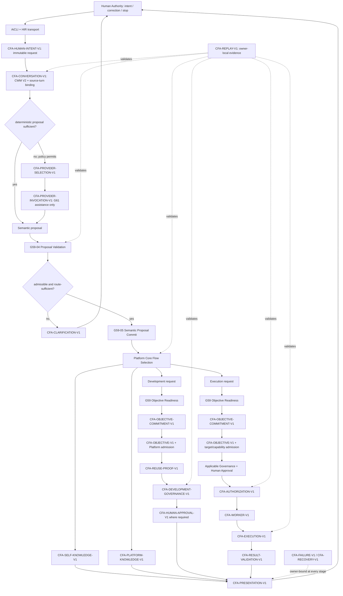

# 1. Implementation Summary

Generation: G66-02

Report identity:
G66_02_PRODUCTION_CONVERSATION_FLOW_CONVERGENCE_ARCHITECTURE_REPORT_V1

Constitutional baseline: `CONSTITUTIONAL_GOVERNANCE_CLOSED`,
`CONSTITUTIONAL_NERVOUS_SYSTEM_STATIC_MAP_ESTABLISHED`,
`CONSTITUTIONAL_FLOW_ARCHITECTURE_SPECIFICATION_ESTABLISHED`, and
`HUMAN_INTENT_ARCHITECTURE_CHARACTERIZED`.

Authenticated repository identity:

- Commit: `b1c66bf4a311fc8a448484d73f105396906a5370`
- Tree: `edee8c7d38b7349729bfc4cfa8e9d6a38047d76e`
- Subject: `G66-00: establish Constitutional Flow Architecture specification`
- Certified working-tree baseline:
  `docs/governance/G66_01_HUMAN_INTENT_ARCHITECTURE_DISCOVERY_AUDIT_REPORT_V1.md`

Implementation contracts: G48 Constitutional Evidence Reporting Standard V1;
Constitutional Flow Architecture Specification V1; Constitutional Architecture
Specification V1; Canonical Layer Model; Constitutional Invariants; Governance
Enforcement Hierarchy; Governance Lineage Model; G65-10 Constitutional Nervous
System Static Reconstruction; G66-01 Human Intent Architecture Discovery Audit;
G59 Conversation V2; G60 Human Interface integration; G61 Central LLM reuse;
and G65 Self Knowledge integration and routing.

Reporting date: 2026-08-02.

Objective:

Define the canonical production Human Conversation composition from Human input
through AiCLI, semantic Conversation, clarification, flow selection, the exact
selected constitutional owner chain, and canonical Presentation, using already
certified owners without redesigning their responsibilities.

Implementation scope:

- Specify one desired default production pipeline that composes Human
  Interface Runtime, Conversation Working Memory V2, Semantic Slots, proposal
  creation and validation, Proposal Commit, route-specific readiness and
  Objective Commitment, Self Knowledge Request Classification, Platform Query
  Router, Platform Project Objective, optional proposal-only Central LLM
  Assistance, owner-bound Clarification, Replay, Governance, Authorization,
  Worker/execution owners, and Presentation.
- Define stage contracts for owner, authority, input, output, validation,
  Replay, and fail-closed behavior.
- Compare the current default route with the canonical route and classify
  reused, removed-from-canonical, newly composed, compatibility-preserved, and
  future-deprecated transitions.
- Define the minimum additive schemas, adapters, routing composition, Replay
  bindings, migration sequence, priorities, and implementation acceptance
  gates required by a later authorized generation.
- Preserve every existing runtime and routing behavior during this
  architecture-only generation.

Modified modules:

- `docs/governance/G66_02_PRODUCTION_CONVERSATION_FLOW_CONVERGENCE_ARCHITECTURE_REPORT_V1.md`
  — this G48 convergence-architecture report.

Intentionally unchanged modules:

- All AiCLI/AiGOL CLI, Human Interface, Conversation V2, CWM, Semantic Slot,
  proposal, commit, readiness, Objective Commitment, Self Knowledge, Platform
  Query Router, Platform Project Objective, Project Services, Central LLM,
  clarification, Replay, Governance, provider, Authorization, Worker,
  execution, result, Presentation, test, manifest, hook, policy, and deployment
  surfaces.
- G65-10, G66-00, and the certified working-tree G66-01 report.

Architectural boundaries preserved:

- Human Authority owns intent, correction, commitment, approval, and stop.
- Conversation owns semantic state and proposal validation; it does not own
  Platform admission, Governance, Authorization, Worker, or execution.
- Platform Core owns operational flow selection, Project Objective
  sufficiency, admission, and service composition; it does not reinterpret
  Human semantic authority.
- Central LLM Assistance may produce a proposal only. Provider selection and
  invocation remain separate authenticated owners, and provider confidence
  creates no authority.
- Self Knowledge and Platform Knowledge remain read-only and may transition
  only to Presentation or their own fail-closed disposition.
- A selected `EXECUTION` request class is not execution authority. It must
  traverse every applicable Objective, admission, Governance, Human Approval,
  Authorization, Worker, execution, and result-validation owner.
- Replay remains owner-local, immutable, read-only on reconstruction, and
  incapable of routing, retrying, approving, or authorizing.
- The proposed composition adapter is orchestration-only. It owns no observed
  decision and cannot repair, infer, or upgrade an owner artifact.

Primary architectural conclusion:

Production convergence requires an additive runtime composition and routing
integration, not a new Conversation architecture. The future canonical default
route should replace the current raw-text-to-Project-Services fallback with a
Conversation-first sequence: capture one Human turn, validate or generate a
bounded semantic proposal, clarify when required, commit the admissible
semantic operations into CWM, and let Platform Core select one G66 flow from
validated semantic evidence. Existing owners then execute only their own
branch.

No runtime convergence is implemented or certified by G66-02. This report
certifies the architecture and migration contract only.

# 2. Code Evidence

## Public API

No public API is added. The current default AiCLI and Conversation V2 entry
points remain separate. The existing Conversation V2 public contract states:

```python
def run_hir_conversation_terminal_v2(
    *,
    runtime_root: str | Path,
    workspace_identity: str | Path,
    session_identity: str,
    human_identity: str,
    created_at: str,
    ttl_seconds: int = 3600,
    input_reader: Callable[[str], str] = input,
    output_writer: Callable[[str], None] = print,
) -> dict[str, Any]:
    """Run the explicit multi-turn AiCLI/HIR Conversation V2 protocol."""
```

Source: `aigol/runtime/human_interface_conversation_runtime_v2.py`.

A later implementation SHALL expose one production composition entry under the
existing Human Interface boundary. Its conceptual contract is:

```text
validated Human request + session/workspace identity + explicit artifacts
-> validated production-conversation result or stable fail-closed result
```

The entry SHALL delegate every decision to an existing owner. It SHALL NOT be
a new semantic, routing, Governance, provider, Authorization, Worker, or
Presentation authority.

## Orchestration Entry Point

The current default Project Services path classifies raw text and may establish
admission precedence before a Conversation V2 semantic commit. The following
excerpt is exact; unrelated surrounding branches are omitted:

```python
request_classification = validate_self_knowledge_request_classification(
    classify_self_knowledge_request(message)
)
if request_classification["request_classification"] == DEVELOPMENT_OBJECTIVE:
    from aigol.runtime.platform_core_admission_precedence_runtime import (
        determine_platform_core_admission_precedence,
    )

    admission_precedence = determine_platform_core_admission_precedence(
        request=message,
        explicit_canonical_artifacts=validated_explicit_artifacts,
        active_workspace_objective=(
            prior_state.get("active_development_objective")
            if isinstance(prior_state, dict)
            else None
        ),
        replay_reference=admission_reference,
    )
```

Source: `aigol/runtime/platform_core_project_services.py`.

The canonical orchestration moves broad admission behind validated semantic
commit and explicit flow selection. The future composition order is normative:

```text
capture Human turn
-> validate Conversation/session/CWM identity
-> run deterministic exact classifiers and deterministic proposal sources
-> optionally request one provider proposal through G61
-> validate proposal through G59-04
-> clarify or commit through G59-05
-> select one G66 flow through Platform Core
-> validate and execute only that owner's branch
-> present the validated branch response
```

This order does not move the G65 Self Knowledge decision after Objective
inference. Its exact classifier retains precedence inside the Conversation
proposal/classification phase and is bound into the later Platform selection.

## Semantic Reductions

The existing explicit HIR already composes deterministic proposal creation,
proposal validation, and Proposal Commit. This excerpt is exact; later slot
assertion and state-transition lines are omitted:

```python
proposal = proposal_v2.create_conversation_interpreter_proposal_v2(
    interpreter_identity=DETERMINISTIC_HIR_PARSER_IDENTITY,
    interpreter_class=proposal_v2.DETERMINISTIC_PARSER,
    interpreter_version=DETERMINISTIC_HIR_PARSER_VERSION,
    conversation_identity=state["envelope"]["conversation_identity"],
    workspace_identity_hash=state["envelope"]["workspace_identity_hash"],
    session_identity_hash=state["envelope"]["session_identity_hash"],
    source_turn_identity=turn_binding["source_turn_identity"],
    source_turn_digest=turn_binding["source_turn_digest"],
    expected_cwm_revision=state["revision"],
    expected_semantic_revision=state["semantic_revision"],
    proposed_semantic_operations=[operation],
)
validation = proposal_v2.validate_conversation_interpreter_proposal_v2(
    proposal,
    current_state=state,
    source_turn_text=source_turn_text,
    observed_at=observed_at,
    interpreter_registry=[
        {
            "interpreter_identity": DETERMINISTIC_HIR_PARSER_IDENTITY,
            "interpreter_class": proposal_v2.DETERMINISTIC_PARSER,
            "interpreter_version": DETERMINISTIC_HIR_PARSER_VERSION,
            "enabled": True,
        }
    ],
)
if validation["validation_disposition"] != proposal_v2.ADMISSIBLE:
    raise FailClosedRuntimeError("semantic proposal is not admissible")
proposal_commit = proposal_commit_v2.commit_proposal_candidate_operations_v2(
    runtime_root=runtime_root,
    workspace_identity=workspace_identity,
    session_identity=session_identity,
    candidate_operation_set=validation["candidate_operation_set"],
    expected_revision=state["revision"],
    committed_at=observed_at,
)
```

Source: `aigol/runtime/human_interface_conversation_runtime_v2.py`, function
`admit_hir_semantic_turn_v2`.

The canonical reduction reuses that owner chain for both explicit and natural
turns:

```text
source turn
-> exact deterministic classification/proposal when available
-> otherwise bounded optional G61 proposal
-> G59 proposal validation against exact source span and CWM revision
-> clarification when rejected, conflicted, or insufficient
-> G59 Proposal Commit of admissible operations
-> route-specific sufficiency evaluation
-> Platform flow selection
```

Read-only requests do not need to become Objective-ready. Their committed
semantic evidence needs only the action/subject/reference fields required by
the exact read-only classifier and selected owner. Development and execution
requests require the complete G59 Objective Readiness and exact Human Objective
Commitment path before Platform admission.

## Public Validators

The canonical composition SHALL call, not duplicate, the existing validators:

- CWM/session/envelope validation before any proposal;
- Self Knowledge request-classification validation for the exact certified
  vocabulary;
- G59 proposal assessment/validation against source text, interpreter registry,
  CWM identity, and expected revisions;
- G59 Proposal Commit revision and candidate-operation validation;
- G59 Objective Readiness and Objective Commitment validation for actionable
  branches;
- Platform Query Router response and proposed flow-binding validation;
- Platform Project Objective validation for Development/Execution branches;
- selected Self Knowledge, Platform Knowledge, Governance, Authorization,
  Worker, execution, result, and Presentation validators;
- owner-local Replay reconstruction and tamper validation.

The current G61 adapter already terminates in the existing proposal validator:

```python
proposal = adapt_epp_response_to_interpreter_proposal_v1(
    current_state=state,
    source_turn_text=turn,
    binding_profile=profile,
    interpreter_request=request,
    epp_response=envelope,
)
validation = proposal_v2.assess_conversation_interpreter_proposal_v2(
    proposal,
    current_state=state,
    source_turn_text=turn,
    observed_at=observed_at,
    interpreter_registry=interpreter_registry,
)
```

Source:
`aigol/runtime/conversation_interpreter_epp_assistance_runtime_v1.py`.

No future flow selector may consume raw provider output, provider confidence,
or an unvalidated interpreter proposal.

## Canonical Data Models

Existing owner artifacts remain unchanged. A later implementation requires two
minimum additive binding schemas; these are architecture requirements, not
runtime contracts established by G66-02.

### Production Conversation Flow Binding V1

`PRODUCTION_CONVERSATION_FLOW_BINDING_V1` SHALL contain only references and
validated selections:

```text
artifact_type
schema_version
flow_architecture_version
request_identity and request_hash
workspace_identity_hash
session_identity_hash
conversation_identity
cwm_revision and cwm_state_hash
source_turn_identity and source_turn_digest
request_classification_identity/hash, when applicable
proposal_identity/hash and interpreter_class
proposal_validation_identity/hash/disposition
semantic_commit_identity/hash
route_sufficiency_status
classification_owner and classification_identity
selection_owner
requested_target_flow_id and requested_target_owner
permitted_next_flow_id and permitted_next_owner
selection_disposition
clarification_identity, when required
ordered predecessor references
owner-local Replay references
created_at
artifact_hash
```

Conversation owns the referenced semantic artifacts and request classification.
Platform Core owns `requested_target_flow_id`, `permitted_next_flow_id`, and
`selection_disposition`, and must preserve an exact Conversation classification
when that classifier owns the decision. The binding does not copy semantic
prose, grant authority, or certify a branch. The supported requested targets
are exactly:

```text
CFA-SELF-KNOWLEDGE-V1
CFA-PLATFORM-KNOWLEDGE-V1
CFA-DEVELOPMENT-GOVERNANCE-V1
CFA-EXECUTION-V1
CFA-CLARIFICATION-V1
CFA-FAILURE-V1
```

For Self Knowledge and Platform Knowledge, target and next flow may be the same
read-only owner. For Development Governance and Execution targets, the next
flow is the required Conversation readiness/Objective Commitment continuation,
then Platform Objective/admission and every declared predecessor in G66 order.
The target never authorizes a jump to G47 or execution. An `EXECUTION` target
records requested flow only; it is not an Authorization, Worker request, or
execution artifact.

### Owner-Bound Clarification Envelope V1

`OWNER_BOUND_CLARIFICATION_ENVELOPE_V1` SHALL bind existing clarification
owners without centralizing their decisions:

```text
artifact_type and schema_version
clarification_identity
originating_flow_id
originating_owner
originating_artifact_reference/hash
workspace/session/conversation/subject identities
expected_revision
reason_code
required_field_or_evidence codes
permitted_reply_kind
attempt identities
status
created_at/expires_at
artifact_hash
```

The originating owner alone decides whether the reply resolves the gap. The
shared envelope standardizes transport, Replay correlation, and Presentation;
it does not create a clarification authority.

No new Semantic Slot class is required for the first convergence version.
Existing action, subject, outcome, work type, qualifier, and semantic-reference
slots are sufficient when route-specific completeness is applied. Any later
new slot class requires the G66 versioning and migration process.

## Deterministic Algorithms

The future default selection algorithm SHALL use this fixed order:

1. Validate Human request, interface, session, workspace, participant-binding
   class, and any active owner-bound clarification.
2. If an active clarification exists, route only to its originating owner for
   revalidation; do not classify it as a new request.
3. Create/load CWM V2 and bind the exact source turn and expected revisions.
4. Run exact deterministic controls first: explicit commands, G65 Self
   Knowledge request classification, and current deterministic parser rules.
5. When deterministic evidence cannot produce an admissible semantic proposal,
   either invoke the configured G61 proposal-only adapter or emit
   Clarification/Failure according to the declared provider policy.
6. Validate the proposal through G59-04. Reject stale spans, illegal authority
   fields, invalid interpreter identity, revision mismatch, conflict, or
   unbound operations.
7. If required route evidence is missing or ambiguous, emit the common
   owner-bound clarification envelope and stop.
8. Commit only admissible operations through G59-05 and reconstruct the exact
   committed CWM revision.
9. Derive route candidates only from validated classification, committed
   semantic slots, explicit artifacts, and current workspace state.
10. Platform Core selects exactly one requested G66 target and one permitted
    immediate successor. Ties, missing route evidence, unknown flow IDs,
    forbidden target-to-successor pairs, and owner mismatch return
    Clarification or Failure.
11. The selected branch validates the binding and every branch-specific
    predecessor independently.
12. Presentation validates the branch response and renders its status,
    evidence references, bounded scope, and limitations.

Deterministic exact Self Knowledge classification always precedes optional LLM
assistance. Provider failure never changes the request to
`DEVELOPMENT_OBJECTIVE`; it yields the declared Clarification or Failure state.

## Responsibility Boundaries

### Canonical Production Flow



The Development Governance branch in this diagram ends at a validated
Governance/approval status for Presentation unless a later explicit execution
transition is separately selected and authorized. Constitutional Certification
Completion is not an automatic synchronous Conversation stage. Governed work
that finishes implementation remains pending until the existing external G48,
Governance assessment, Certification, and promotion owners satisfy
`CFA-CONSTITUTIONAL-CERTIFICATION-V1`.

`CFA-DYNAMIC-TRACE-V1` is intentionally absent from the executable sequence:
G66-00 marks it `SPECIFIED_NOT_IMPLEMENTED`. A future trace may observe these
boundaries only after each owner decision and may never become a production
conversation owner, router, validator, retry mechanism, or Replay substitute.

### Stage Contract Matrix

| Stage | Runtime owner | Authority owner | Input artifact | Output artifact | Validation | Replay evidence | Fail-closed behavior |
|---|---|---|---|---|---|---|---|
| Human input | AiCLI/HIR transport | Human Authority | terminal input, interface/session/participant binding | immutable Human request/source turn | non-empty, command, identity class, session and attachment validation | request identity/hash and session binding | reject/cancel; no semantic or downstream authority |
| Conversation intake | CWM V2 store/runtime | Conversation Layer | Human request and workspace/session identity | Conversation envelope and current CWM revision | schema, TTL, workspace, session, revision and participant class | atomic CWM state/revision | no proposal on stale/expired/mismatched state |
| Exact request classification | G65 classifier under Conversation boundary | Conversation classification owner | normalized exact source turn | validated Self Knowledge/clarification/non-match classification | closed vocabulary, canonical form, hash | classification identity/hash in convergence binding | ambiguity clarifies; non-match does not become development automatically |
| Deterministic semantic proposal | existing deterministic HIR/proposal constructors | Conversation Layer | source turn, CWM, exact classification | G59 interpreter proposal and operations | source spans, interpreter registry, slot classes, revisions | proposal/source-turn identities | invalid proposal stops; no semantic mutation |
| Optional Central LLM proposal | G61 adapter through `CFA-PROVIDER-SELECTION-V1` and `CFA-PROVIDER-INVOCATION-V1` | selection/invocation owners for transport; Conversation retains semantic authority | bounded request, CWM and binding profile | provider envelope adapted to G59 proposal | provider identity/binding/envelope plus G59 proposal assessment | provider selection, request/envelope hashes and proposal validation | timeout/invalid output -> stable failure or clarification; no flow selection |
| Proposal validation | G59-04 | Conversation Layer | G59 proposal, source turn and current CWM | admissible candidate operations or rejection | exact source/revision/dependency/authority-field checks | validation identity/hash | rejection/conflict routes to clarification/failure; no commit |
| Clarification | originating semantic or Platform owner; HIR transports | originating owner plus Human reply | owner-bound envelope and Human reply | resolved input, pending state, cancellation or failure | owner/session/subject/revision/reply-kind validation | original gap and ordered attempts | stale/wrong-owner/insufficient reply remains pending or fails |
| Semantic commit | G59-05 Proposal Commit and CWM atomic store | Conversation Layer | admissible candidate operations and expected revision | new CWM revision and semantic commit identity | candidate-set/revision/cardinality/dependency validation | commit identity and pre/post state hashes | no partial mutation; mismatch leaves prior revision authoritative |
| Flow selection | Platform Query Router plus future thin binding adapter | Conversation retains classification; Platform Core owns operational target/next selection | committed CWM, exact classification, explicit artifacts and workspace state | Production Conversation Flow Binding V1 | allowed target and immediate-successor G66 IDs, distinct owners, route sufficiency, predecessor hashes | immutable selection/binding record | ties/unknown/forbidden successor/missing evidence -> clarification/failure; no branch call |
| Self Knowledge branch | existing G65 integration/runtime family | source owners plus Self Knowledge projection owner | validated flow binding, exact subject, manifest/snapshot | authenticated query and Platform response | manifest, digest, snapshot, subject, response validators | immutable hashes; no runtime Replay write required | unavailable/failure response; never Objective/Governance/execution |
| Platform Knowledge branch | Platform Knowledge Runtime | Platform Core Platform Knowledge owner | validated flow binding and bounded knowledge query | Platform Knowledge response | closed response, capability/owner/status bounds | response/source hashes where recorded | deterministic unavailable/clarification; never execution authority |
| Development readiness/Commitment | G59-06 and `CFA-OBJECTIVE-COMMITMENT-V1` owner | Conversation plus exact Human commit act | committed CWM and flow binding | readiness and immutable Objective Commitment | completeness/conflict/current digest/participant/session/exact act | readiness, confirmation and commitment Replay | no Platform admission when not ready/stale/uncommitted |
| Platform Objective/admission | `CFA-OBJECTIVE-V1` Platform Project Objective and Project Services owners | Platform Core | Objective Commitment, workspace/admission context and explicit artifacts | sufficient Project Objective or clarification | action/subject/outcome/work type/scope/source lineage | request/commitment/Objective/admission hashes | insufficient Objective cannot reach Reuse Proof or Governance |
| Reuse Proof | existing Constitutional Reuse Proof owner | Reuse Proof owner | admitted Objective and current baseline/scope | reuse admission disposition | applicability, freshness, baseline and scope binding | immutable Reuse Proof record | no G47 on missing/invalid proof |
| Development Governance | G47 integration | Development Governance | Objective and valid Reuse Proof/admission | governed plan/implementation binding/status | policy, evidence, need, scope and lineage | G47 record and implementation binding Replay | no approval-ready or execution-ready status on invalid inputs |
| Human Approval | HIR/subject-specific approval adapters | Human Authority plus subject owner | exact governed subject and summary/hash | approved/rejected/pending act | identity, subject, scope, freshness and permitted use count | immutable Human act | no Authorization/next effect when absent, stale or rejected |
| Execution target admission | Platform capability/route owners | Platform Core/capability owner | committed execution request, exact target and evidence | eligible route/capability binding | target, certification, scope, current status and Governance requirement | route and binding Replay | unresolved/uncertified target clarifies or fails; never implicit execution |
| Authorization | existing Authorization Runtime | Execution Authorization | execution-ready evidence, exact Human act and summary | one bounded Authorization | subject/hash/actor/time/use/scope validation | Authorization Replay | no Worker request on mismatch or missing authority |
| Worker lifecycle | request/assignment/dispatch/invocation owners | stage-specific Worker owners | Authorization and exact chain | authenticated invocation | chain, assignment, dispatch, status and allowed-effects validation | ordered Worker Replay | no self-assignment, bypass or invocation on lineage mismatch |
| Execution | existing Execution Runtime | Execution owner | authenticated Worker invocation and allowed effects | bounded execution artifact/output | Authorization, Worker lineage, environment, scope and duplicate checks | start/outcome/effect identities | stop; no broadened/repeated effect |
| Result validation | capture then validation owners | corresponding result owners | execution/output and expected contract | captured and validated/rejected result | custody, schema, hash, lineage and policy | ordered capture/validation evidence | raw result never becomes validated truth or Completion |
| Presentation | Canonical Platform Presentation; AiCLI renders | source owner retains facts; Presentation owns structure | validated branch/failure/clarification/status response | deterministic human-facing presentation | recognized adapter, source schema/hash and limitation visibility | optional presentation hash; source Replay unchanged | refuse unknown/invalid/misleading source |
| Failure/Recovery | owner of failed/suspended subject | same owner; Human may clarify/cancel/approve | failed state and prior immutable evidence | stable failure, clarification, recovery attempt or cancellation | owner/session/subject/recoverability/no-repeat checks | append-only failure/recovery branch | never erase failure, change owner, or repeat completed effects |

### Constitutional Owner Analysis

| Owner | Canonical responsibility | Responsibility explicitly not acquired |
|---|---|---|
| Human Authority | intent, correction, exact Commitment, approval, stop | semantic validation, Platform sufficiency, Authorization implementation |
| AiCLI/HIR | input/output transport, session continuity and thin composition | intent meaning, flow decision, provider or execution authority |
| Conversation Layer | CWM, Semantic Slots, proposals, validation, commit, readiness | Platform selection/admission, Governance, Authorization, execution |
| Platform Core | select requested operational G66 target and permitted next flow; Objective/admission; compose read-only services | Human intent/classification, semantic mutation, G47, Worker execution |
| Self Knowledge family | manifest/snapshot validation and fixed source projection | search, inference, Objective, execution, authority creation |
| Platform Knowledge | bounded platform metadata composition | Self Knowledge ownership, governed work or execution authority |
| Provider selection/invocation | select and transport optional proposal request | semantic acceptance, flow selection, Commitment, Governance |
| Reuse Proof | authenticate reuse admission for governed development | G47 planning, Human approval, execution |
| Development Governance | governed need/evidence/policy/planning eligibility | Human approval, Authorization, Worker, self-certification |
| Authorization | permit one exact execution subject | Objective/flow selection, Worker self-selection, broader scope |
| Worker/execution/result owners | bounded lifecycle, effects, capture and validation | self-Authorization, Governance, constitutional Certification |
| Replay | validate immutable owner-local evidence | routing, recovery decision, retry, approval, authority |
| Presentation | deterministic structure/rendering | source facts, authority, hidden action |
| Constitutional Certification | later external-evidence completion only | synchronous conversation success or self-certification |

## Current Default Versus Canonical Production Flow

| Concern | Current default flow | Canonical production flow |
|---|---|---|
| Entry | Human -> default AiCLI -> Reference UHI -> Project Services | Human -> default AiCLI/HIR -> Conversation intake/CWM |
| Self Knowledge | exact G65 classifier before Objective; correct early route | same exact classifier, now bound to source turn, proposal/commit and explicit G66 selection |
| Non-Self-Knowledge fallback | provisionally `DEVELOPMENT_OBJECTIVE` | unresolved until validated semantic proposal and single Platform selection |
| Natural semantics | Project Services lexical inference/route probes | deterministic proposal first; optional G61 proposal; G59 validation/commit |
| Conversation memory | UHI project context and owner continuations | CWM V2 is canonical semantic memory; UHI context binds by reference |
| Clarification | several owner-specific shapes | same owners through one transport/binding envelope |
| Flow decision | inferred from router/service/binding outcomes | explicit validated G66 flow-binding artifact |
| Read-only query | Self/Platform Knowledge route | same owners; no Objective readiness/Commitment required |
| Development | Project Objective may be inferred directly from raw text | complete semantic evidence -> Objective readiness/Commitment -> Platform Objective -> Reuse Proof -> G47 |
| Execution request | inconsistent default lexical handling; alternate complete route exists | explicit execution selection -> complete Objective/admission/Governance/Approval/Authorization/Worker chain |
| Central LLM | certified adapter has no current default caller | optional proposal source only after deterministic attempt and before G59 validation |
| Replay | multiple owner-local stores and contexts | same stores plus additive cross-owner binding references; no history rewrite |
| Presentation | current adapters render selected result | same canonical Presentation owner for every branch and failure |

## Convergence Map

### Reused transitions

- Human -> AiCLI/HIR transport.
- Active clarification -> originating-owner restoration before new-turn
  classification.
- Exact Self Knowledge classifier -> Self Knowledge integration.
- G59 proposal -> proposal validation -> Proposal Commit -> CWM revision.
- G59 Objective Readiness -> Human confirmation -> Objective Commitment.
- Platform Query Router -> Self Knowledge or Platform Knowledge owner.
- Platform Objective -> Reuse Proof -> G47 Development Governance.
- Governance/Human Approval -> Authorization -> Worker -> Execution -> Result
  Validation where the selected branch permits execution.
- Every validated response -> Canonical Presentation -> AiCLI rendering.
- Owner-local Replay at every authority boundary.

### Removed from the future canonical default path

These transitions are not removed by G66-02. A later implementation SHALL stop
using them as canonical new production ingress after compatibility gates pass:

- raw non-Self-Knowledge text -> blanket `DEVELOPMENT_OBJECTIVE` fallback;
- raw Human request -> Platform admission precedence before Conversation
  semantic commit;
- raw Human request -> Project Objective inference without a validated
  Conversation/flow binding;
- generic Platform Knowledge probing as hidden metadata for an unresolved Help
  or execution request;
- arbitrary alternate workflow identity used as if it were a G66
  constitutional flow selection.

### Newly introduced transitions

- default UHI request -> CWM V2/source-turn binding;
- exact classifier/deterministic parser/optional G61 source -> one G59 proposal
  validation boundary;
- admissible Proposal Commit -> explicit Platform Core flow selection;
- flow selection -> immutable Production Conversation Flow Binding V1;
- common clarification transport -> originating-owner revalidation;
- UHI, CWM, proposal, commit, route, and branch Replay connected through
  reference-only correlation bindings.

### Compatibility-preserved transitions

- exact natural and command-form Self Knowledge requests;
- explicit `action:`, `subject:`, `outcome:`, `work-type:`, `/confirm`, and
  `/commit` Conversation V2 controls;
- direct validated Self Knowledge, Platform Query Router, Conversation,
  Project Services, and execution APIs;
- `conversation-v2` and `conversation-execute-v2` as explicit alternate entry
  adapters while migration is active;
- legacy/alternate `aigol conversation` histories and direct command families;
- existing clarification Replay and continuation records;
- existing route/service response types and Presentation adapters;
- all historical Replay readers and certified artifact versions.

### Bypasses to deprecate after successor certification

- the default raw-text-to-Project-Services Objective path as new production
  ingress;
- provider-assisted classification or general answer used directly as a
  constitutional flow decision rather than a proposal;
- the alternate workflow registry presented as the canonical G66 flow owner;
- direct use of G61 output beyond G59 proposal validation/commit;
- alternate complete-execution entry represented as equivalent to default
  natural Conversation without the new flow-binding adapter.

Transport directly to execution, Conversation directly to Worker/provider
authority, Self/Platform Knowledge to Objective/execution, and Commitment used
as Authorization are forbidden transitions, not compatibility paths awaiting
deprecation.

## Reuse Proof

| Required component | Authenticated current owner/evidence | Canonical reuse | Why reuse is sufficient |
|---|---|---|---|
| Human Interface Runtime | G60 HIR and current AiCLI modes | production transport and thin sequencing | already preserves Human/interface and no-execution boundaries |
| Conversation Working Memory V2 | G59-01 | canonical semantic memory and revision identity | immutable/atomic state, session/workspace binding and Replay already exist |
| Semantic Slots | G59-02 | action, subject, outcome, work type, qualifier and references | existing taxonomy supports route-specific and Objective semantics without a new first-version slot class |
| Conversation Proposal Runtime | G59-04 | common deterministic/LLM proposal contract | already rejects unbound and authority-shaped proposals |
| Proposal Commit Runtime | G59-05 | only semantic mutation path | already validates candidate operations and expected revision atomically |
| Objective Readiness | G59-06 | development/execution branch completeness | prevents incomplete semantics from becoming actionable Objective |
| Objective Commitment | G59-07 | exact Human commitment before Platform admission | preserves Human act and separates Commitment from Authorization |
| Self Knowledge Request Classification | G65-07 | deterministic first classifier and exact read-only precedence | current production-positive route is already certified and bounded |
| Platform Query Router | current Platform Core router | operational G66 selection owner and branch adapter | already owns deterministic service candidate selection under Platform Core |
| Platform Project Objective | current inference/validator | validate actionable committed request and scope | existing Platform owner; no Conversation duplication required |
| Central LLM Assistance | G61-03 | optional natural-language proposal generator | already uses authenticated provider owner and returns proposal-only validation |
| Clarification runtimes | Project Services, G59 and alternate owner-specific paths | originating-owner question/reply logic behind shared envelope | decisions remain correct; only transport/correlation needs convergence |
| Replay | owner-local writers/reconstructors | retain evidence; add reference-only convergence binding | avoids central Replay redesign or historical mutation |
| Governance | Reuse Proof and G47 integration | unchanged development admission/planning owners | already certified production gates; Conversation must not duplicate them |

No reused owner is broadened. The reuse proof is architectural: later runtime
certification must still demonstrate actual call sites, positive/negative
behavior, Replay round trips, and production reachability.

## Compatibility Analysis

Compatibility policy is `ADDITIVE_THEN_DEPRECATE`:

1. Existing artifact schemas and public validators remain readable and valid.
2. New binding/envelope schemas contain references to existing artifacts; they
   do not rewrite them.
3. The current exact Self Knowledge behavior remains a mandatory positive
   invariant throughout migration.
4. Explicit Conversation V2 commands remain valid inputs through an adapter.
5. Direct APIs keep their own validators and reachability classification; they
   do not become implicit default bypasses.
6. Old default and alternate routes remain available until replay parity,
   negative bypass tests, and production entry evidence certify the successor.
7. Deprecation first blocks new production ingress, then preserves historical
   readers and Replay for the required retention period.
8. No compatibility adapter may synthesize missing Conversation, Commitment,
   Governance, Human Approval, or Authorization evidence.

G66-01 found three current compatibility failures: one older AiGOL Next test
expects runtime binding where current routing returns
`AIGOL_NEXT_RUNTIME_BINDING_NOT_REQUIRED`, and two older submit-continuity tests
expect a legacy conversation-completion status instead of the current submit
completion status. A future convergence implementation must make a governed
compatibility decision for those exact contracts and obtain passing or
explicitly superseded evidence. G66-02 neither repairs nor normalizes them.

## Migration Analysis

| Modification class | Required? | Individually justified change | Explicit non-change |
|---|---|---|---|
| Documentation | `YES_NOW` | this canonical architecture and future flow obligations | does not activate runtime |
| Runtime composition | `YES_FUTURE` | thin HIR production composition adapter sequences existing owners | no new decision authority or owner merge |
| Routing changes | `YES_FUTURE` | move broad Objective/admission after semantic commit and explicit Platform flow selection | retain exact G65 precedence and Platform ownership |
| Adapter composition | `YES_FUTURE` | bind default UHI, G59 explicit inputs, G61 proposal output, Project Services and branch responses | no provider/Conversation redesign |
| Compatibility layer | `YES_FUTURE` | preserve explicit commands, direct APIs, old statuses where governed, and historical route artifacts | no silent equivalence or evidence synthesis |
| Replay changes | `ADDITIVE_FUTURE` | add cross-owner correlation/binding records and common clarification references | no owner-local schema rewrite, retry semantics or history mutation |
| Schema changes | `ADDITIVE_FUTURE` | Production Conversation Flow Binding V1 and Owner-Bound Clarification Envelope V1 | no first-version Semantic Slot, Objective, Governance, Authorization, Worker or Presentation schema change |
| Provider changes | `NO` | reuse G61 and current selection/invocation owners | provider remains optional proposal-only |
| Conversation redesign | `NO` | reuse CWM/slots/proposal/commit/readiness/Commitment | no new semantic authority |
| Governance redesign | `NO` | reuse Reuse Proof and G47 gates after Platform Objective | no Governance logic in Conversation adapter |
| Authorization/Worker redesign | `NO` | reuse existing execution chain on execution branch only | selection never becomes execution authority |
| Data migration | `NO_INITIAL` | new sessions use new bindings; historical sessions remain readable | no rewrite/backfill of old Replay |
| Deployment change | `NO_NOW` | later separately governed cutover required | no server/process mutation by G66-02 |

## Migration Sequence

1. Specify and certify the two additive schemas and closed validators, including
   G66 flow IDs, owner fields, predecessor hashes, status vocabulary, and
   fail-closed unknown-field behavior.
2. Implement a thin Human Interface composition adapter over current CWM,
   proposal, validation, commit, clarification, and flow owners without
   changing their APIs where avoidable.
3. Integrate deterministic exact controls first; add G61 only as an optional
   proposal source with provider-unavailable clarification/failure behavior.
4. Extend Platform Query Router input with the validated semantic/commit
   binding and emit the new flow-selection binding. Do not accept raw provider
   output or uncommitted semantic state.
5. Connect the four selected branch adapters and enforce read-only versus
   actionable branch requirements. Keep Objective Readiness/Commitment off the
   read-only branches.
6. Standardize clarification transport while retaining the originating owner's
   sufficiency decision and all prior attempts.
7. Add reference-only Replay correlation and demonstrate deterministic
   reconstruction/tamper failure without changing owner-local history.
8. Run positive and negative convergence suites for Self Knowledge, Platform
   Knowledge, help, ambiguous requests, development, execution, provider
   unavailable/invalid output, cross-owner clarification, stale CWM, bypasses,
   Authorization, Worker, and Presentation.
9. Resolve or explicitly supersede the three G66-01 compatibility failures and
   prove direct APIs/alternate modes remain bounded.
10. Audit the actual default `./aicli` production path, update the descriptive
    nervous-system map, complete G48 evidence, then block new ingress through
    deprecated bypasses.
11. Consider Dynamic Trace only in a later observation-only generation after
    functional convergence is certified.

## Implementation Priorities

| Priority | Future work | Acceptance boundary |
|---|---|---|
| `P0` | binding and clarification schemas/validators | closed schema, owner identity, hashes, canonical order, fail-closed negatives |
| `P1` | thin HIR/CWM/proposal/commit composition | no duplicated semantic logic; exact Human/session/revision lineage |
| `P2` | semantic-bound Platform flow selection and four branch adapters | one selected G66 flow; no read-only/actionable cross-route |
| `P3` | compatibility and Replay correlation | old readers preserved, three known failures resolved/superseded, deterministic reconstruction |
| `P4` | repository-wide negative and production route certification | no provider/Worker/Governance/Authorization bypass; default AiCLI evidence |
| `P5` | deprecation/cutover and static-map update | new ingress blocked only after successor certification |
| `P6` | optional Dynamic Trace | observation-only, non-interfering, separately certified |

## Future Implementation Acceptance Gates

A runtime convergence generation SHALL NOT certify until it demonstrates:

- the exact current Self Knowledge positive lineage remains unchanged in
  meaning and still bypasses Objective/Governance/execution;
- Platform Knowledge answers only bounded informational requests;
- ambiguous/general Help requests clarify rather than becoming Development
  Objectives by fallback;
- development and execution requests cannot leave Conversation without
  admissible committed semantics;
- Objective Readiness and exact Objective Commitment gate every actionable
  natural-language branch;
- Platform Core independently validates the committed Objective and selects
  only an allowed G66 flow;
- provider unavailable, timeout, malformed output, confidence manipulation,
  and authority-field injection never select a flow or mutate CWM;
- cross-owner, stale, duplicate, and wrong-session clarification replies fail
  closed;
- Development Governance, Human Approval, Authorization, Worker, execution,
  result validation, Replay, and Presentation each retain separate artifacts;
- direct APIs and alternate modes cannot bypass the same owner validators;
- historical Replay remains readable and new convergence Replay is
  deterministic/tamper-evident;
- the three G66-01 compatibility failures have an explicit governed
  disposition;
- Python compilation, focused and repository-wide regressions, governance
  conformance, production route evidence, and `git diff --check` pass.

# 3. Constitutional Self-Assessment

## Verified

- The architecture begins at Human Authority/AiCLI and ends at validated
  canonical Presentation, with every decision assigned to an existing owner.
- One canonical diagram covers Human Intent, Conversation, semantic proposal,
  proposal validation, Clarification, Semantic Commit, flow selection, all
  four required branch classes, Replay, Failure/Recovery, and Presentation.
- The stage matrix identifies runtime owner, authority owner, input, output,
  validation, Replay, and fail-closed behavior for every stage.
- Current and canonical flows are compared explicitly.
- Reused, removed-from-canonical, newly introduced,
  compatibility-preserved, and future-deprecated transitions are separately
  identified.
- Every required reuse component has an authenticated current owner, exact
  canonical role, and non-duplication justification.
- Human, Conversation, Platform Core, Governance, Authorization, Replay,
  provider, Worker, result, and Presentation authority remain separate.
- Central LLM Assistance is optional and proposal-only; deterministic exact
  classification precedes it and G59 proposal validation follows it.
- Read-only flows do not require or create Objective Commitment, while
  development/execution flows cannot bypass readiness and exact Human
  Commitment.
- Selecting `CFA-EXECUTION-V1` is explicitly separated from Authorization and
  actual execution.
- Migration is correctly classified as future runtime composition, routing,
  adapters, compatibility, additive Replay bindings, and additive schemas;
  no provider, Conversation, Governance, Authorization, or Worker redesign is
  required.
- The G66-01 compatibility failures remain visible and have a required future
  disposition.
- Governance conformance and document consistency checks pass without runtime,
  routing, test, provider, or Conversation mutation.

## Not Verified

- No Production Conversation Flow Binding schema, Clarification envelope,
  validator, composition adapter, call site, router input, or branch adapter is
  implemented by G66-02.
- No current default AiCLI run traverses the complete canonical pipeline; the
  report defines desired architecture, not production reachability.
- G61 remains without a current default CLI/runtime caller.
- The three G66-01 focused compatibility failures remain unresolved because
  runtime/test repair is outside this generation.
- No Replay correlation wrapper or cross-owner convergence reconstruction is
  implemented or exercised.
- No broad natural-language, multilingual, provider-failure, execution-request,
  repository-wide bypass, performance, or deployment validation is performed.
- Human identity remains asserted rather than universally authenticated.
- Dynamic Trace remains specified but unimplemented and is not part of this
  convergence implementation.
- No live provider, Worker, Authorization, execution, installed process,
  container, deployment, server, or external system is invoked.

# 4. Validation Matrix

| Requirement | Evidence | Validation | Result |
|---|---|---|---|
| G48 report structure | six exact top-level sections and required code-evidence subsections | deterministic heading review | `PASS` |
| G65-10 consistency | current nodes, transitions, decisions, owners and reachability | static-map cross-reference review | `PASS` |
| G66-00 consistency | stable flow IDs, universal transition law and owner contracts | normative cross-flow review | `PASS` |
| G66-01 consistency | convergence finding, reuse inventory, gaps and known compatibility failures | discovery-audit comparison | `PASS` |
| Constitutional Architecture consistency | distributed owners, no central authority kernel and mutation boundaries | cross-document architecture review | `PASS` |
| Canonical Layer Model consistency | L0-L4 responsibilities and separate Human/Governance authority overlay | layer/authority review | `PASS` |
| Governance Hierarchy consistency | Reuse Proof/G47/approval/Authorization precedence | enforcement-order review | `PASS` |
| Complete canonical production flow | Human through Presentation and four selected branch classes | diagram and stage-matrix review | `PASS` |
| Per-stage owner/artifact/failure evidence | runtime owner, authority, inputs, outputs, validation, Replay and fail-closed columns | exact field-completeness review | `PASS` |
| Current versus canonical comparison | comparison table | transition-by-transition review | `PASS` |
| Convergence classifications | reused, removed, introduced, compatible and deprecated lists | classification completeness review | `PASS` |
| Reuse proof | all required named components | owner/evidence/non-duplication table review | `PASS` |
| Human Authority preservation | intent, correction, Commitment, approval and stop boundaries | owner matrix and branch review | `PASS` |
| Conversation ownership preservation | CWM/slots/proposal/validation/commit/readiness | semantic-stage review | `PASS` |
| Platform Core ownership preservation | flow selection, Objective/admission and service composition | selector/branch review | `PASS` |
| Governance/Authorization ownership preservation | Reuse Proof, G47, Human Approval and Authorization sequence | actionable-branch review | `PASS` |
| Provider remains proposal-only | G61 adapter before G59 validation; no provider-selected flow | LLM stage and forbidden-transition review | `PASS` |
| Replay preservation | owner-local history plus reference-only future bindings | Replay/migration review | `PASS` |
| Migration analysis | documentation/runtime/routing/adapter/compatibility/Replay/schema categories | individually justified classification review | `PASS` |
| Migration sequence and priorities | ordered 11-step sequence and P0-P6 table | dependency and acceptance review | `PASS` |
| Runtime implementation | prohibited by G66-02 | intentionally not performed | `NOT_APPLICABLE` |
| Python compilation and runtime regressions | no Python/test modification authorized | deferred to implementation generation | `NOT_APPLICABLE` |
| Governance conformance | existing read-only conformance engine | 20 checks passed, 0 failed, 0 warnings, 0 critical violations, `CONFORMANT` | `PASS` |
| Document whitespace integrity | G66-02 report and unchanged tracked diff | `git diff --check` plus new-file whitespace review | `PASS` |

# 5. Repository Mutation Summary

Modified files:

- `docs/governance/G66_02_PRODUCTION_CONVERSATION_FLOW_CONVERGENCE_ARCHITECTURE_REPORT_V1.md`
  — architecture, convergence map, reuse proof, compatibility analysis,
  migration sequence, priorities, and future acceptance gates.

Unchanged subsystems:

- All runtime, CLI, routing, Conversation, CWM, Semantic Slot, proposal,
  commit, Objective, query, Self Knowledge, Platform Knowledge, Central LLM,
  provider, clarification, Governance, Authorization, Worker, Replay,
  execution, Presentation, test, schema, manifest, hook, policy, and deployment
  behavior.

API compatibility:

- No current API or artifact contract changes. All new model names and
  transitions in this report are requirements for a later certified
  implementation generation, not active runtime contracts.

Boundary preservation:

- This architecture report performs no runtime composition, route cutover,
  provider/Worker call, Authorization, Replay write, mutation, deprecation,
  deployment, or certification-completion action.
- Existing owners remain authoritative; the future composition adapter is
  explicitly non-authoritative.

Unrelated pre-existing changes:

- `docs/governance/G66_01_HUMAN_INTENT_ARCHITECTURE_DISCOVERY_AUDIT_REPORT_V1.md`
  was present as the certified untracked working-tree baseline before G66-02
  work began and was not modified by this generation.

# 6. Certification Verdict

PRODUCTION_CONVERSATION_FLOW_CONVERGENCE_CHARACTERIZED
