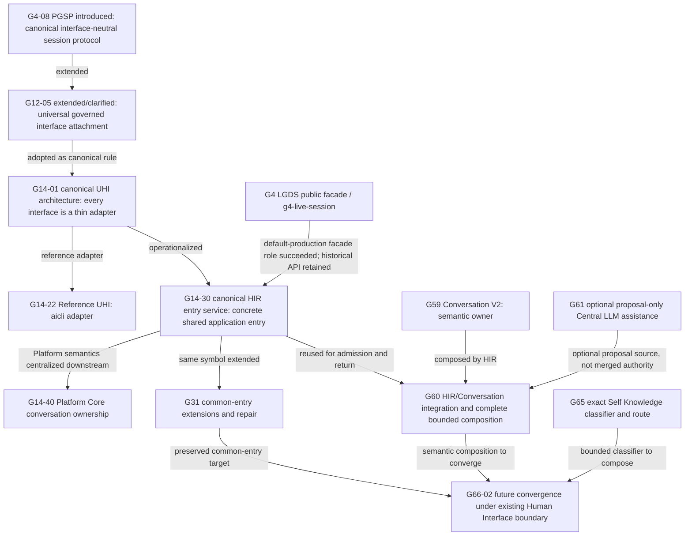

# 1. Implementation Summary

Generation: G66-04

Report identity:
G66_04_CANONICAL_HUMAN_ENTRY_CAPABILITY_DISCOVERY_REPORT_V1

Constitutional baseline: `CONSTITUTIONAL_GOVERNANCE_CLOSED`,
`CONSTITUTIONAL_NERVOUS_SYSTEM_STATIC_MAP_ESTABLISHED`,
`CONSTITUTIONAL_FLOW_ARCHITECTURE_SPECIFICATION_ESTABLISHED`,
`HUMAN_INTENT_ARCHITECTURE_CHARACTERIZED`,
`PRODUCTION_CONVERSATION_FLOW_CONVERGENCE_CHARACTERIZED`, and
`HUMAN_INTENT_PRECEDENCE_CHARACTERIZED`.

Authenticated repository identity:

- Commit: `17b2c1dcf586c99bb6b15674ec9682f7729ee40f`
- Tree: `ed5cc178d73835240f3bda5cf048343b69b9bbf4`
- Subject: `G66-03: characterize Human Intent precedence`

Implementation contracts: G48 Constitutional Evidence Reporting Standard V1;
G4 PGSP architecture and public API; G12 Universal Conversational Entry and
PGSP responsibility clarification; G14 Unified Human Interface architecture,
Reference UHI, Canonical Human Interface Runtime Entry Service, and Platform
Core conversation ownership; G31 common-entry preservation and repair; G47
Development Governance closure; G59 Conversation Layer V2; G60 Human
Interface/Conversation integration; G61 Central LLM reuse; G65 Self Knowledge;
G65-10 Constitutional Nervous System; and G66-00 through G66-03.

Reporting date: 2026-08-03.

Objective:

Perform a repository-wide and history-wide, read-only discovery audit to
identify which certified subsystem was intended to be the single canonical
Human Entry capability for AiGOL, distinguish that capability from its
adapters and downstream decision owners, and determine whether it was later
extended, superseded, merged, deprecated, or retained as canonical.

Audit scope:

- Traced the entry architecture from G4 PGSP through G12, G14, G31, G47,
  G59-G61, G65, and G66.
- Compared declarations of canonicality, public entry APIs, current call
  sites, interface-neutrality, semantic ownership, clarification, flow
  selection, Platform Core integration, Governance, Replay, and extensibility.
- Distinguished a constitutional protocol from its concrete application
  service, a reference adapter, a semantic owner, a routing owner, and an
  optional provider-backed proposal source.
- Reviewed current production and alternate entry surfaces without treating
  call frequency as constitutional authority.
- Made no implementation, routing, schema, test, runtime, deployment, or
  non-requested documentation change.

Modified modules:

- `docs/governance/G66_04_CANONICAL_HUMAN_ENTRY_CAPABILITY_DISCOVERY_REPORT_V1.md`
  — this G48 discovery report.

Intentionally unchanged modules:

- All AiCLI and AiGOL CLI adapters; PGSP and historical session runtimes;
  Human Interface Runtime; Platform Core; Conversation; CWM; Semantic Slot;
  Interpreter; proposal; clarification; Objective; Self Knowledge; Platform
  Knowledge; Central LLM; provider; Governance; Authorization; Worker;
  execution; result; Replay; presentation; tests; manifests; and policies.
- All prior governance reports and the G65-10 machine-readable static map.

Primary finding:

Decision `A` is established: a canonical Human Entry capability already
exists.

The original constitutional subsystem is the Platform Governed Session
Protocol (`PGSP`). G4-08 defined it as the interface-neutral Platform Core
session protocol between adapters and canonical Platform Services. G12-05
then made the intended permanent role exact:

```text
PGSP is the universal governed interface attachment and session invocation
boundary for all present and future interfaces.
```

G14 did not replace that constitutional role. G14-01 certified all Human
Interfaces as thin modality adapters over the same PGSP-bound runtime, and
G14-30 supplied its concrete, current application-service realization:

```text
aigol.runtime.human_interface_runtime_entry_service
  ::run_human_interface_runtime_entry(...)
```

The correct present identity is therefore one lineage at two abstraction
levels, not two competing capabilities:

```text
PGSP
  = canonical universal session-attachment protocol and constitutional role

Canonical Human Interface Runtime Entry Service
  = concrete shared application entry implementing that role for current
    Human Interface/runtime composition
```

G31 explicitly recovered this lineage and called
`run_human_interface_runtime_entry` the one literal common entry. Later G31
generations extended the same symbol through additional application
transitions. G60 reused the Human Interface boundary for Conversation V2 and
called the G14-30 entry from the complete committed-Objective execution path.
G66-02 again requires the future production composition entry to remain under
the existing Human Interface boundary.

The Reference UHI, Conversation Layer V2, Conversation Interpreter, Central
LLM Assistance, Platform Query Router, Self Knowledge Request Classification,
and Platform Core Project Services are not superseding Human Entry
capabilities. They are respectively an adapter, semantic state owner,
proposal owner, optional proposal source, flow-selection owner, bounded
classifier, and Platform coordination/admission owner.

Current production use is not perfectly converged: the default AiCLI submits a
new raw turn directly to Project Services before calling the common runtime
entry for approved/actionable continuation, while `conversation-v2` is a
separate alternate entry. That is an integration-shape limitation already
characterized by G66-01 through G66-03. It does not erase the explicit G4/G12/
G14/G31 canonical identity and does not justify inventing a new entry owner.

Architectural boundaries preserved:

- Human Authority owns intent, correction, approval, commitment, and stop.
- Interface adapters capture and render only.
- The canonical entry binds sessions and sequences existing owners; it does
  not acquire their business or decision authority.
- Conversation owns semantic state and proposal validation.
- Platform Core owns operational flow selection and admission.
- Governance, Authorization, provider, Worker, execution, Replay, and
  Presentation remain distinct.
- Central LLM Assistance remains proposal-only.
- No historical path is declared deprecated unless certified evidence says
  so; reduced current use is not silently converted into deprecation.

## Audit Method

The audit used four bounded evidence classes:

1. Original architecture and responsibility declarations, including their
   exact status and certification verdicts.
2. Later reports that explicitly discuss extension, preservation,
   compatibility, replacement, or common-entry repair.
3. Current source definitions and call sites for the canonical entry, the
   default AiCLI, the Conversation V2 modes, and historical PGSP commands.
4. The G65-10 static entry inventory and G66 normative/current architecture
   reports, used without treating descriptive reachability as authority.

The audit does not infer supersession from newer file dates, newer terminology,
or lack of a symbol name in one later report. Supersession or deprecation
requires explicit responsibility evidence.

# 2. Code Evidence

## Public API

The current concrete shared entry remains:

```python
def run_human_interface_runtime_entry(
    *,
    interface_name: str,
    session_id: str,
    human_requests: list[str],
    created_at: str,
    runtime_root: str | Path,
    workspace: str | Path,
    governed_runtime_runner: GovernedRuntimeRunner,
    presentation: dict[str, Any] | None = None,
    operator_context: str = "CANONICAL_HUMAN_INTERFACE_RUNTIME_ENTRY",
    ...
) -> dict[str, Any]:
    """Enter the certified runtime from any Unified Human Interface."""
```

Source: `aigol/runtime/human_interface_runtime_entry_service.py`, function
`run_human_interface_runtime_entry`.

Its module contract calls the service the shared Platform Core entry boundary
for Human Interfaces. The service validates interface, session, time,
workspace, requests, prior application state, and contextual Human actions,
then delegates to the owning runtime operations.

The original PGSP public API was the G4-04 governed-session runtime, with the
G4-05 `aigol g4-live-session` adapter. G4-10 explicitly described that API as
the current LGDS specialization and said future Web, REST, Voice, Mobile, and
other adapters must reuse the same protocol contract. That historical API
remains callable as an alternate command; it is not the current default AiCLI
facade.

## Orchestration Entry Point

The intended dependency direction established by G14 and recovered by G31 is:

```text
Human
-> modality adapter
-> PGSP-compatible Canonical Human Interface Runtime Entry Service
-> Platform Core / Conversation / other selected owners
-> Governance and execution owners when separately admissible
-> canonical Presentation
-> modality adapter
-> Human
```

Current source confirms that `run_human_interface_runtime_entry` is used by:

- default and one-shot AiCLI after actionable approval;
- AiCLI G31 continuation actions;
- AiGOL CLI runtime-bound paths;
- G60 complete Conversation execution for committed-Objective admission; and
- G60 completion return to the Human Interface.

The default new-turn submission still calls
`prepare_unified_human_interface_project_context` before the shared entry. The
explicit `conversation-v2` mode calls `run_hir_conversation_terminal_v2`, and
the explicit `conversation-execute-v2` mode calls the G60 complete execution
orchestrator. These are current entry surfaces, but they do not carry an
artifact declaring that they supersede PGSP or G14-30.

## Semantic Reductions

The canonical Human Entry reduction is intentionally non-semantic:

```text
adapter-captured Human interaction
-> validate interface/session/request envelope
-> bind to shared governed session/application entry
-> delegate semantic and operational decisions to their certified owners
-> return canonical pending/result/presentation state
```

The semantic reductions are separately owned:

- historical architecture: UBTR interprets and CSA structures meaning;
- current Conversation V2: G59 CWM, slots, proposals, proposal validation,
  atomic commit, readiness, and Objective Commitment;
- current default bounded routes: G65 exact Self Knowledge classification,
  Platform Query Router, and Project Objective inference;
- optional assistance: G61 converts provider output into a G59 proposal only.

An entry capability supports these operations by composing or transporting
their artifacts. It does not satisfy the no-business-logic rule by copying
their algorithms into the entry service.

## Public Validators

Validation remains distributed:

- the entry service validates its own interface, request, action, and prior
  application-state contract;
- Project Services validates workspace and active-owner continuity;
- G59 validates Conversation envelope, CWM, slots, proposals, revisions,
  readiness, and Commitment;
- G65 validates closed Self Knowledge classifications and queries;
- Platform Core validates route and Objective/admission artifacts;
- each Governance, Authorization, Worker, execution, result, Replay, and
  Presentation owner validates its own boundary.

No candidate becomes canonical merely because it can call a validator. The
canonical entry's validity comes from its declared interface-neutral ownership
and its refusal to replace downstream owners.

## Canonical Data Models

The entry lineage uses distinct model layers:

| Model | Owner | Entry relationship |
|---|---|---|
| PGSP session identity/envelope | PGSP | canonical interface-neutral attachment and lineage |
| Human request/source turn | Human Authority; HIR transports | immutable entry evidence |
| UHI project context | Platform Core Project Services | current default workspace/continuity and routing context |
| G59 CWM/semantic artifacts | Conversation Layer | semantic state after Human entry |
| G31 application state/pending action | shared Human Interface runtime entry plus exact low-level owners | interface-neutral actionable continuation |
| flow/classification artifacts | Conversation classifier or Platform Core owner | selection evidence, not entry authority |
| owner-local Replay | each owning runtime under Replay law | immutable reconstruction evidence |
| canonical presentation | Presentation owner; adapter renders | final output without source-authority transfer |

G66-00 now names the constitutional Human Intent flow
`CFA-HUMAN-INTENT-V1`, owned by Human Authority with HIR/AiCLI transport, and
the Conversation flow `CFA-CONVERSATION-V1`, owned by the Conversation Layer.
This confirms rather than collapses the entry/semantic split.

## Deterministic Algorithms

The historical canonicality test used by this audit is deterministic:

1. Locate the first certified declaration of universal interface attachment.
2. Identify whether a later artifact explicitly supersedes or deprecates that
   responsibility.
3. Identify the concrete implementation certified to be shared by all current
   Human Interfaces.
4. Verify later common-entry work preserves or replaces the same public owner.
5. Classify every newer candidate by its declared authority and reachable
   predecessor/successor boundaries.
6. Reject a candidate as the common entry if it is modality-specific, owns
   semantic/business decisions, supports only one query class, or lacks a
   Platform Core session boundary.

This yields one lineage:

```text
PGSP constitutional protocol
-> Unified Human Interface architecture
-> Canonical Human Interface Runtime Entry Service
-> G31 common application entry extensions
-> G60/G66 composition reuse
```

No later report contains an explicit `PGSP_SUPERSEDED`,
`HUMAN_INTERFACE_RUNTIME_ENTRY_SUPERSEDED`, or equivalent certified
responsibility transfer.

## Responsibility Boundaries

| Responsibility | Canonical owner | Human Entry relationship |
|---|---|---|
| Human intent, correction, approval, commitment, stop | Human Authority | capture and preserve exact act |
| modality capture/rendering | interface adapter | predecessor/successor only |
| universal session attachment | PGSP | original constitutional entry role |
| shared current application entry | Canonical Human Interface Runtime Entry Service | concrete interface-neutral sequencing boundary |
| semantic memory and proposal acceptance | Conversation Layer | delegated downstream owner |
| optional semantic proposal generation | deterministic interpreter or G61 adapter | non-authoritative proposal source |
| clarification sufficiency | owner detecting the gap | entry transports question/reply |
| flow selection and Objective/admission | Platform Core | entry carries validated evidence |
| governed development | G47 Development Governance | never inherited by entry |
| execution permission | Authorization plus exact Human act | never inferred from entry |
| provider/Worker/execution/result | corresponding certified owners | invoked only through branch contracts |
| Replay | owner-local custody under Replay authority | entry preserves references and lineage |
| Presentation | Canonical Platform Presentation | adapter renders without altering facts |

## 1. Complete Candidate Inventory

| Candidate | Introduced | Original purpose | Owner | Intended long-term role | Current implementation/use | Evolution disposition |
|---|---|---|---|---|---|---|
| PGSP | G4-08; clarified G12-05 | interface-neutral governed session protocol and adapter-to-Platform-Core boundary | PGSP / Platform Core session protocol | universal attachment for every present/future interface | G4/G5 runtimes and `aigol g4-live-session` remain callable; protocol semantics persist in later UHI law | `ORIGINAL_CANONICAL_PROTOCOL`; operational facade later realized by G14-30; not deprecated |
| Unified Human Interface architecture | G14-01 | make every interface a thin modality adapter over one runtime | constitutional Human Interface architecture | permanent no-interface-specific-runtime rule | active architectural constraint | `CANONICAL_ARCHITECTURAL_PATTERN`, not an executable subsystem |
| AiGOL Next / ACLI Next | G4/G11-G14 | first conversational CLI adapter | interface adapter | first adapter, explicitly not privileged architecture | alternate CLI has broad active command surface | `REFERENCE/HISTORICAL_ADAPTER`; not canonical entry owner |
| Reference UHI (`aicli`) | G14-22 | first clean minimal Unified Human Interface | interface adapter | reference implementation for terminal interaction | current default repository CLI plus three explicit modes | `REFERENCE_ADAPTER`; extended, never promoted to semantic/runtime authority |
| Canonical Human Interface Runtime Entry Service | G14-30 | remove divergence and provide one shared Platform Core runtime entry | interface-neutral Human Interface application entry | concrete common runtime entry for all interfaces | active in AiCLI approvals/G31, AiGOL CLI, G60 admission and completion return | `CURRENT_CANONICAL_RUNTIME_ENTRY`; extended, not superseded |
| Platform Core Project Services / Human Conversation Experience | G14-27/G14-38/G14-40 and later | own workspace, guidance, intent resolution, clarification, summaries, admission, and routing | Platform Core | downstream operational decision and response owner | default new-turn production owner; current active | `DOWNSTREAM_OWNER`; overlapping ingress calls do not make it the Human entry |
| G31 Common Entry Point | G31, repaired G31-24G-R04-R04-R04-R01 | keep post-approval application sequencing out of AiCLI | same G14-30 runtime entry service | versioned extension of the shared entry through governed application states | current `run_human_interface_runtime_entry` contains G31 transitions | `MERGED_EXTENSION`; not a separate candidate |
| Conversation Layer V2 / CWM | G59-01 through G59-07 | typed semantic state, clarification, proposal commit, readiness, Commitment | Conversation Layer plus exact Human acts | canonical semantic/conversation owner | implemented/certified; alternate AiCLI and direct APIs | `DOWNSTREAM_SEMANTIC_OWNER`; not universal transport entry |
| HIR Conversation V2 | G60-01/G60-02 | bind AiCLI/HIR to Conversation V2 and one complete committed-Objective execution chain | HIR orchestration over existing owners | alternate adapter/composition proof and reusable integration | `conversation-v2` and `conversation-execute-v2` alternate production modes | `COMPATIBLE_EXTENSION`; G60 complete path reuses G14-30 entry |
| Conversation Interpreter | G58 architecture; G59-04 implementation | produce and validate bounded semantic proposals | proposal generator; Conversation validates | semantic proposal source behind Conversation | implemented/certified, no independent universal entry | `DOWNSTREAM_PROPOSAL_OWNER` |
| Central LLM Assistance | G61-01 through G61-03 | reuse provider services to create proposal-only semantic assistance | provider selection/invocation plus G59 validation | optional proposal source | implemented/certified adapter; no default CLI/runtime caller | `OPTIONAL_EXTENSION`; cannot own entry or flow |
| Platform Query Router | earlier Platform Core; current G65 integration | choose bounded informational/development service candidates | Platform Core | operational flow selection after valid input/context | active in default production and direct API | `DOWNSTREAM_FLOW_OWNER` |
| Self Knowledge Request Classification | G65-07 | exact pre-Objective read-only Self Knowledge precedence | bounded request-classification owner under Platform Core composition | one narrow deterministic classifier | default-active for exact supported requests | `BOUNDED_CLASSIFIER`; not general Human Entry |
| G66 Production Conversation composition | G66-02 architecture | converge existing owners under one default Conversation-first route | future thin HIR composition; decisions remain distributed | future composition under existing Human Interface boundary | architecture only; no runtime entry added | `FUTURE_EXTENSION_TARGET`; explicitly not a new entry owner |

The inventory finds no certified artifact that promotes the Reference UHI,
Conversation V2, Platform Core Project Services, Query Router, Self Knowledge
classifier, or Central LLM adapter to universal interface-attachment owner.

## 2. Historical Evolution



Evolution findings:

- **Introduced:** PGSP first established the universal protocol role.
- **Extended:** G12 clarified universal attachment; G14 generalized thin Human
  Interfaces and implemented a concrete shared entry; G31 extended that entry;
  G60 added Conversation composition.
- **Superseded:** the G4-04/G4-05 LGDS facade ceased to be the default
  production application facade, but its PGSP constitutional contract was not
  superseded. No later owner replaces universal attachment.
- **Merged:** G31 “Common Entry Point” is an extension inside the G14-30
  service, not a second common-entry subsystem. G60 composes the same entry
  with Conversation but does not merge owner authority.
- **Deprecated:** no candidate subsystem in this audit has a certified
  `DEPRECATED` disposition. G66-02 proposes later deprecation of bypass
  transitions only after successor certification.
- **Canonical:** PGSP remains the original protocol identity; the G14-30
  service remains the concrete common application entry.

## 3. Ownership Analysis

The phrase “Human Entry” spans three different responsibilities that must not
be collapsed:

```text
interface attachment/session identity -> PGSP / current HIR entry
semantic understanding               -> Conversation / interpreter owners
operational flow selection            -> Platform Core
```

PGSP and the G14-30 service are eligible entry owners because their contracts
are interface-neutral and non-authoritative over downstream business choices.
Conversation V2 is not eligible because changing semantic state is its proper
business responsibility. Platform Core is not eligible because selecting
services, determining Objective sufficiency, and admission are its proper
business responsibilities. A classifier or LLM is not eligible because it
handles only one decision/proposal class.

Human Authority is not transferred to the entry service. The entry accepts and
binds a Human act; it cannot convert a request into Commitment, approval, or
Authorization. G66-00 makes this explicit by assigning Human Intent to Human
Authority and transport only to HIR/AiCLI.

## 4. Capability Comparison Matrix

Legend: `FULL` means the role is a declared design responsibility or supported
through certified delegation; `BOUNDED` means one entry/mode/request class;
`NO` means the capability is outside the candidate's contract.

| Candidate | Natural input | Session/interface attachment | Semantic support | Clarification | Human Intent | Flow selection | Platform Core handoff | Universal modalities | Current default role |
|---|---|---|---|---|---|---|---|---|---|
| PGSP | `FULL` | `FULL` | `FULL` by UBTR/Conversation delegation | `FULL` by owning service | `FULL` transport | `FULL` by downstream Platform Core | `FULL` | `FULL` declared | `BOUNDED` as historical protocol/runtime lineage |
| G14-30 HIR entry | `FULL` composed requests | `FULL` shared application boundary | `BOUNDED` across current legacy/G60 paths | `FULL` via Project Services/owners | `FULL` preservation | `BOUNDED` via current Platform owners | `FULL` | `FULL` declared; two interface families proven | `FULL` for actionable/G31 continuation, not every new turn |
| Reference UHI | `FULL` | adapter-local | delegated | delegated | transport | delegated | `FULL` | `NO`, CLI only | `FULL` default terminal adapter |
| Project Services | `FULL` raw text | workspace/context only | bounded inference | `FULL` | bounded interpretation | `FULL` Platform-owned | already Platform Core | callable but not interface protocol | `FULL` default new-turn decision owner |
| Conversation V2 | explicit typed turns; broad natural path not default | Conversation envelope only | `FULL` | `FULL` | `FULL` semantic state | `NO` external flow selection | `BOUNDED` through G60 complete path | `BOUNDED` AiCLI/direct API | alternate mode |
| HIR Conversation V2 | explicit terminal grammar | `BOUNDED` one mode | `FULL` by G59 | `FULL` | `FULL` | `NO` in G60-01; bounded complete path G60-02 | `BOUNDED` | `NO` current AiCLI mode | alternate mode |
| Conversation Interpreter | source-turn bound | `NO` | proposal only | proposal may expose ambiguity | proposal only | `NO` | `NO` | transport-neutral API | direct/downstream |
| Central LLM Assistance | `FULL` bounded text capsule | `NO` | proposal only | proposal/failure only | `NO` authority | `NO` | `NO` | transport-neutral API | no default caller |
| Platform Query Router | query string | `NO` | bounded route inference | tie/missing-evidence result | `NO` Human authority | `FULL` | Platform-owned | API-neutral | default downstream |
| Self Knowledge classifier | eight exact subjects/commands | `NO` | exact classification only | bounded ambiguity | `BOUNDED` | one flow only | `FULL` via Platform Core | API-neutral | default early classifier |

## 5. Constitutional Compliance Matrix

| Canonical Human Entry requirement | PGSP constitutional contract | G14-30 concrete service | Other candidates | Finding |
|---|---|---|---|---|
| Accept natural Human conversation | raw interaction enters PGSP | accepts composed Human requests | G59 semantics stronger but separate | `PASS` by entry plus downstream semantics |
| Preserve Human Authority | explicit non-authority and Human response | collects no decision authority from transport | G59/G60 exact Human acts preserved | `PASS` |
| Perform no business logic itself | binds session and service sequence only | sequences/delegates exact owners; no authority transfer | Project Services/Conversation correctly do business logic | `PASS` with bounded orchestration distinction |
| Support semantic interpretation | delegates to UBTR/CSA historically | current routes delegate to Project Services/G59 | Conversation/Interpreter supply semantics | `PASS`, current default convergence `PARTIAL` |
| Support clarification | protocol lifecycle includes Human response | delegates to Project Services and owner-specific continuations | G59 and G65 provide bounded clarification | `PASS`, common envelope not yet implemented |
| Support Human Intent | captures exact Human interaction | preserves request/session/action lineage | G59 owns semantic state | `PASS` |
| Support constitutional flow selection | binds canonical service sequence | delegates to Platform Core | Query Router owns actual selection | `PASS` by non-owning composition; explicit G66 binding future |
| Route into Platform Core | defining PGSP purpose | module is shared Platform Core entry boundary | G60 complete path reuses it | `PASS` |
| Support CLI, GUI, API, Speech, Agents, future interfaces equally | explicitly universal across modalities | explicitly reusable by Web/mobile/voice/REST/desktop | adapters themselves are modality-specific | `PASS` architecturally; production adapters `PARTIAL` |
| Preserve Governance | explicit no-governance-authority boundary | delegates governed runtime and separate approvals | G47/Authorization remain separate | `PASS` |
| Preserve Replay | session lineage and replay-visible summary | preserves Project Services and owner Replay | G59/G31 owner-local evidence retained | `PASS` |
| Preserve extensibility | specialization/adapter contract | interface-neutral arguments and shared result | later owners attach without transfer | `PASS` |

No downstream candidate independently satisfies all requirements. PGSP plus
its G14-30 concrete service does so precisely because semantic interpretation,
flow selection, Governance, and Replay are supported without being absorbed.

## 6. Natural Conversation Support

The original architecture accepted raw natural-language interaction through
the adapter into PGSP, then assigned semantic interpretation to UBTR and
structured intent to CSA. G14-22 demonstrated natural development requests
through the Reference UHI. G14-30 demonstrated the same natural request through
both `aicli` and `aigol next` into the shared entry.

The modern semantic owner is G59 Conversation V2. Its certified substrate is
stronger and more explicit than the historical UBTR path, but the current
default `./aicli` does not route arbitrary natural turns through that complete
semantic pipeline. G60 exposes it through explicit alternate modes, and G61
provides optional proposal-only LLM assistance without a default caller.

This means natural-conversation capability exists and is reusable, while its
uniform default composition remains bounded. It does not mean Conversation V2
is the universal entry owner.

## 7. Human Intent Support

Human Intent has three preserved stages:

1. Human Authority originates, corrects, confirms, approves, or stops.
2. The entry binds the exact act to interface/session/application identity.
3. Conversation or deterministic classification owners validate meaning and
   Platform Core selects the operational flow.

G66-03 shows that current active clarification state can precede new-request
classification. That precedence characteristic belongs to the current
Project Services/continuity composition. It does not transfer Human Intent
ownership to Project Services or erase the canonical entry boundary.

The appropriate entry capability must carry any future explicit
new-intent-versus-continuation decision without becoming that decision's
semantic authority. PGSP/G14-30 is the only lineage designed to do so for
every adapter.

## 8. Flow-Classification Support

Flow classification is deliberately downstream and distributed:

- G65-07 owns exact Self Knowledge precedence.
- Platform Query Router owns bounded Platform service candidates.
- Platform Objective inference and Project Services own actionable sufficiency
  and admission inputs.
- G59 readiness owns semantic completeness, not Platform flow selection.
- G61 provider output owns no classification or selection authority.
- G66-00 supplies stable constitutional flow identifiers.

The canonical entry should transport validated classification and flow-binding
artifacts and invoke the selected owner. It must not become a second Query
Router. G66-02's proposed thin composition under the existing Human Interface
boundary is consistent with this division.

## 9. Platform Core Integration

Platform Core integration is the defining common-entry property:

- G4-08: PGSP is the adapter-to-Platform-Core invocation boundary.
- G12-05: PGSP binds adapter interaction to a governed Platform Core session.
- G14-30: the concrete service is the shared Platform Core entry boundary for
  Human Interfaces.
- G31: the same service is the public common application transition.
- G60-02: committed-Objective execution calls the same service for Platform
  admission and later Human Interface completion return.

Project Services is therefore a callee/decision owner at this boundary, not a
replacement for the boundary itself.

## 10. Replay Compatibility

The canonical lineage is Replay-compatible by construction:

- PGSP owns neutral session identity and replay-visible session summaries but
  not Replay reconstruction authority.
- G14-30 records or preserves Project Services context, runtime status, and
  workspace state while leaving Replay with certified owners.
- G31 extends the common entry using prior application state and owner-local
  immutable artifacts/reconstructors.
- G59 uses revisioned CWM and proposal/commit evidence.
- G60 binds Commitment, admission, Authorization, Worker, result, Completion,
  and Human return evidence without rewriting earlier records.

Historical PGSP/G4 Replay remains readable. No report reviewed authorizes
rewriting it into G14/G59 formats. A future convergence binding should add
references, not mutate history, exactly as G66-02 requires.

## 11. Governance Compatibility

The entry lineage preserves Governance because it never treats entry,
classification, semantic confidence, approval capture, or callability as
Authorization.

G47 is a Development Governance barrier, not a Human Interface architecture
replacement. Its closure report explicitly keeps AiCLI as presentation and
transport only, Project Services as clarification/lifecycle owner, and
Development Governance as a pre-planning decision barrier. The common entry
may reach G47 only after the Platform Objective and other required predecessor
evidence are valid.

Conversation Commitment, Platform admission, G47 planning eligibility, Human
Approval, Authorization, Worker invocation, execution, result validation, and
constitutional Certification remain non-substitutable.

## 12. Canonical Verdict

The required decision is:

```text
A) A canonical Human Entry capability already exists.
```

Canonical identity:

```text
Original constitutional subsystem:
  PGSP — universal governed interface attachment and session invocation
  boundary.

Concrete current common-entry subsystem:
  Canonical Human Interface Runtime Entry Service —
  run_human_interface_runtime_entry(...).
```

This is one constitutional capability lineage, not answer `B`. The other
candidates overlap because they implement required downstream behavior, but
their own certified contracts explicitly deny universal entry ownership.

Answer `C` is rejected because G4-08, G12-05, G14-01, G14-30, and G31 contain
direct, repeated, certified common-entry declarations.

## 13. Recommended Future Convergence Target

Because the canonical capability has been identified, the recommended target
is precise:

```text
Preserve PGSP as the constitutional universal attachment contract.

Use the existing Canonical Human Interface Runtime Entry Service symbol family
as the single concrete production composition boundary.

Compose G59 Conversation semantics, G61 optional proposal assistance, G65
exact classification, Platform flow selection, owner-bound clarification,
and canonical Presentation behind or through that boundary without moving
their decisions into it.
```

This recommendation does not call for a new “Human Entry” architecture or a
new authority owner. It calls for later authorized convergence to extend the
already certified entry lineage, preserve the Reference UHI and alternate
adapters as transports, and retain direct APIs as bounded non-default
surfaces. Any implementation generation must separately prove current default
production reachability, compatibility, Replay preservation, negative bypass
behavior, and no authority transfer.

# 3. Constitutional Self-Assessment

## Verified

- G4-08 introduced PGSP as the interface-neutral Platform Core session
  protocol between adapters and canonical Platform Services.
- G12-05 explicitly named PGSP the universal governed interface attachment and
  session invocation boundary for all present and future interfaces.
- G14-01 certified one runtime for CLI, Web, REST, Voice, mobile, desktop, and
  future adapters, with PGSP attachment and separate semantic ownership.
- G14-22 identified `aicli` as a reference adapter and explicitly denied it
  semantic, Governance, execution, and Replay authority.
- G14-30 implemented one interface-independent shared Platform Core runtime
  entry for current and future Human Interfaces.
- G31 recovered and extended that exact function as the one common application
  entry rather than creating a competing subsystem.
- Current source still defines and calls `run_human_interface_runtime_entry`
  from default/submit actionable continuation, G31, AiGOL CLI, and G60 complete
  execution boundaries.
- G59 Conversation V2, G61 assistance, Platform Query Router, and G65
  classification have explicit bounded responsibilities that exclude
  universal Human Entry ownership.
- G60's complete execution path reuses the G14-30 entry for admission and
  Human-facing completion return.
- G66-00 keeps Human Authority, HIR transport, Conversation, Clarification,
  flow, Governance, Replay, and Presentation ownership distinct.
- G66-02 places future production composition under the existing Human
  Interface boundary rather than proposing a new entry owner.
- No certified supersession or deprecation of PGSP's universal attachment role
  or the G14-30 common-entry service was found.
- Decision `A` is justified by original and successor evidence, not merely by
  current symbol names.
- No runtime, test, schema, route, prior report, or deployment was modified.

## Not Verified

- This audit does not claim that every current Human turn enters
  `run_human_interface_runtime_entry` before any Project Services call. The
  default new-turn route and alternate Conversation modes remain distinct.
- The historical PGSP name is not uniformly present in modern call graphs;
  this audit establishes responsibility lineage, not universal current symbol
  invocation.
- No current GUI, speech, mobile, REST, or agent adapter was found as a
  production peer of the CLI adapters. Their equality is architectural, not
  dynamically demonstrated.
- Broad natural-language Conversation V2 and G61 assistance are not integrated
  into the current default AiCLI path.
- There is no implemented G66 Production Conversation Flow Binding or common
  clarification envelope.
- G66-03's new-intent-versus-active-continuation precedence characteristic is
  not repaired by this read-only discovery generation.
- No external installed package, container, server, GUI, speech interface,
  agent process, provider, or Worker was invoked or inspected.
- Reduced use of a historical facade is not treated as proof of formal
  deprecation.

# 4. Validation Matrix

| Requirement | Evidence | Validation | Result |
|---|---|---|---|
| G48 report structure | six required top-level sections and standard Code Evidence subsections | deterministic heading review | `PASS` |
| Complete candidate inventory | fourteen protocol, adapter, runtime, semantic, routing, and assistance candidates | repository/history inventory | `PASS` |
| Original purpose and introducing generation | G4/G12/G14/G31/G59-G61/G65 reports and Git introduction commits | history and report review | `PASS` |
| Constitutional owner and long-term role | responsibility matrices and explicit non-owner clauses | owner-by-owner comparison | `PASS` |
| Current implementation and production use | current definitions/call sites plus G65-10 entry inventory | static source and map review | `PASS` |
| Supersession/extension/canonicality | explicit evolution language and absence of certified transfer/deprecation | lineage review | `PASS` |
| Canonical requirement evaluation | twelve-requirement compliance matrix | contract/current-state comparison | `PASS` |
| Natural conversation support | G4/G12/G14 natural-language path and G59-G61 modern semantic owners | architecture/call-scope review | `PASS` |
| Human Intent support | Human Authority, HIR transport, G59, G66-00, and G66-03 | authority/precedence review | `PASS` |
| Flow-classification support | G65 classifier, Query Router, Project Services, and G66 flow IDs | owner/scope review | `PASS` |
| Platform Core integration | PGSP adapter boundary, G14-30 entry, G31 and G60 callers | source and history review | `PASS` |
| Replay compatibility | PGSP, G14-30, G31, G59, G60 and G66 reference-only law | evidence-lineage review | `PASS` |
| Governance compatibility | G47 barrier and separate Human/Authorization/Worker owners | enforcement-order review | `PASS` |
| G31 Common Entry consistency | common-entry preservation audit and R01 repair | exact symbol/owner comparison | `PASS` |
| G47 consistency | Development Governance closure and AiCLI transport-only boundary | scope review | `PASS` |
| G59 Conversation consistency | CWM, proposal, commit, readiness, Commitment owners | semantic-owner review | `PASS` |
| G61 Central LLM consistency | proposal-only adapter and no default caller | caller/authority review | `PASS` |
| G65 Self Knowledge consistency | exact bounded classification and Platform integration | routing-owner review | `PASS` |
| G65-10 nervous-system consistency | default/alternate/direct entry inventory | static-map cross-check | `PASS` |
| G66-00 flow consistency | Human Intent, Conversation, Clarification, flow and Replay contracts | stable-flow review | `PASS` |
| G66-01 through G66-03 consistency | convergence gap, existing-boundary target, and precedence finding | cross-report review | `PASS` |
| Canonical decision A/B/C | direct PGSP and G14-30 declarations plus later preservation | evidence-weighted decision review | `PASS` |
| Governance conformance | existing read-only conformance owner | 20 checks passed, 0 failed, 0 warnings, 0 critical violations, `CONFORMANT` | `PASS` |
| Runtime implementation | prohibited | intentionally not performed | `NOT_APPLICABLE` |
| Document whitespace integrity | G66-04 report and preserved existing changes | `git diff --check` and new-file whitespace check | `PASS` |

# 5. Repository Mutation Summary

Modified files:

- `docs/governance/G66_04_CANONICAL_HUMAN_ENTRY_CAPABILITY_DISCOVERY_REPORT_V1.md`
  — requested read-only G48 discovery report.

Unchanged subsystems:

- All runtime, CLI, PGSP, Human Interface, Conversation, Platform Core,
  classification, query, Objective, Governance, provider, Authorization,
  Worker, execution, result, Replay, Presentation, test, schema, manifest,
  hook, policy, deployment, and external-system surfaces.

API compatibility:

- No API, schema, adapter, entry route, classifier, semantic operation,
  Objective, provider, Worker, Replay, Governance, or execution behavior
  changed.

Boundary preservation:

- This report identifies an existing owner lineage; it does not activate a
  new entry service, merge PGSP with Conversation, move Platform decisions
  into HIR, deprecate a current path, or authorize convergence implementation.
- No live provider, Worker, Authorization, execution, Replay mutation,
  repository mutation, deployment, or external process was invoked.

Unrelated pre-existing changes:

- `docs/governance/G66_01_HUMAN_INTENT_ARCHITECTURE_DISCOVERY_AUDIT_REPORT_V1.md`
  was present as an untracked certified baseline artifact before G66-04 and
  was not modified.

# 6. Certification Verdict

CANONICAL_HUMAN_ENTRY_CAPABILITY_CHARACTERIZED
