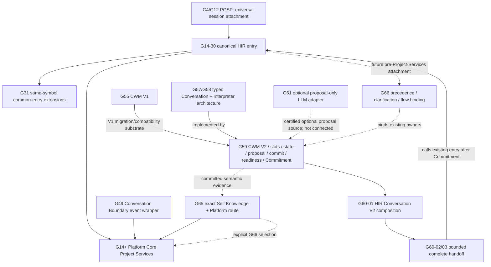

# 1. Implementation Summary

Generation: G66-06

Report identity:
G66_06_PRE_PROJECT_SERVICES_CONVERSATION_COMPOSITION_DISCOVERY_REPORT_V1

Constitutional baseline: `CONSTITUTIONAL_GOVERNANCE_CLOSED`,
`CONSTITUTIONAL_NERVOUS_SYSTEM_STATIC_MAP_ESTABLISHED`,
`CONSTITUTIONAL_FLOW_ARCHITECTURE_SPECIFICATION_ESTABLISHED`,
`HUMAN_INTENT_ARCHITECTURE_CHARACTERIZED`,
`PRODUCTION_CONVERSATION_FLOW_CONVERGENCE_CHARACTERIZED`,
`HUMAN_INTENT_PRECEDENCE_CHARACTERIZED`,
`CANONICAL_HUMAN_ENTRY_CAPABILITY_CHARACTERIZED`, and
`CANONICAL_HUMAN_ENTRY_CONVERGENCE_REQUIRES_EXTENSION`.

Authenticated repository identity:

- Commit: `4196220a38834fe34e295530bdd5973ab9b11258`
- Tree: `483e6c652502ac77c371b0038ead01a4cfc12347`
- Subject: `G66-01: characterize Human Intent architecture`
- Certified G66-02 through G66-05 artifacts are present in this authenticated
  tree and history despite the later G66-01 artifact-only commit subject.

Implementation contracts: G48 Constitutional Evidence Reporting Standard V1;
G31 Common Entry architecture; G47 Development Governance closure; G55-03
Conversation Working Memory V1; G57/G58 Conversation and Interpreter
architecture; G59 Conversation Layer V2; G60 Human Interface/Conversation
integration; G61 Central LLM assistance; G65 Self Knowledge; G65-10
Constitutional Nervous System; and G66-00 through G66-05.

Reporting date: 2026-08-03.

Objective:

Perform a repository-wide and history-wide, read-only discovery audit to
identify which already certified capability was intended to compose Human
Intent and Conversation immediately after
`run_human_interface_runtime_entry(...)` and before
`prepare_unified_human_interface_project_context(...)`, without inventing a
new runtime, architecture, adapter, or authority owner.

Audit scope:

- Traced the canonical Human Entry, G31 Common Entry continuations, the G49
  Platform Core Conversation Boundary, G55/G59 Conversation memory, G58/G59
  Interpreter and proposal ownership, G60 HIR composition, G61 optional model
  assistance, G65 exact Self Knowledge classification, Platform Query Router,
  Project Services, clarification, Presentation, and alternate conversational
  compatibility paths.
- Located each candidate's introducing generation, current source, callers,
  callees, production reachability, owner, and later evolution.
- Reconstructed the intended sequence from Human input through Conversation
  identity, semantic commit, flow selection, and Project Services.
- Distinguished a certified owner capability from a composition call site and
  from a constitutional cross-owner binding artifact.
- Applied only the required reuse dispositions:
  `ACTIVE_CANONICAL`, `ACTIVE_EXTENSION_POINT`, `LEGACY_COMPATIBILITY`,
  `SUPERSEDED`, `UNUSED_CERTIFIED`, and `OBSOLETE`.
- Made no runtime, schema, routing, test, adapter, prior-report, Replay, or
  deployment change.

Modified modules:

- `docs/governance/G66_06_PRE_PROJECT_SERVICES_CONVERSATION_COMPOSITION_DISCOVERY_REPORT_V1.md`
  — this G48 discovery report.

Intentionally unchanged modules:

- Canonical Human Interface Runtime Entry, AiCLI/AiGOL CLI, PGSP, G31,
  Platform Core Conversation Boundary, Project Services, Conversation V1/V2,
  CWM, Semantic Slots, Interpreter, proposal validation, Proposal Commit,
  Objective readiness and Commitment, G61 assistance, Self Knowledge, Query
  Router, clarification, Governance, Authorization, Worker, execution, Replay,
  Presentation, tests, manifests, hooks, and policies.
- All G66-00 through G66-05 reports and the G65-10 machine map.

Primary finding:

No single hidden or superseded runtime was intended to own the entire
pre-Project-Services composition. The intended architecture is deliberately
distributed across certified owners:

```text
Canonical Human Interface Runtime Entry
  -> Human Intent precedence decision
  -> G59 Conversation identity and CWM V2
  -> deterministic or optional G61 proposal source
  -> G59 proposal validation
  -> originating-owner Clarification or G59 Proposal Commit
  -> Platform Core flow selection
  -> Project Services and the selected existing owner chain
```

The closest existing composition implementation is G60-01. Its
`human_interface_conversation_runtime_v2` already creates a Conversation V2
session and sequences CWM, explicit deterministic semantic proposals, G59-04
validation, G59-05 commit, the state machine, readiness, and exact Human
Objective Commitment. G60-02 then proves a bounded handoff from that Commitment
through the existing canonical Human Entry into Project Services and the
certified execution chain.

G60 is a reusable integration proof, not a complete universal
pre-Project-Services composer. It accepts an explicit field grammar, does not
call G61, does not classify general Human Intent or G66 flows, stops at
Commitment in G60-01, and calls the canonical entry only after Conversation in
G60-02. The required production order instead begins inside the already
canonical entry and must support read-only, clarification, development, and
execution request classes without making every request Objective-ready.

The remaining gap is therefore not one missing semantic capability. It is the
unimplemented constitutional composition binding identified by G66-02 through
G66-05: an intent-precedence record, a common owner-bound clarification
transport, and an explicit Production Conversation Flow Binding connected at
one versioned pre-Project-Services attachment in the existing entry service.

Required decision:

```text
C) The composition was intentionally distributed across multiple certified
   owners and requires a constitutional composition binding.
```

Decision `A` is rejected because no current call graph performs the complete
sequence at the required production boundary. Decision `B` is rejected because
the gap is not one disconnected component: G59, G60, G61, G65, Platform flow
selection, clarification transport, and the canonical entry are independently
bounded and require an explicit owner-preserving composition contract. Decision
`D` is rejected because semantic memory, interpretation, proposal validation,
commit, clarification, classification, routing, Project Services, Replay, and
Presentation capabilities already exist; no new constitutional capability
owner is needed.

Architectural boundaries preserved:

- Human Authority owns intent, correction, Commitment, approval, and stop.
- Canonical HIR owns interface-neutral entry and orchestration only.
- Conversation owns semantic state, proposal assessment, commit, readiness,
  and exact Objective Commitment transitions.
- Proposal generators, including G61, own no semantic acceptance or flow
  authority.
- The owner that detects an unresolved condition owns clarification
  sufficiency.
- G65 owns only its exact Self Knowledge request decision.
- Platform Core owns operational flow selection, Objective sufficiency,
  admission, and Project Services composition.
- Governance, Authorization, provider, Worker, execution, Replay, and
  Presentation remain independent owners.

# 2. Code Evidence

## Public API

The sole canonical Human Entry host remains:

```python
def run_human_interface_runtime_entry(
    *,
    interface_name: str,
    session_id: str,
    human_requests: list[str],
    created_at: str,
    runtime_root: str | Path,
    workspace: str | Path,
    governed_runtime_runner: GovernedRuntimeRunner,
    ...
) -> dict[str, Any]:
    """Enter the certified runtime from any Unified Human Interface."""
```

Source: `aigol/runtime/human_interface_runtime_entry_service.py`, function
`run_human_interface_runtime_entry`.

The closest current semantic composition API is:

```python
def run_hir_conversation_terminal_v2(
    *,
    runtime_root: str | Path,
    workspace_identity: str | Path,
    session_identity: str,
    human_identity: str,
    created_at: str,
    ttl_seconds: int = 3600,
    input_reader: Callable[[str], str] = input,
    output_writer: Callable[[str], None] = print,
) -> dict[str, Any]:
    """Run the explicit multi-turn AiCLI/HIR Conversation V2 protocol."""
```

Source: `aigol/runtime/human_interface_conversation_runtime_v2.py`.

That public terminal is certified and reusable through its owner APIs, but it
is neither interface-neutral in participant declaration nor a natural-turn
production composition function. Its contract requires ordered `action:`,
`subject:`, `outcome:`, and `work-type:` commands followed by exact `/confirm`
and `/commit` acts.

## Orchestration Entry Point

The current canonical entry calls Project Services immediately for ordinary
requests:

```python
project_contexts = [
    prepare_unified_human_interface_project_context(
        interface_name=interface,
        session_id=session,
        message=request,
        runtime_root=root,
        workspace=workspace_text,
        created_at=created,
        explicit_canonical_artifacts=explicit_canonical_artifacts,
        explicit_canonical_artifact_references=(
            explicit_canonical_artifact_references
        ),
    )
    for request in requests
]
```

Source: `aigol/runtime/human_interface_runtime_entry_service.py`.

G60-01 supplies the opposite bounded direction:

```text
AiCLI/HIR Conversation V2 terminal
-> create CWM V2 session
-> admit explicit semantic turns
-> validate and commit proposals
-> readiness and exact Human Commitment
-> stop before Platform Core
```

G60-02 then composes:

```text
G59 Objective Commitment
-> render one bounded Platform request
-> run_human_interface_runtime_entry(...)
-> prepare_unified_human_interface_project_context(...)
-> existing governed execution owners
```

This proves owner compatibility but not the required
`canonical entry -> Conversation -> flow selection -> Project Services` order.

## Semantic Reductions

The certified reductions remain separate:

```text
G59-01/G59-02:
interface/session/Human participant + source turn
-> Conversation identity + revisioned CWM + typed Semantic Slots

G59-04:
source-bound interpreter proposal + current CWM revision
-> admissible candidate operations or deterministic rejection

G59-05:
admissible candidate operations + exact expected revision
-> atomic semantic commit + new CWM revision

G59-03/G59-06/G59-07:
committed semantic state
-> clarification/candidate review/readiness
-> exact Human-confirmed immutable Objective Commitment

G61-03:
bounded provider response
-> G59 proposal + G59 validation result only

G65-07 and Platform Query Router:
exact request class + validated query/evidence
-> bounded read-only or operational route candidate
```

No proposal source may mutate CWM, resolve clarification, select a Platform
flow, create an Objective, or authorize execution. No flow selector may
consume unvalidated proposal text or provider confidence.

## Public Validators

The complete required validator set already exists:

- canonical entry interface/session/request validation;
- G59 Conversation envelope, participant, CWM, Semantic Slot, revision, and
  atomic persistence validation;
- G59 Interpreter Proposal source-span, identity, forbidden-authority-field,
  dependency, comparison, and disposition validation;
- G59 Proposal Commit candidate-set and expected-revision validation;
- G59 state-machine, readiness, confirmation, and Objective Commitment
  validation;
- G61 provider selection/binding/envelope and G59 proposal assessment;
- G65 exact request-classification validation;
- Platform Query Router candidate/evidence/selection validation;
- Project Services Objective, admission, clarification, and operational-turn
  validation;
- owner-local Replay reconstruction/tamper validation; and
- canonical Platform Presentation validation.

The audit found no need for a duplicate semantic, classification, routing,
Project Services, Replay, or Presentation validator. The additive G66 binding
schemas require their own closed validators because they bind decisions across
owners without acquiring those decisions.

## Canonical Data Models

| Artifact/model | Current owner | Composition role |
|---|---|---|
| Human request/source turn | Human Authority; HIR transports | exact immutable input |
| canonical entry session/workspace binding | PGSP/HIR entry lineage | interface-neutral invocation identity |
| Conversation Envelope and CWM V2 | Conversation Layer | Conversation identity, participants, revision and semantic state |
| Semantic Slot V2 | Conversation Layer | typed action, subject, outcome, work type, qualifiers and references |
| Interpreter Proposal V2 | proposal source; Conversation validates | non-authoritative candidate semantic operations |
| Proposal validation/candidate operation set | G59-04 | sole admissibility boundary before semantic mutation |
| Proposal Commit | G59-05 | sole atomic proposal-to-CWM transition |
| Conversation protocol/readiness | G59-03/G59-06 | clarification and actionable semantic sufficiency |
| Objective Commitment | Conversation plus exact Human act | immutable actionable intent; not Platform admission or Authorization |
| Self Knowledge request classification | G65-07 | exact bounded read-only precedence |
| Platform query/flow selection | Platform Core | operational owner and selected branch |
| Project Services context | Platform Core | workspace, Objective, admission, clarification and branch composition |
| canonical Presentation | Presentation owner | validated human-facing structure |

Three cross-owner contracts remain specification-only at the current source
baseline:

```text
HUMAN_INTENT_PRECEDENCE_DECISION_V1
OWNER_BOUND_CLARIFICATION_ENVELOPE_V1
PRODUCTION_CONVERSATION_FLOW_BINDING_V1
```

They are binding artifacts, not new semantic or routing owners.

## Deterministic Algorithms

The repository evidence supports this owner-preserving composition algorithm:

1. Canonical HIR validates interface, session, workspace, participant-binding
   class, source turn, explicit artifacts, and stop/cancel forms.
2. The G66-03 precedence decision classifies the current turn relationship as
   `NEW_HUMAN_INTENT`, `CLARIFICATION_REPLY`,
   `AMBIGUOUS_STATE_RELATIONSHIP`, or `HUMAN_STOP` before restored
   clarification state can replace current intent.
3. A clarification reply returns only to its originating owner. A new intent
   creates or loads the bound G59 Conversation/CWM episode and records the
   exact source-turn identity and expected revisions.
4. Exact deterministic controls run first: explicit Conversation commands,
   exact G65 Self Knowledge forms, and eligible deterministic proposal rules.
5. If deterministic evidence is insufficient and policy permits, G61 may
   return one proposal-only result through existing provider owners.
6. G59-04 validates every proposal against source spans, interpreter registry,
   current CWM identity, and revisions. Invalid, stale, conflicting, or
   authority-shaped output cannot affect state.
7. The originating semantic owner emits clarification when evidence is
   ambiguous or route-insufficient; otherwise G59-05 atomically commits only
   admissible operations.
8. Platform Core derives candidates only from exact classification, committed
   semantic references, explicit artifacts, and current workspace evidence,
   then emits one requested G66 flow and one permitted immediate successor.
9. Project Services independently validates the flow binding and referenced
   owner artifacts. Read-only branches proceed without Objective Commitment;
   actionable branches traverse G59 readiness/Commitment and every required
   Platform/Governance predecessor before later effects.
10. The selected owner returns a validated source artifact through canonical
    Presentation and the interface-neutral entry result.

This algorithm composes existing owners. It does not create a central intent,
semantic, routing, or authority kernel.

## Responsibility Boundaries

| Responsibility | Certified owner | Composer responsibility | Forbidden substitution |
|---|---|---|---|
| intent, correction, Commitment, approval, stop | Human Authority | preserve and bind exact act | model/entry/Platform inference |
| universal interface/session entry | PGSP and Canonical HIR entry | validate transport and sequence owner calls | business or semantic decision |
| Conversation identity/CWM/slots | G59 Conversation Layer | call exact API and carry references | entry/Platform mutation of semantic memory |
| deterministic/model proposal | registered parser or G61/provider chain | choose only under declared policy | proposal as committed meaning |
| proposal validation/commit | G59-04/G59-05 | require exact dispositions and hashes | provider confidence or caller assertion |
| clarification sufficiency | owner detecting the gap | transport question/reply/envelope | central clarification decision owner |
| exact Self Knowledge class | G65-07 | preserve early exact decision | general intent authority |
| operational flow selection | Platform Core | provide validated evidence and return binding | Conversation/entry selecting Platform owner |
| Objective/admission/Project Services | Platform Core | invoke only with valid predecessors | raw proposal or flow target as admission |
| Governance/Authorization/effects | corresponding certified owners | sequence only when selected branch permits | entry, Commitment, or selection as authority |
| Replay | owner-local custodians under Replay law | correlate immutable references | routing, retry, approval, or recovery decision |
| Presentation | Canonical Platform Presentation | validate and return structure | invention or alteration of source facts |

## 1. Complete Candidate Inventory

| Candidate | Introduced | Owner/intended responsibility | Current status, callers and callees | Production reachability | Reuse classification |
|---|---|---|---|---|---|
| PGSP universal session boundary | G4-08; clarified G12-05 | interface-neutral governed attachment between adapters and Platform Core | historical PGSP runtime/CLI remains callable; later HIR law preserves the protocol role | historical/alternate facade; constitutional lineage active | `ACTIVE_CANONICAL` |
| Canonical Human Interface Runtime Entry Service | G14-30; extended G31 | one shared interface-neutral application entry; sequencing without downstream decision ownership | called by AiCLI actionable continuations, AiGOL CLI, G31, and G60-02; directly calls Project Services for ordinary requests | current production, but not first default ingress for every new turn | `ACTIVE_CANONICAL` |
| G31 Common Entry transitions | G31; common-entry repair through G31-24G-R04-R04-R04-R01 | extend the same HIR entry across governed application states and exact Human actions | implemented inside `run_human_interface_runtime_entry`; calls exact G31 owners | active for G31 continuations; downstream of pre-Project semantics | `ACTIVE_EXTENSION_POINT` |
| Platform Core Project Services | G14-08A and later G14/G19-G65 extensions | workspace continuity, classification composition, Objective/admission, clarification and selected Platform services | called directly by default AiCLI, canonical entry, G49 boundary and direct APIs; calls G65 classifier, Query Router, Objective and Presentation owners | default-active and canonical downstream boundary | `ACTIVE_CANONICAL` |
| alternate conversational CLI workflow router | early Conversation/G2 lineage | broad compatibility workflow classification, semantic translation and provider-assisted fallback | called by `aigol conversation`; invokes many legacy workflow families | active alternate CLI, not default or G59 semantic owner | `LEGACY_COMPATIBILITY` |
| Platform Core Conversation Boundary V1 | G49-02 | event/checkpoint/projection wrapper over Project Services and canonical HIR approval continuation | current source has test callers only; Human request/reply events call Project Services directly | direct/test-only; no CLI/runtime caller found | `UNUSED_CERTIFIED` |
| Conversation Working Memory V1 | G55-03 | isolated bounded Conversation state and persistence | retained as validation/migration substrate used by CWM V2; V2 owns current typed model | no current Human entry composition | `SUPERSEDED` |
| typed Conversation/Interpreter architecture | G57-01 through G58-02 | define typed semantics, Envelope, state, Commitment, proposal-only interpreters and clarification | implemented by G59/G61; remains normative owner law | active through implementing runtimes | `ACTIVE_CANONICAL` |
| Conversation Working Memory V2 | G59-01 | canonical Conversation identity, participant binding, revisioned semantic memory and atomic state | called by G59 semantic/state/proposal owners, G60 HIR and G61 adapter | alternate/direct production and tests; absent from canonical entry | `ACTIVE_CANONICAL` |
| Semantic Slot Runtime V2 | G59-02 | closed typed semantic slot construction, validation and revision semantics | called by G59 state/proposal and G60 deterministic HIR | alternate/direct production and tests | `ACTIVE_CANONICAL` |
| Conversation State Machine V2 | G59-03 | deterministic clarification, correction, review and protocol transitions | called by G60 HIR; validates CWM transitions | alternate/direct production and tests | `ACTIVE_CANONICAL` |
| Interpreter Proposal and validation V2 | G59-04 | common source-bound proposal schema, assessment, comparison and deterministic admissibility | called by G60 deterministic HIR, G61 adapter and tests | alternate/direct; absent from canonical entry | `ACTIVE_CANONICAL` |
| Proposal Commit Runtime V2 | G59-05 | sole atomic admissible-operation-to-CWM mutation | called by G60 HIR and direct tests; G61 intentionally does not call it | alternate/direct; absent from canonical entry | `ACTIVE_CANONICAL` |
| Objective Readiness and Commitment | G59-06/G59-07 | actionable semantic completeness and immutable exact Human-confirmed Objective | called by G60 HIR and validated by G60-02 handoff | alternate/complete execution path; not read-only routing | `ACTIVE_CANONICAL` |
| HIR Conversation Layer V2 integration | G60-01 | transport orchestration across G59 CWM, explicit deterministic proposal, validation, commit, state, readiness and Commitment | `aicli conversation-v2` and G60-02 call it; imports all G59 owners, no Project Services/G61 | active alternate production mode | `ACTIVE_EXTENSION_POINT` |
| complete Conversation-to-execution integration | G60-02/G60-03 | bind committed Objective through canonical entry, Platform Core and certified later owners | `aicli conversation-execute-v2`; calls G60-01 then canonical entry | active bounded alternate production mode | `ACTIVE_EXTENSION_POINT` |
| Central LLM Interpreter assistance | G61-03 | optional authenticated provider proposal adapted to G59-04 validation, with no commit or flow authority | only source definition and G61 tests call its public runner; no CLI/runtime caller found | not production-reachable | `UNUSED_CERTIFIED` |
| Self Knowledge Request Classification | G65-07 | exact eight-subject/command read-only decision and bounded ambiguity result | called by Project Services and direct tests; precedes current Objective inference | default-active through Project Services | `ACTIVE_CANONICAL` |
| Platform Query Router | pre-G65 Platform Core, extended through G65 | deterministic service/flow candidate selection from bounded evidence | called by Project Services and direct APIs; calls branch owners/adapters | default-active downstream | `ACTIVE_CANONICAL` |
| owner-specific operational clarification | G29/G30 and current Project Services extensions | retain Platform semantic-route owner/session/slot/revision continuity | Project Services creates, restores and validates it; default AiCLI renders it | default-active but Platform-owner-specific | `ACTIVE_EXTENSION_POINT` |
| Canonical Platform Presentation | earlier Platform Core, extended G65 | validate and structure selected source responses and limitations | called by Project Services/read-only integrations; adapters render | default-active on bounded branches | `ACTIVE_CANONICAL` |
| G66 precedence, common clarification and flow-binding contracts | G66-02/G66-03 | bind current-turn relationship, originating clarification owner, committed semantics and selected G66 flow without decision transfer | specified in certified reports; no runtime artifact or caller exists | not production-reachable | `ACTIVE_EXTENSION_POINT` |
| G47 Development Governance barrier | G47 | govern admitted development work before planning/effects | reached only after Platform Objective and predecessor evidence | active downstream; never a Conversation composer | `ACTIVE_CANONICAL` |

No inspected candidate warrants `OBSOLETE`. Historical readers and alternate
surfaces remain bounded compatibility evidence unless a certified deprecation
or removal generation says otherwise.

## 2. Historical Evolution



Evolution findings:

- PGSP and G14-30 establish the entry boundary, not semantic ownership.
- G31 extends that same entry for later governed transitions. It supplies a
  useful versioned action/composition pattern but no natural-turn semantics.
- G49 provides a certified event/projection wrapper but delegates Human
  requests directly to Project Services and has no current non-test caller.
- G55-03 supplies the V1 memory substrate. G59-01 makes V2 the current typed
  Conversation state while retaining deterministic V1 migration and readers.
- G57/G58 define the distributed semantic and proposal architecture; G59
  implements its core deterministic owners.
- G60-01 is the first concrete HIR-to-G59 composition. G60-02/03 prove that an
  immutable Commitment can safely enter the existing HIR/Platform pipeline.
- G61 adds one optional proposal source but deliberately stops at G59-04.
- G65 adds the exact default Self Knowledge decision inside current Project
  Services composition, not inside G59 or the canonical entry.
- G66-02 through G66-05 identify the required future binding and its exact
  attachment point. They preserve all prior owners and do not designate G60,
  G61, Query Router, or Project Services as a replacement entry runtime.

## 3. Constitutional Ownership Map

```text
Human Authority
  owns intent / correction / Commitment / approval / stop
      |
Canonical HIR Entry
  owns interface-neutral session attachment and thin sequencing
      |
Conversation Layer (G59)
  owns CWM / typed meaning / proposal validation / semantic commit / readiness
      |                         ^
      |                         |
      +-- deterministic parser +-- G61 provider path supplies proposal only
      |
Originating clarification owner
  owns whether missing/ambiguous evidence is resolved
      |
Platform Core
  owns G66 operational flow selection / Objective / admission / Project Services
      |
Selected Self Knowledge / Platform Knowledge / Governance / execution owner
      |
Canonical Presentation
  owns structure; source owner retains facts
```

The word “composition” does not create a constitutional owner. The HIR entry
may control call order and bind immutable references, but every substantive
decision remains attributable to the owner shown above. G60's orchestration
module follows that rule and is reusable precisely because it declares itself
non-authoritative.

## 4. Conversation Composition Sequence

The complete intended pre-Project-Services sequence is:

```text
Human Input
-> Canonical HIR validates interface/session/source turn
-> Human Intent Precedence decides new intent/reply/ambiguous relation/stop
-> Conversation identity and current CWM V2 revision
-> deterministic exact classifier/parser first
-> optional G61 proposal source only when policy permits
-> G59-04 Conversation Proposal validation
-> owner-bound Clarification and Human reply, when required
-> G59-05 Semantic Commit to a new CWM revision
-> Platform Core selects requested G66 flow and immediate successor
-> Production Conversation Flow Binding
-> prepare_unified_human_interface_project_context(...)
-> selected existing branch owner
-> Canonical Presentation
```

The sequence has two route-specific qualifications:

1. Exact Self Knowledge and bounded Platform Knowledge requests need only the
   committed/classified evidence required by their read-only owner. They do not
   create Objective Commitment.
2. Development or execution requests may be classified before actionable
   admission, but their permitted immediate successor is readiness/Objective
   Commitment and then Platform Objective/admission. A requested execution
   target never jumps directly to Authorization, Worker, or execution.

The G66 flow binding therefore records both a requested target and the one
permitted next owner. It does not pretend that target selection has already
completed the branch's constitutional predecessors.

## 5. Runtime Call Graph

### Current default new turn

```text
Human
-> ./aicli
-> Reference UHI _submit_composed_request
-> prepare_unified_human_interface_project_context
-> restored clarification precedence OR G65 exact classification
-> Platform Query Router / Objective / admission
-> selected branch Presentation or approval continuation
-> canonical HIR entry only for later actionable/G31 transitions
```

### Current canonical entry ordinary request

```text
run_human_interface_runtime_entry
-> prepare_unified_human_interface_project_context
-> current Project Services owner chain
-> governed_runtime_runner only after runtime-binding admission
```

### Current Conversation V2 mode

```text
./aicli conversation-v2
-> run_hir_conversation_terminal_v2
-> CWM V2
-> explicit deterministic proposal
-> G59-04 validation
-> G59-05 commit
-> state/readiness
-> exact Human Objective Commitment
-> stop; Platform Core not reached
```

### Current complete alternate mode

```text
./aicli conversation-execute-v2
-> G60-01/G59 Commitment sequence
-> G60-02 committed-Objective handoff
-> run_human_interface_runtime_entry
-> prepare_unified_human_interface_project_context
-> Platform admission and later certified execution owners
```

### Unconnected certified assistance

```text
run_conversation_interpreter_epp_assistance_v1
-> provider selection/invocation
-> provider envelope validation
-> adapt to G59 proposal
-> G59-04 assessment
-> return candidate only

current callers: G61 tests only
```

No current call graph matches:

```text
run_human_interface_runtime_entry
-> G66 Human Intent precedence
-> G59/G60 semantic composition
-> optional G61
-> explicit G66 Platform flow binding
-> prepare_unified_human_interface_project_context
```

The G49 Platform Core Conversation Boundary is not that missing call graph. Its
Human-request and clarification-reply handler calls Project Services directly,
and no CLI/runtime caller of its public runner was found.

## 6. Reuse Proof

| Required stage | Exact existing capability | Reuse evidence | Why no replacement is required |
|---|---|---|---|
| universal entry | PGSP/G14-30/G31 `run_human_interface_runtime_entry` | interface-neutral signature and current multi-family callers | already certified as the one common entry |
| Conversation identity and memory | G59-01 CWM V2 | current create/load/recover/atomic store APIs and G60 use | typed revision/session/workspace model already canonical |
| semantic vocabulary | G59-02 Semantic Slots | G60 deterministic operations and G59 validators | closed current taxonomy supports first convergence scope |
| proposal contract | G59-04 | deterministic HIR and G61 both terminate at the same validator | one source-bound proposal boundary already exists |
| semantic mutation | G59-05 | G60 calls exact atomic commit API | prevents composer or provider from mutating CWM |
| clarification/readiness | G59-03/G59-06 plus Project owner continuations | certified state and owner-specific fail-closed behavior | only transport/binding must be standardized |
| Human Commitment | G59-07 | exact digest-bearing act and G60-02 validation | preserves Human Authority on actionable requests |
| optional natural-language assistance | G61-03 | authenticated provider path returns a G59-assessed proposal only | no new central LLM or provider owner needed |
| exact read-only intent | G65-07 | default-active exact Self Knowledge behavior | must retain deterministic precedence before optional LLM |
| flow selection | Platform Query Router/Platform Core | active closed candidates and response validators | operational decision already has an owner |
| Project composition | `prepare_unified_human_interface_project_context` | default/canonical-entry/direct callers and broad certified lineage | remains the downstream Platform boundary |
| Replay | existing owner-local stores and reconstructors | G59 revisions, G60 handoff evidence, Project workspace state | future binding can correlate references without rewriting history |
| Presentation | Canonical Platform Presentation and existing adapters | default Self/Platform responses already validate | one uniform return can compose existing adapters |

G60-01 should be reused as the sequencing proof and source of existing owner
calls, not installed wholesale as a new default terminal inside the entry. A
later implementation may extract or expose a non-interactive, one-turn
composition function from the same module/symbol family while preserving its
validators and public compatibility mode.

## 7. Canonical Composition Verdict

The required A/B/C/D verdict is:

```text
C
```

Expanded verdict:

```text
The pre-Project-Services Conversation composition was intentionally
distributed across multiple certified owners and requires a constitutional
composition binding.
```

The canonical host is the existing Human Interface Runtime Entry Service. The
canonical semantic substrate is G59 Conversation Layer V2. G60 is the
certified composition template and bounded reachability proof. G61 is an
optional, currently unused proposal source. G65 and Platform Core retain exact
classification and operational flow-selection ownership. Project Services
remains the downstream Platform boundary.

None of those statements grants a new owner or merges their authority. The
future binding records how their independently validated artifacts relate; it
does not recompute their decisions.

## 8. Minimal Constitutional Convergence Recommendation

The smallest later authorized convergence is:

1. Implement the already specified `HUMAN_INTENT_PRECEDENCE_DECISION_V1`,
   `OWNER_BOUND_CLARIFICATION_ENVELOPE_V1`, and
   `PRODUCTION_CONVERSATION_FLOW_BINDING_V1` schemas and closed validators.
2. Add one versioned pre-Project-Services composition branch to the existing
   `run_human_interface_runtime_entry` symbol family. Preserve every existing
   argument, G31 branch, completion return, and post-admission runner path.
3. Reuse the G60-01 call order through non-interactive owner APIs: create/load
   CWM, bind the source turn, produce and validate a proposal, clarify or
   commit, and reconstruct the exact revision.
4. Run exact commands and G65 Self Knowledge classification before optional
   G61 assistance. Provider failure, malformed output, confidence changes, or
   authority-shaped fields must yield clarification/failure without mutation
   or route selection.
5. Ask Platform Core to create the G66 target/immediate-successor binding from
   committed references. Do not add flow scoring to HIR or Conversation.
6. Pass only validated references and exact classifications into the existing
   Project Services API. Retain Project Services ownership of workspace,
   Objective, admission, and its current branches.
7. Return every selected response through the existing canonical Presentation
   owner and then the common HIR result boundary.
8. Route default AiCLI first turns through the same entry only after positive,
   negative, Replay, compatibility, and production-reachability gates pass.

The G49 boundary may remain a direct certified event API and the alternate
conversational CLI may remain a compatibility surface. Neither should be
promoted to the new canonical composition owner.

## 9. Estimated Implementation Impact

| Work package | Expected change | Complexity | Constitutional risk |
|---|---|---|---|
| three G66 binding schemas/validators | additive closed artifacts and tamper/owner checks | `MODERATE` | `HIGH` if owner or predecessor fields are loose |
| canonical entry pre-routing branch | bounded ordering extension to existing service | `MODERATE` | `HIGH` because all current entry branches must remain valid |
| reusable G60 one-turn composition surface | refactor/expose existing owner calls without changing G59 semantics | `MODERATE` | `MODERATE` |
| optional G61 connection | policy-gated proposal call before G59 validation/commit | `LOW_TO_MODERATE` | `HIGH` negative-path burden |
| Platform flow-binding adapter | bind committed evidence to exact G66 target/successor | `MODERATE` | `HIGH` bypass and authority-substitution burden |
| Project Services reference ingress | accept/validate binding references while preserving current owner | `LOW_TO_MODERATE` | `MODERATE` |
| common clarification transport | correlate owner/session/revision and ordered replies | `MODERATE` | `HIGH` stale/cross-owner reply burden |
| canonical Presentation return | normalize branch structure using existing adapters | `LOW_TO_MODERATE` | `MODERATE` |
| default AiCLI cutover and compatibility | replace direct first-turn ingress only after certification | `MODERATE` | `VERY_HIGH` regression and historical-Replay burden |

Overall estimate:

```text
new constitutional capability owners: NONE
new Human Entry architecture/runtime: NONE
runtime composition delta: MODERATE
certification and compatibility effort: HIGH
```

The largest cost is proof: exact current Self Knowledge behavior, read-only
non-Objective routes, actionable Commitment gating, provider failure,
clarification precedence, alternate/direct API containment, G31 preservation,
Replay reconstruction, and no Governance/Authorization/Worker bypass.

# 3. Constitutional Self-Assessment

## Verified

- The existing canonical HIR entry calls Project Services before its injected
  post-admission governed runner and contains no G59/G61 pre-routing call.
- G59 implements the canonical typed Conversation state, Semantic Slots,
  state machine, proposal validation, Proposal Commit, readiness, and
  Objective Commitment owners.
- G60-01 already composes all G59 owners through an explicit deterministic HIR
  protocol and stops before Platform Core at Commitment.
- G60-02/03 prove one bounded Commitment-to-canonical-entry-to-Platform Core
  and execution composition without transferring owner authority.
- G61-03 produces and validates a proposal only; no current CLI/runtime caller
  invokes its public runner.
- G65-07 is default-active inside Project Services and remains an exact,
  bounded Self Knowledge classifier rather than a general intent owner.
- Platform Query Router and Project Services are active Platform Core owners
  downstream of the missing composition boundary.
- The G49 Platform Core Conversation Boundary calls Project Services directly
  for Human request/reply events and has test-only current callers.
- Conversation Working Memory V1 remains a compatibility/migration substrate;
  V2 is the canonical typed state.
- The alternate conversational CLI contains useful compatibility behavior but
  does not implement the G59/G66 canonical composition contract.
- G66-02 through G66-05 consistently require an additive binding under the
  existing entry service, not a new entry runtime or owner.
- Decision `C` follows from current call graphs and certified responsibility
  declarations.
- No runtime, schema, test, route, adapter, prior report, Replay, or external
  system was modified.

## Not Verified

- No current default production call traverses canonical entry, G59 semantic
  composition, optional G61, G66 flow binding, and Project Services in that
  order.
- The G66 Human Intent precedence, common clarification, and flow-binding
  artifacts remain unimplemented.
- G60's explicit field grammar is not broad natural-language interpretation
  and is not claimed as such.
- G61 remains unused by production and no live provider was invoked.
- No common cross-owner clarification transport or uniform entry-level
  Presentation envelope is implemented.
- Web, GUI, Speech, REST, Agent, and future-interface reachability through the
  complete proposed composition is not dynamically demonstrated.
- No broad natural-language, multilingual, provider-failure, stale-session,
  cross-owner, performance, deployment, or repository-wide convergence suite
  was run.
- Human participant identity remains asserted rather than universally
  authenticated.
- Dynamic Trace remains specified but unimplemented.

# 4. Validation Matrix

| Requirement | Evidence | Validation | Result |
|---|---|---|---|
| G48 report structure | six top-level sections and standard Code Evidence subsections | deterministic heading review | `PASS` |
| complete candidate inventory | entry, Conversation V1/V2, Interpreter, proposal, clarification, HIR, Presentation, Router and Project Services candidates | repository/history inventory | `PASS` |
| introducing generation and owner | Git introduction commits and certified G31/G47/G55/G57-G61/G65 reports | history/report comparison | `PASS` |
| callers, callees and reachability | current source call sites and CLI modes | static caller/import audit | `PASS` |
| six-value reuse vocabulary | every candidate inventory row | controlled-value review | `PASS` |
| Human-to-Project-Services reconstruction | deterministic algorithm and sequence | owner/transition review | `PASS` |
| current default call graph | AiCLI and Project Services source | static call-order review | `PASS` |
| canonical entry call graph | HIR entry source | Project Services-before-runner review | `PASS` |
| G59/G60 composition | HIR Conversation V2 and complete execution integration | import/call-order review | `PASS` |
| G61 reachability | adapter definition and repository-wide callers | source caller audit | `PASS` |
| G65 classification preservation | exact classifier and Project Services caller | source/owner review | `PASS` |
| G49 boundary disposition | public runner and repository-wide callers | source caller audit | `PASS` |
| A/B/C/D decision | current graphs, owner boundaries and G66 contracts | evidence-weighted alternative review | `PASS` |
| G31 consistency | same canonical entry symbol and continuation branches | source/history review | `PASS` |
| G47 consistency | Development Governance remains downstream of Platform admission | enforcement-order review | `PASS` |
| G59 consistency | CWM, slots, proposal, commit, readiness and Commitment remain separate owners | semantic-owner review | `PASS` |
| G61 consistency | proposal-only, no commit/flow authority | boundary/caller review | `PASS` |
| G65/G65-10 consistency | default, alternate and direct reachability preserved | static-map/current-source comparison | `PASS` |
| G66-00 through G66-05 consistency | stable flows, convergence, precedence, entry identity and readiness gap | cross-report review | `PASS` |
| runtime implementation | prohibited | intentionally not performed | `NOT_APPLICABLE` |
| governance conformance regression | existing conformance test module | 5 passed | `PASS` |
| governance conformance | existing read-only conformance owner | 20 passed, 0 failed, 0 warnings, 0 critical violations, `CONFORMANT` | `PASS` |
| document consistency | six top-level sections, nine required deliverables, 23 candidate rows, one allowed disposition per row, decision C and exact verdict | deterministic assertions | `PASS` |
| document whitespace integrity | G66-06 report and preserved baseline | `git diff --check` and new-file whitespace check | `PASS` |

# 5. Repository Mutation Summary

Modified files:

- `docs/governance/G66_06_PRE_PROJECT_SERVICES_CONVERSATION_COMPOSITION_DISCOVERY_REPORT_V1.md`
  — requested read-only G48 discovery evidence.

Unchanged subsystems:

- All PGSP, Human Interface, CLI, G31, Conversation, CWM, Semantic Slot,
  Interpreter, proposal, clarification, Central LLM, Platform Core, Query
  Router, Self Knowledge, Objective, Governance, Authorization, provider,
  Worker, execution, result, Replay, Presentation, test, schema, manifest,
  hook, policy, and deployment surfaces.

API compatibility:

- No API, schema, entry route, classifier, semantic operation, flow,
  Objective, Presentation, Replay, Governance, provider, Worker, or execution
  behavior changed.

Boundary preservation:

- The report identifies a distributed certified composition and its missing
  binding. It does not create or select a new runtime owner, merge existing
  owners, implement a route, invoke a live provider/Worker, mutate Replay,
  authorize, execute, deploy, or change external state.
- The recommendation extends the already canonical entry lineage and reuses
  G59/G60/G61/G65/Platform owners under their current authority limits.

Unrelated pre-existing changes:

- None observed at audit start.

# 6. Certification Verdict

PRE_PROJECT_SERVICES_CONVERSATION_COMPOSITION_CHARACTERIZED
