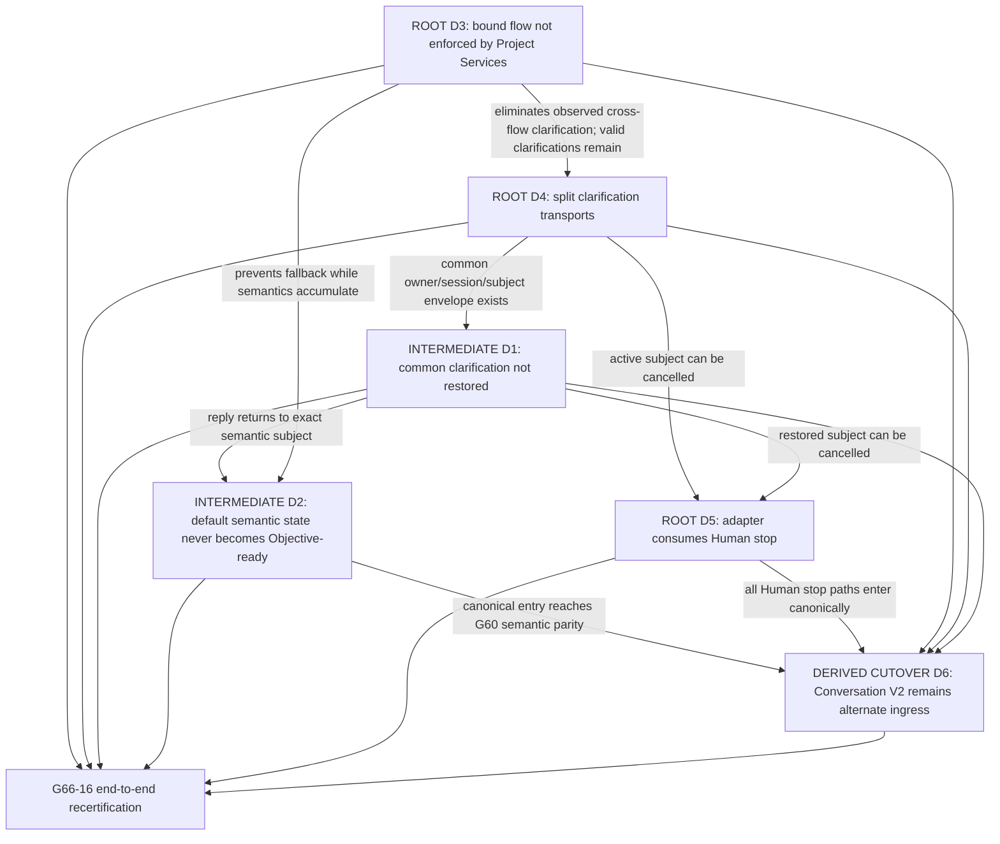

# 1. Implementation Summary

Generation: G66-09

Report identity:
G66_09_PRODUCTION_HUMAN_INTERACTION_REPAIR_SEQUENCING_REPORT_V1

Constitutional baseline: `CONSTITUTIONAL_GOVERNANCE_CLOSED`,
`CONSTITUTIONAL_NERVOUS_SYSTEM_STATIC_MAP_ESTABLISHED`,
`CONSTITUTIONAL_FLOW_ARCHITECTURE_SPECIFICATION_ESTABLISHED`,
`HUMAN_INTENT_ARCHITECTURE_CHARACTERIZED`,
`PRODUCTION_CONVERSATION_FLOW_CONVERGENCE_CHARACTERIZED`,
`HUMAN_INTENT_PRECEDENCE_CHARACTERIZED`,
`CANONICAL_HUMAN_ENTRY_CAPABILITY_CHARACTERIZED`,
`CANONICAL_HUMAN_ENTRY_CONVERGENCE_REQUIRES_EXTENSION`,
`PRE_PROJECT_SERVICES_CONVERSATION_COMPOSITION_CHARACTERIZED`,
`PRODUCTION_CONVERSATION_FLOW_BINDING_ESTABLISHED`, and
`PRODUCTION_HUMAN_INTERACTION_STACK_REQUIRES_REPAIR`.

Authenticated repository identity:

- Commit: `c841a8aec5f70b4cacff9118e103f1343b053f6d`
- Tree: `54a8eb66fd145c73e99bae8dfbde8d4ecfceee36`
- Subject: `G66-08: validate production Human Interaction Stack`

Implementation contracts: G48 Constitutional Evidence Reporting Standard V1;
Constitutional Architecture Specification V1; Canonical Layer Model;
Governance Enforcement Hierarchy; Constitutional Flow Architecture
Specification V1; G31 Common Entry architecture; G47 Development Governance;
G59 Conversation Layer V2; G60 Human Interface/Conversation integration; G61
Central LLM proposal assistance; G65 Self Knowledge; G65-10 Constitutional
Nervous System; and G66-00 through G66-08.

Reporting date: 2026-08-03.

Objective:

Construct the constitutional dependency graph for the six validated G66-08
production defects and define the minimum safe repair order without executing
production validation, implementing a repair, introducing a runtime, changing
an owner, or redesigning the architecture.

Analysis scope:

- Treated D1 through D6 as the complete and closed production-defect set.
- Traced each defect to its constitutional owner, introducing generation,
  current runtime owner, immediate cause, architectural cause, consequences,
  upstream dependencies, and automatic-reduction potential.
- Distinguished root defects from intermediate and derived repair obligations.
- Ordered repair generations by owner preservation, dependency, defect
  reduction, Replay safety, and compatibility risk.
- Verified the sequence against G66-07, G66-08, the Constitutional Nervous
  System, Constitutional Flow Architecture, Human Intent, Conversation,
  Platform Core, and Governance architecture.
- Did not re-run G66-08 production conversations or its production validation.

Modified modules:

- `docs/governance/G66_09_PRODUCTION_HUMAN_INTERACTION_REPAIR_SEQUENCING_REPORT_V1.md`
  — this read-only G48 repair-sequencing report.

Intentionally unchanged modules:

- All AiCLI, Human Interface, Conversation, CWM, proposal, clarification,
  Objective Commitment, flow-binding, Project Services, Platform routing,
  Governance, Authorization, Worker, execution, Replay, Presentation, provider,
  test, schema, manifest, hook, policy, and deployment surfaces.
- All G66-00 through G66-08 reports and evidence.

Primary conclusion:

The six defects do not require six parallel repairs or a new architecture.
They form three repair chains:

```text
Flow isolation:
  D3 -> removes the observed cross-flow source of one D4 instance

Clarification and semantic completion:
  D4 -> D1 -> D2 -> enables safe D6 convergence

Human channel closure:
  D4/D1 -> D5
  D2/D5 -> D6
```

The minimum safe implementation sequence is:

```text
G66-10  enforce the validated flow binding at Project Services       [D3]
G66-11  converge all clarification transport on the common envelope  [D4]
G66-12  persist and restore owner-bound clarification continuity      [D1]
G66-13  compose typed multi-turn semantics through Commitment         [D2]
G66-14  route Human stop through the canonical entry                  [D5]
G66-15  converge public conversation-v2 on canonical ingress          [D6]
G66-16  re-run production end-to-end certification; no repair scope
```

D3 is first because it is the highest-leverage fail-closed isolation repair:
it prevents a validated read-only target from becoming an Objective and also
eliminates the exact cross-flow Project Services clarification observed by
G66-08. D4 must still be repaired independently because owner-specific
Platform clarifications remain a certified capability and must use the common
transport even on valid Platform flows. D1 then restores the common envelope;
D2 can safely accumulate typed Conversation evidence; D5 can bind cancellation
to the exact active subject; and D6 can be converged only after the canonical
entry has functional parity with the alternate G60 mode.

No repair in this sequence may broaden the binding composer into a semantic,
clarification, Platform, Governance, Authorization, Replay, Worker, execution,
or Presentation authority.

# 2. Code Evidence

## Public API

G66-09 adds no API. The current canonical production host remains:

```python
run_human_interface_runtime_entry(...)
```

The current default submit path calls that entry, while the public mode
dispatcher still calls these alternate APIs directly:

```python
run_hir_conversation_terminal_v2(...)
run_complete_conversation_execution_terminal_v2(...)
```

The repair roadmap preserves these public functions and treats modes as
adapters. It does not require deleting a public Conversation API. G66-15 is
limited to the certified D6 `conversation-v2` bypass and must change its
production ingress composition only after the canonical entry can provide the
same certified G59/G60 semantics. `conversation-execute-v2` is a compatibility
constraint, not an additional G66-09 defect.

## Orchestration Entry Point

The current canonical entry correctly composes G66-07 before Project Services:

```text
request
-> compose_production_conversation_flow_binding_v1
-> prepare_unified_human_interface_project_context
```

Three ordering mismatches explain the repair graph:

1. The composer recovers only
   `pending_clarification_request.operational_clarification_envelope`; the G59
   readiness gate returns `owner_bound_clarification_envelope` while setting
   `operational_clarification_envelope` to `None`.
2. Project Services validates the flow binding and every predecessor, but when
   `objective_commitment_required` is false it resumes its legacy raw-message
   classifier and Project Objective inference without constraining those
   operations by the bound requested target.
3. AiCLI consumes an unbound `/cancel` inside the adapter and dispatches
   `conversation-v2` before the default canonical-entry path.

These are sequencing defects. The existing owners, schemas, and decisions are
otherwise sufficient for repair.

## Semantic Reductions

G66-07 currently reduces each non-clarification production turn to one
`SEMANTIC_REFERENCE` slot operation. G59 correctly validates and commits that
operation, but actionable readiness requires the already-certified typed
action, subject, outcome, and work-type evidence. Therefore D2 is not a failure
of Proposal Validation or Proposal Commit. It is a composition limitation
between the default source-turn reducer and the existing G59 semantic owners.

The safe reduction after D1 is:

```text
exact source turn or owner-bound reply
-> existing deterministic G60/G59 proposal rules
-> optional G61 proposal only when deterministic evidence is insufficient
-> G59-04 validation
-> G59-05 commit
-> G59 readiness
-> exact Human confirmation and Commitment
```

No Project Objective may be inferred from raw text when the validated binding
selects Self Knowledge, Platform Knowledge, Clarification, or Failure. No
semantic proposal may itself select a Platform flow.

## Public Validators

The repair sequence reuses the existing validators:

- G66-07 precedence, common clarification, flow-binding, and predecessor
  Replay validators;
- G59 CWM, Semantic Slot, proposal, commit, readiness, confirmation, and
  Objective Commitment validators;
- G65 exact Self Knowledge classification validation;
- Platform Query Router selection validation;
- Project Services Objective, admission, clarification, and turn validation;
- owner-local Replay reconstruction and hash validation; and
- canonical Presentation validation.

Required validator extensions are bounded to transition consistency:

- G66-10 must reject a bound read-only target before any Project Objective,
  admission, Governance, provider, Authorization, Worker, or execution path.
- G66-11 must validate the common envelope around each existing owner's
  clarification artifact without replacing that owner's validator.
- G66-12 must validate session, owner, subject, revision, status, expiry, and
  attempt lineage when restoring a clarification.
- G66-15 must prove `conversation-v2` reaches the same owner validators through
  canonical ingress, while other public adapters remain compatible and do not
  duplicate those validators.

## Canonical Data Models

No new canonical data model is required. Repairs use:

| Existing model | Owner | Repair use |
|---|---|---|
| Human request/stop act | Human Authority; HIR transports | D5 exact stop binding |
| `HUMAN_INTENT_PRECEDENCE_DECISION_V1` | Conversation classification owner | D1 reply relationship and D5 stop disposition |
| CWM V2/Semantic Slots | Conversation Layer | D2 typed multi-turn state |
| Proposal/Validation/Commit V2 | proposal source/G59 | D2 sole semantic mutation path |
| Objective Readiness/Commitment | G59 plus exact Human act | D2 actionable gate |
| `OWNER_BOUND_CLARIFICATION_ENVELOPE_V1` | originating owner; HIR transports | D4 common transport and D1 continuity |
| `PRODUCTION_CONVERSATION_FLOW_BINDING_V1` | Platform selection/reference binding | D3 downstream transition constraint |
| Platform Project Objective | Platform Core | admitted only on actionable committed branch |
| owner-local Replay | each exact owner | additive references and reconstruction only |
| canonical Presentation | Presentation owner | render repaired branch status without new facts |

Historical operational clarification envelopes and Replay remain readable.
G66-11 wraps or references them; it must not rewrite or silently reinterpret
old evidence.

## Deterministic Algorithms

The dependency algorithm is:

1. Reject any proposed repair that changes an owner or adds a competing entry,
   semantic, routing, clarification, Replay, or execution authority.
2. Repair a predecessor transition before any consumer that depends on it.
3. Prefer a repair that removes more than one observed consequence.
4. Keep automatic defect reduction distinct from mere enablement of a later
   repair.
5. Preserve historical readers and alternate direct APIs until successor
   production evidence certifies cutover.
6. Require a separate end-to-end certification generation after all repair
   units; a passing unit suite is not production convergence.

Applied to D1-D6:

```text
D3 first: establishes target-to-successor isolation.
D4 next: establishes one transport for every remaining valid clarification.
D1 next: persists and restores that transport to the originating owner.
D2 next: accumulates typed semantics through readiness and Commitment.
D5 next: sends stop through precedence and cancels the exact active subject.
D6 last: redirects public Conversation modes only after canonical parity.
```

## Responsibility Boundaries

| Responsibility | Constitutional owner | Repair composer may do | Repair composer must not do |
|---|---|---|---|
| intent, reply, Commitment, stop | Human Authority | preserve exact acts and hashes | infer or replace Human authority |
| interface/session entry | PGSP/Canonical HIR | order calls and transport artifacts | own semantics or Platform selection |
| CWM/slots/proposal acceptance | G59 Conversation | invoke existing APIs | write semantic state directly |
| clarification sufficiency | originating owner | wrap, persist, restore, correlate | decide another owner's gap |
| Platform flow selection | Platform Query Router | validate and carry target/successor | rescore in HIR or Conversation |
| Objective/admission | Platform Core | enforce branch prerequisites | infer Objective on a read-only target |
| Governance | G47 and exact governance owners | preserve downstream gate | absorb into entry or Conversation |
| Authorization/Worker/execution | exact existing owners | remain unreachable until predecessors pass | infer authority from target/Commitment |
| Replay | owner-local custodians | add reference-only correlation | rewrite, retry, route, or approve |
| Presentation | Canonical Platform Presentation | render validated owner result | create source facts or authority |

## 1. Complete Defect Inventory

| ID | Validated production fact | Constitutional owner | Introducing generation | Current runtime owner | Classification |
|---|---|---|---|---|---|
| D1 | owner-bound clarification continuity is lost on the next default turn | originating clarification owner; HIR transports; Conversation classifies reply relationship | common envelope/precedence integration G66-07 over G29/G30 continuity | G66 composer, AiCLI pending state, Platform workspace Replay | `INTERMEDIATE` |
| D2 | default natural multi-turn interaction cannot reach Objective Commitment | Conversation Layer plus exact Human commit act | bounded production reducer G66-07; typed semantics/Commitment existed in G59/G60 | production binding composer calling G59 owners | `INTERMEDIATE` |
| D3 | Project Services can create a Project Objective after a read-only binding | Platform Core flow selector and Project Objective/admission owners | raw Objective path G14-08A; inconsistent binding composition introduced G66-07 | Platform Core Project Services | `ROOT` |
| D4 | Project Services clarification is not always in the common envelope | owner detecting insufficiency; HIR transports | owner-specific operational envelope G30; common transport required G66-02 and implemented partially G66-07 | Platform Core Project Services and AiCLI rendering | `ROOT` |
| D5 | `/cancel` bypasses Canonical Human Entry | Human Authority owns stop; AiCLI/HIR transports | Reference UHI command dispatch G14-22 | AiCLI interactive adapter | `ROOT` |
| D6 | `conversation-v2` remains an alternate production ingress | PGSP/Canonical HIR owns universal entry; Conversation owns semantics | G60-01 alternate mode; production convergence obligation G66-02/G66-07 | AiCLI mode dispatcher and G60 terminal | `DERIVED_CUTOVER` |

“Introducing generation” identifies where the currently conflicting transition
entered the repository, not a transfer of constitutional ownership. D3, for
example, combines an older legitimate unbound Project Services behavior with a
G66-07 bound ingress that did not disable that behavior.

## 2. Constitutional Ownership Matrix

| Defect | Decision that remains with owner | Repair surface | Owners explicitly unaffected |
|---|---|---|---|
| D1 | originating owner decides reply sufficiency; Conversation decides reply relationship | common-envelope persistence/reconstruction and entry transport | Platform selection, Governance, Authorization, Worker |
| D2 | G59 validates semantics/readiness; Human performs exact Commitment | default one-turn/multi-turn composition over G59/G60 APIs | Platform Objective, Governance, provider authority |
| D3 | Platform Core selects flow and separately admits actionable Objective | bound Project Services branch dispatch and fail-closed target validation | Conversation semantics, Self Knowledge, Governance |
| D4 | each detector owns its gap | common transport adapter and Presentation binding | detector algorithms and owner-local Replay |
| D5 | Human owns stop; subject owner owns cancellation result | AiCLI/HIR command-to-entry transport | G31 decision owners, Conversation, Platform Core |
| D6 | Conversation retains all G59 decisions | public mode adapter routed through canonical entry/composition | PGSP, G31, G47, Authorization, execution |

No defect justifies moving Platform selection into Conversation, moving
semantic validation into HIR, centralizing clarification sufficiency, or
turning the flow binding into admission or Authorization.

## 3. Root-Cause Analysis

### D1 — Owner-bound clarification continuity

- Immediate cause: `_active_clarification_envelope` reads only the legacy
  `operational_clarification_envelope`; the G66 readiness context stores the
  common `owner_bound_clarification_envelope` and explicitly leaves the legacy
  field `None`. AiCLI converts the response to a generic pending clarification
  without preserving the common envelope for the next composer call.
- Architectural cause: common cross-owner transport was added adjacent to,
  rather than through, the existing Platform workspace continuity model.
- Downstream consequences: the next reply becomes `NEW_HUMAN_INTENT`, loses
  owner/subject/revision lineage, and cannot advance the original readiness
  gap.
- Upstream dependency: D4 must first guarantee one common envelope shape for
  every valid clarification source; D3 must prevent forbidden read-only flows
  from generating spurious clarification subjects.
- Automatic elimination: D4 does not automatically fix persistence. D1
  requires its own continuity repair.

### D2 — Natural multi-turn Objective Commitment

- Immediate cause: the production deterministic reducer always creates one
  `SEMANTIC_REFERENCE`; typed `action:`, `subject:`, `outcome:`, and
  `work-type:` turns are not reduced through the existing G60/G59 typed
  proposal rules in the default path.
- Architectural cause: G66-07 proved source binding and selection integrity but
  did not compose the full existing semantic protocol behind the canonical
  entry.
- Downstream consequences: readiness remains incomplete, exact confirmation
  and Commitment are unreachable, and actionable natural requests cannot
  proceed lawfully to Platform Objective/admission.
- Upstream dependency: D1 must preserve replies and the active semantic subject;
  D3 must enforce that incomplete or read-only turns cannot fall into raw
  Objective inference.
- Automatic elimination: D1 removes one blocker but does not create typed
  semantic operations. D2 remains a separate repair.

### D3 — Read-only binding to Project Objective

- Immediate cause: after validating the binding, Project Services uses the
  binding only for the actionable Commitment gate. Other targets re-enter
  legacy classification, `resolve_development_intent`, and raw-message Project
  Objective inference.
- Architectural cause: integrity validation was connected without making the
  selected G66 target and immediate successor the closed Platform branch
  predicate.
- Downstream consequences: read-only requests may create an Objective or
  clarification, violate the selected owner transition, and produce a response
  inconsistent with immutable flow evidence.
- Upstream dependency: none among D1-D6. Existing G66-07 binding and validators
  are sufficient inputs.
- Automatic elimination: repairing D3 eliminates the exact G66-08 cross-flow
  Objective and its associated Project Services clarification, partially
  reducing D4. It does not standardize valid Platform-owner clarifications.

### D4 — Non-common Project Services clarification

- Immediate cause: Project Services still emits
  `PLATFORM_CORE_OPERATIONAL_CLARIFICATION_ENVELOPE_V1`; only the G66 Objective
  readiness gate emits `OWNER_BOUND_CLARIFICATION_ENVELOPE_V1`.
- Architectural cause: clarification decision owners were preserved, but their
  transport and Replay correlation were not fully adapted to the G66 common
  envelope.
- Downstream consequences: common precedence cannot consistently discover the
  active owner/subject, Presentation is branch-specific, and cross-owner
  continuity cannot have one fail-closed contract.
- Upstream dependency: D3 first, so forbidden cross-flow clarification is
  stopped rather than wrapped as valid evidence.
- Automatic elimination: D3 removes the reproduced ambiguous cross-flow
  occurrence only. D4 remains for legitimate Project-owner clarification.

### D5 — Human stop bypass

- Immediate cause: `run_reference_uhi_session` consumes `/cancel`, clears
  adapter state, records a workspace event, and never submits a Human stop to
  the canonical entry.
- Architectural cause: the original G14 adapter command predates the G66 Human
  Intent precedence and failure-flow binding.
- Downstream consequences: no immutable precedence/CWM/flow evidence identifies
  the exact stopped subject; stop behavior differs by interface/mode.
- Upstream dependency: D4/D1 for cancelling an active clarification by exact
  owner and subject. G31-specific rejection decisions must remain distinct and
  must not be normalized into a generic stop.
- Automatic elimination: no other repair changes the adapter command branch.

### D6 — Alternate Conversation ingress

- Immediate cause: AiCLI `main` dispatches `conversation-v2` directly to the
  G60 terminal before canonical entry.
- Architectural cause: G60 was intentionally certified as a bounded alternate
  integration before G66 established the common production ingress.
- Downstream consequences: the public mode has Conversation evidence but no
  canonical-entry, precedence, or Production Conversation Flow Binding
  evidence; supported production paths remain non-uniform.
- Upstream dependency: D2 must give the canonical entry G60-equivalent semantic
  capability; D1/D4 must preserve clarification; D5 must preserve stop; D3
  must enforce downstream flow isolation.
- Automatic elimination: earlier repairs enable safe cutover but do not remove
  the direct mode dispatch. D6 requires a final adapter-routing repair.

## 4. Dependency Graph



Constitutional evidence for the edges:

- G66-00 Universal Transition Law requires the successor to validate its
  predecessor and forbids read-only knowledge transitions to Objective,
  Governance, or execution.
- G66-02 requires active clarification to return only to its originating owner,
  typed committed semantics before route selection, and read-only versus
  actionable branch separation.
- G66-03 requires the four-way current-turn precedence decision before restored
  state can influence routing.
- G66-07 supplies the binding, common envelope, readiness gate, and selection-
  only evidence but does not connect the complete continuation path.
- G66-08 proves each broken edge in production and is normative for this graph.
- G65-10 records `conversation-v2` and complete execution as alternate
  production paths; therefore D6 is a compatibility cutover, not permission to
  delete Conversation ownership or historical readers.

Root classification is about the repair graph. D4 remains a root transport
defect even though D3 eliminates one observed D4 occurrence. D6 is derived in
sequencing because it cannot safely converge until canonical functional parity
exists; its direct dispatch still requires an explicit later repair.

## 5. Repair Sequencing Matrix

| Generation | Single repair objective | Prerequisites | Constitutional risk | Replay impact | Governance impact | Conversation impact | Platform Core impact | Compatibility impact | Expected defect reduction |
|---|---|---|---|---|---|---|---|---|---|
| G66-10 | enforce requested target/permitted successor in bound Project Services ingress | G66-07 binding/validators | `HIGH` transition and negative-bypass risk | add branch disposition/reference; no history rewrite | prevents read-only entry to G47; no G47 redesign | none; committed evidence remains input only | closes raw-message inference for read-only/clarification/failure targets | preserve unbound direct API under explicit bounded contract; bound production fails closed | eliminates D3 and exact cross-flow portion of D4 |
| G66-11 | adapt every valid clarification source to the common owner-bound envelope | G66-10 | `HIGH` owner/session/subject substitution risk | reference existing owner artifact and attempts; preserve legacy readers | no Governance decision change | Conversation gaps retain G59 owner | Platform gaps retain Platform owner | old operational envelopes remain readable; new production transport is common | eliminates remaining D4; enables D1 |
| G66-12 | persist, reconstruct, and route active common clarification to originating owner | G66-11 | `HIGH` stale/cross-owner reply risk | additive active-envelope reference and append-only attempts | no Governance effect; invalid reply stops | restores exact revision/subject before semantic mutation | workspace stores transport state without deciding sufficiency | preserve G29/G30 continuity and session histories | eliminates D1; removes one major blocker to D2 |
| G66-13 | compose existing typed G59/G60 multi-turn semantics and exact Commitment under canonical entry | G66-10 and G66-12 | `VERY_HIGH` Human-authority and semantic-mutation risk | existing G59 proposal/commit/readiness/Commitment Replay plus reference binding | actionable branch still stops before G47 until Platform admission | reaches typed readiness/confirmation/Commitment through existing owners | receives immutable Commitment, never raw proposal | preserve explicit commands, direct G59/G60 APIs, and optional G61 proposal-only policy | eliminates D2; enables D6 |
| G66-14 | transport unbound Human stop through canonical precedence and subject-specific cancellation | G66-11 and G66-12 | `HIGH` because `/cancel` also represents exact G31 rejections | append stop/cancellation evidence; never erase prior gap/effect | existing approval/rejection owners unchanged | Human stop reaches Conversation/failure when that is the active subject | active Platform subject receives exact cancellation only | retain distinct G31 reject, activation, execution, and task-outcome decisions | eliminates D5 |
| G66-15 | route public `conversation-v2` through the canonical Human Entry composition | G66-10 through G66-14 | `VERY_HIGH` production/caller compatibility risk | correlate canonical entry with existing G60 evidence; no migration rewrite | G47/Authorization/Worker chain remains after exact predecessors | G60 remains semantic owner and reusable mode adapter | repaired mode receives validated binding before Platform work | preserve CLI flags/direct APIs and verify `conversation-execute-v2` compatibility; deprecate only the certified bypass after parity | eliminates D6 |
| G66-16 | re-run complete production Human Interaction Stack certification | all repairs | `HIGH` evidence breadth; no implementation objective | prove old/new Replay reconstruction and tamper failure | include inherited G47 disposition without hiding it | certify natural, typed, clarification, stop, and alternate paths | certify exact branch enforcement and Presentation | prove historical/direct readers and adapter parity | determines certification; introduces no repair |

## 6. Estimated Repair Complexity

| Repair unit | Implementation complexity | Certification complexity | Dominant proof burden |
|---|---|---|---|
| G66-10 / D3 | `MODERATE` | `HIGH` | every allowed/forbidden target-successor branch; direct API containment |
| G66-11 / D4 | `MODERATE` | `HIGH` | cross-owner/session/subject wrapping without decision transfer |
| G66-12 / D1 | `MODERATE` | `VERY_HIGH` | stale, duplicate, wrong-session, wrong-owner, expiry, cancellation, Replay |
| G66-13 / D2 | `MODERATE_TO_HIGH` | `VERY_HIGH` | multi-turn corrections, revisions, confirmation/Commitment, G61 failures |
| G66-14 / D5 | `LOW_TO_MODERATE` | `HIGH` | distinguish generic stop from every exact G31 Human decision |
| G66-15 / D6 | `LOW_TO_MODERATE` | `VERY_HIGH` | public-mode parity, historical compatibility, no alternate bypass |
| G66-16 certification | `NONE` | `VERY_HIGH` | complete E2E matrix, repository regressions, production reachability |

Overall estimate:

```text
new constitutional capabilities: NONE
new owners: NONE
new Human Entry architecture: NONE
repair implementation complexity: MODERATE_TO_HIGH
certification and compatibility complexity: VERY_HIGH
```

The largest risk is not code volume. It is proving that stronger composition
does not turn transport into authority, does not reinterpret historical Replay,
does not make Commitment equivalent to admission or Authorization, and does
not break the distinct Human decisions already represented by `/cancel` in
G31 lifecycles.

## 7. Expected Architectural Convergence After Each Repair

| After generation | Established convergence | Defects still open |
|---|---|---|
| G66-10 | immutable read-only target cannot become Objective; Project Services honors requested target and immediate successor | D1, D2, remaining D4, D5, D6 |
| G66-11 | every valid clarification crosses one owner-bound transport while detector ownership remains distributed | D1, D2, D5, D6 |
| G66-12 | next turn is classified against and returned to the exact active owner/session/subject/revision | D2, D5, D6 |
| G66-13 | default natural/typed multi-turn can reach exact Objective Commitment without raw Objective fallback | D5, D6 |
| G66-14 | Human stop traverses canonical entry and cancels only its bound subject | D6 |
| G66-15 | `conversation-v2` no longer bypasses canonical entry; other certified modes remain visible compatibility surfaces | none of D1-D6; whole-stack certification pending |
| G66-16 | production convergence is either certified or a new bounded validation report identifies only newly observed evidence, not assumed success | none presumed before evidence |

At no intermediate stage may the repository claim complete production
convergence. Each generation certifies only its one repair objective and keeps
later bypasses or gaps visible.

## 8. Final Recommended Repair Roadmap

1. Implement G66-10 as the fail-closed Platform branch-enforcement repair.
   Treat the flow binding as a constraint on allowed owner calls, not as
   Objective admission or execution authority.
2. Implement G66-11 only for remaining constitutionally valid clarification
   sources. Preserve their original artifacts and validators by reference.
3. Implement G66-12 on the common envelope. Persist active status and ordered
   attempts in Platform workspace Replay, reconstruct read-only, and route the
   reply only to the originating owner.
4. Implement G66-13 by reusing G60/G59 owner APIs behind the canonical entry.
   Do not add a second parser authority or allow G61 output past G59 validation.
5. Implement G66-14 with subject-aware stop mapping. Preserve G31 rejection and
   review actions as distinct exact Human acts.
6. Implement G66-15 as `conversation-v2` adapter convergence after parity
   evidence. Retain public flags and direct APIs where compatible, verify
   `conversation-execute-v2` without treating it as a new G66-09 defect, and
   block the certified D6 bypass as production ingress.
7. Execute G66-16 as a fresh end-to-end validation generation. Re-run every
   G66-08 interaction and negative, focused owner regressions, governance
   conformance, Replay reconstruction, and production launcher evidence.

The roadmap is minimal because no repair unit creates an owner or schema family,
and because D3 removes one D4 manifestation before clarification work begins.
It is safe because each downstream repair consumes only certified predecessor
artifacts and because the final ingress cutover occurs last.

# 3. Constitutional Self-Assessment

## Verified

- D1 through D6 are the complete defect set used by this report; no additional
  production defect was introduced.
- D3 is an independent root defect and the highest-leverage first repair.
- D3 automatically removes the exact read-only-to-Objective clarification
  occurrence but does not eliminate valid owner-specific clarification needs.
- D4 must precede full D1 repair because continuity requires a common envelope
  from every participating owner.
- D1 must precede D2 because semantic replies must return to the active subject
  before they can lawfully mutate CWM.
- D2 must precede D6 because the canonical entry needs existing G60 semantic
  parity before alternate production ingress can be closed.
- D5 is a separate adapter repair because no semantic or flow repair changes
  the current `/cancel` branch.
- G31 cancellation/rejection decisions remain distinct and cannot be collapsed
  into generic Human stop.
- No repair changes Human, Conversation, Platform Core, clarification,
  Governance, Authorization, Worker, Replay, execution, or Presentation
  ownership.
- Historical Replay is preserved; proposed changes are additive references and
  new production transitions only.
- G66-09 did not re-run production validation or modify runtime/test code.

## Not Verified

- No repair is implemented by G66-09.
- No proposed generation number is reserved or activated by this report.
- No D1-D6 positive or negative runtime behavior is re-executed.
- No compatibility, performance, provider, Worker, execution, deployment, or
  external-interface behavior is dynamically validated.
- The four inherited G47 R01 failures reported by G66-08 are not promoted to a
  seventh defect or repaired here. They remain a required visible regression
  disposition for later implementation/certification generations.
- Final production convergence cannot be claimed until every repair is
  separately certified and G66-16 end-to-end evidence passes.

# 4. Validation Matrix

| Requirement | Evidence | Validation | Result |
|---|---|---|---|
| G48 report structure | six exact top-level sections and standard Code Evidence subsections | deterministic heading review | `PASS` |
| complete defect inventory | D1-D6 table | exact closed-set comparison to G66-08 | `PASS` |
| per-defect required fields | owner, generation, runtime, causes, consequences, dependency, automatic reduction | field-completeness review | `PASS` |
| ownership preservation | ownership and responsibility matrices | Constitutional Architecture comparison | `PASS` |
| root/intermediate/derived classification | dependency graph and explanatory law | causal/dependency review | `PASS` |
| repair minimization | D3 first and D4 partial automatic reduction | leverage review | `PASS` |
| one objective per repair generation | G66-10 through G66-15 | scope-isolation review | `PASS` |
| repair impact analysis | nine-column sequencing matrix | required-dimension comparison | `PASS` |
| complexity estimate | implementation/certification matrix | bounded estimate review | `PASS` |
| convergence after each repair | staged convergence table | open-defect accounting | `PASS` |
| G66-07 consistency | current composer, validators, entry and Project Services bindings | static source/report review | `PASS` |
| G66-08 consistency | six normative defects and observed traces | report cross-reference | `PASS` |
| Constitutional Nervous System consistency | default/alternate/direct entry inventory and owner map | G65-10 comparison | `PASS` |
| Constitutional Flow consistency | Universal Transition Law and flow owner contracts | G66-00/specification comparison | `PASS` |
| Human Intent consistency | four-way precedence and Human stop ownership | G66-03 comparison | `PASS` |
| Conversation consistency | G59 owners and G60 composition reuse | owner/API review | `PASS` |
| Platform Core consistency | selection, Objective, admission and Project Services remain Platform-owned | boundary review | `PASS` |
| Governance consistency | G47/Authorization/Worker remain downstream and separate | enforcement-order review | `PASS` |
| production validation | prohibited by G66-09 | intentionally not re-run | `NOT_APPLICABLE` |
| repair implementation | prohibited by G66-09 | none performed | `NOT_APPLICABLE` |
| governance conformance regression | existing read-only conformance test | 5 passed | `PASS` |
| governance conformance | existing read-only conformance engine | 20 passed, 0 failed, 0 warnings, 0 critical violations, `CONFORMANT` | `PASS` |
| document consistency | headings, IDs, generations, matrices, verdict, and closed defect vocabulary | deterministic review | `PASS` |
| whitespace integrity | G66-09 artifact and repository diff | `git diff --check` plus new-file check | `PASS` |

# 5. Repository Mutation Summary

Added documentation:

- `docs/governance/G66_09_PRODUCTION_HUMAN_INTERACTION_REPAIR_SEQUENCING_REPORT_V1.md`
  — defect inventory, ownership analysis, root causes, dependency graph,
  repair sequence, complexity, staged convergence, and roadmap.

Unchanged subsystems:

- All runtime, CLI, Human Interface, Conversation, CWM, proposal,
  clarification, Objective Commitment, flow-binding, Platform Core, Governance,
  Authorization, Worker, execution, Replay, Presentation, provider, test,
  schema, manifest, hook, policy, and deployment behavior.

API compatibility:

- No API, schema, route, entry, classifier, semantic operation, Objective,
  Governance, Replay, provider, Worker, execution, or Presentation contract
  changed.

Boundary preservation:

- This report orders future repairs only. It does not grant implementation
  authority, reserve generations, deprecate a path, change a public mode,
  rewrite Replay, invoke a provider/Worker, authorize, execute, or deploy.
- Every proposed repair consumes existing certified owners and must receive its
  own later authorization and G48 evidence.

Unrelated pre-existing changes:

- None observed at sequencing start.

# 6. Certification Verdict

PRODUCTION_REPAIR_SEQUENCE_CHARACTERIZED
