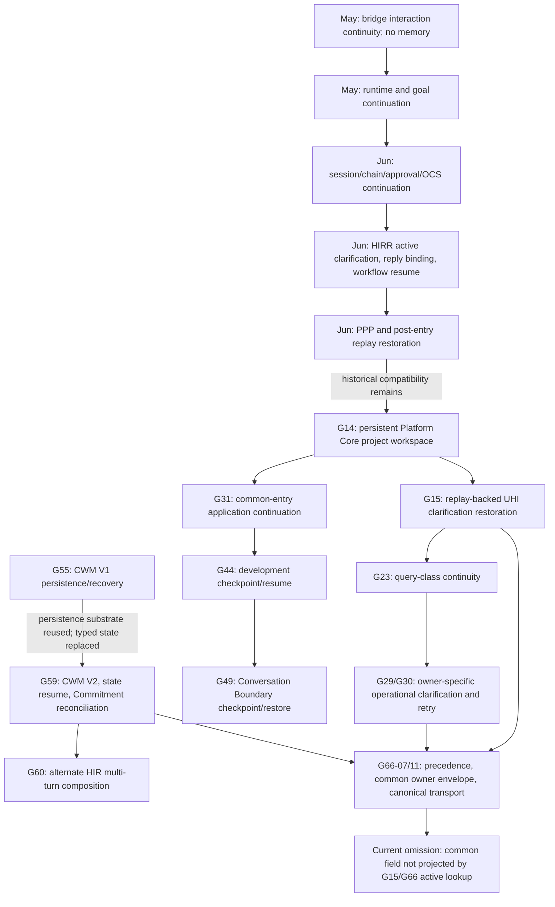
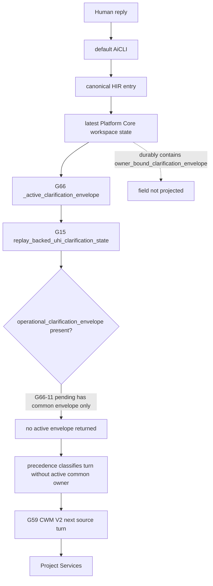
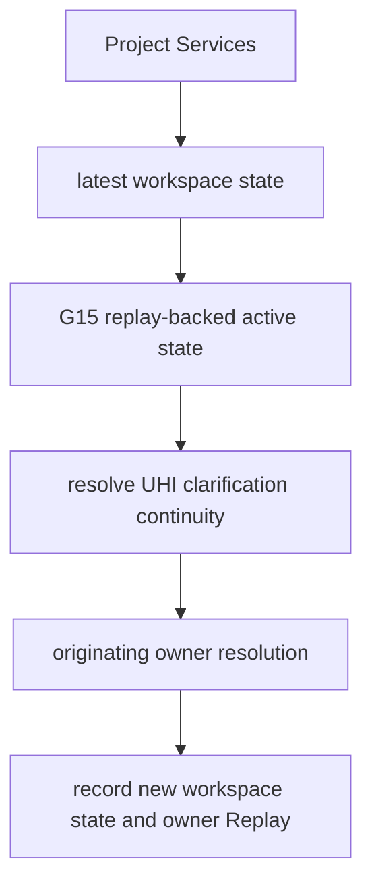

# 1. Implementation Summary

Generation: G66-11A

Report identity:
G66_11A_CONSTITUTIONAL_CONTINUATION_CAPABILITY_DISCOVERY_AUDIT_REPORT_V1

Constitutional baseline: `CONSTITUTIONAL_GOVERNANCE_CLOSED`,
`CONSTITUTIONAL_NERVOUS_SYSTEM_STATIC_MAP_ESTABLISHED`,
`CONSTITUTIONAL_FLOW_ARCHITECTURE_SPECIFICATION_ESTABLISHED`,
`HUMAN_INTENT_ARCHITECTURE_CHARACTERIZED`,
`PRODUCTION_CONVERSATION_FLOW_CONVERGENCE_CHARACTERIZED`,
`HUMAN_INTENT_PRECEDENCE_CHARACTERIZED`,
`CANONICAL_HUMAN_ENTRY_CAPABILITY_CHARACTERIZED`,
`CANONICAL_HUMAN_ENTRY_CONVERGENCE_REQUIRES_EXTENSION`,
`PRE_PROJECT_SERVICES_CONVERSATION_COMPOSITION_CHARACTERIZED`,
`PRODUCTION_CONVERSATION_FLOW_BINDING_ESTABLISHED`,
`PRODUCTION_HUMAN_INTERACTION_STACK_REQUIRES_REPAIR`,
`PRODUCTION_REPAIR_SEQUENCE_CHARACTERIZED`,
`PRODUCTION_FLOW_ISOLATION_ENFORCEMENT_ESTABLISHED`, and
`OWNER_BOUND_CLARIFICATION_TRANSPORT_CONVERGENCE_ESTABLISHED`.

Authenticated repository identity:

- Commit: `7704dac9a4aa7ddda7cac63b0272932e6ab2b0aa`
- Tree: `4e1aa371d7dee2ea7c2a89a7465fa881b5790e97`
- Subject: `G66-11: converge owner-bound clarification transport`

Implementation contracts: G48 Constitutional Evidence Reporting Standard V1;
Constitutional Architecture Specification V1; Canonical Layer Model;
Governance Enforcement Hierarchy; Constitutional Flow Architecture
Specification V1; G31 Common Entry architecture; G47 Development Governance;
G59 Conversation Layer V2; G60 Human Interface/Conversation integration; G61
Central LLM proposal assistance; G65 Self Knowledge; G65-10 Constitutional
Nervous System; and G66-00 through G66-11.

Reporting date: 2026-08-03.

Objective:

Perform a repository-wide and history-wide, read-only reconstruction of every
certified continuation, restoration, resume, pending-state, and reply-dispatch
capability relevant to the production Human Interaction Stack before any
authorization to implement G66-12 defect D1.

Audit scope:

- Searched current runtime, CLI, bridge, test, Governance, certification,
  Replay, and historical artifacts for continuation, resume, restore, pending
  conversation, pending clarification/proposal/Objective, active owner,
  reply/return-owner, follow-up, Conversation identity, CWM, Semantic Slot,
  workspace, and state-restoration concepts.
- Traced introduction commits, later certified reports, current definitions,
  callers, callees, default/alternate/direct reachability, migrations, and
  explicit compatibility or supersession evidence.
- Distinguished Human clarification continuation from session turn allocation,
  semantic-state recovery, approval resume, execution retry, workflow
  continuation, checkpoint recovery, and presentation continuity.
- Applied exactly one required continuation classification to every capability
  in the complete bounded inventory.
- Made no D1, runtime, CLI, schema, routing, Replay, test, policy, deployment,
  or prior-report change.

Modified modules:

- `docs/governance/G66_11A_CONSTITUTIONAL_CONTINUATION_CAPABILITY_DISCOVERY_AUDIT_REPORT_V1.md`
  — this G48 discovery report.

Intentionally unchanged modules:

- Canonical Human Entry; Project Services; Production Conversation Flow
  Binding; Human Intent precedence; owner-bound clarification; Conversation
  V1/V2; CWM; Semantic Slots; proposal; readiness; Commitment; G31; G44; G49;
  Platform Query Router; Governance; Authorization; Worker; execution; Replay;
  Presentation; all adapters; all tests; and all G66-00 through G66-11 reports.

Primary finding:

The required decision is `B`:

```text
The repository contains multiple certified continuation mechanisms.
```

The mechanisms are intentionally owner- and lifecycle-specific. The canonical
capability for the G66-12 clarification-continuation problem is not one hidden
replacement runtime. It is the composition of three already certified current
capabilities:

```text
G14/G15 Platform Core workspace Replay
  -> persist, locate, and reconstruct pending UHI clarification state

G59 Conversation Working Memory V2
  -> preserve Conversation identity, participant binding, revision, and state

G66-07/G66-11 owner-bound clarification envelope and precedence
  -> identify the exact current subject and sole permitted return owner
```

The G15 runtime functions remain present and production-called:

```python
latest_platform_core_workspace_state(...)
replay_backed_uhi_clarification_state(...)
resolve_uhi_clarification_continuity(...)
record_unified_human_interface_workspace_state(...)
```

G15-HIR-02 implemented these functions specifically so a Human clarification
reply could be restored from Platform Core workspace Replay and continue the
same UHI conversation. G17-HI-02L later gave the capability the deterministic
verdict `CLARIFICATION_BINDING_REUSABLE_WITH_MINOR_BINDING` and rejected a new
clarification engine.

G66-11 reused the persistence surface and the G66 owner-bound transport, but it
did not connect the common envelope to the existing G15 restoration surface.
The exact current omission is structural:

```text
pending_clarification_request
  contains owner_bound_clarification_envelope

replay_backed_uhi_clarification_state(...)
  projects only operational_clarification_envelope

production composer _active_clarification_envelope(...)
  reads only that projected operational field
```

Consequently, the common envelope is durable but is not recovered as the
active owner-bound subject on the next default turn. This is certified D1; it
is not evidence that continuation capability is absent.

Historical HIRR clarification runtimes also implement Replay-backed active
clarification lookup, Human reply binding, resolution, and workflow resume.
They remain callable through the older `aigol` conversational CLI and
certification surfaces. They are `LEGACY_COMPATIBILITY`, not canonical for
G66-12, because they use the earlier HIRR/CSA workflow lineage rather than the
current G59 CWM, G66 precedence, common envelope, and canonical HIR entry.

G31 application continuation, G44 development checkpoint resume, G49 boundary
restore, G59 suspension/resume, Objective Commitment reconciliation, approval
resume, pending-proposal restoration, OCS/PPP continuation, goal continuation,
and bounded runtime retry remain valid within their own owners. None is a
general replacement for owner-bound Human clarification continuation.

Only Conversation Working Memory V1 has explicit successor evidence: G59-01
reuses its persistence substrate while establishing V2 as the current typed
Conversation state and retaining V1 only for explicit migration and legacy
readability. No inspected continuation runtime has a certified `OBSOLETE`
disposition, and history contains no deletion of a continuation/resume/restore
source path. Functionality migrated and specialized without silent removal.

Architectural boundaries preserved:

- Human Authority owns the reply, correction, Commitment, approval, and stop.
- Conversation owns CWM, semantic revision, proposal acceptance, readiness,
  and Objective Commitment.
- The originating clarification owner retains sufficiency authority.
- Platform Core owns workspace Replay, operational flow, Objective, admission,
  and Project Services composition.
- Canonical HIR transports and sequences; it does not decide continuation
  meaning or sufficiency.
- G31, G44, approval, Authorization, Worker, execution, retry, and Presentation
  owners remain bounded and non-substitutable.

# 2. Code Evidence

## Public API

The current default continuation substrate is exposed through existing
Project Services operations:

```python
def latest_platform_core_workspace_state(
    session_root: Path,
) -> dict[str, Any] | None: ...

def replay_backed_uhi_clarification_state(
    workspace_state: dict[str, Any] | None,
) -> dict[str, Any] | None: ...

def resolve_uhi_clarification_continuity(
    *,
    message: str,
    workspace_state: dict[str, Any] | None,
    active_clarification_state: dict[str, Any],
    session_root: Path,
    created_at: str,
) -> tuple[dict[str, Any], dict[str, Any]]: ...

def record_unified_human_interface_workspace_state(...): ...
```

Source: `aigol/runtime/platform_core_project_services.py`.

The current semantic restoration substrate is:

```python
create_conversation_working_memory_state_v2(...)
load_conversation_working_memory_state_v2(...)
recover_conversation_working_memory_state_v2(...)
```

Source:
`aigol/runtime/platform_core_conversation_working_memory_runtime_v2.py`.

The current cross-owner identity and transport APIs are:

```python
create_owner_bound_clarification_envelope_v1(...)
validate_owner_bound_clarification_envelope_v1(...)
```

Source: `aigol/runtime/production_conversation_flow_binding.py`.

The older HIRR public capabilities remain available separately:

```python
run_clarification_continuity(...)
continue_human_intent_clarification_to_workflow(...)
```

Sources: `aigol/runtime/clarification_continuity_runtime.py` and
`aigol/runtime/human_intent_clarification_continuity_runtime.py`.

These APIs prove multiple mechanisms exist. Their different artifacts,
callers, owners, and lifecycle positions prove they are not interchangeable.

## Orchestration Entry Point

The current default production path is:

```text
Human
-> default AiCLI
-> run_human_interface_runtime_entry(...)
-> compose_production_conversation_flow_binding_v1(...)
-> latest Platform Core workspace state
-> G66 active-clarification lookup
-> G59 CWM V2 recovery and source-turn composition
-> Project Services
-> selected owner / Presentation
```

The intended existing G15 continuation path inside Project Services is:

```text
prepare_unified_human_interface_project_context(...)
-> latest_platform_core_workspace_state(...)
-> replay_backed_uhi_clarification_state(...)
-> resolve_uhi_clarification_continuity(...)
-> clarification satisfaction / query-class continuity
-> record_unified_human_interface_workspace_state(...)
```

The current G66 field mismatch occurs before that path can consume a common
envelope. `replay_backed_uhi_clarification_state(...)` copies the pending
legacy `operational_clarification_envelope` but not the G66-11
`owner_bound_clarification_envelope`. The production composer helper
`_active_clarification_envelope(...)` calls the G15 recovery function and then
again asks only for `operational_clarification_envelope`. Therefore G66
precedence cannot certify `CLARIFICATION_REPLY` against the durable common
envelope, and Project Services does not reach its existing reply-binding
branch for that envelope.

This is reuse omission, not capability absence.

## Semantic Reductions

Continuation mechanisms perform different reductions:

```text
session resume
  persisted turn identifiers -> next collision-safe turn identity

workspace restoration
  latest workspace record -> pending Human/Project context

clarification continuation
  active subject + exact Human reply -> same-owner resolution attempt

CWM recovery
  workspace/session identity -> validated Conversation state and revision

state-machine resume
  suspended CWM + exact interface/participant -> resumed Conversation state

approval resume
  immutable pending proposal + exact Human approval -> governed next stage

runtime continuity
  bounded failure/result + retry policy -> continue/stop decision only
```

Only the clarification reduction answers D1. Session allocation cannot restore
an owner. CWM recovery cannot determine the return owner. The common envelope
cannot decide sufficiency. Approval and workflow continuation cannot accept a
semantic clarification reply. A correct later composition needs each owner to
perform only its own reduction.

## Public Validators

The required validation surface already exists:

- Platform Core validates workspace state, pending clarification, historical
  operational envelopes, query-class continuity, and immutable continuity
  evidence.
- G66 validates closed owner-bound envelopes, expected owner, session,
  Conversation, subject, expected CWM revision, source reference/hash,
  expiry, attempts, and negative authority flags.
- G59 validates CWM identity, participant binding, revision, semantic state,
  recovery, state transitions, readiness, and Commitment.
- Older HIRR runtimes validate their own clarification chain and Replay but do
  not validate G66 owner-bound or G59 CWM V2 contracts.
- G31 validates stage-specific application state and exact Human actions.
- Approval, G44, Objective Commitment, and runtime-continuity owners validate
  their own bounded resume contracts.

No new continuation validator owner is required for G66-12. The future
connection must compose existing validators and fail closed on wrong session,
wrong owner, wrong subject, stale revision, expiry, duplicate attempt, or
tampered Replay evidence.

## Canonical Data Models

| Model | Current owner | Continuation meaning |
|---|---|---|
| Platform Core workspace state | Platform Core | latest persistent session/project and pending-Human-action projection |
| `PLATFORM_CORE_UHI_ACTIVE_CLARIFICATION_STATE_V1` | Platform Core restoration | historical recovered UHI clarification projection |
| `OWNER_BOUND_CLARIFICATION_ENVELOPE_V1` | originating owner; HIR transports | current common owner/session/Conversation/subject/revision return contract |
| CWM V2 atomic state | Conversation Layer | canonical Conversation identity, participants, lifecycle, revision, and typed semantics |
| Conversation State Machine V2 | Conversation Layer | correction, clarification, review, suspension/resume, abandonment, readiness |
| G31 application state/action | common entry plus exact downstream owner | stage-specific governed application continuation |
| pending governed-development proposal | proposal/Governance owner; alternate CLI transports | later explicit approval/rejection/modification continuation |
| G44 checkpoint/resume point | Development Continuity owner | external-repair workflow eligibility, not Human conversation state |
| owner-local Replay references | exact custodians | immutable reconstruction inputs, never routing authority |

`OWNER_BOUND_CLARIFICATION_ENVELOPE_V1` does not replace workspace state or
CWM. It supplies the cross-owner identity that the historical Platform Core
active-state projection lacks. Conversely, workspace Replay supplies durable
discovery that the envelope alone does not perform.

## Deterministic Algorithms

The discovery classification algorithm was:

1. Search current filenames, definitions, call sites, artifacts, and reports
   for every required continuation/restoration term and close variants.
2. Locate each implementation's introduction commit and certified generation.
3. Identify current callers and callees without treating tests as production.
4. Separate default, alternate, direct/test-only, historical, and bridge
   reachability.
5. Require explicit successor evidence before classifying `SUPERSEDED` and
   explicit retirement/removal evidence before classifying `OBSOLETE`.
6. Determine whether the capability carries Human reply identity, semantic
   Conversation state, application state, workflow state, or only
   presentation/execution continuity.
7. Compare the exact G66-11 pending artifact with the fields consumed by the
   current G15/G66 restoration call graph.
8. Select the canonical G66-12 reuse set only after the inventory, timeline,
   ownership, call graph, and production reachability were complete.

This yields decision `B`, one explicit `SUPERSEDED` capability, no
`OBSOLETE` capability, and a bounded reuse recommendation.

## Responsibility Boundaries

| Responsibility | Current constitutional owner | Continuation relationship |
|---|---|---|
| Human reply, correction, approval, Commitment, stop | Human Authority | exact act is transported and hash-bound |
| universal entry/session attachment | PGSP/Canonical HIR | sequences restoration and owner calls |
| workspace persistence and active-context discovery | Platform Core | stores and reconstructs pending transport state |
| Conversation identity, CWM, semantic revision | G59 Conversation | loads/reconstructs exact state; accepts semantic mutation only through G59 |
| clarification sufficiency | originating clarification owner | receives reply and decides only its own unresolved condition |
| current-turn relationship | G66 Human Intent precedence owner | new intent/reply/ambiguous/stop decision before restored state can route |
| flow selection | Platform Query Router | remains after valid continuation evidence |
| application-stage continuation | G31 and exact stage owner | not a general conversation resolver |
| Objective/admission | Platform Core | remains unreachable without required predecessors |
| Governance/Authorization/Worker/execution | exact existing owners | continuation cannot imply any authority or effect |
| Replay | owner-local custodians under Replay law | reconstruction evidence only |
| Presentation | Canonical Presentation | renders continuation status without choosing the owner |

Historical G15 language assigned broad clarification ownership to Platform
Core. G66-00 through G66-11 later refined that division: Platform Core still
owns workspace persistence and operational clarification where applicable,
while each originating owner retains its own sufficiency decision and HIR
transports the common envelope. Reusing G15 storage/restoration does not revive
the broader historical ownership claim.

## 1. Repository-Wide Continuation Inventory

Inventory boundary: a row is included when the capability persists, restores,
resumes, binds, or deterministically gates state across Human turns, runtime
invocations, Conversation revisions, approval stages, or immediate downstream
workflows. Pure display continuity, generic file rollback, terminology-only
mentions, and retry flags with no state-carrying boundary are documented after
the table rather than promoted to continuation owners.

| Capability | Introduced | Current runtime and owner | Current callers -> principal callees | Production reachability / certification / compatibility | G66-11 reuse | G66-12 reuse | Classification |
|---|---|---|---|---|---|---|---|
| Human Interaction Continuity Layer V1 | pre-generation bridge; commit `646273ee` | `sapianta_bridge/human_interaction_continuity`; bridge transport owner | interaction transport bridge -> request/session/binding/response evidence | finalized bridge path; explicitly no memory, resume, routing, or autonomous continuation; outside current AiCLI | no | no; transport-hash pattern only | `LEGACY_COMPATIBILITY` |
| Bounded Runtime Continuity V1 | early runtime; commit `bd9f6a95` | `continuity/RuntimeContinuityEngine`; execution-runtime continuity owner | `runtime_engine.py` -> validator/retry policy/Replay | current governed runtime; decides bounded retry/stop and never Human reply ownership | no | no | `ACTIVE_EXTENSION_POINT` |
| Goal Continuity Runtime V1 | early runtime; commit `ffb2cd26` | `goals/GoalContinuityEngine`; goal owner | focused tests -> goal validator/next-step projection | certified, test/direct only; no Human production caller | no | no | `PRODUCTION_UNUSED` |
| Conversation Chain Continuity V1 | pre-G14; commit `d135f92d` | `conversation_chain_continuity_runtime.py`; legacy conversation-chain owner | prompt/native-development integrations and AiGOL CLI -> immutable chain replay | alternate/legacy production; preserves chain identity, not pending owner dispatch | no | no; lineage pattern only | `LEGACY_COMPATIBILITY` |
| Conversation Session Resume V1 | pre-G14; commit `0cc6ac62` | `conversation_session_resume_runtime.py`; session allocation owner | AiGOL CLI and G60 complete execution -> turn discovery/allocation | current alternate/G60 use; allocates next turn only | no | limited: preserve session/turn allocation, not clarification state | `ACTIVE_EXTENSION_POINT` |
| Implementation Approval Resume V1 | pre-G14; commit `493b3920` | `implementation_approval_resume.py`; approval/handoff owner | AiGOL CLI -> pending approval packet and handoff | alternate legacy production; approval-specific | no | no | `LEGACY_COMPATIBILITY` |
| OCS memory and continuity | pre-G14; commit `273f44b4` | `ocs_memory_and_continuity_runtime.py`; OCS owner | OCS end-to-end/alternate CLI -> OCS sources and Replay | alternate OCS compatibility; not G59 Conversation memory | no | no | `LEGACY_COMPATIBILITY` |
| OCS cognition continuity and clarification | pre-G14; commit `a3062c87` | `ocs_llm_cognition_continuity_and_clarification_runtime.py`; OCS cognition owner | OCS LLM end-to-end/certification -> history, continuity, clarification evidence | alternate/certification path; model-cognition gaps, not Human reply restoration | no | no | `LEGACY_COMPATIBILITY` |
| Clarification Lifecycle Resolution | pre-G14; commit `2c499b09` | `clarification_lifecycle_resolution_runtime.py`; HIRR lifecycle owner | older HIRR/AiGOL flows -> replay reconstruction and lifecycle resolution | certified older runtime family | no | no direct reuse; historical design evidence | `LEGACY_COMPATIBILITY` |
| Clarification Continuity Runtime V1 | G2 lineage; commit `adb0250d` | `clarification_continuity_runtime.py`; HIRR clarification owner | AiGOL CLI -> active lookup, reply binding, response/resolution/workflow-resume artifacts | alternate `aigol` production and tests; not default canonical HIR | no | no direct reuse; validators target old chain | `LEGACY_COMPATIBILITY` |
| Human Intent Clarification Continuity | G2-04; commit `8c383576` | `human_intent_clarification_continuity_runtime.py`; HIRR/CSA workflow owner | AiGOL CLI and certification runtimes -> target refinement, resolution, workflow selection | certified alternate/legacy path | no | no direct reuse; owner/flow model predates G59/G66 | `LEGACY_COMPATIBILITY` |
| Context-Assembled to PPP continuation | pre-G14; commit `98057094` | `context_assembled_to_ppp_routing_continuation.py`; PPP routing owner | AiGOL CLI -> PPP routing | alternate downstream workflow continuation | no | no | `LEGACY_COMPATIBILITY` |
| OCS-to-PPP continuation adapter | pre-G14; commit `06b6a9c8` | `ocs_to_ppp_continuation_adapter_runtime.py`; OCS/PPP adapter owner | direct/certification surfaces -> PPP candidate handoff | bounded compatibility path; no default caller found | no | no | `LEGACY_COMPATIBILITY` |
| Post-entry continuation gate and replay restoration | pre-G14; commit `522028a0`; later lifecycle repair | `post_entry_continuation_gate_runtime.py` plus AiGOL CLI `_restore_pending_post_entry_continuation_from_replay`; native-development/PPP owner | alternate AiGOL CLI -> restored native context and PPP continuation | alternate production; concrete cross-invocation restore but wrong subject/owner for D1 | no | pattern only; do not reuse artifacts or dispatcher | `LEGACY_COMPATIBILITY` |
| Pending governed-development proposal restore | pre-G14 ACLI approval continuity | AiGOL CLI `_restore_pending_governed_development_bridge_from_replay`; proposal/approval owner | alternate AiGOL CLI -> immutable proposal verification and re-presentation | alternate production; explicit approval/reject/modification only | no | no; demonstrates fail-closed pending-state restoration | `LEGACY_COMPATIBILITY` |
| G14 persistent Project workspace continuity | G14-05/G14-08A; source commit `0a85f777` | Project Services workspace state; Platform Core | AiCLI, canonical HIR, G49 -> latest/record workspace operations | default production and direct API; certified | yes, pending common transport is recorded through this surface | yes, canonical durable discovery substrate | `ACTIVE_CANONICAL` |
| G15 replay-backed UHI clarification continuity | G15-HIR-02; source commit `80565bfe` | Project Services recovery/binder; Platform Core transport/restoration | composer and Project Services -> latest workspace, active-state projection, resolution, persistence | default production-called; fully works for historical pending shape; certified reusable by G17 | omitted for the new common field; old projection still called | yes, principal restoration/binding substrate with G66 owner refinement | `ACTIVE_CANONICAL` |
| G23 query-class continuity across clarification | G23-04B | logic inside `resolve_uhi_clarification_continuity`; Platform Query Router/Platform Core | G15 resolver -> canonical query identity and fail-closed class preservation | active on historical/unbound clarification continuation | no effective common-envelope reachability | yes only after exact owner-bound restoration; keep router ownership | `ACTIVE_EXTENSION_POINT` |
| G29/G30 owner-specific operational clarification continuation | G29/G30; binder commit `408141e0` | Project Services `_bind_owner_specific_clarification_reply`; G29 owner | Project Services historical active envelope -> G29 operational-turn owner | active for unbound/historical operational envelope; G66-11 retains source evidence | yes as source artifact and transport adaptation; not next-turn common restore | yes for G29-specific reply dispatch after common validation | `ACTIVE_EXTENSION_POINT` |
| G30 attachment retry continuity | G30-06/G30-07; commit `9f30af15` | Project Services operational-turn attachment state; G29/attachment owner | direct/default operational turn -> ordered attachment attempts | certified bounded retry on a valid Platform clarification | G66-11 preserves its owner-local evidence | only after return to that exact G29 subject; not a universal dispatcher | `ACTIVE_EXTENSION_POINT` |
| G31 Common Entry application continuation | G31; common-entry repair commit `8a9aa3e2` | `_continue_g31_application_transition` in canonical HIR; exact stage owners | default AiCLI and G49 -> G31 decision/Worker/result owners | default production for supplied G31 state/action; certified | unchanged | design pattern only; not semantic clarification | `ACTIVE_CANONICAL` |
| Constitutional Development Continuity Manager | G44-01; commit `b6f7d77a` | `constitutional_development_continuity_manager_runtime.py`; Development Continuity owner | capability registry and tests -> checkpoint/resume/external-repair validators | certified public API, no production runtime caller | no | no; checkpoint pattern only | `PRODUCTION_UNUSED` |
| Platform Core Conversation Boundary restore/checkpoints | G49-02; commit `fea960df` | `platform_core_conversation_boundary.py`; Platform Core Conversation Boundary | tests/direct API -> Project Services, workspace state, canonical HIR G31 actions | certified but no CLI/runtime caller found | no | no promotion; checkpoint/event pattern only | `PRODUCTION_UNUSED` |
| Conversation Working Memory V1 | G55-03; commit `6e9f7eda` | `platform_core_conversation_working_memory_runtime.py`; former CWM owner | V1 tests and explicit G59 migration -> V1 persistence/recovery | readable/migratable; no current production Conversation composition | no | no; V2 owns current state | `SUPERSEDED` |
| Conversation Working Memory V2 recovery | G59-01; commit `f0617aa3` | `platform_core_conversation_working_memory_runtime_v2.py`; Conversation Layer | G60 HIR and G66 composer -> create/load/recover/atomic state | default G66 and alternate G60 production; canonical typed state | yes, identity/revision/state referenced and recovered | yes, canonical Conversation state substrate | `ACTIVE_CANONICAL` |
| Conversation State Machine V2 suspension/resume | G59-03; commit `f1a8aebf` | `prepare_conversation_resume_v2`; Conversation Layer | current source definition/tests only for exact suspended state | certified direct/test path; no production caller of resume operation | no | bounded no: active clarification is not necessarily `SUSPENDED`; use only if that state applies | `PRODUCTION_UNUSED` |
| Objective Commitment restore/reconcile | G59-07 | `restore_or_reconcile_objective_commitment_v2`; Conversation plus Human Commitment owner | current source definition/tests only -> immutable intent/record/CWM cleanup reconciliation | certified recovery operation, not production-called | no | no for clarification; retain for interrupted Commitment only | `PRODUCTION_UNUSED` |
| G60 HIR Conversation V2 multi-turn continuation | G60-01 | `human_interface_conversation_runtime_v2.py`; HIR orchestration over G59 | `conversation-v2` and complete alternate mode -> G59 state/proposal/commit/readiness/Commitment | alternate production; D6 bypass remains | no | reuse CWM/owner APIs, not the terminal or alternate ingress | `ACTIVE_EXTENSION_POINT` |
| G66 precedence and owner-bound transport | G66-07/G66-11 | production binding composer, Project Services, canonical HIR, AiCLI; distributed owners | default AiCLI -> precedence, common envelope, pending transport | default production; current canonical identity/transport | yes, central G66-11 result | yes, exact owner/session/subject/revision contract | `ACTIVE_CANONICAL` |
| G66 active-clarification lookup adapter | G66-07 over G15 restoration | `_active_clarification_envelope` in production composer; HIR composition | canonical HIR -> G15 active-state projection -> historical operational field | default production-called but incomplete for G66-11 common field | G66-11 intentionally did not change it | yes, extend existing adapter rather than add runtime | `ACTIVE_EXTENSION_POINT` |

No row is `OBSOLETE` or `EXPERIMENTAL`. That is an evidence result, not an
omission: current history has no deleted continuation/resume/restore source
path and no certified report examined declares one of these capabilities
obsolete. Certification-only and test-only operations are classified
`PRODUCTION_UNUSED`, retained older operational families are
`LEGACY_COMPATIBILITY`, and only explicit G55-to-G59 successor evidence earns
`SUPERSEDED`.

Search exclusions:

- `AGOL Visual Continuity Memory V1` and the accepted Human Interaction
  Continuity ADR preserve presentation/interaction lineage but explicitly
  deny memory persistence or autonomous continuation.
- Replay-chain integrity, governance primitive continuity, native messaging
  response continuity, rollback restore, retry policy, and observability
  summaries preserve evidence or execution behavior but do not restore a
  pending Human conversation owner.
- G61 proposal assistance returns a proposal and G59 assessment only. It has no
  pending proposal, CWM mutation, clarification dispatch, or resume authority.
- G65 Self Knowledge classification is exact request classification, not
  conversation continuation. Its result remains an input to G66 precedence.

## 2. Historical Evolution Timeline



Evolution findings:

- Continuation first appeared as bounded bridge/runtime/goal and workflow
  lineage, not as one general Human conversation owner.
- The June HIRR family first supplied complete active-clarification lookup,
  reply binding, resolution, and workflow resume. Later architecture retained
  it as an alternate compatibility surface rather than deleting it.
- G14 moved canonical UHI project/workspace state into Platform Core. G15 then
  implemented the current replay-backed UHI clarification binder rather than
  copying HIRR into the Reference UHI.
- G17-HI-02L explicitly audited G15 reuse and concluded that the capability was
  canonical and reusable with minor binding.
- G23 and G30 extended the Platform Core path with query-class preservation,
  owner-specific operational clarification, and attachment retry lineage.
- G31 introduced a separate, stage-specific common application continuation;
  it did not replace conversation clarification.
- G55 introduced isolated CWM persistence. G59 established V2 typed state,
  explicit V1 migration, state-machine resume, and Commitment reconciliation.
- G60 composed G59 multi-turn behavior in an alternate HIR terminal.
- G66 added current-turn precedence and a cross-owner common envelope, then
  G66-11 converged production transport without connecting the new field to
  G15 restoration.
- Functionality migrated without removal. The current issue is the last
  adapter between durable G66 transport and certified G15 restoration.

## 3. Runtime Ownership Matrix

| Continuation concern | Canonical/current owner | Current mechanism | Historical or bounded peers | Finding for D1 |
|---|---|---|---|---|
| session/turn identity | PGSP/HIR session boundary | session identity plus collision-safe turn allocation | Conversation Session Resume V1 | necessary context, insufficient owner restoration |
| pending workspace transport | Platform Core | G14 record/latest workspace state | older AiGOL local pending variables | canonical durable discovery |
| active clarification reconstruction | Platform Core transport plus exact originating owner | G15 replay-backed active state | HIRR lifecycle/clarification runtimes | capability exists; common field connection omitted |
| current-turn relationship | G66 precedence owner | four-way precedence artifact | historical active-state-first inference | canonical; must consume exact restored common evidence |
| Conversation identity/revision | G59 Conversation Layer | CWM V2 recover/load | G55 CWM V1, OCS memory | V2 canonical; V1 superseded |
| reply sufficiency | originating clarification owner | G59 readiness owner or G29 semantic capability owner | HIRR central workflow resolver | never centralize in Platform transport |
| operational query-class continuity | Platform Query Router/Platform Core | G23 logic inside G15 resolver | HIRR workflow selection | reuse only for matching Platform owner |
| application-stage continuation | G31 plus exact stage owner | G31 state/action branch in canonical HIR | approval resume and pending-proposal restore | separate from semantic clarification |
| external-repair resume | G44 Development Continuity | checkpoint/resume/revalidation | none canonical for Human conversation | unrelated bounded recovery |
| Conversation suspend/resume | G59 Conversation Layer | state-machine exact participant/interface resume | G49 boundary restore | not automatically applicable to active clarification |
| Replay | exact owner-local custodian | immutable workspace/CWM/envelope/owner records | historical readers remain | references correlate; Replay never routes |
| Presentation | Canonical Presentation | render pending/continued result | bridge interaction continuity | no continuation authority |

## 4. Current Runtime Call Graph

### Default production and D1 omission



### Existing reusable canonical path



### Alternate historical paths

```text
aigol conversation
-> HIRR clarification lifecycle/continuity
-> bind Human reply to active clarification chain
-> target refinement / workflow selection / resume

aicli conversation-v2
-> G60 HIR terminal
-> G59 CWM load and multi-turn state transitions
-> readiness / exact Commitment

aigol next / conversational development
-> session resume / pending post-entry or pending proposal restore
-> PPP or approval-specific continuation
```

The alternate graphs demonstrate working patterns but do not satisfy the
current canonical owner and artifact contracts as a wholesale replacement.

## 5. Reuse Matrix

| Existing capability | Reused by G66-11 | Why reused or omitted | Constitutionally compatible G66-12 use |
|---|---|---|---|
| G14 workspace record/latest state | yes | stores pending common transport and current project/session state | retain unchanged as durable discovery boundary |
| G15 active-state projection | called indirectly, but new common field omitted | implementation predates G66 envelope and projects only legacy operational field | extend projection/validation to expose the existing common envelope by reference |
| G15 clarification continuity resolver | no effective common-envelope call | no active common envelope reaches its branch | reuse sequencing/persistence where owner matches; do not centralize all sufficiency in Platform Core |
| G23 query-class continuity | no effective common-envelope call | depends on G15 resolver reachability | retain only for Platform-owned clarification continuation |
| G29/G30 owner-specific binder | source path reused; reply path not reached by common envelope | G66-11 adapted source transport only and intentionally reserved D1 | dispatch G29 replies back through its existing binder after exact common-owner validation |
| G30 attachment retry | owner evidence preserved | not a transport convergence decision | resume only when the restored subject is that exact attachment clarification |
| G59 CWM V2 recovery | yes | G66 composer recovers canonical Conversation state | retain exact Conversation identity/revision and reject stale envelope revisions |
| G59 state-machine resume | no | active clarification is not automatically a `SUSPENDED` Conversation | call only if certified lifecycle state is actually suspended; not a generic D1 fix |
| G59 Objective Commitment reconcile | no | applies only to interrupted immutable Commitment creation/cleanup | no D1 use |
| G60 terminal orchestration | no | alternate ingress and explicit grammar; D6 remains open | reuse owner APIs/patterns, not terminal entry or parser ownership |
| G66 precedence | yes | current canonical current-turn relationship artifact | bind `CLARIFICATION_REPLY` to restored common hash before state mutation |
| G66 owner-bound envelope | yes | sole bound production clarification transport | use unchanged; enforce session, owner, subject, revision, expiry, attempts |
| HIRR clarification runtimes | no | historical workflow/owner/schema lineage differs | no direct reuse; retain compatibility and regression evidence |
| G31 common-entry continuation | unchanged | stage-specific and not D1 | preserve; do not route semantic clarification through G31 actions |
| G44/G49 restore mechanisms | no | certified but production-unused and domain/boundary-specific | no promotion; patterns only |
| pending proposal/post-entry restoration | no | older AiGOL approval/PPP states | no artifact reuse; pattern evidence for fail-closed unconsumed-state lookup |

The exact omitted reuse is therefore:

```text
runtime:
  aigol.runtime.platform_core_project_services
  ::replay_backed_uhi_clarification_state
  ::resolve_uhi_clarification_continuity

owner:
  Platform Core for workspace persistence/restoration and any Platform-owned
  clarification; exact originating owner for sufficiency

introduced:
  G15-HIR-02, source commit 80565bfe

reason omitted:
  G66-11 intentionally implemented D4 transport only; the historical active
  projection and composer adapter still name the old operational field

constitutional compatibility:
  compatible when reused as transport/reconstruction and exact owner dispatch,
  incompatible if historical broad Platform Core sufficiency ownership is
  revived over G59 or another originating owner
```

## 6. Production Reachability

| Surface | Continuation mechanism reached | Current disposition |
|---|---|---|
| default `./aicli` non-empty turn | canonical HIR, G66 composer, G59 CWM V2, Project workspace load/store | default production |
| next default turn after G66-11 clarification | workspace state loads, but common envelope is not projected as active | D1 production gap |
| unbound/direct Project Services with legacy operational pending state | G15 restore plus G29/G30 owner-specific continuation | active compatibility/direct path |
| default G31 pending application action | canonical HIR G31 continuation | default bounded production |
| `./aicli conversation-v2` | G60/G59 multi-turn state | alternate production; D6 open |
| `./aicli conversation-execute-v2` | G60, then canonical entry at later committed-Objective boundary | alternate production |
| `python -m aigol.cli.aigol_cli conversation/next` | HIRR, session, OCS/PPP, proposal and approval continuations | alternate/legacy production |
| G44 manager | registry/tests | certified, production-unused |
| G49 Conversation Boundary | tests/direct API | certified, production-unused |
| G59 state resume and Commitment reconcile | tests/direct public API | certified, production-unused |
| Sapianta bridge continuity | bridge transport stack | separate compatibility stack, no memory persistence |

Current production reachability disproves answer `A` as incomplete: one
disconnected canonical capability exists, but so do many certified
continuation mechanisms with distinct owners and live alternate callers.
Answer `C` is false because G15, HIRR, G59, G31, and other certified mechanisms
are implemented and tested. Answer `B` is the only complete characterization.

## 7. Canonical Continuation Verdict

```text
B) The repository contains multiple continuation mechanisms.
```

Canonical for G66-12:

```text
durable pending state and restore:
  G14/G15 Platform Core workspace Replay

Conversation identity and semantic revision:
  G59 Conversation Working Memory V2

return-owner and current-turn relationship:
  G66 Human Intent precedence plus OWNER_BOUND_CLARIFICATION_ENVELOPE_V1

reply sufficiency and continuation transition:
  exact originating owner named by the envelope

universal sequencing and transport:
  existing Canonical Human Interface Runtime Entry
```

Historical/compatibility:

- HIRR lifecycle, clarification, and Human Intent continuity;
- OCS/PPP, conversation-chain, approval, pending proposal, and post-entry
  continuation;
- bridge interaction continuity.

Current but bounded to other responsibilities:

- runtime retry/stop;
- session turn allocation;
- G31 application-stage continuation;
- G30 attachment retry;
- G59 suspend/resume and Commitment reconcile;
- G44 checkpoint resume and G49 boundary restore.

Superseded:

- G55 CWM V1 as current typed Conversation memory, with explicit G59 V2
  migration compatibility retained.

Obsolete:

- none demonstrated.

## 8. Reuse Recommendation

Reuse the existing canonical stack rather than create a continuation runtime:

1. Preserve G14/G15 workspace recording, latest-state lookup, and immutable
   clarification continuity evidence.
2. Preserve the G66 common envelope unchanged as the sole cross-owner return
   contract.
3. Preserve G59 CWM V2 as the sole current Conversation identity/revision and
   semantic-state substrate.
4. Dispatch only to the originating owner named and validated by the common
   envelope. Reuse the G29/G30 binder for its own subject and G59 owner APIs for
   Conversation readiness subjects.
5. Retain HIRR, G31, G44, G49, approval, and PPP paths within their certified
   compatibility or bounded roles; do not promote them to a universal
   clarification owner.
6. Add references to existing owner-local Replay; do not migrate or rewrite
   historical records.

## 9. Constitutional Recommendation for G66-12

The later separately authorized G66-12 should be characterized as a bounded
connection repair, not capability creation:

```text
existing G66-11 pending common envelope
-> existing G14/G15 workspace restoration
-> existing G66 precedence validation
-> existing G59 Conversation identity/revision validation
-> exact existing originating owner
-> existing owner-local resolution and Replay
-> canonical Presentation and Human transport
```

The minimal implementation surface is the existing active-state projection and
composer/Project Services adapter. G66-12 should not add a new continuation
runtime, owner, replay model, semantic parser, or envelope schema. It should
not invoke G59 suspension resume unless the Conversation is actually
`SUSPENDED`, and it should not use the historical HIRR workflow selector to
route current G66 flows.

Required later proof should cover intact, stale, duplicate, expired,
wrong-session, wrong-Conversation, wrong-subject, wrong-owner, and tampered
common envelopes; G29 and G59 originating-owner returns; unchanged CWM on
invalid replies; deterministic workspace/CWM/owner Replay; G31 preservation;
and no Objective, Governance, Authorization, Worker, or execution bypass.

This recommendation is made only after completing the repository
reconstruction above.

# 3. Constitutional Self-Assessment

## Verified

- Multiple certified continuation mechanisms exist; decision `B` is supported
  by current definitions, call sites, certified reports, and introduction
  history.
- G15 implemented replay-backed UHI clarification restoration and binding in
  Project Services, and G17-HI-02L explicitly certified it reusable with minor
  binding.
- The G15 persistence, lookup, active-state, resolver, and recorder functions
  remain in current source and are called by default-production components.
- G66-11 pending transport contains the common owner-bound envelope.
- The G15 active-state projection and G66 composer lookup consume only the
  historical operational envelope field.
- This field mismatch is the exact omitted reuse behind D1.
- G59 CWM V2 is production-recovered by the G66 composer and is the current
  canonical Conversation identity/revision substrate.
- G55 CWM V1 has explicit V2 successor and migration evidence and is the only
  inventory capability classified `SUPERSEDED`.
- HIRR clarification continuity remains callable through older AiGOL surfaces
  but has not been promoted to current canonical HIR/G59/G66 ownership.
- G31, G44, G49, approval, session, retry, PPP, state-resume, and Commitment
  recovery capabilities are bounded to different state owners.
- No continuation source deletion or certified obsolete disposition was found.
- G66-11 omitted connection of a certified capability, but correctly avoided
  implementing D1 within D4 scope.
- No runtime, test, schema, route, prior report, Replay, or external system was
  modified.

## Not Verified

- D1 is not implemented or dynamically repaired by this discovery generation.
- A G66 common envelope still does not restore as active state on the next
  default production turn.
- No current production call dispatches that restored common envelope to both
  G59 and G29 originating-owner paths.
- Historical HIRR artifacts are not proven interoperable with G59 CWM V2 or
  G66 owner-bound envelopes and are not recommended as direct replacements.
- G59 suspension/resume and Objective Commitment reconciliation are not
  production-called and are not claimed to solve ordinary active
  clarification continuation.
- No production conversation, live provider, external Worker, Authorization,
  execution, deployment, server, container, GUI, Web, Speech, REST, Agent, or
  installed package was invoked.
- Dynamic Trace remains specified but unimplemented.

# 4. Validation Matrix

| Requirement | Evidence | Validation | Result |
|---|---|---|---|
| G48 report structure | six exact top-level sections and standard Code Evidence subsections | deterministic heading review | `PASS` |
| repository-wide search | source, CLI, bridge, tests, reports, Governance, history | required-term and filename search | `PASS` |
| complete bounded inventory | 30 state-bearing continuation capabilities plus documented exclusions | inventory field/classification review | `PASS` |
| exact classification vocabulary | every inventory row has one of seven permitted values | deterministic assertion | `PASS` |
| introduction history | per-file first-add commits and generation reports | Git history review | `PASS` |
| current runtime/owner/callers/callees | source definitions and repository-wide call sites | static caller/callee review | `PASS` |
| production reachability | default, alternate, direct/test-only and bridge surfaces | G65-10/current-source comparison | `PASS` |
| historical evolution | May bridge/runtime through G66 common transport | source/report/history timeline | `PASS` |
| supersession evidence | G55 V1 to G59 V2 explicit migration/compatibility | report/source review | `PASS` |
| obsolete/abandoned evidence | deletion history and certified dispositions | no deleted continuation source and no obsolete declaration found | `PASS_NONE_FOUND` |
| G66-11 omitted reuse | common pending field versus historical projected/read field | exact source-shape comparison | `PASS` |
| canonical verdict A/B/C | multiple current/historical owners and explicit reuse evidence | alternative-by-alternative review | `PASS_B` |
| G31 consistency | stage-specific canonical-entry state/action continuation | source/report review | `PASS` |
| G47 consistency | continuation grants no planning eligibility | ownership review | `PASS` |
| G59 consistency | CWM V2, state resume, readiness and Commitment remain Conversation-owned | owner/API review | `PASS` |
| G60 consistency | alternate terminal retained; owner APIs reusable | call-path review | `PASS` |
| G61 consistency | proposal-only; no pending-state or continuation authority | source/report review | `PASS` |
| G65 consistency | exact classifier remains an input, not continuation owner | classification/owner review | `PASS` |
| G65-10 consistency | default/alternate/direct entry and restore/new decision | static-map comparison | `PASS` |
| G66-00 consistency | current-turn predecessor and owner-preserving transitions | flow-law review | `PASS` |
| G66-09 consistency | G66-12 remains D1 after D4 | repair-sequence comparison | `PASS` |
| G66-10 consistency | bound flow isolation remains unchanged | boundary review | `PASS` |
| G66-11 consistency | common transport exists; restoration intentionally absent | source/report review | `PASS` |
| D1 implementation | prohibited | intentionally not performed | `NOT_APPLICABLE` |
| governance conformance regression | existing read-only conformance test | 5 passed | `PASS` |
| governance conformance | existing read-only conformance engine | 20 passed, 0 failed, 0 warnings, 0 critical violations, `CONFORMANT` | `PASS` |
| document consistency | headings, inventory rows, classification vocabulary, decision B, verdict | deterministic review | `PASS` |
| whitespace integrity | complete repository diff | `git diff --check` | `PASS` |

# 5. Repository Mutation Summary

Added documentation:

- `docs/governance/G66_11A_CONSTITUTIONAL_CONTINUATION_CAPABILITY_DISCOVERY_AUDIT_REPORT_V1.md`
  — repository inventory, history, ownership, call graphs, reuse,
  reachability, verdict, and bounded G66-12 recommendation.

Unchanged subsystems:

- All runtime, CLI, Human Interface, Conversation, CWM, clarification,
  precedence, flow binding, Project Services, Query Router, Objective,
  Governance, Authorization, Worker, execution, Replay, Presentation, bridge,
  test, schema, manifest, hook, policy, and deployment behavior.

API compatibility:

- No public or private API, schema, route, validator, state transition,
  classifier, semantic operation, owner, or result shape changed.

Boundary preservation:

- This report identifies certified reuse surfaces and does not activate them.
- It does not implement D1, create a continuation owner, migrate historical
  Replay, promote an alternate path, alter clarification sufficiency, invoke a
  provider/Worker, authorize, execute, or deploy.
- G66-12 remains a separately authorized repair generation.

Unrelated pre-existing changes:

- None observed at audit start.

# 6. Certification Verdict

CONSTITUTIONAL_CONTINUATION_CAPABILITY_CHARACTERIZED
