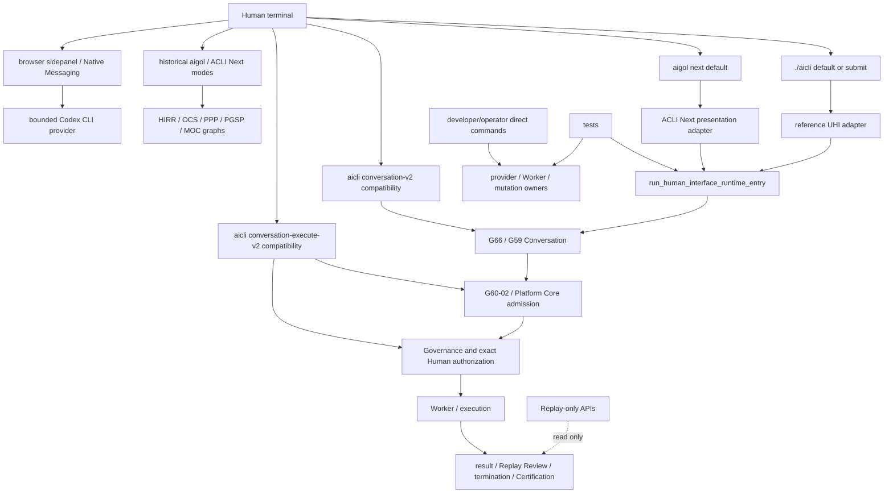
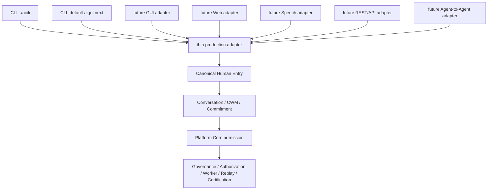

# 1. Implementation Summary

Generation: G66-15

Report identity:
G66_15_PRODUCTION_ENTRY_MODE_CONSTITUTIONAL_AUDIT_REPORT_V1

Constitutional baseline: `CONSTITUTIONAL_GOVERNANCE_CLOSED`,
`PRODUCTION_CONVERSATION_FLOW_BINDING_ESTABLISHED`,
`CONSTITUTIONAL_CONTINUATION_CONVERGENCE_ESTABLISHED`,
`CANONICAL_TYPED_SEMANTIC_COMPOSITION_CONVERGENCE_ESTABLISHED`, and
`CONSTITUTIONAL_EXECUTION_SPINE_CONVERGENCE_ESTABLISHED`.

Authenticated repository identity:

- Commit: `85ab66e58b2c91a15433c5f677ade831f2dca586`
- Tree: `8e3238d84c29fae8d6d70a0d75c4e0db584975c5`
- Subject: `G66-14: converge constitutional execution spine`

Implementation contracts: G48 Constitutional Evidence Reporting Standard V1;
Constitutional Architecture Specification V1; Canonical Layer Model;
Constitutional Flow Architecture; G31 Common Entry and execution-spine
contracts; G47 Development Governance; G59 Conversation Layer V2; G60 Human
Interface/Conversation integration; and G66-00 through G66-14.

Reporting date: 2026-08-03.

Objective:

Perform a read-only audit of every authenticated public surface capable of
initiating, resuming, directly advancing, or reconstructing AiGOL runtime work.
Classify Human Interaction Channels, Canonical Entry, adapters, internal APIs,
compatibility interfaces, development and test entries, Replay-only surfaces,
legacy launchers, and reserved future channels. Determine which callable paths
are constitutionally production paths and which must not be represented as
production alternatives.

No implementation, refactoring, API, schema, baseline, PCBV31, Conversation,
Governance, Worker, Replay, or Certification change is authorized or made.

Primary finding:

The normative production topology is singular:

~~~text
Human Interaction Channel adapter
-> run_human_interface_runtime_entry
-> G66/G59 Conversation and typed semantic state
-> G60-02 Platform Core admission handoff
-> Platform Core
-> Governance
-> distinct Human execution authorization
-> Worker / local or provider execution
-> result / Replay Review / termination / final Certification
~~~

The default `./aicli` interactive and `submit` modes, and default `aigol next`,
already converge on that Canonical Entry. The repository also retains callable
surfaces that do not enter there at their Human ingress:

- `conversation-v2` and `conversation-execute-v2` directly call G60 terminals;
- historical `aigol` and ACLI Next subcommands directly call earlier runtime
  families;
- direct development commands can invoke provider, Worker, mutation, or staged
  execution APIs;
- the browser/native-messaging bridge calls a bounded Codex CLI provider
  without the G66 canonical Human Entry path;
- public Worker and execution functions accept programmatic calls but validate
  exact predecessor artifacts;
- compatibility bridge controllers remain importable; and
- 355 public `reconstruct_*` functions are read-only evidence entry points.

Those surfaces do not invalidate the established canonical spine. They do mean
that the repository's public entry topology is not constitutionally explicit:
callable compatibility and development paths can still be mistaken for
production peers. The current constitutional model therefore requires entry
reclassification, not a downstream architecture redesign.

Audit method:

1. Authenticated the current Git commit and clean worktree.
2. Enumerated tracked executable files, Python `__main__` blocks, CLI parsers,
   nested subcommands, public controller functions, Worker/execution owners,
   Replay reconstructors, tests, and reserved channel infrastructure.
3. Reconstructed callers and callees from definitions, imports, actual parser
   dispatch, production call sites, and accepted governance reports.
4. Distinguished importability and test callability from production
   reachability.
5. Treated an entry as production only when a current Human-facing adapter
   delegates to Canonical Human Entry or when it is a downstream internal
   successor of that entry.
6. Audited every bypass against Conversation, admission, Governance, distinct
   Human authorization, Worker, Replay Review, and final Certification.

Repository mutation:

- Added this audit report only.
- All runtime, CLI, adapter, bridge, schema, policy, baseline, and test files
  remain unchanged.

# 2. Code Evidence

## Public API

The sole canonical public runtime entry is:

~~~python
run_human_interface_runtime_entry(...)
~~~

Its current non-test callers are:

- `aigol/cli/aicli.py` for default interactive and submit AiCLI modes;
- `aigol/cli/aigol_cli.py` for default `aigol next`;
- `human_interface_conversation_execution_integration_v2.py` for the existing
  G60-02 admitted-objective and completion transports; and
- `platform_core_conversation_boundary.py`, a direct programmatic boundary
  with no current CLI caller.

The default AiCLI adapter APIs are:

~~~python
run_reference_uhi_session(...)
run_reference_uhi_submit_session(...)
~~~

Both are called by `aigol.cli.aicli.main(...)`; both call Canonical Human Entry
for non-empty submitted Human turns. They are adapters, not semantic,
admission, authorization, Worker, or Replay owners.

The public G60 terminals are:

~~~python
run_hir_conversation_terminal_v2(...)
run_complete_conversation_execution_terminal_v2(...)
~~~

`aicli conversation-v2` and `aicli conversation-execute-v2` call these
directly. The first directly composes G59 typed Conversation. The second
directly starts the existing complete G60 path and calls Canonical Human Entry
only at its later Platform admission and completion-return boundaries. They
are real callable compatibility interfaces, not the normative Human ingress.

## Orchestration Entry Point

The default parser in `aigol/cli/aicli.py` has four dispatch outcomes:

| Mode | Direct callee | Audit status |
|---|---|---|
| no positional mode | `run_reference_uhi_session` | canonical production adapter |
| `submit` | `run_reference_uhi_submit_session` | canonical production adapter |
| `conversation-v2` | `run_hir_conversation_terminal_v2` | explicit compatibility ingress |
| `conversation-execute-v2` | `run_complete_conversation_execution_terminal_v2` | explicit compatibility ingress |

The default `aigol next` branch calls
`_run_acli_next_runtime_bound_session(...)`, which calls
`run_human_interface_runtime_entry(...)`. The named `next session`,
`interactive`, `readonly-worker`, `execution-plan`, and `dashboard` branches
call older ACLI Next APIs directly and are retained compatibility interfaces.

The root `sapianta` launcher imports
`sapianta_system.runtime.cli.sapianta_cli`, but `sapianta_system/` is excluded
by the repository `.gitignore` and is absent from the authenticated Git tree.
The tracked launcher is therefore historical evidence, not an authenticated
current production entry.

## Semantic Reductions

Only the canonical G66/G59 path owns the current production Human-turn
precedence, typed Semantic Slot/CWM reduction, Proposal Validation, Proposal
Commit, candidate review, exact Human confirmation, Objective Readiness, and
exact Objective Commitment composition.

Compatibility G60 terminals reuse G59 owners but bypass G66 canonical ingress
at the initial Human turn. Historical HIRR, OCS, PPP, PGSP, MOC, bridge, and
minimal-runtime entries use different artifact families and cannot be treated
as equivalent semantic reductions merely because they are callable.

Replay reconstructors perform no semantic reduction. Worker APIs consume
already typed and authorized artifacts; they must never interpret raw Human
input.

## Public Validators

The canonical and compatibility surfaces reuse public validators for Human
Intent precedence, Production Conversation Flow Binding, CWM, Proposal Commit,
readiness, Commitment, Platform admission, Governance, execution
authorization, Worker lifecycle, result, Replay Review, termination, and final
Certification.

Direct Worker APIs fail closed when exact predecessors are absent. That makes
them constitutionally valid internal APIs; it does not make them independent
Human Interaction Channels.

The 355 tracked top-level functions whose names begin `reconstruct_` validate
or reconstruct immutable evidence. Their current consumers are internal owner
chains, inspection commands, certification modules, and tests. They create no
admission, authorization, dispatch, provider, Worker, mutation, or
Certification authority and are classified together as `REPLAY_ONLY`.

## Canonical Data Models

The classification applies to entry behavior, not file names:

- a Human channel carries source acts and identity but owns no semantic or
  execution authority;
- Canonical Entry validates and sequences the channel transport;
- a production adapter delegates to Canonical Entry;
- an internal runtime API consumes exact owner artifacts after entry;
- a compatibility interface exposes a retained older or alternate contract;
- a development entry is callable but not constitutional production ingress;
- a test entry exists only under controlled fixtures;
- a Replay-only entry reads evidence and creates no authority;
- a legacy entry remains historically callable or named but is outside the
  current authenticated production model; and
- a dead entry has no authenticated implementation or caller.

No discovered entry remains `UNKNOWN` after caller/callee reconstruction.

## Deterministic Algorithms

An entry was included when at least one of the following was true:

1. it is a tracked executable or Python `__main__` module;
2. it is reachable from a CLI parser dispatch;
3. it is a public controller capable of starting or resuming a runtime state;
4. it can create or consume Authorization, Worker, provider, execution,
   result, termination, or Certification evidence;
5. it reconstructs Replay evidence; or
6. it is a test-only entry used to inject runtime state.

Pure models, renderers, serializers, hash helpers, and validators that cannot
initiate, resume, advance, or reconstruct runtime state were excluded. Grouped
rows below are closed syntactic inventories: all parser commands are listed,
all 54 tracked `__main__` modules are accounted for, every tracked
`sapianta_bridge/*/*controller.py` public controller is covered, all 355
top-level `reconstruct_*` functions are covered, and all tracked test functions
are covered by their test-entry family.

## Responsibility Boundaries

| Entry class | Owner | Authority | Permitted predecessor | Permitted successor | Forbidden consumer/use |
|---|---|---|---|---|---|
| `CANONICAL_HUMAN_INTERACTION_CHANNEL` | Human Interface adapter | source transport only | authenticated Human/session | Canonical Entry | direct Platform, provider, Worker, or Replay authority |
| `CANONICAL_ENTRY` | Canonical HIR | validation, sequencing, owner transport | recognized adapter or exact internal continuation | Conversation or exact downstream continuation owner | raw unbound provider/Worker request |
| `PRODUCTION_ADAPTER` | exact interface adapter | capture, render, delegate | Human act | Canonical Entry | semantic mutation, admission, authorization, execution |
| `INTERNAL_RUNTIME_API` | exact runtime owner | only its certified local responsibility | exact validated predecessor | exact certified successor | direct Human/channel use |
| `COMPATIBILITY_INTERFACE` | historical/alternate adapter owner | bounded by retained contract | explicit compatibility invocation | its retained owner graph | representation as canonical production ingress |
| `DEVELOPMENT_ENTRY` | development/certification owner | bounded experiment or operator action | explicit developer/operator invocation | isolated development runtime | production traffic or constitutional equivalence |
| `TEST_ENTRY` | test fixture | temporary injected state only | pytest/test adapter | subject under test | production import or retained evidence authority |
| `REPLAY_ONLY` | Replay/inspection owner | read and reconstruct only | immutable evidence reference | report or validator | routing, authorization, execution, mutation |
| `LEGACY` | historical owner | historical contract only | explicit old invocation | retained old runtime if dependencies exist | canonical production claim |
| `DEAD` | none | none | none | none until separately implemented | any current reachability claim |

## Complete Public Entry Inventory and Classification Matrix

Every row has exactly one classification. A grouped row lists a closed set of
entries that share one caller, callee, authority, and reachability disposition.

| ID | Entry or closed entry family | Exact classification | Current callers -> principal callees | Reachability / access | Canonical Entry relation | Constitutionally permitted |
|---|---|---|---|---|---|---|
| E01 | root `./aicli`, default interactive invocation | `CANONICAL_HUMAN_INTERACTION_CHANNEL` | Human shell -> `aigol.cli.aicli.main` | current production; Human accessible | must enter | yes |
| E02 | `aigol.cli.aicli.main`, default and `submit` dispatch | `PRODUCTION_ADAPTER` | root launcher or `python -m` -> reference UHI APIs | current production; Human/programmatic | delegates | yes |
| E03 | `run_reference_uhi_session` | `PRODUCTION_ADAPTER` | AiCLI main -> Canonical HIR per submitted turn | current production; programmatic public API | delegates | yes |
| E04 | `run_reference_uhi_submit_session` | `PRODUCTION_ADAPTER` | AiCLI main -> Canonical HIR for one composed submission | current production; programmatic public API | delegates | yes |
| E05 | `run_human_interface_runtime_entry` | `CANONICAL_ENTRY` | AiCLI, default `aigol next`, G60-02 internal transport, G49 direct API, tests -> G66/Project Services/G31 or exact continuation | current canonical production | is Canonical Entry | yes |
| E06 | default `aigol next` and `_run_acli_next_runtime_bound_session` | `PRODUCTION_ADAPTER` | `aigol` parser -> ACLI presentation -> Canonical HIR | current production adapter; Human accessible | delegates | yes |
| E07 | `aicli conversation-v2` / `run_hir_conversation_terminal_v2` | `COMPATIBILITY_INTERFACE` | explicit AiCLI mode -> G60/G59 typed Conversation | callable alternate production surface | bypasses at initial ingress | yes only as explicit compatibility |
| E08 | `aicli conversation-execute-v2` / `run_complete_conversation_execution_terminal_v2` | `COMPATIBILITY_INTERFACE` | explicit AiCLI mode -> G60-02 full orchestration; later internal HIR admission/return | callable full alternate surface | bypasses at initial ingress | yes only as explicit compatibility |
| E09 | `aigol next session`, `interactive`, `readonly-worker`, `execution-plan`, `dashboard` | `COMPATIBILITY_INTERFACE` | `aigol` parser -> corresponding `aigol.acli_next` runtime | Human accessible; retained older APIs | bypasses or does not require | yes as bounded compatibility, not production peer |
| E10 | `aigol conversation`, `prompt submit`, `conversational route`, `clarification unknown-domain`, `domain-reference resolve`, `decision-support recommend`, `g4-live-session` | `LEGACY` | historical AiGOL CLI -> HIRR/OCS/PPP/PGSP-era owners | Human accessible and still callable | bypasses | historical only |
| E11 | `aigol execution handoff`, `implementation epoch`, `implementation real-epoch`, `implementation compete`, `provider invoke`, `run-governed`, `dispatch authorize` | `DEVELOPMENT_ENTRY` | developer CLI -> direct bridge/provider/implementation/operator runtimes | callable; may invoke provider, Worker, or mutation owners | bypasses | development/operator use only |
| E12 | provider credential `add`, `rotate`, `verify`, `disable`, `delete`; all MOC commands including `runtime-dispatch` and `provider-execution-gate` | `DEVELOPMENT_ENTRY` | developer CLI -> vault or MOC staged runtimes | callable administrative/prototype paths | bypasses | bounded development/admin only |
| E13 | `aigol ingress generate`, `governance validate`, `continuity preview` | `DEVELOPMENT_ENTRY` | developer CLI -> artifact/validation preview owners | callable, noncanonical preparation | bypasses | development evidence only |
| E14 | `aigol status`; runtime status/progress/watch; approval/bridge/plan/dashboard queries; provider-governance queries; credential history/status; return inspect; all replay and chain-inspection commands; diagnostics; all cognition inspection commands | `REPLAY_ONLY` | Human CLI -> read-only query/reconstruction owners | Human accessible, no runtime activation | not applicable | yes, read-only |
| E15 | browser `sidepanel.html`/`sidepanel.js` -> `service_worker.js` -> `agol_bridge.native.native_messaging_host.main/handle_native_message` | `DEVELOPMENT_ENTRY` | Human browser action -> Native Messaging -> `run_minimal_end_to_end_bridge` -> bounded Codex CLI provider | locally reachable when extension/native host installed | bypasses | development/demo only; not constitutional production |
| E16 | `run_minimal_end_to_end_bridge`, `run_bounded_codex_cli_task`, `run_minimal_explicit_governed_transport_path`, `scripts/run_minimal_bridge_transport.py` | `DEVELOPMENT_ENTRY` | browser/native host, direct callers, script, tests -> Codex CLI or minimal transport | programmatic/direct; provider-capable | bypasses | development/demo only |
| E17 | all 32 tracked `sapianta_bridge/*/*controller.py` public controller modules, including active ChatGPT/provider, operational-entry, runtime-surface, execution-realization, interaction-loop, and no-copy-paste families | `COMPATIBILITY_INTERFACE` | preceding bridge controller or tests/direct imports -> retained bridge validators and lifecycle owners | importable; no canonical production caller found | bypasses | compatibility retention only |
| E18 | `sapianta_bridge` approval, observability, policy, protocol, and reflection CLIs | `COMPATIBILITY_INTERFACE` | `python -m`/direct invocation -> bridge stores/readers/validators | Human/programmatic; separate bridge stack | bypasses | compatibility/admin only |
| E19 | `platform_core_conversation_boundary` public checkpoint/restore/entry functions | `INTERNAL_RUNTIME_API` | tests/direct API -> Project Services and Canonical HIR | programmatic; no current CLI caller | delegates internally where applicable | yes internally |
| E20 | G60-02 `admit_committed_objective_to_platform_core_v2`, `prepare_committed_objective_execution_v2`, `authorize_pending_committed_objective_execution_v2`, `authorize_and_execute_prepared_objective_v2` | `INTERNAL_RUNTIME_API` | Canonical HIR or compatibility terminal -> Platform/Governance/execution spine | canonical downstream and compatibility reuse | downstream of entry | yes with exact predecessors |
| E21 | Authorization/Worker/execution chain: `authorize_execution_ready`, `select_unified_resource` and assignment selection, `create_worker_invocation_request`, `assign_worker_from_invocation_request`, `dispatch_assigned_worker`, `invoke_dispatched_worker`, `start_execution` | `INTERNAL_RUNTIME_API` | canonical G60-02, historical G31/G5, direct tests -> exact next owner | programmatic; production only through validated chain | downstream; must not be HIC | yes with exact predecessors |
| E22 | result/terminal chain: `capture_worker_result`, `validate_worker_result`, capability completion adapters, `review_validated_worker_result`, `terminate_reviewed_operation`, `certify_governed_termination` | `INTERNAL_RUNTIME_API` | canonical G60-02, historical owner chains, tests -> result/Replay/terminal owners | programmatic; production only through validated chain | downstream; must not be HIC | yes with exact predecessors |
| E23 | provider APIs including native/OpenAI/live provider invocation functions | `INTERNAL_RUNTIME_API` | certified provider owners, development CLIs, browser bridge, tests | programmatic; some callers bypass canonical production | downstream only in production | yes internally; direct production use forbidden |
| E24 | all 355 tracked top-level `reconstruct_*` functions | `REPLAY_ONLY` | owner chains, inspection/certification modules, tests -> immutable Replay files | programmatic/read-only | not applicable | yes, never authority-bearing |
| E25 | `aigol.runtime.operator.runtime_cli` | `REPLAY_ONLY` | `python -m`/tests -> read-only runtime status/inspection | Human/programmatic | not applicable | yes, read-only |
| E26 | `aigol.runtime.operator.runtime_execution_cli`, `aigol.runtime.operator_cli`, `operator_environment_bootstrap` | `DEVELOPMENT_ENTRY` | explicit operator CLI -> bounded operational/Worker runtimes | Human/programmatic direct operation | bypasses | development/operator use only |
| E27 | 40 tracked audit/certification `__main__` modules under `aigol/runtime` | `DEVELOPMENT_ENTRY` | explicit `python -m` or tests -> focused certification scenarios | developer/testing only; some provider/Worker capable | bypasses | certification only |
| E28 | `runtime.governance.governance_conformance_engine` | `DEVELOPMENT_ENTRY` | operator/tests -> read-only conformance rules | developer/operator; read-only | not applicable | yes for validation |
| E29 | 1,114 tracked test modules and 6,869 `test_*` functions, including injected adapters and preconstructed G31 state | `TEST_ENTRY` | pytest -> runtime under temporary roots | testing only | may bypass intentionally | yes only in tests |
| E30 | root `sapianta` launcher | `LEGACY` | shell -> ignored `sapianta_system.runtime.cli.sapianta_cli` | target absent from authenticated tree | bypass status not verifiable in Git | historical only |
| E31 | authenticated REST/API server ingress | `DEAD` | no tracked server/router/HTTP handler | not reachable | none | no current claim |
| E32 | authenticated native GUI ingress | `DEAD` | no tracked GUI application entry; browser companion is E15 | not reachable | none | no current claim |
| E33 | authenticated Speech/Voice ingress | `DEAD` | no tracked speech adapter or caller | not reachable | none | no current claim |
| E34 | authenticated Agent-to-Agent ingress | `DEAD` | no tracked A2A adapter or caller | not reachable | none | no current claim |

The 40 E27 modules are the tracked `aigol/runtime/*certification*.py` and audit
`__main__` surfaces plus capability audit/delta/normalization review modules
reported by the deterministic `__main__` search. They include ACLI dogfood and
live-session certification, cognition/provider certifications, HIRR and Human
Intent certifications, Product 1 certifications, Replay reproducibility and
improvement certifications, Worker selection certification, and system
readiness certification. Their command-line execution is explicit development
evidence; none is called by default `aicli` or default `aigol next`.

## Caller/Callee Graph

## Production Reachability Matrix

| Entry path | Human accessible | Programmatic | Current production reachability | Bypassed constitutional stages | Parallel-path disposition |
|---|---:|---:|---|---|---|
| `./aicli` default | yes | yes | full canonical spine | none | constitutional |
| `./aicli submit` | yes | yes | full canonical spine | none | constitutional adapter |
| default `aigol next` | yes | yes | Canonical HIR; downstream depends on request/artifacts | none at ingress | constitutional adapter |
| `conversation-v2` | yes | yes | G59 typed Conversation/Commitment only | Canonical Entry and G66 ingress; no Platform/execution continuation | compatibility |
| `conversation-execute-v2` | yes | yes | full G60 path; later HIR used for admission/return | Canonical Entry and G66 ingress before Commitment | compatibility parallel path |
| named ACLI Next submodes | yes | yes | retained PGSP/older Platform functions | current canonical Conversation spine varies or is absent | compatibility/historical |
| historical `aigol conversation` family | yes | yes | retained HIRR/OCS/PPP graphs | Canonical Entry and current G59/G66 composition | historical |
| direct `aigol` execution/provider/implementation/MOC commands | yes | yes | direct bounded owners; some provider/Worker/mutation capable | Human Entry, Conversation, admission, and/or current execution sequencing | development; architectural drift if called production |
| browser Native Messaging bridge | yes when installed | yes | direct bounded Codex CLI provider path | Canonical Entry, Conversation, Platform admission, distinct execution authorization, canonical Worker and terminal chain | development; architectural drift if called production |
| `sapianta_bridge` controllers | no default UI | yes | direct/test compatibility stack | current canonical spine | compatibility |
| internal Worker/execution APIs | no | yes | reachable inside canonical path and direct tests | none when valid predecessor supplied; Human ingress if called directly | constitutional internal API only |
| Replay reconstructors | some via inspection CLI | yes | read-only | not applicable | no execution path |
| test entries | no production | yes | temporary fixtures | deliberately variable | test only |
| REST/GUI/Speech/A2A | no | no | absent | all | dead/reserved |

## Canonical Human Interaction Topology

Normative topology:

Placement rules:

- E01 is the present Human Interaction Channel.
- E02-E04 and E06 are adapters between a Human channel and E05.
- E05 is the only Canonical Entry.
- E19-E23 are internal positions downstream of Canonical Entry and exact
  predecessor validation.
- E07-E18, E26-E28, and E30 sit outside normative production topology under
  compatibility, development, or legacy status.
- E24-E25 observe topology without entering it.
- E29 is test-only.
- E31-E34 are reserved future channel positions with no implementation.

## Parallel-Path Analysis

| Callable path | Canonical Human Entry bypass | Other bypass | Evidence classification | Constitutional finding |
|---|---:|---|---|---|
| `conversation-v2` | yes at ingress | stops before Platform execution | compatibility | retain for G59 protocol compatibility; do not advertise as production ingress |
| `conversation-execute-v2` | yes at ingress | G66 production binding before Commitment | compatibility | reclassify explicitly; it reuses downstream owners but is a parallel Human ingress |
| named ACLI Next submodes | yes or not used | current G66/G59 path varies | compatibility | retain only as bounded adapters/tests until canonicalized or retired |
| historical `aigol` conversation/PGSP/HIRR/OCS paths | yes | current Conversation and admission contracts | historical | no constitutional production status |
| direct `aigol` provider/execution/implementation/MOC | yes | one or more admission, Governance, Human authorization, Worker, Replay, Certification stages | development | permitted only as explicit development/operator tooling |
| browser/native bridge | yes | all current production gates before direct Codex CLI provider | development | architectural drift if represented as production; cannot be promoted unchanged |
| `sapianta_bridge` active/direct/runtime controller families | yes | current canonical owners | compatibility | retain for evidence/compatibility; no production claim |
| internal Worker APIs called with valid predecessors | no logical bypass | none; predecessor validators enforce order | internal | constitutional downstream reuse |
| internal Worker APIs called directly without predecessors | attempted only | fail closed | internal | not a second working path |
| Replay reconstruction | not applicable | creates no authority | Replay-only | cannot bypass execution because it cannot execute |
| test fixtures | often intentional | controlled temporary state | test | never production evidence by itself |

The repository therefore has one established constitutional production spine,
two explicitly callable G60 compatibility ingresses, and several development
or historical runtime paths. The architecture does not require their deletion,
but their status must be made explicit before the production entry-mode
constitution can be called established.

## Future HIC Readiness Assessment

| Future channel | Can legally use Canonical Entry? | Downstream change required? | Required adapter work | Constitutional blocker |
|---|---:|---:|---|---|
| CLI | yes; already proven twice | no | preserve thin capture/render contract | none |
| GUI | yes | no | authenticated session, source-act transport, exact control rendering | no implementation exists |
| Web | yes | no | authenticated request/session adapter and Replay-reference presentation | no authenticated Web server exists |
| Speech | yes | no | preserve audio transcript/source provenance and require exact visible/audible confirmation/authorization | no speech adapter; transcription cannot infer Human authority |
| REST/API | yes | no | authenticated client/actor/session envelope and strict separation of service act from Human act | no authenticated REST/API handler exists |
| Agent-to-Agent | yes for non-Human proposal transport | no | machine identity, non-Human authority profile, later exact Human confirmation and authorization | an agent may not impersonate Human Authority |

The downstream canonical runtime is channel-neutral at its public signature.
The blockers are adapter-level identity, provenance, session isolation,
multi-turn continuity, exact Human-act transport, and presentation. A future
channel must never call Platform Core, provider, Worker, or Replay as an
alternative ingress.

The current browser companion is not a ready Web/GUI adapter for this model.
Its tracked service worker and native host call the bounded Codex CLI bridge,
not Canonical Human Entry. Reusing its UI is possible; reusing its direct
execution topology as production is constitutionally prohibited.

## Recommended Constitutional Production Topology

1. Declare `run_human_interface_runtime_entry(...)` the sole production entry
   contract.
2. Preserve default `./aicli`, `submit`, and default `aigol next` as thin
   production adapters.
3. Mark `conversation-v2` and `conversation-execute-v2` explicitly as
   compatibility modes; retain their certified owner APIs and tests.
4. Mark historical `aigol`, ACLI Next submodes, MOC, bridge, provider, and
   operator paths as compatibility, legacy, or development surfaces exactly as
   inventoried; do not route production traffic through them.
5. Keep Worker, provider, result, Replay, termination, and Certification APIs
   public for internal composition and testing, but document that valid
   predecessor evidence—not importability—controls execution.
6. Keep every `reconstruct_*` surface Replay-only.
7. Require every future Human channel to implement only the thin adapter
   contract into Canonical Entry.
8. Require Agent-to-Agent sources to retain machine identity and non-Human
   authority until separate exact Human acts occur.

## Entry Disposition Recommendations

| Recommendation | Entries | Evidence basis |
|---|---|---|
| preservation | E01-E06, E19-E24 | current canonical callers or certified downstream owners |
| adapter status | E02-E04, E06; future E31-E34 only after implementation | thin delegation is the constitutional channel contract |
| internalization | E21-E23 and direct programmatic Platform boundary calls | public APIs are necessary to owner composition but are not Human ingresses |
| compatibility retention | E07-E09, E17-E18 | certified tests/callers remain; wholesale removal would lose capability |
| legacy status | E10 and E30 | historical callers/contracts; not current canonical ingress |
| development status | E11-E13, E15-E16, E26-E28 | explicit operator, provider, prototype, browser, audit, or certification use |
| Replay-only status | E14, E24-E25 | read/reconstruct only; no authority |
| test-only status | E29 | pytest-controlled temporary state |
| retirement candidate | E30 after external dependency/consumer audit | tracked launcher targets code absent from authenticated tree |
| no retirement evidence | all other entries | current compatibility, testing, audit, or internal consumers still exist |

No removal is authorized by this audit. Retirement requires a separate
consumer and history audit.

## Reuse Impact Assessment

1. Which existing certified capabilities are reused?

   The recommended model reuses the established Canonical Human Entry, G66/G59
   Conversation and typed semantic composition, G60-02 admission handoff,
   Platform Core admission, Governance review, distinct Human execution
   authorization, Worker lifecycle, provider or local execution, result
   capture/validation, Replay Review, Governed Termination, and final
   Certification. It also reuses default AiCLI and default `aigol next` as thin
   adapters, and retains G60 terminals, historical interfaces, internal APIs,
   and Replay reconstructors under noncanonical classifications.

2. Which new capabilities (if any) would be required?

   No downstream runtime capability is required. Establishing the entry-mode
   constitution requires explicit status metadata/documentation and, if
   enforcement is later authorized, production exposure guards that distinguish
   canonical adapters from compatibility and development modes. Future GUI,
   Web, Speech, REST/API, and Agent-to-Agent use requires new thin adapters only;
   no new Conversation, Platform, Governance, Worker, Replay, or Certification
   owner is required.

3. Does any currently certified capability become unreachable under the proposed constitutional model?

   No. The model changes classification, not code reachability. G60 alternate
   terminals remain callable compatibility interfaces; ACLI Next, bridge,
   historical, development, certification, internal owner, and Replay APIs
   remain available to their permitted consumers. Only their eligibility to be
   represented as constitutional production ingress is narrowed.

4. Would the constitutional model introduce a parallel production path?

   No. It declares one production ingress contract and places every other
   callable surface outside production or downstream of that contract. Future
   channels converge on the same Canonical Entry and therefore add adapters,
   not production spines.

5. Would the constitutional model decrease or increase the number of production paths?

   It would decrease the number of surfaces constitutionally recognized as
   production paths to one canonical entry topology. Physical callable paths
   would remain unchanged until separately authorized enforcement or retirement
   work. The default AiCLI and default `aigol next` are two adapters to the same
   path, not two production runtimes.

# 3. Constitutional Self-Assessment

## Verified

- The authenticated G66-14 tree has one canonical runtime entry API.
- Default AiCLI interactive and submit modes delegate to Canonical Human Entry.
- Default `aigol next` delegates to Canonical Human Entry.
- Explicit `conversation-v2` and `conversation-execute-v2` modes bypass the
  canonical initial Human ingress and are callable compatibility interfaces.
- `conversation-execute-v2` reuses the established downstream owners rather
  than creating a second Worker/Replay/Certification implementation.
- Historical AiGOL, ACLI Next, HIRR, OCS, PPP, PGSP, MOC, bridge, provider, and
  operator surfaces remain reachable under distinct contracts.
- The browser native host can directly invoke the bounded Codex CLI provider
  and does not call Canonical Human Entry.
- Direct Worker/execution APIs validate exact predecessors and remain valid
  internal owner surfaces, not Human channels.
- All 355 `reconstruct_*` functions are Replay-only entry surfaces.
- The tracked root `sapianta` launcher depends on a package excluded from the
  authenticated tree.
- No authenticated REST/API server, native GUI, Speech, or Agent-to-Agent
  production adapter exists.
- Future channels can reuse Canonical Entry without downstream redesign if they
  preserve identity, provenance, session, and exact Human authority.
- No runtime or baseline was modified.

## Not Verified

- No browser extension, Native Messaging host, provider, Worker, REST server,
  GUI, Speech system, Agent-to-Agent transport, deployed process, or external
  production system was executed.
- The ignored local `sapianta_system/` directory is not authenticated evidence;
  its current contents and external consumers are not classified by this
  report.
- This audit does not prove that every historical or development command is
  safe for production. It concludes the opposite: they are not production
  ingresses under the proposed model.
- No retirement safety conclusion is made beyond identifying the tracked
  `sapianta` launcher as a candidate for a separate consumer audit.
- Reclassification and enforcement are recommendations only; no implementation
  is authorized or performed.

# 4. Validation Matrix

| Requirement | Evidence | Validation | Result |
|---|---|---|---|
| G48 structure | six exact top-level sections and standard Code Evidence subsections | deterministic heading review | `PASS` |
| authenticated baseline | Git commit/tree/subject and clean initial worktree | exact Git identity | `PASS` |
| executable inventory | tracked executable files and 54 Python `__main__` modules | complete Git search | `PASS` |
| AiCLI modes | parser choices and `main` dispatch | direct caller/callee reconstruction | `PASS` |
| required public APIs | reference UHI and Canonical HIR definitions/callers | repository-wide symbol search | `PASS` |
| ACLI Next modes | `aigol` parser and `run_command` branches | direct dispatch reconstruction | `PASS` |
| Browser bridge | manifest, service worker, native host and provider call | source call graph | `PASS_DEVELOPMENT_BYPASS` |
| CLI adapters | default AiCLI and default `aigol next` | both call Canonical HIR | `PASS` |
| future REST/API | tracked server/router/framework search | no authenticated implementation | `DEAD` |
| future GUI | tracked application entry search | no authenticated native GUI; browser is development | `DEAD` |
| future Speech | tracked adapter/caller search | none | `DEAD` |
| future Agent-to-Agent | tracked adapter/caller search | none | `DEAD` |
| Worker-only entries | Authorization, selection/assignment, dispatch, invocation, execution APIs | callers and predecessor validators | `PASS_INTERNAL` |
| terminal owner entries | result, Replay Review, termination, Certification APIs | callers and exact successors | `PASS_INTERNAL` |
| replay reconstruction entries | 355 top-level `reconstruct_*` definitions | deterministic source enumeration | `PASS_REPLAY_ONLY` |
| testing-only entries | 1,114 test modules and 6,869 test functions | tracked test enumeration | `PASS_TEST_ONLY` |
| compatibility controllers | 32 tracked bridge controller modules | definitions and noncanonical callers | `PASS_COMPATIBILITY` |
| parallel-path audit | explicit mode and direct-provider/Worker dispatch graphs | stage-by-stage bypass matrix | `RECLASSIFICATION_REQUIRED` |
| future HIC readiness | Canonical HIR public signature and current two adapters | channel-neutral downstream analysis | `READY_WITH_ADAPTER_CONSTRAINTS` |
| Reuse Impact Assessment | five exact required questions | deterministic document review | `PASS` |
| governance regression | `tests/test_governance_conformance.py` | focused pytest | `PASS` |
| governance conformance | read-only conformance engine | deterministic engine | `PASS` |
| document consistency | headings, inventory IDs, one classification per row, matrices and verdict | deterministic review | `PASS` |
| whitespace integrity | complete repository diff | `git diff --check` | `PASS` |

# 5. Repository Mutation Summary

Added one governance evidence artifact:

- `docs/governance/G66_15_PRODUCTION_ENTRY_MODE_CONSTITUTIONAL_AUDIT_REPORT_V1.md`

No production CLI, Canonical Human Entry, Conversation, Semantic Slot, CWM,
proposal, Commitment, Platform Core, Governance, Authorization, Worker,
provider, execution, result, Replay, termination, Certification, bridge,
browser, schema, policy, baseline, PCBV31, manifest, deployment, or test file
changed.

This report creates no entry, route, authority, admission, authorization,
execution, baseline identity, or retirement decision. Recommended
classifications are constitutional audit findings pending separately authorized
status/enforcement work.

Unrelated pre-existing changes:

- None. The worktree was clean at audit start.

# 6. Certification Verdict

PRODUCTION_ENTRY_MODE_CONSTITUTION_REQUIRES_RECLASSIFICATION
