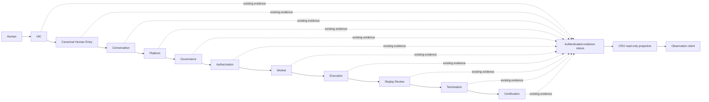
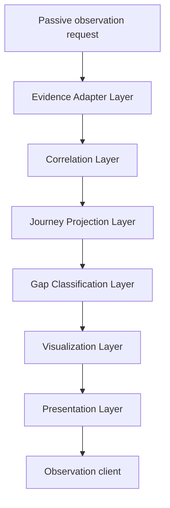

# 1. Implementation Summary

Generation: G67-01

Report identity:
G67_01_CONSTITUTIONAL_RUNTIME_OBSERVATORY_ARCHITECTURE_SPECIFICATION_V1

Constitutional baseline: `CONSTITUTIONAL_GOVERNANCE_CLOSED`,
`CANONICAL_TYPED_SEMANTIC_COMPOSITION_CONVERGENCE_ESTABLISHED`,
`CONSTITUTIONAL_EXECUTION_SPINE_CONVERGENCE_ESTABLISHED`,
`CONSTITUTIONAL_PRODUCTION_WORKFLOW_REQUIRES_EXTENSION`,
`CLARIFICATION_PRODUCER_CONSUMER_CONTRACT_CONVERGENCE_ESTABLISHED`,
`CONSTITUTIONAL_NATURAL_CONVERSATION_CAPABILITY_REQUIRES_IMPLEMENTATION`, and
`CONSTITUTIONAL_RUNTIME_OBSERVATORY_DISCOVERY_COMPLETED`.

Authenticated repository identity:

- Commit: `53ff64da533fc9e9008e2cd69423611c366124c5`
- Tree: `d4309d96bca98daf3d9e31848364c754c0b03216`
- Subject: `G67-00: audit constitutional runtime observatory discovery`
- Parent: `0e88c6bfd42bbe050112d5a1a0b3c021a68a9936`

Implementation contracts: G48 Constitutional Evidence Reporting Standard V1;
Constitutional Architecture Specification V1; Canonical Layer Model;
Constitutional Flow Architecture; G15 Replay Observation Layer; G18 runtime
status and root-cause trace; G19 Canonical Presentation; G31 Common Entry and
execution spine; G47 Development Governance; G59 Conversation Layer V2; G60
Human Interface/Conversation integration; G64 constitutional completion; G65
Constitutional Nervous System; G66-13, G66-14, G66-18, G66-19; and G67-00.

Reporting date: 2026-08-04.

Objective:

Specify the complete constitutional architecture for a passive Constitutional
Runtime Observatory (CRO) capable of reconstructing and visualizing the
authenticated lifetime of one Human Intent without becoming a production
owner, predecessor, successor, authority, or source of runtime evidence.

Architecture scope:

- define the Human Intent Journey as a non-authoritative, in-memory projection
  over existing authenticated evidence;
- define normalized Runtime Event, Decision, journey state, correlation, gap,
  visualization, and presentation contracts;
- define six internal passive layers and channel-neutral future extension
  boundaries;
- maximize reuse of existing Replay, reconstruction, observation, status,
  trace, Presentation, and static-topology capabilities; and
- preserve one canonical production-entry topology and every current owner.

No implementation is authorized or performed. The models in this report are
architecture-level view contracts. They do not create an API, persisted schema,
Replay artifact, runtime event, registry, authority class, owner, or production
workflow.

Modified modules:

- `docs/governance/G67_01_CONSTITUTIONAL_RUNTIME_OBSERVATORY_ARCHITECTURE_SPECIFICATION_V1.md`
  — this architecture-only G48 evidence artifact.

Intentionally unchanged modules:

- all Human Interaction, Canonical Human Entry, Conversation, CWM, Semantic
  Slot, proposal, Commitment, Platform Core, Governance, Authorization,
  Worker, provider, execution, result, Replay, termination, Certification,
  Presentation, observability, schema, policy, baseline, PCBV31, adapter,
  bridge, deployment, and test code;
- all existing Replay and owner-local evidence schemas; and
- the G65 static nervous-system map, which remains descriptive evidence rather
  than a runtime registry.

Architectural boundaries preserved:

- the CRO reads authenticated evidence only after an existing owner produces
  it;
- every fact retains its existing constitutional owner and validator;
- CRO correlation creates no source fact and repairs no missing lineage;
- CRO rendering cannot approve, authorize, dispatch, invoke, mutate, retry,
  cancel, terminate, certify, or promote; and
- no CRO edge is inserted into the production owner graph.

## Architectural Vision

The CRO is an external, passive constitutional observability composition. Its
primary object is the `Human Intent Journey`: a deterministic view of the
authenticated evidence produced as one Human Intent moves through the one
canonical entry topology and its branch-appropriate owners.

The Human Intent Journey begins at the earliest authenticated Human/adaptor or
Canonical Human Entry evidence available for the initiating source act. It
includes only later Human acts that are explicitly bound to that intent, such
as clarification replies, candidate confirmation, Objective Commitment, and
execution authorization. It ends at the branch-appropriate authenticated
terminal boundary: read-only Presentation return, final execution
Certification, governed-development constitutional completion, an explicit
blocked/failed/cancelled terminal, or an unresolved gap when the evidence does
not prove a terminal.

`Human Intent Journey` is not a new production identity. It is an ephemeral
projection identity derived from existing source identities and hashes. It
does not replace session, Conversation, source-turn, Commitment, canonical
chain, Replay, execution, or Certification identities.

The architecture is:

~~~text
authenticated evidence produced by existing owners
-> read-only owner adapter and validator
-> fail-closed correlation graph
-> non-authoritative Human Intent Journey projection
-> deterministic gap classification
-> deterministic views
-> passive presentation to an observation client
~~~

No arrow returns from the CRO to an observed owner.

## Constitutional Principles

1. **Evidence before view.** Every displayed fact must resolve to authenticated
   source evidence and its existing owner-local validator or reconstructor.
2. **Owner preservation.** The CRO has no authority over the facts it projects.
   It records the source owner; it does not become that owner.
3. **No production adjacency.** No production owner may require a CRO input or
   emit evidence for the purpose of satisfying a CRO requirement.
4. **No inference of authority.** Natural language, timestamps, filenames,
   visual position, confidence, or absence cannot create Human, Governance,
   Authorization, Worker, Replay Review, termination, or Certification
   authority.
5. **Explicit correlation only.** Hash equality, explicit predecessor
   reference, owner-validated identity, revision lineage, and authenticated
   handoff are the only correlation bases.
6. **Fail-closed ambiguity.** More than one admissible lineage is
   `AMBIGUOUS`; the CRO must not choose a convenient path.
7. **Branch awareness.** A stage absent from a read-only or refused branch is
   `NOT_REACHED` or `NOT_APPLICABLE`, not evidence loss.
8. **Gap visibility.** Missing, excluded, uncomposed, corrupt, and unknown
   evidence remain visibly distinct.
9. **Deterministic presentation.** Identical authenticated evidence,
   architecture version, adapter catalog, and requested view produce the same
   projection and rendering.
10. **Source drill-down.** Every event, decision, state, edge, and gap retains
    its exact source reference, artifact hash, owner, and validation result
    when those fields exist.
11. **Post-hoc first.** The initial architecture observes persisted evidence;
    live instrumentation and pre-artifact telemetry are outside scope.
12. **No consciousness claim.** Constitutional self-knowledge means bounded
    evidence inspection, diagnosis, and explanation. It does not establish
    self-awareness, consciousness, sentience, or autonomous self-direction.

# 2. Code Evidence

## Public API

No public API is added by G67-01. A future implementation may expose a
read-only CRO query boundary, but that boundary is not authorized here and
must not be added to Canonical Human Entry or any production owner.

Existing pure/read-only capabilities that define the feasible boundary include:

~~~python
def replay_observation_artifact(
    *,
    replay_identifier: str,
    source_replay_artifact: dict[str, Any],
    observed_at: str,
    sequence: int,
) -> dict[str, Any]:
    """Normalize one replay artifact into one deterministic observation."""
~~~

~~~python
def reconstruct_production_conversation_flow_binding_v1(
    replay_reference: str | Path,
) -> dict[str, Any]:
~~~

~~~python
def trace_platform_core_root_cause(
    *,
    observed_field: str | None = None,
    observed_value: Any = None,
    failure_reason: str | None = None,
    artifact_reference: str | Path | None = None,
    replay_reference: str | Path | None = None,
    runtime_result: dict[str, Any] | None = None,
    user_visible_result: dict[str, Any] | None = None,
    created_at: str = "2026-07-11T00:00:00Z",
) -> dict[str, Any]:
    """Trace an observed result backward to replay-backed causal evidence."""
~~~

The existing generic reconstruction API has a write-capable default:

~~~python
def reconstruct_latest_chain(
    *,
    replay_root: str | Path,
    report_dir: str | Path,
    created_at: str,
    persist_report: bool = True,
) -> dict[str, Any]:
~~~

The existing chain-inspection caller explicitly disables that write mode:

~~~python
        kwargs["persist_report"] = False
        report = reconstruction_func(**kwargs)
~~~

A future CRO may reuse only the read-only form. It must not rely on a caller
remembering an unsafe default; its own adapter contract must fix persistence,
provider invocation, Worker invocation, runtime mutation, and owner calls to
false by construction.

The future conceptual read request may select an existing journey by session,
Conversation, source turn, Human Intent precedence, Commitment, Flow Binding,
canonical chain, Replay reference, artifact hash, execution, or Certification
identity. This is an architecture-level selector vocabulary, not a new runtime
API or schema.

## Orchestration Entry Point

The CRO has no production orchestration entry point. The production topology
and the passive observation topology are disjoint:

The dotted edges represent evidence already emitted for each owner's own
constitutional purpose. They are not callbacks, hooks, events inserted for the
CRO, or new successors. The CRO query/response path is an observation path,
not a production Human Intent workflow.

The observation boundary is post-persistence. Evidence may be read after a
stage completes or while an owner has independently persisted an explicit
pending/progress artifact. The CRO must not claim visibility into an
unpersisted call stack, terminal keystroke, provider content excluded from
Replay, or failure that occurred before any authenticated evidence was written.

## Semantic Reductions

The CRO performs no semantic reduction. It must not:

- parse unrestricted Human language;
- create or revise a Semantic Slot;
- assess an Interpreter Proposal;
- commit a CWM transition;
- decide Candidate Review, readiness, Commitment, route, admission,
  Governance, Authorization, execution, Replay Review, termination, or
  Certification; or
- turn a visual or inferred relationship into source evidence.

The CRO may normalize existing owner vocabulary into view labels only when the
adapter catalog binds that label to an exact artifact type, owner, validator,
and certified topology stage. The normalized label is presentation metadata.
The original artifact remains authoritative.

For example, the existing G66 Conversation reconstruction returns its
validated source decisions and a reconstruction hash:

~~~python
    return {
        "human_intent_precedence_decision": precedence,
        "production_conversation_flow_binding": binding,
        "reconstruction_verified": True,
        "replay_reference": str(root),
        "reconstruction_hash": replay_hash(
            {
                "precedence_hash": precedence["artifact_hash"],
                "flow_binding_hash": binding["artifact_hash"],
            }
        ),
    }
~~~

The CRO may show that verified ordering. It may not supply a missing proposal,
confirmation, readiness, or Commitment.

## Public Validators

The source owner's validator or reconstructor remains the integrity authority.
The Evidence Adapter Layer must call the exact validator/reconstructor for a
recognized artifact version. A generic CRO parser may extract routing metadata
only after the owner-local artifact validates.

The current G66 reconstruction demonstrates the required pattern:

~~~python
    binding = validate_production_conversation_flow_binding_replay_predecessors_v1(
        load_json(binding_paths[0]),
        expected_request_hash=precedence["request_hash"],
    )
~~~

and the validator verifies each predecessor against its authenticated hash:

~~~python
    for reference in binding["ordered_predecessor_references"]:
        captured = load_json(Path(reference["replay_reference"]))
        if replay_hash(captured) != reference["artifact_hash"]:
            _fail("production Conversation predecessor Replay tampering detected")
~~~

The adapter catalog must record, at minimum:

| Field | Architectural requirement |
|---|---|
| adapter identity/version | stable CRO-internal catalog identity; no source authority |
| artifact type/version | exact recognized source contract |
| source owner | existing constitutional owner |
| validator/reconstructor | exact read-only callable or validation composition |
| accepted evidence root | bounded, explicit root class |
| lifecycle stage mapping | versioned projection label |
| identity fields | exact fields eligible for correlation |
| predecessor fields | explicit reference/hash/revision fields |
| branch/terminal predicates | exact source status values and rules |
| content visibility | displayed, referenced-only, redacted, or intentionally excluded |
| side-effect declaration | read-only, no persistence, no provider, no Worker |
| certified source generation | evidence basis for the mapping |

An unknown artifact version is `UNSUPPORTED_EVIDENCE`; it is never accepted by
structural resemblance. An adapter with a write-capable dependency must wrap
only an explicitly pure mode. If purity cannot be established, the capability
is not reusable by the CRO.

## Canonical Data Models

The following models are non-authoritative in-memory projections. They are not
new L1 canonical artifact definitions and must not be persisted into source
Replay. Every field that states a runtime fact must point back to authenticated
owner evidence.

### Human Intent Journey Model

The `Human Intent Journey` is a branch-aware directed acyclic projection of
one initiating Human Intent and every explicitly bound descendant decision or
owner transition.

#### Identity

| Identity element | Rule |
|---|---|
| root anchor | earliest uniquely reconstructed Human source act plus its session/workspace/Conversation provenance and source or request digest |
| journey projection identity | deterministic digest of architecture version and the immutable root-anchor identity tuple |
| aliases | existing session, Conversation, CWM, source-turn, Commitment, Flow Binding, canonical-chain, Replay, execution, result, termination, and Certification identities |
| alias admission | only an explicit reference, exact hash, owner-validated identity, revision link, or authenticated handoff may add an alias |
| late-entry query | trace backward to exactly one root anchor; zero roots is unresolved and multiple roots is `AMBIGUOUS` |
| stability | later evidence extends the same projection because the identity depends on the root anchor, not the current set of events |
| authority | the journey identity grants none and cannot be used as a production predecessor |

The same session may contain multiple Human Intent Journeys. Shared session,
workspace, filename, timestamp, similar text, or actor identity is not enough
to merge them. A clarification or exact Human act joins a journey only through
its owner-bound envelope, candidate/summary digest, Commitment, or other exact
predecessor evidence.

#### Lifecycle

The Journey lifecycle is a topology, not one universal linear chain:

~~~text
authenticated Human source act
-> Canonical Human Entry / precedence
-> branch decision

   READ-ONLY
   -> Self Knowledge or Platform Knowledge
   -> Presentation / Human return

   GOVERNED ACTION
   -> Conversation proposal / validation / commit / CWM
   -> Candidate Review / exact confirmation / readiness / Commitment
   -> Platform admission / Reuse Proof / Governance / preparation
   -> exact execution decision / Authorization
   -> Worker / execution / result validation

      NON-MUTATING
      -> capability Completion / Replay Review / termination
      -> final execution Certification / Human return

      ACCEPTED MUTATION
      -> task-outcome review / disposable validation / acceptance
      -> mutation decision / mutation Authorization
      -> replacement Worker / result / Replay Review / termination
      -> final execution Certification / Human return

   GOVERNED-DEVELOPMENT COMPLETION, WHEN COMPOSED
   -> pending outcome / external G48 / Governance assessment
   -> constitutional Certification / promotion / completion
~~~

The projection must represent conditional branches without suggesting that
every journey traverses them. The G66-16 absence of one default G66-to-G64
mutation/completion composition must be displayed as `UNCOMPOSED`, not drawn as
an observed transition.

#### Ownership

No single owner owns the Journey. Ownership is federated and immutable:

- Human Authority owns exact Human source and decision acts;
- Canonical Human Entry owns entry validation and continuation transport;
- Conversation/G59 owns proposal validation, CWM mutation, Candidate Review,
  readiness, and Objective Commitment evidence;
- Platform, Reuse Proof, G47, planning, and preparation owners retain their
  exact admission and Governance responsibilities;
- Authorization, Worker, provider/local execution, result, Replay Review,
  termination, Certification, and Presentation owners retain their evidence;
  and
- the CRO owns no source fact or constitutional decision. Its internal layers
  are responsible only for ephemeral view computation.

#### Boundaries

The Journey begins only where authenticated evidence begins. Unauthenticated
terminal process arrival before the first persisted act is `NOT_OBSERVED`. The
Journey ends only when a branch terminal is authenticated or when a gap
prevents further proof. A CRO terminal label is not the same as a Governed
Termination artifact:

- `PRESENTATION_RETURN_TERMINAL` is a view label for a completed read-only or
  Human-return branch;
- `FINAL_EXECUTION_CERTIFICATION` is shown only from its exact owner evidence;
- `CONSTITUTIONAL_COMPLETION` is shown only from G64 evidence;
- `BLOCKED`, `FAILED`, or `CANCELLED` requires explicit owner evidence; and
- an incomplete evidence chain ends `UNKNOWN` or another exact gap class, not
  an invented terminal.

#### State progression

Progression is append-only in the projection and source-order preserving. A
later observation cannot rewrite an earlier owner decision. Revision-bearing
state is ordered by validated revision/predecessor lineage. Repeated stages,
including a replacement Worker cycle, are represented as distinct occurrences
of the same certified owner stage and retain separate evidence identities.

### Runtime Event Model

A `Runtime Event` is a CRO projection of one authenticated owner artifact or
one explicitly authenticated transition between artifacts. It is not a new
runtime-emitted event.

| Runtime Event field | Definition |
|---|---|
| event identity | deterministic view identity derived from architecture version, source owner, source artifact/replay hash, stage mapping, and occurrence index |
| event owner | exact existing owner recorded by the artifact or adapter catalog; never `CRO` for a runtime fact |
| event evidence | source reference, artifact type/version, artifact hash, Replay hash/index/step, validator/reconstructor result, and permitted source excerpt |
| event transition | one directed edge supported by an explicit predecessor, authenticated handoff, exact hash, owner-validated identity, or revision link |
| event classification | `SOURCE_ACT`, `STATE_TRANSITION`, `PROPOSAL`, `VALIDATION`, `HUMAN_DECISION`, `ADMISSION`, `GOVERNANCE_DECISION`, `AUTHORIZATION`, `RESOURCE_SELECTION`, `WORKER_LIFECYCLE`, `EXECUTION`, `RESULT`, `REPLAY_REVIEW`, `TERMINATION`, `CERTIFICATION`, or `PRESENTATION` |
| stage | exact versioned Journey stage |
| occurrence | stable occurrence number within that stage and journey, ordered by authenticated predecessors rather than timestamp |
| source time | exact source timestamp and field name when present; otherwise absent |
| authority | copied source authority classification or `NONE`; the event projection grants none |
| visibility | full view, reference-only, redacted, or intentionally excluded according to source contract |

One source artifact may yield one event plus several evidence edges, but the CRO
must not split one owner decision into multiple apparent authorities. A
transition with no authenticated edge is a separate gap projection, not a
Runtime Event.

### Journey State Model

Journey state has three independent dimensions:

1. `stage` — constitutional position in the owner topology;
2. `outcome` — what the authenticated owner evidence says occurred; and
3. `observation disposition` — whether and how the CRO can authenticate it.

This separation prevents `FAILED`, `NOT_REACHED`, and `NOT_RECORDED` from
becoming synonyms.

#### Stage vocabulary

| Region | Exact stage classes |
|---|---|
| Human ingress | `HUMAN_ENTER`, `HIC_TRANSPORT`, `CANONICAL_HUMAN_ENTRY`, `HUMAN_INTENT_PRECEDENCE`, `FLOW_BINDING` |
| Conversation | `CONVERSATION`, `SEMANTIC_SLOTS_CWM`, `PROPOSAL`, `PROPOSAL_VALIDATION`, `PROPOSAL_COMMIT`, `CANDIDATE_REVIEW`, `HUMAN_CONFIRMATION`, `OBJECTIVE_READINESS`, `OBJECTIVE_COMMITMENT` |
| read-only | `SELF_KNOWLEDGE`, `PLATFORM_KNOWLEDGE`, `PRESENTATION_RETURN` |
| Platform/Governance | `COMMITMENT_HANDOFF`, `PLATFORM_OBJECTIVE`, `PLATFORM_ADMISSION`, `REUSE_PROOF`, `DEVELOPMENT_GOVERNANCE`, `PLANNING_DURABLE_WORK`, `PROPOSAL_REVIEW`, `CAPABILITY_ROUTE`, `EXECUTION_PREPARATION`, `EXECUTION_SUMMARY`, `HUMAN_EXECUTION_DECISION` |
| Authorization/Worker | `EXECUTION_AUTHORIZATION`, `RESOURCE_SELECTION`, `WORKER_INVOCATION_REQUEST`, `WORKER_ASSIGNMENT`, `WORKER_DISPATCH`, `WORKER_INVOCATION` |
| execution/result | `EXECUTION`, `RESULT_CAPTURE`, `RESULT_VALIDATION`, `CAPABILITY_COMPLETION` |
| mutation branch | `TASK_OUTCOME_REVIEW`, `DISPOSABLE_VALIDATION`, `ACCEPTANCE_PREREQUISITE`, `CONTENT_ACCEPTANCE_DECISION`, `CONTENT_ACCEPTANCE`, `MUTATION_CANDIDATE`, `HUMAN_MUTATION_DECISION`, `MUTATION_AUTHORIZATION`, `REPLACEMENT_WORKER_CYCLE` |
| terminal execution | `POST_EXECUTION_REPLAY_REVIEW`, `GOVERNED_TERMINATION`, `FINAL_EXECUTION_CERTIFICATION`, `PRESENTATION_RETURN` |
| constitutional completion | `PENDING_CONSTITUTIONAL_COMPLETION`, `EXTERNAL_G48_EVIDENCE`, `GOVERNANCE_ASSESSMENT`, `CONSTITUTIONAL_CERTIFICATION`, `PROMOTION_DECISION`, `CONSTITUTIONAL_COMPLETION` |

The topology catalog may add a stage only through later governed architecture
work. Renderers may group stages for a concise view, but the underlying Journey
must retain the exact stage.

#### Outcome vocabulary

| Outcome | Exact meaning |
|---|---|
| `ENTERED` | source evidence proves the stage was entered but not a later result |
| `PENDING` | source evidence explicitly records a pending state |
| `SUCCEEDED` | the owner records successful completion under its own contract |
| `BLOCKED` | the owner explicitly blocks continuation pending a required predecessor or decision |
| `FAILED` | authenticated owner evidence records failure or fail-closed termination |
| `CANCELLED` | authenticated owner or exact Human evidence records cancellation under an existing contract |
| `TERMINATED` | an exact branch terminal or Governed Termination is recorded; the exact subtype remains visible |
| `CERTIFIED` | an exact Certification owner records Certification |
| `NOT_APPLICABLE` | a validated branch predicate excludes the stage from this journey |

`PENDING` may not be inferred merely because later evidence is absent.
`SUCCEEDED` at one stage does not imply the next stage was reached. `CERTIFIED`
must identify whether it is final execution Certification or constitutional
Certification.

#### Observation disposition

| Disposition | Meaning |
|---|---|
| `OBSERVED_AUTHENTICATED` | exact source evidence passed its owner validator/reconstructor |
| `OBSERVED_INVALID` | evidence was present but failed integrity validation; gap class is `CORRUPTED` |
| `UNOBSERVED` | no authenticated event can be projected; one exact gap class explains why |

### Decision Model

A `Decision` is projected only from an existing artifact whose owner contract
contains a choice, assessment, status, disposition, confirmation, refusal, or
terminal determination. A validator invocation alone is not a decision unless
its source contract records a separately meaningful decision artifact.

Each Decision contains:

| Decision field | Architectural rule |
|---|---|
| Decision identity | source decision identity when present, plus a deterministic view identity tied to its artifact hash |
| Owner | exact existing constitutional owner |
| Reason | exact reason/status code and bounded source explanation; never CRO-generated rationale |
| Evidence | source reference, artifact and Replay hashes, validated predecessor references, and reconstruction result |
| Input state | exact predecessor stage occurrence(s) and source state hashes/revisions |
| Output state | exact owner-recorded successor status and admitted successor, if any |
| Confidence | source-recorded confidence with provenance, or `NOT_APPLICABLE`; CRO computes no score |
| Rule | exact rule/predicate identifier when recorded, otherwise source contract reference; never an inferred policy |
| Replay reference | exact owner-local Replay reference when present, otherwise explicit `NOT_RECORDED`/`INTENTIONALLY_EXCLUDED` disposition |

Human confirmation, Objective Commitment, execution authorization, content
acceptance, and mutation authorization remain distinct decisions over distinct
subjects. The visualization must not merge them into one generic Human approval.
Likewise Proposal Validation, result validation, disposable validation, Replay
Review, execution Certification, and constitutional Certification remain
separate decisions.

## Deterministic Algorithms

### Journey Correlation Model

The Correlation Layer forms a typed evidence graph. It maximizes reuse by
delegating artifact integrity to existing reconstructors and adding only a
read-only cross-owner resolver.

#### Correlation axes

| Axis | Existing authenticated evidence | Correlation rule |
|---|---|---|
| session | UHI, Canonical Entry, clarification, G66 binding | exact identity equality within an owner-validated artifact; session alone never merges journeys |
| Conversation | Conversation/CWM identities, workspace, revisions | exact identity plus revision/predecessor lineage |
| Semantic Slots | CWM state, proposal operations, commit transition | source-bound operation and persisted CWM revision/hash |
| Commitment | candidate, confirmation, readiness, Commitment hashes | exact candidate/objective digest and owner predecessor |
| Replay | reference path, wrapper hash, index, step, reconstruction | bounded path plus verified wrapper/artifact hash |
| Flow Binding | ordered predecessor references | preserve exact recorded order and hashes |
| Governance | Platform Objective, Reuse Proof, G47, plan/Durable Work, preparation | exact Objective/scope/chain handoffs and owner hashes |
| Authorization | execution summary, actor/session confirmation, Authorization | exact summary hash, actor, session, predecessor and authorization hash |
| Worker | selection, request, assignment, dispatch, invocation | exact lifecycle identity and predecessor hash at every transition |
| Execution | invocation, execution, result capture/validation | exact invocation/execution/result identities and hashes |
| Certification | Review, termination, final Certification or G64 completion | exact validated predecessor, chain, termination, certification and promotion references |

#### Correlation evidence classes

Correlation edges are admitted in this descending integrity order:

1. `EXPLICIT_PREDECESSOR_HASH` — a source artifact names the predecessor and
   its hash, both validate;
2. `EXPLICIT_REPLAY_REFERENCE` — a validated artifact points to owner-local
   Replay whose wrapper/artifact hashes validate;
3. `AUTHENTICATED_HANDOFF` — two owners' validated artifacts bind the same
   exact handoff identity and hashes;
4. `OWNER_VALIDATED_IDENTITY` — an owner validator proves an identity within
   the same lineage;
5. `REVISION_PREDECESSOR` — exact prior/new revision and state hashes prove a
   state transition; and
6. `STATIC_TOPOLOGY_EXPECTATION` — may identify an expected edge for gap
   classification only; it never proves a runtime transition.

Filename similarity, directory proximity, timestamp proximity, equal free-form
text, equal actor identity, and static map adjacency are never sufficient.

#### Resolution algorithm

1. Validate the observation request and explicit evidence roots; reject path
   escape, overlapping unauthenticated roots, empty selectors, and more than one
   unresolved root candidate.
2. Resolve the selector to source artifacts using a versioned adapter catalog.
3. Invoke owner-local validators/reconstructors and preserve each exact result.
4. Establish or reconstruct exactly one root Human Intent anchor.
5. Traverse explicit predecessor edges backward to the root and successor
   edges forward only when both endpoints validate.
6. Bridge early session/Conversation/Flow Binding identities to later
   Commitment/chain/Authorization identities only through authenticated
   handoff evidence.
7. Preserve repeated stage occurrences and branch predicates.
8. Detect cycles, cross-session substitution, cross-actor substitution,
   cross-root path escape, stale revision, conflicting hashes, and multiple
   eligible successors; fail closed at the affected edge.
9. Normalize validated nodes into Runtime Events, Decisions, and stage states
   in memory.
10. Compare the observed graph with the versioned lifecycle topology and apply
    exactly one primary gap class to every absent, invalid, interrupted, or
    topology-inconsistent expected occurrence.
11. Order events by authenticated predecessor/revision lineage, then owner
    replay index/step, and only then use timestamps as display metadata.
12. Render requested deterministic views without persisting the Journey or
    calling an observed owner.

The resolver returns a complete projection only relative to its explicit
evidence roots, adapter catalog version, and topology version. It must display
those limits. It may not claim global repository completeness from a bounded
query.

#### Correlation result invariants

- every observed node has exactly one source owner and validation result;
- every observed edge cites its evidence class and source reference;
- every stage occurrence belongs to exactly one uniquely rooted Journey or is
  quarantined as `AMBIGUOUS`;
- no gap is converted into a synthetic event;
- no static topology edge is represented as dynamically traversed without
  runtime evidence; and
- identical inputs produce identical graph identities and ordering.

## Responsibility Boundaries

### Passive Layer Specification

The CRO is passive because its input is finalized or independently persisted
existing evidence, its computation is pure/read-only, and its output is an
ephemeral view returned only to an observation client. No output is admissible
as a predecessor to a production owner.

#### Allowed operations

- accept a read-only observation request and explicit bounded evidence roots;
- load existing evidence without modifying access times where the underlying
  platform permits, and without acquiring write handles;
- verify existing serialization, Replay hashes, artifact hashes, revisions,
  identities, and predecessor references;
- invoke owner-local pure validators and reconstructors;
- call an existing mixed-mode inspector only through a proven read-only mode,
  such as unified reconstruction with `persist_report=False`;
- correlate authenticated identities and build an in-memory graph;
- compare evidence with a versioned descriptive topology;
- classify gaps and interruptions deterministically;
- render and return deterministic text, JSON-like view data, or diagrams to an
  authenticated observation client; and
- cite exact source references for human inspection.

Returning a response is not Replay persistence. Any future export, cache,
telemetry, report store, or observation ledger requires separate authorization.

#### Forbidden operations

- write, rewrite, move, delete, repair, append to, or reindex source Replay;
- call `generate_replay_observation_layer(...)`,
  `observe_replay_directory(...)`, a progress recorder, persisted
  reconstruction mode, or any evidence/report writer;
- insert hooks, events, trace calls, callbacks, spans, metrics, probes, or
  dependencies into a production owner;
- accept a CRO Journey, Event, Decision, state, diagram, or gap as production
  evidence;
- invoke Canonical Human Entry, Conversation mutation, Objective admission,
  Governance, Authorization, Worker, provider, execution, Replay Review,
  termination, Certification, promotion, or mutation APIs;
- dispatch, retry, cancel, compensate, repair, approve, authorize, certify, or
  promote;
- infer Human authority from natural language or an observation query;
- infer a transition from time, filename, directory, text similarity, or static
  topology alone;
- recover or display raw provider content that its source contract excludes;
- reinterpret a compatibility, historical, development, test, or dead entry as
  a production path; or
- create a maintenance task, patch, policy, baseline, schema, owner, or runtime
  identity.

#### Authority and ownership boundaries

| Boundary | Existing owner authority | CRO limit |
|---|---|---|
| Human | source, confirmation, Commitment, authorization, acceptance, mutation decision | display exact act/subject only; never infer assent or create Human authority |
| Canonical Entry | admission, validation and continuation transport | observe entry evidence; never become ingress or continuation owner |
| Conversation | proposal validation, CWM mutation, review, readiness, Commitment | reconstruct state; never parse, propose, commit, confirm or decide readiness |
| Platform | Objective, admission, route and service boundaries | show exact outcome; never infer or admit an Objective |
| Governance | Reuse Proof, G47, planning, approval, mutation and promotion decisions | show owner reason/evidence; never reassess, approve or promote |
| Authorization | exact bounded execution/mutation permission | show subject and hashes; never authorize, renew, consume or revoke |
| Worker/provider/execution | selection, dispatch, invocation and effects | show persisted lifecycle; never invoke, retry, cancel or inspect excluded content |
| Replay | immutable evidence and owner-local reconstruction | read/verify only; ordinary CRO reconstruction is not Post-Execution Replay Review |
| termination | exact governed closure | show terminal evidence; never terminate |
| Certification | execution or constitutional Certification | display exact certified subject/scope; never certify |
| CRO internal layers | ephemeral projection computation only | no constitutional source ownership or production authority |

#### Replay boundaries

The CRO may read Replay wrappers, verify hashes, and call reconstructors. It
must not create a Replay record of its own in the initial architecture. The
source Replay reference and validation result remain visible. A CRO projection
hash may support deterministic response comparison in memory, but it is not a
Replay hash, Certification hash, or admissible owner artifact.

Post-Execution Replay Review is a specific authority-bearing lifecycle stage.
The CRO's ordinary read-only reconstruction must never be labeled Replay Review.

#### Governance, Conversation, and Worker boundaries

- Governance evidence is displayed as an existing decision with its scope,
  rule, reason, and predecessors. A gap report is not Governance assessment.
- Conversation evidence is displayed as exact proposals, commits, revisions,
  confirmations, readiness, Commitment, and clarification lineage. A Journey
  cannot mutate CWM or interpret a reply.
- Worker evidence is displayed from exact request, selection, assignment,
  dispatch, invocation, execution, and result artifacts. A visualization
  interaction cannot call, retry, cancel, or otherwise signal a Worker.

### Runtime Integration

The CRO observes the production lifetime at evidence boundaries only:

| Production region | Evidence observed | CRO relationship |
|---|---|---|
| Human Enter/HIC | persisted UHI/session/source records when present | post-hoc read; pre-persistence arrival may be `NOT_OBSERVED` |
| Canonical Human Entry | request, precedence, flow/continuation captures | reconstruct and correlate only |
| Conversation | CWM, Slots, proposal, validation, commit, review, readiness, Commitment | owner-local validation and state projection |
| Platform | Objective, admission, route, Project Services context | display exact branch and outcome |
| Governance | Reuse Proof, G47, plan/Durable Work, review/preparation | display exact owners and decisions |
| Authorization | summary, Human act, Authorization evidence | display exact authorized subject and status |
| Worker | request, selection, assignment, dispatch, invocation | reconstruct exact ordered occurrences |
| Execution/result | local/provider execution metadata, capture, validation, Completion | show permitted evidence; respect content exclusion |
| Replay Review | exact post-result review artifact | display as owner decision, distinct from CRO reconstruction |
| Termination | Governed Termination evidence | display exact terminal classification |
| Certification | final execution or constitutional evidence | display exact subject, scope, predecessor and status |

No row grants an observation hook or requires an owner to emit new evidence.
If an existing owner does not persist a required fact, the CRO applies a gap
class rather than modifying that owner.

## Visualization Architecture

All views consume the same immutable in-memory Journey projection. A view may
filter or group data but cannot create a stage, edge, decision, owner, or
terminal absent from the projection. Each rendering includes architecture,
topology and adapter-catalog versions; journey projection identity; evidence
root scope; validation summary; and gap summary.

| Required view | Deterministic content | Mandatory safeguards |
|---|---|---|
| Sequence Diagram | ordered owner lanes, Human acts, event occurrences, explicit transitions, branch returns and terminal | order by authenticated lineage; dotted/static expectation never shown as observed |
| State Diagram | stage nodes, exact outcomes, branch predicates, repeat cycles and terminals | stage, outcome and observation disposition remain separate |
| Intent Journey | root Human Intent anchor, correlated identities, branch path, decisions, last verified point and terminal/gap | one uniquely rooted journey only; no session-wide merging |
| Timeline | ordered events with exact source timestamp field/value, revision, replay index and elapsed values when recorded | timestamps are display metadata and never sole ordering proof |
| Decision Tree | owner decisions, input/output state, rule, reason, evidence, exact true/false/fail-closed branch | no CRO-generated rationale or combined Human approvals |
| Owner Map | G65 static owner/topology base plus current observed nodes/edges and a versioned G66/G67 overlay | distinguish `STATIC_EXPECTED`, `OBSERVED`, `NOT_REACHED`, and stale topology |
| Evidence Map | artifact/reference/hash graph, owner validator, reconstruction status and drill-down source | reference-only/redacted evidence stays protected; invalid evidence is quarantined |
| Workflow Interruption Map | last authenticated event, exact failure/gap, affected expected successor, downstream `NOT_REACHED` stages | never identify a root cause beyond authenticated evidence |
| Gap Classification View | one row per primary gap with class, stage, evidence scope, detection rule, source contract and remediation boundary | gap is descriptive; it creates no task, fix, Governance decision or authority |

Determinism requirements:

- stable sort by topology position, authenticated predecessor order, stage
  occurrence, owner, and source identity;
- stable identifiers derived from canonical existing hashes and explicit
  version inputs;
- fixed visual symbols and colors per exact stage outcome and gap class;
- no layout-dependent meaning; a text/structured representation must preserve
  the same facts as a graphical representation;
- explicit rendering of missing time, reason, confidence, Replay, and terminal
  fields; and
- identical facts across views must link to the same Runtime Event, Decision,
  stage occurrence, and source evidence identity.

## Gap Classification

Each expected stage occurrence receives at most one primary gap class. Related
secondary facts may be listed, but renderers must not hide the primary class.

| Gap class | Exact constitutional meaning | Required evidence/test |
|---|---|---|
| `NOT_REACHED` | validated branch/predecessor evidence proves the owner stage was not entered | prior branch result, refusal, block, failure or absent mandatory predecessor is authenticated |
| `NOT_OBSERVED` | an occurrence may have happened, but it lies outside persisted/authenticated evidence visible to the bounded CRO query | observation boundary or evidence-root limitation is explicit; no claim that a record should exist |
| `NOT_RECORDED` | the source contract/topology says a traversed stage should have persisted evidence, but no admissible record exists | traversal claim or successor exists, expected record rule is known, and search scope is complete for the bounded root |
| `INTENTIONALLY_EXCLUDED` | the constitutional/source contract deliberately excludes the content or event from Replay/observation | exact exclusion rule, such as bounded raw provider-content exclusion |
| `UNCOMPOSED` | certified components exist, but no authenticated production caller/handoff connects them in this journey | current caller graph and topology prove missing composition, such as the G66-to-G64 completion gap |
| `FAILED` | an existing owner artifact explicitly records failure or fail-closed outcome | validated failure evidence and owner reason/status |
| `CORRUPTED` | evidence exists but its schema, hash, Replay chain, predecessor, identity, or reconstruction validation fails | exact validator/reconstructor failure; content is not used downstream by the CRO |
| `AMBIGUOUS` | two or more authenticated candidates satisfy available links and no exact evidence selects one | candidate set and missing discriminator are shown; no candidate is chosen |
| `UNKNOWN` | authenticated evidence is insufficient to assign any more specific class | all more specific classification predicates were evaluated and failed |
| `NOT_APPLICABLE` | the topology includes the stage, but a validated branch predicate excludes it from this journey | exact branch predicate and selected branch |
| `UNSUPPORTED_EVIDENCE` | evidence is present but no authenticated/versioned adapter can validate or map its artifact version | artifact/version/reference shown without speculative parsing |
| `STALE_TOPOLOGY` | validated runtime evidence names a stage/transition not represented by the selected descriptive topology version | source evidence remains visible; static map is not treated as authority |

Classification precedence is deterministic:

1. present but invalid evidence -> `CORRUPTED`;
2. multiple admissible correlations -> `AMBIGUOUS`;
3. unsupported artifact version -> `UNSUPPORTED_EVIDENCE`;
4. validated runtime stage absent from the selected topology ->
   `STALE_TOPOLOGY`;
5. explicit owner failure -> `FAILED`;
6. explicit constitutional exclusion -> `INTENTIONALLY_EXCLUDED`;
7. absent authenticated production composition -> `UNCOMPOSED`;
8. validated branch exclusion -> `NOT_APPLICABLE`;
9. validated predecessor/branch stop -> `NOT_REACHED`;
10. expected persisted record absent from a complete bounded root ->
   `NOT_RECORDED`;
11. event outside the observable/evidence-root boundary -> `NOT_OBSERVED`; and
12. otherwise -> `UNKNOWN`.

For an explicit failure, the failed stage is `FAILED`; its downstream stages
are normally `NOT_REACHED`. A corrupt failure artifact remains `CORRUPTED`, not
`FAILED`, because its owner outcome is not authenticated.

## Architectural Layers

| Layer | Inputs | Responsibility | Output | Explicit non-responsibility |
|---|---|---|---|---|
| Evidence Adapter Layer | explicit roots/selectors and existing artifacts | select exact version adapter, load, owner-validate/reconstruct, enforce visibility and side-effect rules | validated source records or exact adapter/validation gaps | no generic schema inference, writes, runtime calls or source repair |
| Correlation Layer | validated source records | build typed graph from exact references, hashes, identities, revisions and handoffs; establish one root | authenticated evidence graph with edge classes and quarantined ambiguity | no timestamp/text correlation, stage creation or owner reassignment |
| Journey Projection Layer | unique rooted evidence graph and topology version | derive in-memory Journey, Runtime Events, Decisions, stage occurrences, branches and terminals | non-authoritative normalized projection | no persistence, authority, semantic interpretation or missing transition synthesis |
| Gap Classification Layer | projection, adapter coverage, topology and source contracts | compare observed versus applicable topology and assign one primary exact gap class | gap/interruption records bound to evidence and rules | no fix, task, approval, retry, instrumentation or root-cause invention |
| Visualization Layer | immutable projection and gaps | produce deterministic view models for nine required views | channel-neutral structured render models | no source access, runtime invocation or layout-dependent semantics |
| Presentation Layer | structured render models and client display policy | format text/diagram/structured response, preserve drill-down links and exclusions | passive client response | no new semantic content, Human authority, Replay write or production return |

Cross-layer invariants:

- each layer accepts immutable inputs and returns new in-memory values;
- source references and validation status survive every layer;
- higher layers cannot relax an Evidence Adapter rejection;
- no layer imports or calls a write/execute/authorize/mutate surface;
- no cache or telemetry is part of the core contract; and
- delivery adapters attach only above the Presentation Layer.

## Self-Knowledge Architecture

The CRO enables bounded constitutional self-knowledge by making authenticated
runtime evidence legible. The term describes system evidence about its own
defined owners and workflows; it does not describe subjective experience.

| Capability | CRO meaning | Permitted output | Constitutional limit |
|---|---|---|---|
| self-observation | reconstruct what authenticated owners recorded for one Human Intent | events, states, decisions, evidence and terminals | cannot observe unpersisted or excluded facts |
| self-diagnosis | compare the observed Journey with versioned topology and locate the last verified transition or exact gap | deterministic interruption/gap classification with source rule | cannot infer hidden root causes or reassess an owner decision |
| self-explanation | present who decided what, under which rule, from which input to which output, with evidence | owner/decision/evidence maps and bounded explanation | cannot invent rationale, confidence or constitutional meaning |
| self-maintenance preparation | identify a documented architecture/evidence gap and the separately governed boundary a Human could use for later work | in-memory gap summary, affected owner/stage and source references | cannot create a task, patch, proposal, approval, mutation, promotion or implementation authority |

Self-maintenance preparation stops before Development Governance intake. A
Human may separately use the displayed evidence to initiate governed work, but
the CRO response is not a task intake, Reuse Proof, plan, approval,
Authorization, or mutation candidate.

The CRO does **not** establish self-awareness, consciousness, sentience,
subjective experience, autonomous intention, autonomous constitutional
authority, or self-modifying governance.

## Future Extension Points

Future channels attach through thin observation delivery adapters above the
Presentation Layer. They submit bounded read queries and render the same
channel-neutral view models. They must not call production owners or change the
CRO core.

| Extension | Adapter responsibility | Required safeguards | Core modification |
|---|---|---|---|
| CLI | parse explicit read selector/root/view and render deterministic text/JSON/diagram | read-only command vocabulary; no production mode ambiguity; stable exit status for gaps | none |
| GUI | authenticated selection, navigation, evidence drill-down and deterministic view rendering | no action controls that imply approve/authorize/retry/cancel; display source/gap status | none |
| Browser/Web | secure read client to an independently authorized CRO endpoint | existing browser direct-provider bridge is not reusable as the data path; origin/session/access boundaries | none |
| REST API | authenticated machine query/response envelope over passive CRO views | read semantics only, bounded roots, response identity/version, no production service act treated as Human authority | none |
| Speech | speak an existing deterministic explanation and accept an observation query | transcript provenance; speech cannot create Human confirmation/Commitment/Authorization; no hidden summary omissions | none |
| Agent-to-Agent | machine-identified read query and structured view response | non-Human identity, least-privilege evidence access, no authority impersonation or workflow act | none |

Adding a network listener, persistent export, access-control system, caching,
streaming, notification, or live telemetry is not authorized by this
architecture. Each requires separate threat, privacy, authority, and
governance review. The core evidence/correlation/journey/gap/view contracts
remain unchanged.

## Repository Reuse Matrix

This is the complete owner-family-level reuse matrix for the proposed CRO
core. The 370 current top-level `reconstruct_*` functions remain individually
owned; the matrix groups them by the common responsibility reused by the CRO.

| Capability | Current owner | Current responsibility | CRO responsibility | Modification required |
|---|---|---|---|---|
| immutable JSON/Replay serialization and hashing | Replay transport owners | load, serialize, hash and persist exact owner evidence | load and verify existing wrappers/hashes only | none; write helpers excluded |
| 370 owner-local reconstructors across 334 modules | each exact artifact owner | validate/reconstruct one owner artifact or lineage | invoke through versioned read-only adapters and retain result | none to owner APIs; new adapter catalog required |
| Human/UHI session and source evidence | Human Interface adapters | capture source acts, session/workspace and return context | anchor journey where authenticated evidence exists | none |
| Human Intent precedence and Production Conversation Flow Binding | G66 binding owner | bind exact request and ordered Conversation predecessors | correlate early intent/Conversation events and order | none |
| CWM, Semantic Slots and state-machine transitions | G59 Conversation | durable semantic state and revision lineage | project exact state occurrences and revision edges | none |
| Interpreter Proposal, Validation, Commit, Review, readiness and Commitment | G59/Human Authority | propose, validate, mutate, review and commit Objective intent | display distinct decisions/events and exact Human boundaries | none |
| owner-bound clarification continuation | G66/G60/Project Services owners | restore exact pending owner and present accepted next act | correlate descendant Human acts with the same Journey | none |
| Platform Objective/admission and Project Services context | Platform Core | infer/validate admitted Objective and route exact services | project admission branch and handoff evidence | none |
| Reuse Proof, G47, planning/Durable Work and proposal review | exact Governance/planning owners | determine reuse need, scope, planning eligibility and review evidence | show separate Governance decisions and predecessor chain | none |
| execution route, dry run, capability binding and summary | existing preparation owners | produce one immutable authorization target | project preparation stages and summary-bound Human decision | none |
| execution Authorization | Human/Authorization owners | authorize exact summary and lineage | display exact subject, actor, session, status and evidence | none |
| resource selection and Worker request/assignment/dispatch/invocation | Worker lifecycle owners | select and activate bounded Worker lifecycle | reconstruct ordered Worker occurrences | none |
| local/provider execution metadata | execution/provider owners | perform bounded effects and record permitted evidence | show exact persisted metadata and exclusions | none; raw excluded content remains unavailable |
| result capture, validation and capability Completion | result/capability owners | validate output and complete capability | project distinct result states and branch decision point | none |
| G31 task-outcome/acceptance/mutation continuation | exact Human, Acceptance, Governance, Authorization and Worker owners | review, validate, accept and authorize one mutation cycle | display branch when explicit lineage exists | none; no default provenance invented |
| Post-Execution Replay Review | Replay Review owner | authority-bearing review of validated result lineage | display exact decision; keep distinct from CRO reconstruction | none |
| Governed Termination | termination owner | close reviewed operation | display exact terminal evidence | none |
| final execution Certification | Certification owner | certify one terminated execution | display exact certified subject/scope | none |
| G64 constitutional completion | G48/Governance/constitutional Certification/promotion owners | complete governed-development lifecycle | display only when current evidence proves composition | none; missing default link remains `UNCOMPOSED` |
| G15 pure Replay observation builders | Platform Core observation owner | normalize existing Replay evidence into category/stage/severity | optional adapter normalization precedent | none; persisted generator forbidden |
| unified Replay reconstruction | Replay inspection owner | scan/reconstruct canonical-chain families | reuse only with `persist_report=False`; supplement via adapters | no source change; read-only wrapper required |
| CLI chain inspection, dashboards, ledgers and summaries | operator presentation owners | provide bounded read-only inspection | reuse navigation/summary patterns and verified results | none; insufficient as CRO core alone |
| CHE runtime status projection | Canonical HIR projection owner | show selected late runtime reachability | evidence source for matching journeys | none; private helper need not become public |
| Platform root-cause trace | Platform Core Replay owner | trace result backward to Governance/request evidence | reuse exact causal evidence where artifact family is supported | none; broader CRO correlation is separate |
| runtime progress readers/snapshots | visibility owner | reconstruct already-recorded progress | display existing progress without adding snapshots | none to reader; recorder forbidden |
| runtime-store inspectors | runtime observability owner | inspect older bounded runtime stores | adapter source only when exact identity bridges validate | none; no production reachability inferred |
| G19 Canonical Presentation | Platform Core Presentation | normalize selected Platform response families | reuse non-authority/presentation principles | none; CRO view presentation remains separate |
| G65 static nervous-system map | governance evidence owner | describe nodes, transitions, decisions, owners and reachability | topology seed plus versioned current overlay | source map unchanged; new CRO overlay capability required |
| Replay Experience specification | product experience owner | define personas, navigation, timeline and evidence drill-down | guide deterministic view behavior | none; renderer implementation later required |
| browser observatory cards | development UI owner | present static bounded layer cards | visual design precedent only | not reused as canonical data path; no modification |

The G65 map currently provides 45 nodes, 40 transitions, 19 decisions, 17
entry points, 84 artifact types, 22 owners, 21 authority classes, 17
fail-closed exits, eight reachability records, and 57 source references. Its
own contract remains:

~~~json
"map_semantics": {
  "descriptive_only": true,
  "runtime_registry": false,
  "grants_authority": false,
  "authorizes_execution": false,
  "authorizes_mutation": false,
  "static_reconstruction_only": true,
  "exhaustive_dynamic_reachability_claimed": false
}
~~~

The CRO must preserve those flags. A versioned current overlay supplements the
map for G66/G67 projection; it does not silently rewrite the authenticated G65
artifact or promote it to a runtime registry.

## Reuse Impact Assessment

1. Which existing certified capabilities are reused?

   The architecture reuses immutable Replay loading and hashing; 370
   owner-local reconstructors across 334 modules; UHI/session evidence; G66
   Human Intent precedence, owner-bound continuation and Production
   Conversation Flow Binding; G59 CWM, Semantic Slots, proposal, validation,
   Commit, review, readiness and Commitment; Platform admission, Reuse Proof,
   G47 and execution preparation; Authorization and the complete Worker/result/
   terminal owner chain; G31 conditional acceptance/mutation evidence; G64
   constitutional completion evidence; G15 pure observation; G18 status and
   root-cause tracing; unified read-only reconstruction; inspection,
   dashboards, ledgers, progress readers and runtime inspectors; G19
   Presentation principles; G65's descriptive topology; and the Replay
   Experience specification. The public API excerpts, current source counts,
   G67-00 discovery, and Repository Reuse Matrix establish each reuse family.

2. Which new architectural capabilities are introduced?

   The specification introduces only passive composition concepts: a versioned
   evidence-adapter catalog; a fail-closed cross-owner correlation resolver; a
   stable non-authoritative Human Intent Journey identity/projection; normalized
   Runtime Event, Decision and three-dimensional stage-state views; an exact
   gap-classification engine; a versioned current overlay for the descriptive
   G65 topology; nine deterministic view models; and channel-neutral passive
   presentation/delivery boundaries. These are architecture definitions, not
   implemented APIs or schemas. No runtime event producer, instrumentation,
   owner, authority, Replay writer, Governance decision, Conversation mutation,
   Worker, or Certification capability is introduced.

3. Does any existing certified capability become unreachable?

   No. The CRO is a consumer after evidence persistence and is not a required
   predecessor or successor. No API, mode, owner, schema, branch, compatibility
   surface, development tool, Replay reconstructor, or test fixture is removed
   or reclassified. Intentional evidence exclusions also remain intact.

4. Does the proposed architecture create any parallel production workflow?

   No. The observation request/response path cannot accept a production Human
   act, create semantic state, call Platform/Governance/Authorization/Worker,
   or return an authority-bearing artifact. The production workflow emits its
   existing evidence for its own purposes and never depends on the CRO. The
   architecture expressly forbids promoting the browser bridge, persisted
   observation generator, historical entry, or CRO delivery adapter into a
   production peer.

5. Does the proposed architecture increase or decrease the number of production workflows?

   Neither. The repository retains one canonical production-entry topology
   with its current read-only, non-mutating, mutating, and constitutional-
   completion branches and current documented composition gaps. CRO adds one
   passive view system outside that topology. It may expose an `UNCOMPOSED`
   transition but cannot close it, so production workflow count and
   reachability remain unchanged.

## Constitutional Recommendation

Authorize a later implementation only as a minimal passive composition over
the architecture specified here. That implementation should proceed in this
order:

1. define a closed, versioned adapter/topology catalog outside existing source
   schemas;
2. implement bounded read-only evidence loading and owner-local validation;
3. implement exact cross-owner correlation and ambiguity quarantine;
4. implement the in-memory Journey/Event/Decision/state/gap projections;
5. implement deterministic structured views before channel-specific UI;
6. prove no filesystem writes, provider/Worker calls, runtime-owner imports,
   production successors, or authority-bearing outputs; and
7. certify one successful G66-14 journey plus read-only, refusal, corruption,
   ambiguity, intentional exclusion, mutation, and uncomposed-completion cases.

Do not authorize runtime instrumentation, owner changes, schema changes,
Replay persistence, live telemetry, caching, notifications, automatic
maintenance, or production integration as part of that first implementation.
Any such capability requires a separate constitutional audit and generation.

# 3. Constitutional Self-Assessment

## Verified

- The G67-00 baseline is authenticated at commit
  `53ff64da533fc9e9008e2cd69423611c366124c5` with tree
  `d4309d96bca98daf3d9e31848364c754c0b03216`.
- The architecture defines the CRO outside Canonical Human Entry and every
  production owner transition.
- Human Intent Journey identity, lifecycle, federated ownership, boundaries,
  conditional branches and state progression are specified.
- Runtime Event identity, owner, evidence, transition and classification are
  specified as view projections rather than emitted runtime events.
- Correlation is defined across session, Conversation, Semantic Slots,
  Commitment, Replay, Flow Binding, Governance, Authorization, Worker,
  Execution and Certification.
- Correlation admits only explicit hashes, references, validated identities,
  revisions and handoffs; timestamp/text/filename heuristics are forbidden.
- Journey stage, owner outcome and observation disposition are separate.
- Decision identity, owner, reason, evidence, input/output state, confidence,
  rule and Replay reference are specified.
- All nine required deterministic views are specified over one immutable
  Journey projection.
- All nine mandatory gap classes are defined, and three bounded supplemental
  classes preserve branch, adapter and topology distinctions.
- Allowed and forbidden operations plus authority, ownership, Replay,
  Governance, Conversation and Worker boundaries are explicit.
- Six internal CRO layers have exact inputs, responsibilities, outputs and
  non-responsibilities.
- Self-observation, self-diagnosis, self-explanation and self-maintenance
  preparation are distinguished without creating self-awareness or authority.
- CLI, GUI, Browser/Web, REST, Speech and Agent-to-Agent delivery adapters can
  attach above Presentation without changing the core.
- The complete owner-family-level reuse matrix identifies current owner,
  current responsibility, CRO responsibility and modification requirement.
- No existing source capability requires modification for architecture reuse;
  new work is limited to passive correlation, normalization, gap projection,
  topology overlay and visualization.
- No production runtime, API, schema, owner, Replay, workflow, baseline,
  PCBV31 or test file changed.

## Not Verified

- The CRO is not implemented; no runtime Journey, Event, Decision, gap, view,
  adapter catalog, topology overlay, or delivery adapter exists under this
  architecture-only authorization.
- No dynamic proof yet shows that a future CRO has zero filesystem writes,
  imports no forbidden runtime owner, or produces all nine views.
- No complete Journey has been reconstructed by a CRO because G67-00 proved
  that no current single CRO exists.
- Pre-artifact Human arrival, failures before evidence persistence, and live
  unpersisted call-stack state remain unobservable.
- Raw provider content intentionally excluded by existing contracts remains
  unavailable and must remain so.
- A single default production provenance through G31 accepted mutation and G64
  constitutional completion remains uncomposed as established by G66-16.
- Network, GUI, Browser, REST, Speech, Agent-to-Agent, persistent export,
  caching, telemetry, access-control and deployment behavior are future
  extension concerns and were not implemented or executed.

# 4. Validation Matrix

| Requirement | Evidence | Validation | Result |
|---|---|---|---|
| G48 structure | six exact top-level sections and mandatory Code Evidence responsibilities | deterministic heading/section review | `PASS` |
| authenticated baseline | current commit/tree/subject, G67-00 report and clean initial worktree | exact Git inspection | `PASS` |
| architecture-only scope | repository diff contains one governance specification and no runtime code | Git/diff review | `PASS` |
| Architectural Vision | passive evidence-to-view topology and one Human Intent Journey object | architecture consistency review | `PASS` |
| Constitutional Principles | twelve explicit non-authority, evidence, correlation, branch and determinism rules | architecture consistency review | `PASS` |
| Human Intent Journey Model | identity, lifecycle, ownership, boundaries and progression | model completeness review | `PASS` |
| Runtime Event Model | identity, owner, evidence, transition and classification fields | model completeness review | `PASS` |
| Journey Correlation Model | ten required domains, six edge classes, twelve-step resolver and invariants | architecture consistency review | `PASS` |
| Journey State Model | exact stage vocabulary plus independent outcome and observation dimensions | model completeness review | `PASS` |
| Decision Model | nine required fields and distinct decision subjects | model completeness review | `PASS` |
| Visualization Architecture | Sequence, State, Intent Journey, Timeline, Decision Tree, Owner, Evidence, Interruption and Gap views | deterministic view review | `PASS` |
| Gap Classification | nine required and three supplemental exact classes with deterministic precedence | classification consistency review | `PASS` |
| Passive Layer Specification | allowed/forbidden operations and authority/ownership/Replay/Governance/Conversation/Worker boundaries | boundary review | `PASS` |
| runtime integration | evidence-only observation points and no return edge to production | topology review | `PASS` |
| Architectural Layers | six layers with input, responsibility, output and non-responsibility | architecture consistency review | `PASS` |
| Self-Knowledge Architecture | four bounded self-knowledge functions and explicit consciousness exclusion | constitutional language review | `PASS` |
| future extension points | CLI, GUI, Browser/Web, REST, Speech and A2A above Presentation | adapter-boundary review | `PASS` |
| Repository Reuse Matrix | all scoped owner families and required five columns | source/G67-00 correlation review | `PASS` |
| reconstruction inventory | current source definitions | 370 top-level functions across 334 modules | `PASS` |
| static topology inventory | authenticated G65 JSON | 45 nodes, 40 transitions, 19 decisions and declared passive flags | `PASS` |
| Reuse Impact Assessment | five exact required questions with evidence-based answers | deterministic document review | `PASS` |
| runtime CRO implementation | explicitly forbidden by G67-01 | no implementation validation applicable | `NOT_APPLICABLE` |
| future live/channel behavior | outside architecture-only scope and separately governed | no runtime/channel validation applicable | `NOT_APPLICABLE` |
| governance regression | `tests/test_governance_conformance.py` | pytest: 5 passed | `PASS` |
| governance conformance | read-only governance conformance engine | 20 passed, 0 failed, 0 warnings, 0 critical violations, `CONFORMANT` | `PASS` |
| document consistency | required headings, models, views, gaps, matrix, questions, recommendation and one verdict | deterministic checker: `ARCHITECTURE_DOCUMENT_CONSISTENT`, 1,191 lines | `PASS` |
| whitespace integrity | complete tracked diff and added report | `git diff --check`; no-index added-file check produced no whitespace errors | `PASS` |

# 5. Repository Mutation Summary

Modified files:

- `docs/governance/G67_01_CONSTITUTIONAL_RUNTIME_OBSERVATORY_ARCHITECTURE_SPECIFICATION_V1.md`
  — added the complete architecture-only CRO specification.

Unchanged subsystems:

- all production Human Interaction, Canonical Entry, Conversation, CWM,
  Semantic Slot, proposal, Commitment, Platform Core, Governance,
  Authorization, Worker, provider, execution, result, Replay, termination,
  Certification, Presentation, observability, schema, policy, baseline, PCBV31,
  adapter, bridge, deployment, and test behavior.

API compatibility:

- No API or schema changed. The report's Journey, Event, Decision, state,
  correlation, gap and view models are non-implemented architecture contracts,
  not persisted source artifacts.

Boundary preservation:

- No runtime event, instrumentation, hook, observer call, route, admission,
  decision, authority, Replay write, Worker invocation, Certification,
  production edge, owner, registry, baseline identity, or workflow was created.
- Existing source owners and intentional evidence exclusions remain
  authoritative.
- The G65 map remains unchanged, descriptive-only and non-authoritative.

Unrelated pre-existing changes:

- None. The worktree was clean at architecture start.

# 6. Certification Verdict

CONSTITUTIONAL_RUNTIME_OBSERVATORY_ARCHITECTURE_SPECIFIED
